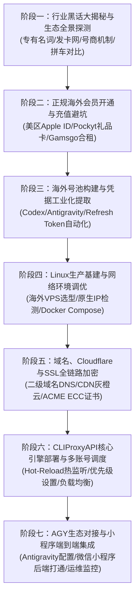

# AI大模型反代与海外号池全栈实战：从0到1构建高可用中转站、ChatGPT Plus正规开通、拼车合租与号商避坑全景指南

欢迎学习《AI大模型反代与海外号池全栈实战：从0到1构建高可用中转站、ChatGPT Plus正规开通、拼车合租与号商避坑全景指南》。

---

## 专栏背景与核心价值

在面向国内微信小程序、Web 应用及企业级工作流接入 ChatGPT、Claude、Gemini 等海外顶级大模型时，开发者通常面临一系列棘手的“基础设施瓶颈”：
1. **网络连接受阻与跨域延迟**：国内服务器无法直接发起对 OpenAI/Anthropic 官方 API 的 HTTPS 连接，或受到跨境不稳定路由与网络抖动的严重干扰；
2. **账号风控与大面积封号**：不合规的注册渠道、劣质数据中心机房代理、黑卡虚拟信用卡充值极易遭遇官方“连坐封号”与资产清算；
3. **高并发限流与单点故障**：单一账号存在严苛的 RPM（每分钟请求数）与 TPM（每分钟 Token 数）限制，在大促或高峰期面临大面积 429 报错；
4. **高昂的调用成本与信息差壁垒**：不了解发卡网生态、中转号池架构、正规低成本充值渠道与行业黑话，导致盲目高价采买低质中转或反复踩坑。

本专栏基于国内生产环境（微信小程序矩阵、FastAPI 异步微服务）与海外高可用反代集群的真实落地经验，全流程公开 **从海外账号生态拆解、正规苹果礼品卡开通 Plus、高纯净网络基建、Cloudflare 边缘解析与 SSL 加密，到基于 CLIProxyAPI 搭建自动热监听、负载均衡与优先级容灾的工业级海外号池中转站**。

---

## 阶段架构概览



```{toctree}
:maxdepth: 2
:caption: 课程阶段导航

stage1_terminology_and_ecology/index
stage2_official_purchase_and_avoid_pitfalls/index
stage3_account_pool_and_token_extraction/index
stage4_linux_infra_and_network/index
stage5_domain_cloudflare_and_ssl/index
stage6_cliproxyapi_deployment_and_scheduling/index
stage7_agy_and_miniapp_integration/index
```
