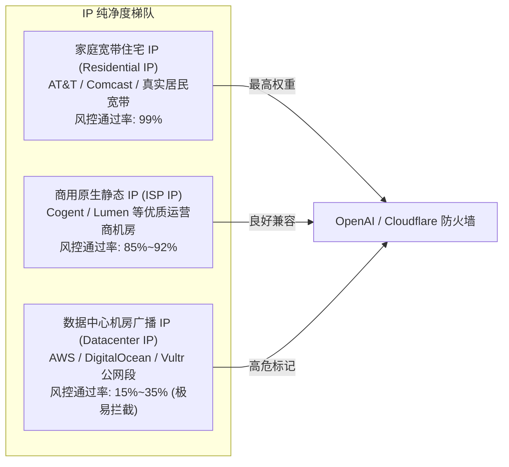
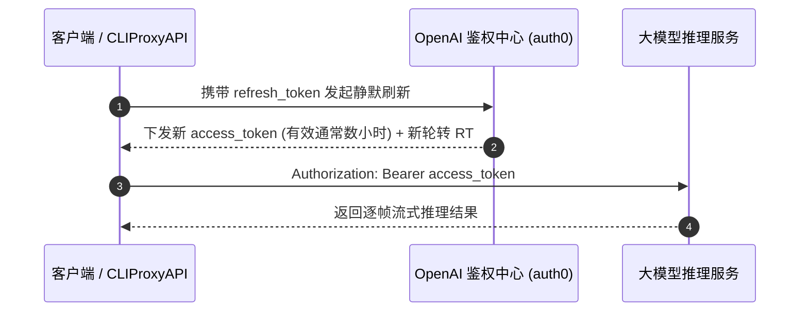

# 01. 行业黑话与专业术语全景词典

在进行大模型中转站与海外号池工程化建设前，厘清行业黑话是避免交“学费”的首要前提。号商与中转站市场鱼龙混杂，许多看似诱人的低价商品背后隐藏着极高的风控清算与模型作弊隐患。

---

## 一、账号生态分类黑话

| 术语名称 | 核心特征与生产方式 | 稳定性与存活期 | 适用场景与风险评级 |
| :--- | :--- | :--- | :--- |
| **手工号 (Handmade)** | 人工使用真实海外家宽 IP、原生浏览器、独立手机卡/邮箱逐个注册验证。 | 极高（几个月至数年） | ⭐️ **高推荐**：适合作为高可用号池的主力 Plus 账号或企业生产基建。 |
| **机刷号 (Bot/Script)** | 使用自动化脚本（如 Python Playwright、Selenium）结合接码平台和批量代理批量并发生成的账号。 | 极低（极易在 24~72 小时内被风控清算） | ⚠️ **高危**：号商常用其冒充“手工新号”低价倾销，批量封号率高达 80% 以上。 |
| **成品号 (Ready-Made)** | 已经完成邮箱注册、手机号短信验证，交付时直接包含账密或包含绑定邮箱的完整账号。 | 中 ~ 高 | 适合开箱即用，但必须第一时间确认是否包含辅助邮箱所有权并修改密码。 |
| **纯净号 (Clean Account)** | 注册后从未绑定过可疑支付方式、从未在脏 IP 上登录、无任何滥用对话记录的一手白号。 | 极高 | 适合后续长期绑定正规苹果礼品卡或个人外币卡开通 Plus 会员。 |
| **独享号 (Exclusive)** | 一人一号，拥有全部所有权（邮箱账号、密码、Token 凭证均归买家独享）。 | 高 | 生产级反代号池唯一推荐的采买形态，杜绝多方并发争抢速率限制。 |
| **共享号 (Shared)** | 一号多卖，多位陌生人共用同一组账密或同一个 Session Token。 | 极低 | 严禁用于生产号池！容易遭遇历史对话隐私泄露、频繁撞 429 限流与随时被改密踢出。 |
| **直登号 (Direct Login)** | 交付形式为标准账号密码（如 `user@gmail.com:password`），买家可在网页端或官方 App 直接登录。 | 取决于注册质量 | 适合普通用户个人在桌面端直接交互使用。 |
| **授权号 / JSON 凭据号** | 不交付明文密码，直接交付提取好的 OAuth 凭据（包含 `access_token`、`refresh_token` 等）。 | 取决于底层账号 | ⭐️ **反代必备**：直接注入 CLIProxyAPI、One-API 或自动化中转引擎。 |
| **白嫖号 / Free 额度号** | 利用 OpenAI/Anthropic/Google 新人注册赠送的免费试用额度或普通免费额度。 | 额度有限 | 仅适合本地轻量测试或临时压测，不可作为核心商业付费业务支撑。 |
| **绑卡号 (Carded Account)** | 号商通过海外虚拟信用卡（甚至黑卡/料卡）强行开通绑定的扣费账号。 | 极低（随时被 Stripe 拒付反洗钱封杀） | 🚨 **绝对禁区**：不仅账号秒封，所绑定的 API 生产环境也将全部被列入高危黑名单。 |
| **降级号 (Degraded)** | 官方虽然未直接注销账号，但命中风控后悄悄剥夺 GPT-4 / GPT-5 等高级模型调用权限，强制降级为 mini 或 3.5。 | 废品 | 需通过模型探测接口校验输出特征，警惕号商以高价售卖被阉割的降级号。 |
| **车头 / 车员 (Carpool)** | 拼车合租体系的术语。**车头**为账号所有者兼付款人；**车员**为分摊费用的合租者。 | 中等 | 若车头跑路或某位车员触发滥用，全车连坐。 |
| **翻车 / 掉顶 (Revoked)** | 订阅中断或被 OpenAI 官方撤销 Plus 会员权限（Refunded/Revoked），退回免费状态。 | 权益失效 | 常见于劣质充值卡、黑卡拒付后官方发起的退费与冻结惩罚。 |

---

## 二、中转站运营与黑产博弈黑话

在商业中转站（Relay Station）与逆向 API 圈子中，经常遇到以下行话：

### 1. 倍率 (Multiplier / Rate)
- **概念**：中转站的核心计费与盈利杠杆。通常表现为**充值汇率比**与**模型调用倍率**。
- **换算方式**：例如某中转站宣称“1 元兑换 1 刀额度”，但在后台将 `gpt-4o` 的消耗倍率设定为 15 倍。这意味着用户发送等量 Token 时，在中转站实际扣费比官方正价高出数倍；反之，若倍率设为 0.5，则说明其底层必然使用了逆向或白嫖账号以低价抢占市场。

### 2. 破甲 (Jailbreak / Uncensored / Bypass)
- **概念**：通过高度复杂的结构化 Prompt 注入（Prompt Injection）或对抗性前置提示，诱导大模型打破官方内建的政治伦理、NSFW、安全审查与版权护栏（Safety Guardrails）。
- **实战影响**：部分中转站会宣称支持“破甲模型”或“无审查版本”，这类服务通常是私下挂载了特殊的系统提示词或外挂过滤拦截层，容易触发官方模型的硬封禁。

### 3. 逆向 (Reverse Engineering / Web-to-API)
- **概念**：不走官方付费的商业 API 渠道，而是通过逆向分析官方 Web 网页端（如 chatgpt.com、claude.ai）或移动端 App 的私有前端接口（如使用 Headless 浏览器、抓取 WebSocket 或 NextAuth Session），包装成标准 OpenAI `/v1/chat/completions` 格式对外提供服务。
- **优缺点**：
  - **优势**：成本极低（甚至零成本），且能借用网页端特权（例如免费版 Gemini 的原生生图、联网搜索功能）；
  - **致命伤**：**极不稳定！** 官方前端一旦更新加密参数（如 Turnstile 人机验证、Arkose Labs Token、PoW 算法变更），逆向接口会瞬间成批瘫痪报错。

### 4. 掺水 (Model Downgrade / Token Dilution)
- **概念**：不诚信中转站的常见暴利套路。用户在客户端请求的是昂贵的 `gpt-4o` 或 `claude-3-5-sonnet`，但中转站后台在网关层通过规则悄悄**降级篡改**为廉价的 `gpt-4o-mini`、甚至开源模型（如 Llama、DeepSeek）。
- **识别方法**：通过特定逻辑难题、代码细节推演或输出 Token 的概率分布特征测试，观察模型实际智商是否与标称模型相符。

---

## 三、网络风控与注册接码黑话

### 1. 家宽住宅 IP (Residential IP)
由真实海外电信运营商（如美国 AT&T、Verizon、Comcast）分配给普通家庭宽带用户的动态或静态 IP。OpenAI 与 Cloudflare 对住宅 IP 拥有天然的高信任度，注册与付款成功率极高。

### 2. 欺诈分 (Fraud Score) 与 Clean IP
IPQS（IPQualityScore）、Scamalytics 等风控引擎对 IP 的评级。健康标准建议 Fraud Score 低于 20，且不能被标记为公共代理（Proxy）、VPN 或网络爬虫（Crawler）。

### 3. 指纹浏览器 (Fingerprint Browser) 与防关联
传统无痕模式仍会泄露 Canvas 画布指纹、WebGL 指纹、Audio 指纹、系统字体列表及 WebRTC 真实内网 IP。批量管理号池时，必须借助指纹浏览器（如 AdsPower、Hubstudio）为每个账号分配独立的浏览器指纹环境与专属代理节点。

### 4. 接码平台 (SMS Verification) 的三种形态
- **一次性临时接码 (Disposable SMS)**：仅能接收一次短信（单价极低，几毛到一元）。缺点是后续一旦触发官方手机复验或 2FA 安全验证，账号将直接彻底死锁报废。
- **长期租用接码 (Long-term Rental)**：可按周或按月固定租用同一虚拟号码，能应对后续复验，但月租累计成本高。
- **海外实体 SIM / eSIM (Physical SIM / eSIM)**：如英国 giffgaff、美国 Ultra Mobile PayGo、5ber 等，具备真实的电信运营商实体卡信息。这是构建长久稳定、抗风控号池的顶格资产。

---

## 四、底层技术协议黑话

### 1. Access Token (AT) vs Refresh Token (RT)
- **Access Token (AT)**：调用具体模型 API（如 `/v1/chat/completions`、`/v1/images/generations`）时必须附带在 HTTP Header（`Authorization: Bearer <AT>`）中的短期通行证。寿命通常仅有几十分钟到数小时。
- **Refresh Token (RT)**：用于换取新 AT 的长期凭据。**对于号池搭建而言，只有拿到了包含 `refresh_token` 的凭证包，反代程序才能在后台实现 24 小时无感静默续期**。

### 2. Session Token / __Secure-next-auth.session-token
网页版 ChatGPT 基于 NextAuth 框架派发的 Cookie 身份认证凭证。部分第三方充值平台需要买家提供该 Token 登录后台代充。

### 3. Antigravity 凭证与 Claude Setup Token
- **Antigravity (AGY) 凭证**：Google Cloud Vertex AI 及 Antigravity 体系中基于服务账号（Service Account）或 OAuth 生成的项目凭证，支持高并发无感刷新。
- **Claude Setup Token**：Anthropic 控制台在绑定开发者设备时派发的高级授权密匙。
