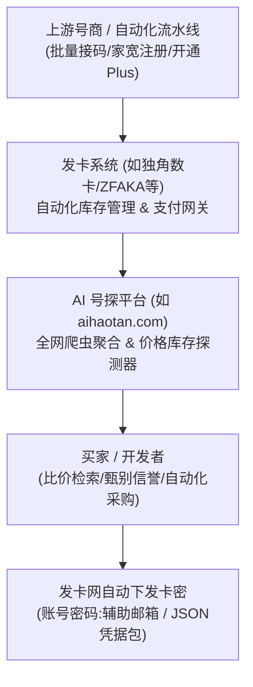
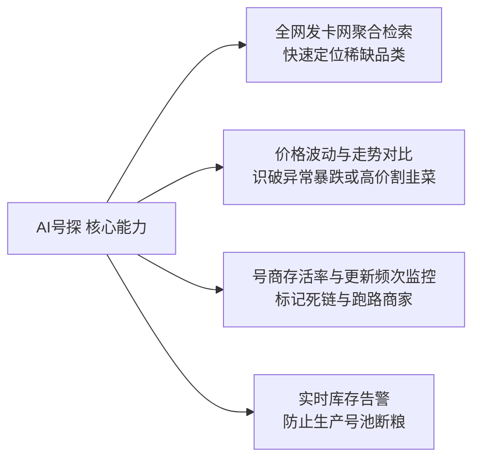

# 02. 号商发卡网生态剖析与 AI 号探测器实战

在大模型号池的采买与扩容环节，许多开发者会接触到各类自动化“发卡网”（即自动化发货虚拟商品交易平台）。由于市场缺乏监管，充斥着倒买倒卖、以次充好、以机刷冒充手工号的现象。本节深入剖析发卡网底层机制，并以行业探测工具与真实平台为例，传授专业级采购避坑技巧。

---

## 一、AI 号商生态与发卡网运作原理

发卡网（通常基于开源系统如独角数卡、ZFAKA 等二次开发）是虚拟商品自动化交付的枢纽：
1. **自动化入库**：号商将批量生产的账号卡密（以逗号或冒号分隔）批量导入发卡网后台；
2. **免登录扫码支付**：买家无需实名注册，输入查询密码或邮箱后直接通过微信、支付宝或 USDT 付款；
3. **即时卡密交付**：支付回调成功后，系统自动弹出卡密或自动发送至买家邮箱。

---

## 二、行业聚合探测器：以 AI号探 (aihaotan.com) 为例

当号池规模扩大时，开发者不可能逐个收藏并刷新数十个零散的发卡网。**AI号探** ([https://aihaotan.com/](https://aihaotan.com/)) 等聚合监控平台应运而生，其核心价值在于消弭信息差与实时监测号商品质：

### 1. 核心实战功能
- **全网聚合检索**：输入关键字（如 `ChatGPT Plus 独享`、`Claude 3.5 Sonnet`、`Codex JSON`），系统自动聚合数十家活跃发卡网的商品、单价与实时库存。
- **号商信誉雷达**：根据历史发卡成功率、更新频率、商品评价综合评分，标记高风险商家。
- **价格走势预警**：帮助开发者识别市场行情。如果某类 Plus 账号市场公允价在 140~160 元左右，突然出现 30~50 元的商品，AI号探可帮助买家快速辨别其大概率是黑卡或共享车位。

---

## 三、典型发卡网商品剖析：以微资源发卡网为例

以典型平台 **微资源发卡网** ([https://wzyp.cn/shop/9S9N5V82](https://wzyp.cn/shop/9S9N5V82)) 等店铺为例，深入拆解号商货架上的常见商品分类与技术内幕：

### 1. 常见商品分类深度解读

| 货架分类示例 | 内部技术本质 | 采购注意事项与避坑法则 |
| :--- | :--- | :--- |
| **Free 免费号 / 白嫖入门号** | 通常为利用临时企业邮箱或接码平台批量注册的免费账户，无绑定支付卡。 | 适合做开发测试与接口冒烟验证，但绝不可用于生产环境，官方可能随时封停注册批量号段。 |
| **带余额 API 额度号** | 早期绑卡赠送 $5/$18 试用金的账号，或由号商代充了固定额度的组织号。 | 必须查验是否为正规绑卡，若号商使用拒付黑卡充值，一两天后 API Key 会直接被 Revoke 并封杀。 |
| **Plus 独享成品号 / 直登号** | 已经开通了 ChatGPT Plus（每月 $20）的独立账号，交付完整的账号、密码及绑定的海外邮箱控制权。 | 必须索取原始辅助邮箱所有权，登录后立即修改密码、检查是否已绑定手机双重验证（2FA）。 |
| **Plus 充值服务 / 代充直充** | 买家提供自己的老账号，号商登录或通过专用付款链接完成 Plus 会员代充值。 | 必须问清充值手段！坚决拒绝任何需要索取账号密码让对方上号操作的黑卡代充，**优先选择苹果官方正规礼品卡充值**。 |
| **Codex / OAuth JSON 凭据包** | 号商直接从 Plus 账号中提取出的标准 JSON 文件，包含 `access_token` 与 `refresh_token`。 | **号池搭建最理想形态**。买家无需在本地重复进行网页模拟登录，拿来即用，但必须校验 JSON 内是否包含长效 `refresh_token`。 |

---

## 四、发卡网采购防坑六大黄金准则

> [!WARNING] 严防“低价陷阱”与“假手工真机刷”
> 1. **切勿贪图远低于官方成本的超低价**：ChatGPT Plus 官方按月收费 20 美元（约合人民币 145 元左右）。若发卡网标价仅 30~50 元且声称“独享一个月”，其背后 99% 是被盗黑卡（几日内必翻车封号）或是多卖的伪独享车位。
> 2. **优先采买“带完整邮箱控制权”的成品号**：交付卡密若仅有 ChatGPT 账号密码而没有邮箱登录权限，一旦触发登录邮箱验证码校验，账号将彻底失联。
> 3. **严格检验 JSON 凭据中的 `refresh_token`**：部分不良号商交付的 JSON 只有短期 `access_token`。一旦数小时过去 Token 过期，号池将直接不可用。
> 4. **小批量试采验收，切忌大批量压货**：首次合作号商，先采买 1~2 个账号放入反代池压测 48 小时，确认未遭遇大规模批量封停后再考虑批量采购。
> 5. **到手即测：利用脚本探测是否为“降级号”**：通过向该账号发起高阶模型推理请求，比对返回的特征字段，严防被号商以 GPT-3.5/mini 冒充高阶大模型。
> 6. **保存发卡凭证与交易哈希**：发卡网多采用自动提单售后系统，务必在购买后第一时间截图保存订单号、卡密内容与查询密钥，出现掉顶以便申请退款或补发。
