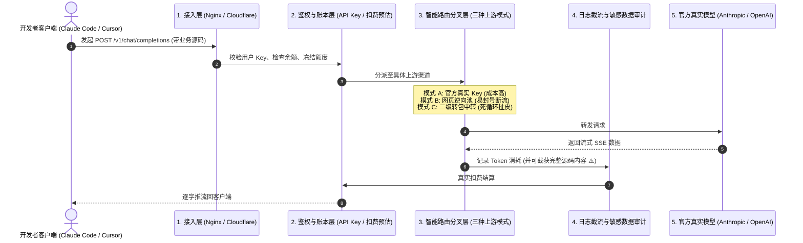
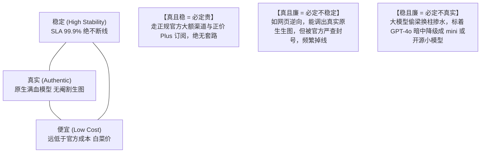

# 03. 商业接入模式、中转站“不可能三角”与开源工具横向评测

面对大模型接入需求，不同规模的开发者、团队与企业有着截然不同的痛点。本节通过全景对比矩阵，深入剖析 **官方正规独享、专业拼车合租（以 Gamsgo 为代表）与自建反代号池中转（以 CLIProxyAPI 为代表）** 三大主流模式的优劣势，揭秘 AI 中转站的赚钱逻辑、数据安全隐患与“不可能三角”，并横向评测主流反代开源网关。

---

## 一、三大主流模式全景对比矩阵

| 评估维度 | 模式 A：官方正规独享模式 | 模式 B：专业拼车合租模式 (如 Gamsgo) | 模式 C：自建反代号池中转模式 (CLIProxyAPI) |
| :--- | :--- | :--- | :--- |
| **单账号成本** | 每月固定 $20（约 145 元/号） | 每月仅需约 25~45 元（4~6人平摊） | 可弹性组合（1~N 个 Plus/Free 账号聚合） |
| **并发承载能力** | 极低（仅满足单人日常网页交互，不可作为高并发后端） | 极低（合租车员共享 RPM/TPM 速率配额，高峰期频繁撞车） | ⭐️ **极高**（多账号池负载均衡轮询，支持大规模业务并发） |
| **接口可编程性** | 仅限官方网页端/App，原生不支持转标准 OpenAI API 格式 | 主要是 Web 共享界面，不提供开发者 API 聚合与下游调用支持 | ⭐️ **满分**（完全输出标准 OpenAI `/v1` 协议接口，可对接任意业务系统） |
| **隐私数据安全** | ⭐️ **满分**（个人私密独享，对话记录完全隔离） | ⚠️ **需注意**（同车成员虽通常无法直接查看，但有提示词污染或会话误删风险） | ⭐️ **极高**（代码与号池完全掌控在自建 VPS 内，杜绝数据外泄） |
| **风控与封号风险** | 极低（正规充值稳定长久） | 低 ~ 中（依赖平台统一售后与自动换车兜底机制） | 极低（海外原生环境 + 自动静默 Token 轮转隔离） |
| **运维门槛** | 零门槛（充值即用） | 零门槛（开箱即用，平台提供自动化客服与售后） | 需具备基础 Linux、Docker、网络与 SSH 隧道运维知识 |
| **核心适用场景** | 个人重度日常办公、学术科研深度推理 | 预算有限的学生、轻度个人体验、个人轻量日常提问 | ⭐️ **商业级应用矩阵、AI 编程助手、团队高可用服务** |

---

## 二、AI 中转站的真实赚钱模式与数据安全陷阱

AI 中转站（Relay Station）单月盈利数万甚至数十万，靠的从来不是模型能力本身，而是**访问门槛、额度管理与信息不透明**。其主要的盈利手法包括：

1. **吃模型差价（偷梁换柱）**：用户在客户端请求的是昂贵的 `claude-opus` 或 `gpt-4o`，中转站在网关层悄悄路由到便宜的 GLM、DeepSeek 或 mini 模型，赚取数十倍的断崖式差价；
2. **利用漏洞与活动薅羊毛**：利用部分平台的试用漏洞批量产出低成本账号（甚至几元一个的日抛号），包装成高价 API 售卖；
3. **逆向 Web 端低成本倾销**：逆向破解网页端（例如逆向 Gemini 生图接口，单次成本仅几分钱，远低于官方商业 API）；
4. **额度池对赌与资金沉淀**：轻度用户充值 50~100 元，实际仅消耗几元便沉寂流失；重度用户跑项目时再通过限速、排队与换上游硬扛；
5. **最致命的隐患：收集工作现场数据打包倒卖**：
   - 中转站不是简单的透明代理，而是**能完整读到你所有输入 Prompt 和输出 Response 的中间人**！
   - 很多开发者在本地使用 Cursor、Claude Code 等编程工具时，上下文会自动携带 `.env` 配置文件、商业源码、数据库架构、公司内网 API 或客户私密数据。不法中转站将这些工作现场数据静默落盘打包，二次倒卖给模型训练机构或黑产，造成难以挽回的资产外泄。

---

## 三、一次 API 请求在中转站内部的五层真实路径

很多人以为中转站就是一个简单的反向代理，实际其内部链条极其复杂：

### 上游路由的三种分叉形态
- **模式 A：官方真实 API Key 转发**（最干净正规，成本最高，价格很难离谱便宜）；
- **模式 B：订阅账号池逆向**（将网页端 Pro 账号通过脚本包装成 API，易触发系统提示词污染、长上下文断流）；
- **模式 C：小中转接大中转（层层转包）**（自己没有上游，只是二道贩子。一旦报错站长永远解释为“上游炸了”，责任边界彻底消失）。

---

## 四、中转站“不可能三角”法则与性价比折中

> [!NOTE] 客观商业规律
> “稳定、真实、便宜”不可兼得。自建私有号池（如基于 CLIProxyAPI）正是以最低的服务器维护成本，换取“模型 100% 真实、数据 100% 自主掌控、多账号互备高稳定”的最佳折中解。

---

## 五、主流开源反代与中转工具横向对比

| 工具名称 | 核心语言 / 技术栈 | 核心定位与特色功能 | 适用场景与优劣势 |
| :--- | :--- | :--- | :--- |
| **CLIProxyAPI / CLIProxyAPIPlus (CPA)** | Go (原生高性能) | 专为个人开发者与团队设计的私有网关。专精于 **Codex / ChatGPT Plus / Claude / AGY** 凭据管理、**无感增量热重载（Inotify）**、15 分钟 Token 自动轮换与毫秒级故障转移。提供跨平台桌面端（Mac/Win）。 | ⭐️ **极力推荐**：极度轻量（内存仅几十兆），专注后端代理，无冗余商业账单模块，代码开源可控，数据绝不外泄。 |
| **sub2api (Subscription to API)** | TypeScript / Go | 专注于将个人网页端订阅（如 ChatGPT Plus、Claude Pro Web 会话）快速转为标准 OpenAI 格式的 API 适配器。 | 适合个人快速把自己手头的单个 Plus 网页账号转成 API 跑脚本，但多账号并发池与故障转移能力较弱。 |
| **New API / One API** | Go + React 前端 | 具备完整商业中转站功能的大一统系统。支持多租户、用户充值计费、多渠道权重分流、模型倍率自定义、兑换码发卡与渠道健康度探测。 | 功能极其强大全面，但架构相对庞大复杂，适合打算对外公开运营商业中转站的站长使用。 |
| **LiteLLM** | Python | 专注将 100+ 种主流大模型统一包装为 OpenAI 标准输入输出的 Python 轻量网关。 | 适合 Python 数据流与微服务内部调用，但在多 OAuth 凭据长效保活与桌面开箱即用方面不如专用 CPA。 |

---

## 六、自建反代号池（CLIProxyAPI）的核心商业壁垒

与直接依赖公网第三方中转站相比，自建基于 CLIProxyAPI 的海外号池具备三大核心商业护城河：
1. **彻底绝缘中间人数据泄露**：源码、环境变量与业务数据不经过任何第三方平台，杜绝被打包转卖；
2. **吞吐量可线性叠加**：多账号通过内网负载均衡平摊并发，规避单号 429 速率限制；
3. **自主可控、杜绝掺水**：底层全是自己一手掌控的正规 Plus / 凭据账号，输出百分之百纯血无阉割。
