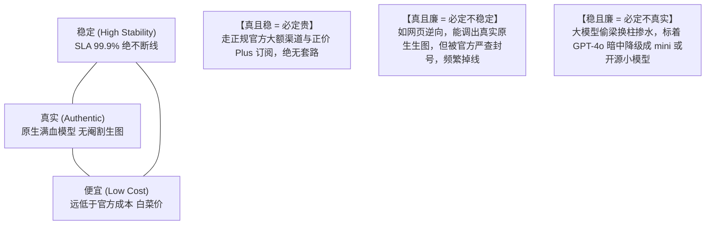

# 03. 商业接入模式、中转站“不可能三角”与开源工具横向评测

面对大模型接入需求，不同规模的开发者、团队与企业有着截然不同的痛点。本节通过全景对比矩阵，深入剖析 **官方正规独享、专业拼车合租（以 Gamsgo 为代表）与自建反代号池中转（以 CLIProxyAPI 为代表）** 三大主流模式的优劣势，揭秘 AI 中转站的“不可能三角”，并横向评测主流反代开源架构。

---

## 一、三大主流模式全景对比矩阵

| 评估维度 | 模式 A：官方正规独享模式 | 模式 B：专业拼车合租模式 (如 Gamsgo) | 模式 C：自建反代号池中转模式 (CLIProxyAPI) |
| :--- | :--- | :--- | :--- |
| **单账号成本** | 每月固定 $20（约 145 元/号） | 每月仅需约 25~45 元（4~6人平摊） | 可弹性组合（1~N 个 Plus/Free 账号聚合） |
| **并发承载能力** | 极低（仅满足单人日常网页交互，不可作为高并发后端） | 极低（合租车员共享 RPM/TPM 速率配额，高峰期频繁撞车） | ⭐️ **极高**（多账号池负载均衡轮询，支持大规模业务并发） |
| **接口可编程性** | 仅限官方网页端/App，原生不支持转标准 OpenAI API 格式 | 主要是 Web 共享界面，不提供开发者 API 聚合与下游调用支持 | ⭐️ **满分**（完全输出标准 OpenAI `/v1` 协议接口，可对接任意业务系统） |
| **隐私数据安全** | ⭐️ **满分**（个人私密独享，对话记录完全隔离） | ⚠️ **需注意**（同车成员虽通常无法直接查看，但有提示词污染或会话误删风险） | ⭐️ **极高**（代码与号池完全掌控在自建 VPS 内，杜绝数据外泄） |
| **风控与封号风险** | 极低（正规充值稳定长久） | 低 ~ 中（依赖平台统一售后与自动换车兜底机制） | 极低（海外原生环境 + 自动静默 Token 轮转隔离） |
| **运维门槛** | 零门槛（充值即用） | 零门槛（开箱即用，平台提供自动化客服与售后） | 需具备基础 Linux、Docker、网络与 SSH 隧道运维知识 |
| **核心适用场景** | 个人重度日常办公、学术科研深度推理 | 预算有限的学生、轻度个人体验、个人轻量日常提问 | ⭐️ **商业级小程序矩阵、AI智能体产品、团队高可用中转服务** |

---

## 二、AI 中转站的商业盈利模式与“不可能三角”

在 AI 市场上，存在大量商业化的“第三方 AI 中转站”（API 聚合转售平台）。它们的常见盈利模式包括：
1. **批零差价与官方大额折扣**：以极低折扣批发大额官方企业 API 或 20x 大额账号，以零售价卖给中小开发者；
2. **倍率抽成机制**：在充值汇率（如 1:1）与模型调用倍率（如 GPT-4o 设为 12~15 倍率）上做数学溢价抽成；
3. **充值沉淀资金与死号沉淀**：大量用户充值 50~100 元，实际仅消费几元后便遗忘，沉淀资金构成了中转商极高的纯利润。

### 核心论点：中转站的“不可能三角”法则

在挑选或评估任何大模型服务中转站时，业界存在一个著名的**三元悖论（不可能三角）**：

> [!NOTE] 如何理解与寻找“性价比折中”？
> 这一法则揭示了底层客观商业与技术规律：
> - **如果你的业务是生产级严肃应用（如付费小程序、企业自动化代码生成）**：必须优先保障“稳定”与“真实”，走官方正规采买、礼品卡或自建私有号池，切忌贪便宜导致业务频繁瘫痪；
> - **如果仅用于个人探索、临时脚本爬虫或非核心草稿任务**：可以选择部分高性价比的拼车车位或逆向中转，在可控的容错成本内换取极致的低开销。

---

## 三、主流开源反代与中转工具横向对比

在大模型网关选型上，目前开源社区形成了以下主流代表体系：

| 工具名称 | 核心语言 / 技术栈 | 核心定位与特色功能 | 适用场景与优劣势 |
| :--- | :--- | :--- | :--- |
| **CLIProxyAPI / CLIProxyAPIPlus (CPA)** | Go (原生高性能) | 专为个人开发者与团队设计的私有网关。专精于 **Codex / ChatGPT Plus / Claude / AGY** 凭据管理、**无感增量热重载（Inotify）**、15 分钟 Token 自动轮换与毫秒级故障转移。 | ⭐️ **极力推荐**：极度轻量（内存仅几十兆），专注后端代理，无冗余商业账单模块，最适合接入微信小程序或自研业务。 |
| **sub2api (Subscription to API)** | TypeScript / Go | 专注于将个人网页端订阅（如 ChatGPT Plus、Claude Pro Web 会话）快速转为标准 OpenAI 格式的 API 适配器。 | 适合个人快速把自己手头的单个 Plus 网页账号转成 API 跑脚本，但多账号并发池与故障转移能力较弱。 |
| **New API / One API** | Go + React 前端 | 具备完整商业中转站功能的大一统系统。支持多租户、用户充值计费、多渠道权重分流、模型倍率自定义、兑换码发卡与渠道健康度探测。 | 功能极其强大全面，但架构相对庞大复杂，适合打算对外公开运营商业中转站的站长使用。 |

---

## 四、自建反代号池（CLIProxyAPI）的战略价值

与直接依赖公网第三方中转站相比，自建基于 CLIProxyAPI 的海外号池具备三大核心商业护城河：
1. **吞吐量可线性叠加**：1 个 Plus 账号不够用，直接在号池目录放入第 2 个、第 3 个 JSON 凭据，系统自动做 Round-Robin 负载均衡，整体并发能力翻倍；
2. **应用业务安全无缝接入**：如我们在 AI 表情包工坊或内容生成小程序后端中，仅需配置一条 `CPA_API_BASE: "http://127.0.0.1:18317/v1"`（通过内网安全隧道），即可低成本为成千上万用户提供极速出图与对话能力；
3. **自主可控、杜绝掺水**：底层全是自己一手掌控的正规 Plus / 凭据账号，输出百分之百纯血无阉割，不受第三方跑路或恶意调包的威胁。
