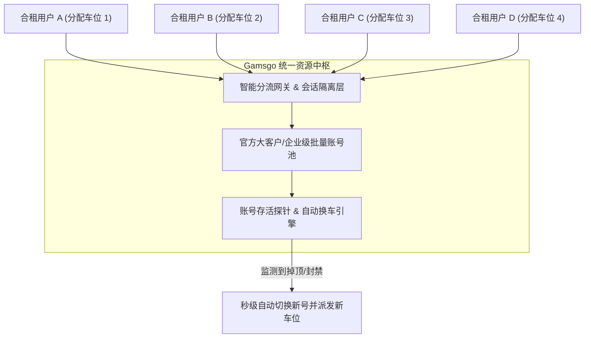

# 02. Gamsgo 拼车平台深度实战测评与边界透视

在个人轻量体验与小团队低成本试水阶段，海外合租拼车平台 **Gamsgo** ([https://www.gamsgo.com/](https://www.gamsgo.com/)) 是目前海外流媒体与 AI 会员合租领域知名度最高、自动化成熟度最完善的平台之一。本节客观剖析其产品机制、优劣势及与自建号池的技术边界。

---

## 一、Gamsgo 平台架构与底层运作逻辑



Gamsgo 与传统微信群、QQ群私人拼车最大的区别在于其**高度系统化、自动化运维**：
1. **车位独立隔离**：系统将一个 ChatGPT Plus 账号通常拆分为 4~6 个车位，用户登录专属代理中转前端或独立分流客户端，尽量减少车员之间的会话相互串扰；
2. **自动化工单与秒级换车**：若底层账号因官方严打遭遇风控或封顶，监控探针会在数分钟内感知，用户在后台点击“申请换车”即可自动重连到新车位，无需人工客服介入扯皮。

---

## 二、平台实操选购全流程

1. 访问 Gamsgo 官方网站：[https://www.gamsgo.com/](https://www.gamsgo.com/)；
2. 搜索并定位 **ChatGPT Plus** 合租专区；
3. 选择购买周期：通常支持 1 个月、3 个月、6 个月及 12 个月（长期购买折算每月仅需 20~35 元人民币左右）；
4. 选择付款方式：支持微信支付、支付宝、信用卡及各类电子钱包，直接人民币结算；
5. 交付使用：支付成功后，个人控制台立即生成车位编号、登录账号、专属动态验证码或免密直登专属链接。

---

## 三、Gamsgo 拼车模式优劣势全景透视

### 1. 核心优势
- **极低试错成本**：单月成本仅为官方独立账号（约 145 元）的 15%~25%；
- **完全告别外币卡与海外支付门槛**：全流程微信/支付宝直接结清；
- **售后兜底能力强**：平台长期运营数年，拥有完善的备用账号池，彻底杜绝了私人团长“收钱跑路”的黑天鹅风险。

### 2. 核心局限与致命痛点（开发者必读）
- ⚠️ **严禁用于高并发 API 生产号池**：
  Gamsgo 提供的是**面向人类肉眼交互的 Web 拼车车位**，并不向买家交付底层的 OAuth 签名密钥或长效 `refresh_token`。**开发者无法将其导出为 JSON 凭据注入 CLIProxyAPI 或作为业务后端**。
- ⚠️ **高峰期频繁遭遇速率配额撞车**：
  OpenAI 对单个 Plus 账号设有严格的 3 小时限制。一旦车队中某位车员在集中跑代码或批量润色论文，其他车员在提问时会立刻遭遇：
  ```text
  You've reached the current limit for GPT-4. Please try again after xx:xx.
  ```

---

## 四、选型建议：何时选 Gamsgo？何时自建号池？

| 业务形态与阶段 | 推荐选择 | 决策依据与路径规划 |
| :--- | :--- | :--- |
| **个人日常提问 / 学生写论文** | ⭐️ **首选 Gamsgo 拼车** | 每月几十元成本最低，省去所有服务器与海外网络折腾。 |
| **初学者体验高级大模型能力** | ⭐️ **首选 Gamsgo 拼车** | 先低成本熟悉模型交互逻辑，再决定是否深度投入。 |
| **微信小程序 / Web应用商业交付** | 🚨 **坚决自建号池反代** | 必须拥有独立可编程 API 接口、高可用负载均衡与自主风控能力。 |
| **企业内部知识库 / 团队专属工作流** | 🚨 **坚决自建号池反代** | 规避商业机密泄漏风险，保障 99.9% 生产 SLA 可用性。 |
