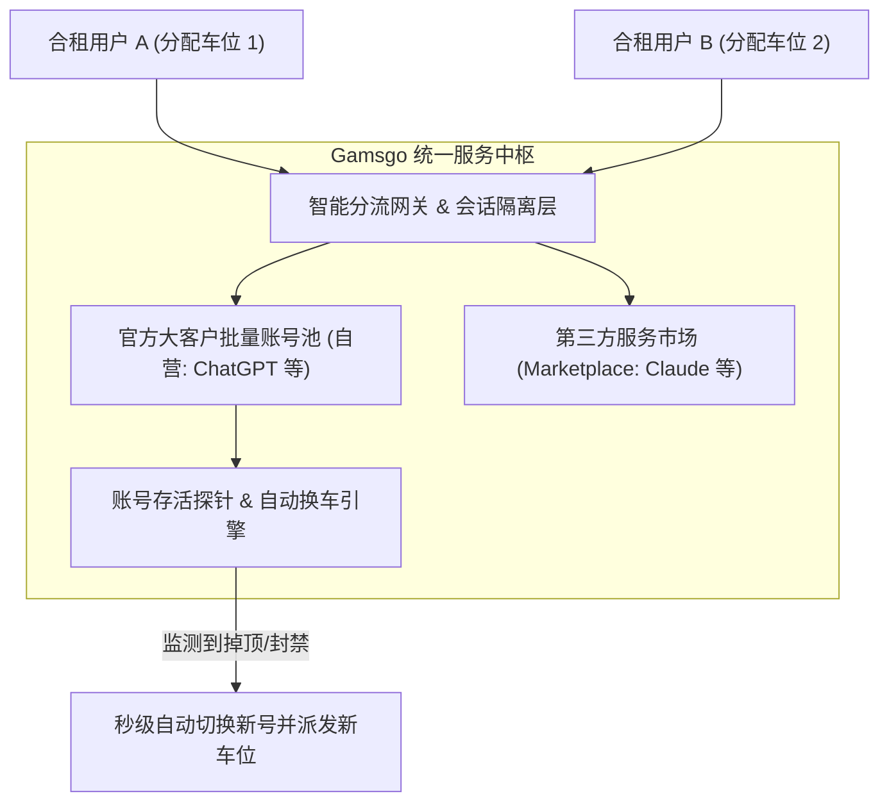

# 02. Gamsgo 拼车平台测评、优惠码与全球共享订阅生态

在个人轻量体验与小团队低成本试水阶段，海外合租拼车平台 **Gamsgo** ([https://www.gamsgo.com/](https://www.gamsgo.com/)) 是目前海外流媒体与 AI 会员合租领域知名度最高、自动化成熟度最完善的平台之一。本节客观剖析其产品机制、专属优惠码、自营与第三方市场区别，以及全球同类共享订阅平台生态。

---

## 一、Gamsgo 平台架构与自营 vs 第三方市场机制

### 1. 自营业务 vs 第三方市场的本质区别
- **ChatGPT Plus 服务（自营保障）**：ChatGPT 是 Gamsgo 的核心自营旗舰产品，官方自建大客户号池与自动化监控，掉线换号与质保响应最快。
- **Claude 等其他 AI 服务（第三方入驻市场）**：Gamsgo 同时也提供 Claude 等高级模型的购买入口，但这部分业务多采用第三方认证商家入驻托管（Marketplace）模式，售后与换号时效取决于第三方商家的响应速度。

---

## 二、平台实操选购与专属促销优惠码

1. 访问 Gamsgo 官方网站：[https://www.gamsgo.com/](https://www.gamsgo.com/)；
2. 搜索并定位 **ChatGPT Plus** 合租专区；
3. 选择购买周期：通常支持 1 个月、3 个月、6 个月及 12 个月（长期购买折算每月仅需 20~35 元人民币左右）；
4. **结账优惠码录入（重点）**：
   在付款页面“优惠券/促销码（Promo Code）”输入框中，填入以下有效促销码获取额外折扣：
   - `WELCO`
   - `VIP5`
   - `HGN9A`
5. 选择付款方式：支持微信支付、支付宝、信用卡及各类电子钱包，直接人民币结算；
6. 交付使用：支付成功后，个人控制台立即生成车位编号、登录账号、专属动态验证码或免密直登专属链接。

---

## 三、全球主流共享订阅平台生态矩阵

除 Gamsgo 之外，国际上还有数家极具规模与知名度的合法共享订阅/合租平台，开发者可横向对比选型：

| 平台名称 | 核心支持服务品类 | 平台特色与优势 |
| :--- | :--- | :--- |
| **Gamsgo** | ChatGPT Plus、Claude、Netflix、Spotify、YouTube Premium 等 | 国内支付支持最友好（微信/支付宝），中文售后工单，全自动换号机制。 |
| **Spliiit** | ChatGPT、Netflix、Spotify、Disney+、Apple One 等 | 欧洲极具影响力的合租先驱，支持数百种软件服务订阅共享，最高节省高达 80%。 |
| **Sharesub** | AI 工具 (ChatGPT)、音乐流媒体、流媒体视频、生产力软件 | 法国合规平台，注重数据隐私与按月灵活加入/退出机制。 |
| **GoSplit** | Disney+、YouTube Premium、ExpressVPN、ChatGPT 等 | 界面现代清爽，主打跨国数字娱乐与工具类订阅共享。 |
| **GoingBus** | ChatGPT、Spotify、Gemini Pro、YouTube 等 | 提供 ChatGPT 与 Gemini Pro 等极具竞争力的低价拼车选项。 |

---

## 四、Gamsgo 拼车模式优劣势全景透视

### 1. 核心优势
- **极低试错成本**：单月成本仅为官方独立账号（约 145 元）的 15%~25%；
- **完全告别外币卡与海外支付门槛**：全流程微信/支付宝直接结清；
- **售后兜底能力强**：平台长期运营数年，拥有完善的备用账号池，彻底杜绝了私人团长“收钱跑路”的黑天鹅风险。

### 2. 核心局限与致命痛点（开发者必读）
- ⚠️ **严禁用于高并发 API 生产号池**：
  拼车平台提供的是**面向人类肉眼交互的 Web 拼车车位**，并不向买家交付底层的 OAuth 签名密钥或长效 `refresh_token`。**开发者无法将其导出为 JSON 凭据注入 CLIProxyAPI 或作为业务后端**。
- ⚠️ **高峰期频繁遭遇速率配额撞车**：
  OpenAI 对单个 Plus 账号设有严格的时间窗口速率限制。一旦车队中某位车员在集中跑代码或大批量生成内容，其他车员在提问时会立刻遭遇配额撞车等待。

---

## 五、选型建议：何时选 Gamsgo？何时自建号池？

| 业务形态与阶段 | 推荐选择 | 决策依据与路径规划 |
| :--- | :--- | :--- |
| **个人日常提问 / 学生写论文** | ⭐️ **首选 Gamsgo 等拼车平台** | 每月几十元成本最低，省去所有服务器与海外网络折腾。 |
| **初学者体验高级大模型能力** | ⭐️ **首选 Gamsgo 等拼车平台** | 先低成本熟悉模型交互逻辑，再决定是否深度投入。 |
| **微信小程序 / Web应用商业交付** | 🚨 **坚决自建号池反代** | 必须拥有独立可编程 API 接口、高可用负载均衡与自主风控能力。 |
| **企业内部知识库 / 团队专属工作流** | 🚨 **坚决自建号池反代** | 规避商业机密泄漏风险，保障 99.9% 生产 SLA 可用性。 |
