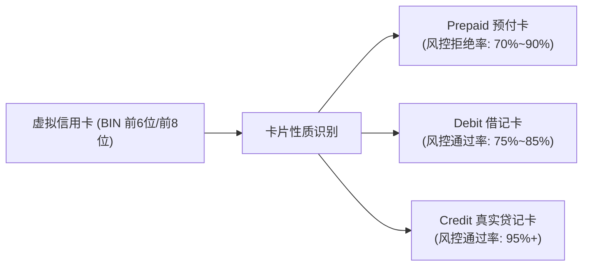

# 03. 海外虚拟信用卡绑定与防风控避坑指南

部分开发者由于没有苹果 iOS 设备，必须在 OpenAI 官方网页端通过信用卡直连开通 Plus 或直接向平台绑定信用卡以激活官方商业 API 额度（Platform API）。本节拆解海外虚拟卡（Virtual Credit Card, VCC）的底层机制与防风控实操要诀。

---

## 一、虚拟信用卡底层机制与 BIN 码常识

### 1. 为什么你的虚拟卡总被 Stripe 提示“Card Declined”？
Stripe 是 OpenAI 的核心支付收单服务商，其风控系统（Stripe Radar）具备毫秒级反欺诈拦截机制：
- **卡种辨识（BIN 检查）**：大部分低门槛开卡平台发行的都是 **Prepaid（预付费虚拟卡）**。Stripe 默认对绝大多数虚拟预付卡进行限额或直接拒付；
- **AVS（地址验证系统）**：部分美国卡会校验你输入的账单邮编（Zip Code）与银行发卡档案是否一致；
- **IP 纯净度连坐**：如果在国内机房 IP、公共代理节点或高欺诈分 IP 下点击“付款”，哪怕卡片本身合法，Stripe 也会直接以“高风险环境”为由发起拒付并拉黑该卡号。

---

## 二、市面主流虚拟卡平台类型对比

| 平台形态 | 典型代表 | 优点与便捷度 | 核心风险与暗坑 |
| :--- | :--- | :--- | :--- |
| **专为 AI 订阅优化的代理卡** | WildCard 等 | 提供一键代填、免海外真实手机号、支持支付宝直接开卡与充值 | 充值手续费偏高（通常在 3%~5%），提现汇率有折损 |
| **加密货币充值型虚拟卡** | Dupay、PokePay 等 | 支持 USDT 链上直接充值开卡，适合长期持有加密资产的开发者 | 需要完成海外 KYC，开卡费与月租费较高，政策波动性大 |
| **企业级多卡管理平台** | Nobepay 等 | 批量开卡能力强，单卡成本低，适合大规模号池管理 | 资金门槛较高，通常需要企业实名认证或较高的首次充值门槛 |

---

## 三、海外虚拟卡开通 Plus 的“防封七步法”

为了确保虚拟卡绑卡一次性成功且后续不被秋后算账，必须严格遵循以下规程：

1. **环境纯净第一**：
   - 必须使用未被 OpenAI 列入黑名单的高纯净度原生节点（建议通过 `ipinfo.io` 或 `scamalytics.com` 校验 Fraud Score < 20）；
   - 浏览器建议开启全新独立指纹或无痕模式，清除所有历史 Cookie 与本地缓存。
2. **账单地址 100% 吻合**：
   - 开卡平台通常会分配一组专属账单地址（Street, City, State, Zip）。在 OpenAI 付款页面中，**必须一个字母不差地完整复制该账单地址**，不可随意瞎编。
3. **卡内务必预留充裕余额**：
   - 开通 $20 的 Plus 会员时，Stripe 往往会先发起一笔 $0 或 $1 的预授权扣款测试，随后才发起 $20 的正式划扣。
   - **卡内余额至少预留 $22 以上**，若因余额不足导致首次扣款失败，该卡号会被 Stripe 风控系统直接打上高危标记。
4. **随充随用，杜绝大额沉淀资金**：
   - 虚拟卡平台属于第三方服务商，存在合规政策变动或接口维护风险。强烈建议按需充值，切勿在卡片钱包内滞留成千上万美元。
5. **绑定成功后立即备份账号凭证**：
   - 一旦支付成功，在 10 分钟内完成 Session 或 OAuth 凭据导出，建立自动化备份机制。
