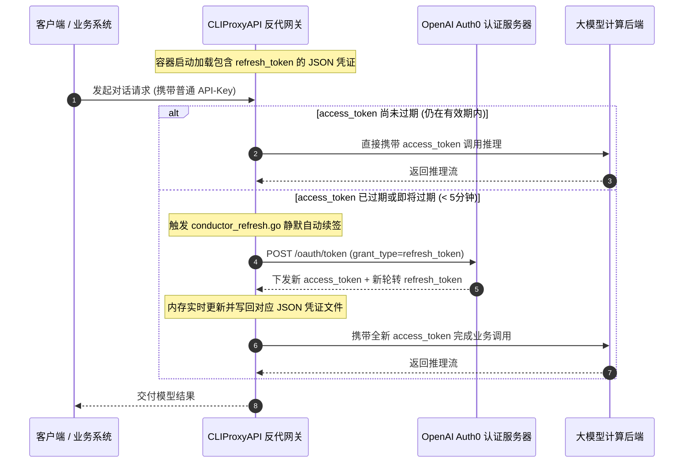

# 01. Token 生命周期拆解与自动化提取链路

要保障号池 24×7 小时持续可用，必须透彻理解 **OAuth 2.0 授权机制** 与 **Token 生命周期**。本节详细拆解为什么普通的短期 Token 会失效，以及生产级号池如何利用 Refresh Token 实现“永动轮转”。

---

## 一、Access Token 与 Refresh Token 的生命周期机制



### 1. 短命的 Access Token (AT)
- **有效期**：通常仅有 **3600 秒（1小时）** 或更短；
- **用途**：作为 Bearer Token 挂载在 HTTP Header 中，直接向推理后端声明鉴权；
- **致命痛点**：若号池中只保存 AT，系统运行 1 小时后所有请求将大面积遭遇 `401 Unauthorized` 致命报错。

### 2. 永动的 Refresh Token (RT)
- **有效期**：通常长达 **30 天至数月**，只要账号本身未被封禁或手动改密，即可反复续期；
- **轮转机制（Refresh Token Rotation, RTR）**：现代安全规范下，每次使用 RT 换取新 AT 时，认证服务器通常会同时下发一个全新的 RT，旧 RT 自动作废。反代程序（如 CLIProxyAPI）在接收到新 RT 后会**自动写回并替换本地 JSON 文件**，从而实现持续无限期的无感顺延。

---

## 二、提取 OAuth 凭据的标准实操路径

提取高质量、带完整 RT 的 JSON 凭据，通常有两种标准途径：

### 途径 A：使用 CLIProxyAPI 自带的 `-codex-login` 命令行工具（最推荐）

CLIProxyAPI 官方二进制内置了标准 OAuth 授权拦截器，能够模拟标准客户端发起 PKCE 认证并在本地自动生成完美格式的 JSON 凭据。

1. **直接启动登录拦截器**：
   ```bash
   # 在海外服务器或本地海外终端执行
   docker exec -it cli-proxy-api ./CLIProxyAPI -codex-login
   ```
2. **终端输出授权链接**：
   终端会输出类似于以下格式的官方登录 URL：
   ```text
   Please open the following URL in your browser:
   https://auth0.openai.com/u/login/identifier?state=...
   ```
3. **完成人机验证与登录**：
   将 URL 复制到浏览器打开，输入对应的 Plus 账号与密码；
4. **自动生成凭证**：
   登录成功后，浏览器会自动重定向到本地监听端口，CLIProxyAPI 自动拦截回调、换取 Token，并在 `auth-dir` 目录下直接生成合规的标准 `codex-xxxx.json` 文件！

### 途径 B：使用 `-codex-device-login` 设备码流（适用于无公网浏览器环境）

如果你的 VPS 无法打开图形界面，且不便进行本地端口回调转发，可使用设备码登录流：
```bash
docker exec -it cli-proxy-api ./CLIProxyAPI -codex-device-login
```
系统会输出一个 **8 位字符的设备配对码**（如 `WDJB-49KM`）和官方配对网址 `https://auth0.openai.com/activate`。用任何手机或电脑浏览器打开该网址，输入该 8 位码并确认授权，服务器后台便会立刻捕获并下发凭据包。
