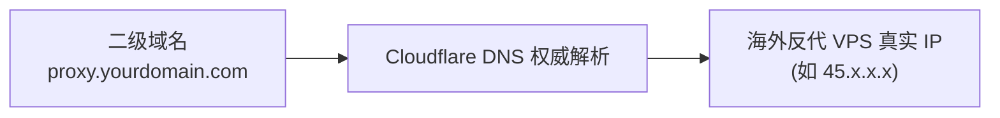
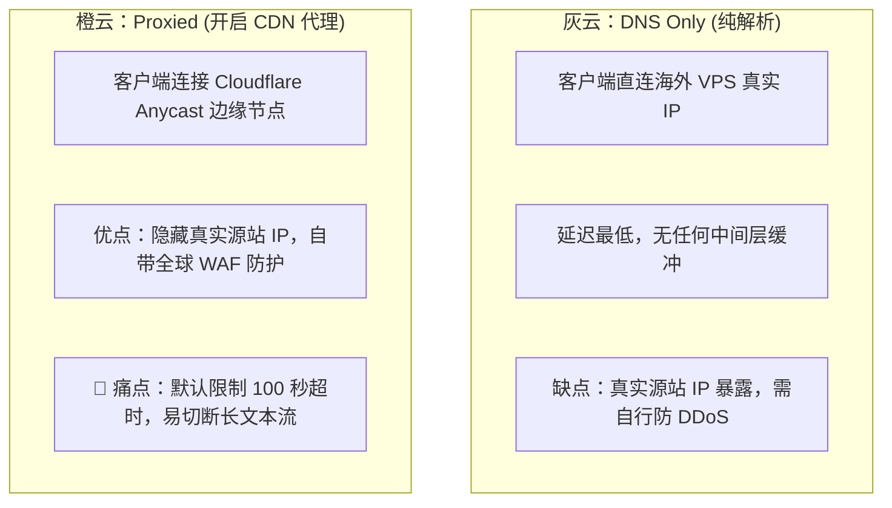

# 01. Cloudflare 二级域名 DNS 智能解析与灰橙云核心抉择

为了将 overseas 反代节点接入我们的生产微服务与微信小程序，必须为其绑定一个独立的二级域名，并通过 Cloudflare 进行权威 DNS 解析。

---

## 一、域名准备与 Cloudflare 接入

1. **域名购买**：建议选用通用的 `.com`、`.net` 或性价比极高的 `.cn`、`.top` 域名；
2. **接入 Cloudflare**：
   - 在 Cloudflare 控制台点击【Add a site】；
   - 按照指引，将域名注册商处的 DNS Nameservers（名称服务器）修改为 Cloudflare 分配的专属地址（如 `ada.ns.cloudflare.com`）；
   - 等待 5~15 分钟即可完成全球生效。

---

## 二、配置二级域名 A 记录

假设您的主域名为 `yourdomain.com`（真实生产实战参考：如我们的 `tg-cc755.cn`），现在为反代中转引擎分配一个二级子域名：`proxy.yourdomain.com`（或 `cpa.yourdomain.com`）：

1. 进入 Cloudflare 对应域名的【DNS】->【Records】；
2. 点击【Add record】：
   - **Type (类型)**：`A`
   - **Name (名称)**：`proxy`（或 `cpa`、`meme`）
   - **IPv4 address**：填入海外 VPS 的真实公网 IP
   - **Proxy status (代理状态)**：关键选择（见下一节）
   - **TTL**：Auto

---

## 三、灰云（仅 DNS） vs 橙云（CDN 代理）核心取舍（必读避坑）

这是大模型开发者最常踩的“隐蔽深坑”：

### 1. 为什么“橙云”可能破坏大模型流式输出？
- **100 秒强制作废（Gateway Timeout 524）**：Cloudflare 免费版对单个 HTTP 请求的最长保持时间为 100 秒。当大模型在深度思考（Thinking）、生成上万字超长代码或处理大批量并发动图生成时，一旦超过 100 秒，Cloudflare 会强行斩断连接并向客户端抛出 `524 A timeout occurred`；
- **响应缓冲干扰**：默认情况下，CDN 可能会试图缓冲一小块数据再分发，破坏“逐字打字机”的丝滑流式体验。

### 2. 生产最佳决策矩阵

| 业务场景 | 推荐配置 | 优化方案与要点 |
| :--- | :--- | :--- |
| **作为小程序后端直接 API 接口** | ⭐️ **首选 灰云 (DNS Only)** | 延迟最低，完全避免任何 100s 握手断连风险。在 VPS 上依靠 UFW 与 Nginx 限流保证安全。 |
| **需要隐藏源站 IP / 防止被恶意攻击** | ⭐️ **选择 橙云 (Proxied)** | 必须在 Cloudflare 的【Configuration Rules】中针对该二级域名设置 **Disable Buffer** 并延长超时时间。 |
