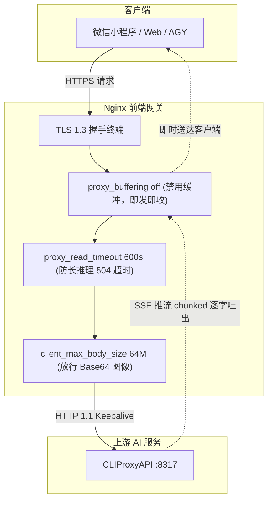

# 5.3 专为大模型打字机流式设计的生产级 Nginx 配置

将海外大模型反向代理（如 CLIProxyAPI）暴露给外部应用（如微信小程序后端、Web 前端或 AGY CLI）时，使用 **Nginx** 作为最前端的统一反向代理网关是业界的标准实践。

然而，如果直接套用传统 Web 网站的默认 Nginx 配置，在面对大模型对话场景时，会遭遇一系列毁灭性的生产故障：
1. **打字机流式效果失效（首字严重延迟）**：默认开启的 Nginx 响应缓冲会导致数据块被暂存，前端必须等大模型吐出数千字或彻底回答结束才能一次性刷出，用户体验瞬间崩塌。
2. **长文本推理与图像生成频繁 504 超时**：GPT-4o、Claude 3.5 Sonnet 或 DALL-E 3 / gpt-image 生成高清大图往往耗时 40~180 秒，默认 60 秒读取超时会导致连接直接被 Nginx 掐断。
3. **多模态图文输入报 413 错误**：用户上传高清头像、UI 截图进行图像识别或表情包合成时，请求体动辄数兆，触发默认 `client_max_body_size 1M` 拦截。

本节将逐一剖析这些技术痛点，并交付一份**久经数万并发实战检验的生产级 Nginx 终极配置文件**。

---

## 核心痛点与必须配置的关键参数解析



### 1. `proxy_buffering off;`（决定流式打字机体验的核心）
- **默认行为**：Nginx 默认会缓冲上游服务器的响应数据（`proxy_buffering on`），直到累积达到 `proxy_buffers` 设定的内存块大小（通常 4KB~8KB）或上游连接完全关闭时，才一次性刷入客户端。
- **大模型场景**：大语言模型基于 Server-Sent Events (SSE) 逐字生成 Token。若开启缓冲，用户在小程序界面会看着光标发呆数十秒，随后一段长文瞬间暴跌式蹦出。
- **解决方案**：必须在对应路由下设置 `proxy_buffering off;`，同时配合 `proxy_cache off;` 与 `chunked_transfer_encoding on;`，强迫 Nginx 收到上游的每一个字符切片立即推送至客户端。

### 2. `proxy_read_timeout 600s;`（防长推理与生图断连）
- **默认行为**：Nginx 默认在 60 秒内没有收到上游数据的读取事件时，判定上游宕机并抛出 `504 Gateway Time-out`。
- **大模型场景**：复杂 Prompt 分析、长思维链（Chain of Thought）推理、或 `gpt-image-2` 并行合成多张高精图片时，模型思考与渲染耗时常突破 60 秒。
- **解决方案**：将 `proxy_read_timeout` 与 `proxy_send_timeout` 延长至 300 秒至 600 秒（5~10 分钟）。

### 3. `client_max_body_size 64M;`（放行多模态大图片与长上下文）
- **默认行为**：Nginx 默认只允许 1MB 的客户端请求主体，超出立即返回 `413 Request Entity Too Large`。
- **大模型场景**：多模态视觉请求（如传入 Base64 格式的高分辨率设计图、原画）请求体往往达到 5MB~20MB。
- **解决方案**：将允许的请求体上限调高至 50M 或 64M。

### 4. `proxy_http_version 1.1;` 与连接复用
- **默认行为**：Nginx 向上游转发默认使用 HTTP 1.0，每次转发都会重新发起三次握手并丢弃 Keep-Alive。
- **解决方案**：强制指定 `proxy_http_version 1.1;` 并清空请求头中的 `Connection ""`，在上游建立持久长连接池，降低连接开销。

---

## 生产级 Nginx 配置文件全景模板

在 VPS 的 `/etc/nginx/sites-available/` 目录下创建新配置文件：

```bash
sudo vim /etc/nginx/sites-available/ai-proxy.conf
```

完整配置代码如下（已包含 HTTP 自动跳转 HTTPS、现代 TLS 加密套件、HSTS、防抖限流与长连接代理）：

```nginx
# ==============================================================================
# AI 反向代理生产级 Nginx 优化配置
# 适配模型: GPT-4o, Claude 3.5, gpt-image, DALL-E, O1/O3 推理模型
# ==============================================================================

# 1. 定义上游反代服务（启用连接池保活）
upstream cliproxy_backend {
    server 127.0.0.1:8317;
    keepalive 64; # 保持 64 个空闲长连接，避免频繁三次握手
}

# 2. HTTP 80 端口自动重定向至 HTTPS 443
server {
    listen 80;
    listen [::]:80;
    server_name api.yourdomain.com;

    # 针对 Let's Encrypt 传统 HTTP-01 验证的保留路径（可选）
    location /.well-known/acme-challenge/ {
        root /var/www/html;
    }

    location / {
        return 301 https://$host$request_uri;
    }
}

# 3. HTTPS 443 核心服务块
server {
    listen 443 ssl http2;
    listen [::]:443 ssl http2;
    server_name api.yourdomain.com;

    # --------------------------------------------------------------------------
    # SSL/TLS 证书路径 (根据 5.2 节选择配置)
    # --------------------------------------------------------------------------
    # 选项 A: Cloudflare Origin CA 证书路径
    # ssl_certificate     /etc/nginx/ssl/cf_origin_api.yourdomain.com.pem;
    # ssl_certificate_key /etc/nginx/ssl/cf_origin_api.yourdomain.com.key;

    # 选项 B: ACME.sh 签发的 Let's Encrypt ECC 证书路径 (推荐)
    ssl_certificate     /etc/nginx/ssl/api.yourdomain.com/fullchain.pem;
    ssl_certificate_key /etc/nginx/ssl/api.yourdomain.com/privkey.pem;

    # --------------------------------------------------------------------------
    # 安全加固与 TLS 性能调优 (兼容 TLS 1.2 / 1.3)
    # --------------------------------------------------------------------------
    ssl_protocols TLSv1.2 TLSv1.3;
    ssl_prefer_server_ciphers off;
    ssl_ciphers "ECDHE-ECDSA-AES128-GCM-SHA256:ECDHE-RSA-AES128-GCM-SHA256:ECDHE-ECDSA-AES256-GCM-SHA384:ECDHE-RSA-AES256-GCM-SHA384:DHE-RSA-AES128-GCM-SHA256:DHE-RSA-AES256-GCM-SHA384";

    # 会话复用与加速
    ssl_session_cache shared:SSL:20m;
    ssl_session_timeout 1d;
    ssl_session_tickets off;

    # HSTS 强制客户端后续仅使用 HTTPS 访问 (包含子域名，有效期半年)
    add_header Strict-Transport-Security "max-age=15768000; includeSubDomains" always;
    add_header X-Content-Type-Options nosniff always;
    add_header X-Frame-Options SAMEORIGIN always;

    # --------------------------------------------------------------------------
    # 基础网络与请求体大小调优
    # --------------------------------------------------------------------------
    client_max_body_size 64M;           # 支持多模态超大图像/文件请求上传
    client_body_buffer_size 128k;

    # 访问日志与错误日志格式
    access_log /var/log/nginx/ai_proxy_access.log;
    error_log  /var/log/nginx/ai_proxy_error.log warn;

    # --------------------------------------------------------------------------
    # 核心路由: 全量转发给 CLIProxyAPI
    # --------------------------------------------------------------------------
    location / {
        proxy_pass http://cliproxy_backend;

        # 1. 协议版本升级与连接复用
        proxy_http_version 1.1;
        proxy_set_header Connection "";

        # 2. 透传客户端真实 IP 与协议信息
        proxy_set_header Host $host;
        proxy_set_header X-Real-IP $remote_addr;
        proxy_set_header X-Forwarded-For $proxy_add_x_forwarded_for;
        proxy_set_header X-Forwarded-Proto $scheme;

        # 3. 彻底禁用缓冲 - 确保 SSE 打字机极速流式输出
        proxy_buffering off;
        proxy_cache off;
        chunked_transfer_encoding on;

        # 4. 延长超时时间 - 满足复杂模型思考与生图长耗时
        proxy_connect_timeout 60s;
        proxy_send_timeout 600s;
        proxy_read_timeout 600s;

        # 5. 支持 WebSocket 升级 (部分多模态/流式协议所需)
        proxy_set_header Upgrade $http_upgrade;
        proxy_set_header Connection $connection_upgrade;
    }

    # --------------------------------------------------------------------------
    # 敏感管理端点安全访问控制 (可选)
    # 若在公网开放 WebUI 管理端点，可限制仅允许运维内网或信任 IP 访问
    # --------------------------------------------------------------------------
    # location /management {
    #     allow 1.2.3.4;       # 你的家/公司固定 IP
    #     deny all;
    #     proxy_pass http://cliproxy_backend;
    # }
}

# 辅助配置: WebSocket 连接升级变量映射 (若 nginx.conf 全局未包含需在此声明)
map $http_upgrade $connection_upgrade {
    default upgrade;
    ''      close;
}
```

---

## 激活配置与热重载

完成文件编辑后，执行以下标准运维命令生效：

```bash
# 1. 建立软链接将配置接入 sites-enabled
sudo ln -sf /etc/nginx/sites-available/ai-proxy.conf /etc/nginx/sites-enabled/

# 2. 检查 Nginx 语法完整性与证书路径（至关重要，务必确保 syntax is ok）
sudo nginx -t

# 预期成功输出:
# nginx: the configuration file /etc/nginx/nginx.conf syntax is ok
# nginx: configuration file /etc/nginx/nginx.conf test is successful

# 3. 平滑热重载（毫秒级生效，当前运行的长连接不会被掐断）
sudo systemctl reload nginx

# 4. 验证端口监听状态
sudo ss -tulpn | grep nginx
```

---

## 生产常见 Nginx 故障排查手册

| 状态码 / 表现 | 常见根本原因 | 对应解决排查操作 |
| :--- | :--- | :--- |
| **502 Bad Gateway** | Nginx 无法与本地 `127.0.0.1:8317` 建立 TCP 握手。通常是 CLIProxyAPI 容器未启动或挂了。 | 运行 `docker ps` 检查容器状态；运行 `curl http://127.0.0.1:8317/health` 检查本地端口连通性。 |
| **504 Gateway Time-out** | 上游推理耗时超过了 `proxy_read_timeout` 限制。 | 检查配置文件中是否遗漏了 `proxy_read_timeout 600s;`；若开启了 Cloudflare 橙云，注意 Cloudflare 免费版限制单次 HTTP 空闲 100 秒（参见 5.1 节对策）。 |
| **413 Request Entity Too Large** | 客户端上传的请求体超过了 `client_max_body_size` 限制。 | 在对应 `server` 或 `location` 块中将 `client_max_body_size` 调大至 `64M` 或更高。 |
| **打字机卡顿，一次性吐出一大坨字** | Nginx 缓冲未关闭，或下游存在中间代理缓存。 | 确认已配置 `proxy_buffering off;`；如果是前端 Web 开发，确认前端 `fetch` 是否支持流式解析（ReadableStream），而非等 `response.json()`。 |
| **400 Bad Request (Header Too Large)** | 客户端传递的 Cookies 或自定义 Authorization 头过长。 | 在 `http` 块加入 `large_client_header_buffers 4 16k;`。 |

完成 Nginx 的高可用流式反代配置后，底层网络与入口网关已固若金汤。接下来，我们将正式进入核心调度引擎阶段——**CLIProxyAPI 架构部署、动态凭据轮询与故障隔离实战**。
