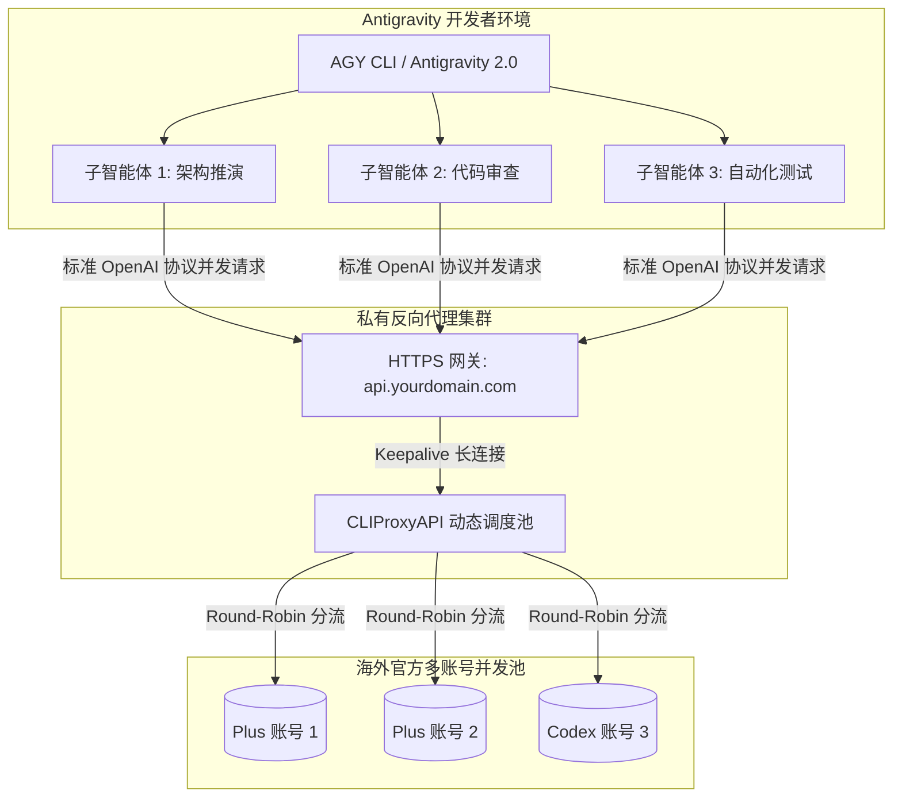

# 7.1 Antigravity (AGY) 接入自定义反代与多 Agent 协同加速

**Google Antigravity (AGY)** 是前沿的智能体编程开发环境与命令行工具（AGY CLI / Antigravity IDE）。在面对超大规模工程重构、跨文件代码推演以及多子智能体并行作业（Subagents Concurrent Invocation）时，AGY 对底层大语言模型有着极高的推理吞吐量与高并发要求。

如果直接使用官方单账号直连，在连续调用 3~5 个并发子智能体（如同时执行 `research`、代码架构分析、测试用例编写）时，极易瞬间撞上官方的 TPM / RPM（Tokens / Requests Per Minute）速率天花板，触发恼人的 HTTP 429 限流阻断。

将 AGY 接入我们搭建的 **CLIProxyAPI 多账号智能调度反代服务**，不仅能大幅降低使用成本，更能利用账号池的平摊分流机制，让多智能体协同畅快奔跑。

---

## 架构拓扑：AGY 与反代网关的集成关系



---

## 接入配置指南

### 1. 环境变量全局注入方式（最简推荐）

在开发者的操作系统（Linux / macOS / Windows WSL）环境配置文件（如 `~/.bashrc` 或 `~/.zshrc`）中注入以下标准环境变量：

```bash
# 1. 指向你自己的海外反代网关域名（末尾必须带 /v1）
export OPENAI_BASE_URL="https://api.yourdomain.com/v1"

# 2. 注入在 config.yaml 中配置的授权密钥
export OPENAI_API_KEY="sk-prod-cliproxy-secret-2026"

# 3. (可选) 指定默认基座模型
export AGY_DEFAULT_MODEL="gpt-4o"
```

保存后执行 `source ~/.bashrc` 即可全局生效。

---

### 2. AGY 客户端配置文件定制

若使用 Antigravity CLI 工具，可在其全局配置文件目录中进行定制：

```bash
# 配置文件通常位于 ~/.gemini/antigravity-cli/config.json
vim ~/.gemini/antigravity-cli/config.json
```

注入对应端点配置：

```json
{
  "api_endpoint": "https://api.yourdomain.com/v1",
  "api_key": "sk-prod-cliproxy-secret-2026",
  "default_model": "gpt-4o",
  "streaming": true,
  "request_timeout_seconds": 600,
  "models": {
    "inherit": "gpt-4o",
    "pro": "gpt-5.6-luna",
    "flash": "gpt-5.5"
  }
}
```

---

## 验证与多 Agent 性能实战

配置完成后，启动 AGY CLI 进行端到端握手测试：

```bash
# 执行简单提示词测试连通性
agy "请简要介绍当前工作空间"
```

在反向代理宿主机上实时监控 `docker compose logs -f cli-proxy-api`，你将看到 AGY 发起的请求被实时捕获并分发：

```text
[debug] [conductor_execution.go:1788] Use OAuth provider=codex auth_file=codex-plus-01.json for model gpt-4o
[info ] [gin_logger.go:103] 200 | 1.821s | 127.0.0.1 | POST "/v1/chat/completions"
```

### 多子智能体并行并发体验
当在 AGY 中运行复杂任务（例如触发多智能体并行重构或分析大仓库）时，多个 Subagent 同时向网关发起请求，CLIProxyAPI 的 `routing.strategy: "round-robin"` 将自动在多个 Plus 账号之间均匀轮流交替分发，彻底杜绝单号 429 报错，实现如丝般顺滑的开发体验！
