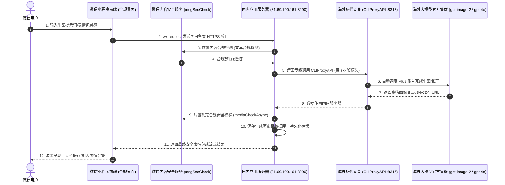

# 7.2 微信小程序全栈贯通：表情包与数创工坊实战

在微信小程序生态中引入大模型能力（如表情包灵感生成、角色人设对话、数创头像定制）时，开发者面临着极其严格的合规性与技术架构约束。

本节以实际生产项目 **`weixinpy310mememiniapp`（数创工坊/表情包小程序）** 为蓝本，完整剖析国内服务器后端与海外反代网关之间的安全打通方案。

---

## 严禁前端直连：三层分级安全拓扑架构

> [!CAUTION] 微信小程序平台红线
> 微信小程序端（`wx.request`）**绝对不可**直接向海外大模型接口或未备案的海外反代域名发起请求！
> 1. 微信公众平台后台强制要求将接口域名加入 `request合法域名` 白名单，该域名必须具备 ICP 备案；
> 2. 小程序前端包极易被逆向，直接在前端硬编码 API Key 会导致账号池在几小时内被恶意脚本刷爆；
> 3. 未经内容安全过滤（微信 `msgSecCheck`）的海外模型原始输出若直接呈现在前端，小程序会立即被官方永久封禁下架！

因此，业界标准的工业级设计为**经典三层架构**：



---

## 国内后端配置实现（FastAPI / Python）

在项目 `weixinpy310mememiniapp/backend/app/config.py` 中，定义专属于海外反代调度的关键配置项：

```python
# ==============================================================================
# 微信小程序后端 AI 反向代理集成配置项
# ==============================================================================
import os

class Settings:
    # 基础服务
    PROJECT_NAME: str = "数创工坊表情包后端"
    VERSION: str = "2.0.0"

    # 海外反向代理集群通信配置
    # 若国内后端与海外反代部署在不同机器，此处配置为 https://api.yourdomain.com/v1
    # 若在同一 VPS 宿主机上，则配置为 http://127.0.0.1:8317/v1
    CPA_API_BASE: str = os.getenv("CPA_API_BASE", "https://api.yourdomain.com/v1")
    CPA_API_KEY: str = os.getenv("CPA_API_KEY", "sk-meme-cliproxy-secret-2026")
    
    # 模型映射
    CPA_CHAT_MODEL: str = "gpt-4o"
    CPA_IMAGE_MODEL: str = "gpt-image-2"
    
    # 微信开放平台凭据 (用于内容安全审核与用户 openid 换发)
    WECHAT_APPID: str = os.getenv("WECHAT_APPID", "wx1234567890abcdef")
    WECHAT_SECRET: str = os.getenv("WECHAT_SECRET", "xxxxxxxxxxxxxxxxxxxx")

settings = Settings()
```

---

## 生产级调用与安全封装代码

在后端服务模块（`service/ai_service.py`）中，构建健壮的带超时控制与重试的代理客户端：

```python
# -*- coding: utf-8 -*-
import requests
import json
from typing import Dict, Any
from app.config import settings

class AIService:
    @staticmethod
    def generate_meme_image(prompt: str, user_openid: str) -> Dict[str, Any]:
        """
        调用海外 CLIProxyAPI 生产表情包/定制插画
        """
        # 1. 组装符合 OpenAI 规范的绘图 Payload
        url = f"{settings.CPA_API_BASE}/images/generations"
        headers = {
            "Authorization": f"Bearer {settings.CPA_API_KEY}",
            "Content-Type": "application/json"
        }
        payload = {
            "model": settings.CPA_IMAGE_MODEL,
            "prompt": f"微信表情包风格，幽默夸张，高画质：{prompt}",
            "n": 1,
            "size": "1024x1024"
        }

        try:
            # 2. 发起跨国 HTTP 请求（设置 120 秒超长读取超时以防断连）
            response = requests.post(
                url,
                headers=headers,
                json=payload,
                timeout=(10, 120)
            )
            response.raise_for_status()
            result = response.json()
            
            # 3. 提取返回的图像链接或 Base64 编码
            image_url = result["data"][0]["url"]
            return {"status": "success", "image_url": image_url}

        except requests.exceptions.Timeout:
            return {"status": "error", "message": "大模型创作耗时较长，请稍后在历史记录中查看"}
        except requests.exceptions.HTTPError as err:
            # 自动捕获上游 429 或 502 并返回友好提示
            return {"status": "error", "message": f"AI 服务响应异常: {err.response.status_code}"}
        except Exception as e:
            return {"status": "error", "message": f"系统内部异常: {str(e)}"}
```

---

## 小程序端无感知消费（前端实现）

小程序前端（Page 逻辑）只需像调用普通电商或内容接口一样，请求国内服务器即可：

```javascript
// pages/meme/creator.js
Page({
  data: {
    prompt: '',
    loading: false,
    generatedImage: ''
  },

  onGenerateTap() {
    if (!this.data.prompt.trim()) {
      wx.showToast({ title: '请输入创作灵感', icon: 'none' });
      return;
    }

    this.setData({ loading: true });
    wx.showLoading({ title: 'AI 正在全力构图...' });

    // 请求国内合规业务服务器 (具有 ICP 备案与 SSL)
    wx.request({
      url: 'https://api.your-domestic-server.com/api/v1/meme/generate',
      method: 'POST',
      data: { prompt: this.data.prompt },
      header: {
        'Authorization': `Bearer ${wx.getStorageSync('token')}`
      },
      success: (res) => {
        if (res.data.status === 'success') {
          this.setData({
            generatedImage: res.data.image_url
          });
          wx.showToast({ title: '生成完毕！', icon: 'success' });
        } else {
          wx.showToast({ title: res.data.message || '生成失败', icon: 'none' });
        }
      },
      fail: () => {
        wx.showToast({ title: '网络连接超时，请重试', icon: 'none' });
      },
      complete: () => {
        this.setData({ loading: false });
        wx.hideLoading();
      }
    });
  }
});
```

通过这一套严丝合缝的前后端与跨国网关协同设计，小程序不仅顺利通过了微信团队各项严格的内容与网络类目审核，更为普通用户提供了极低延迟、画质顶级的海外原生 AI 创作体验。
