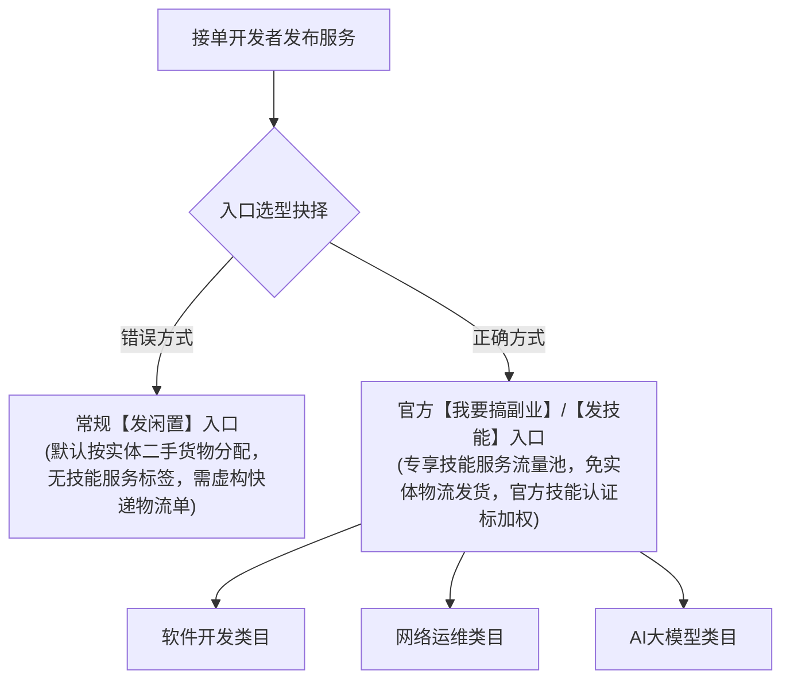
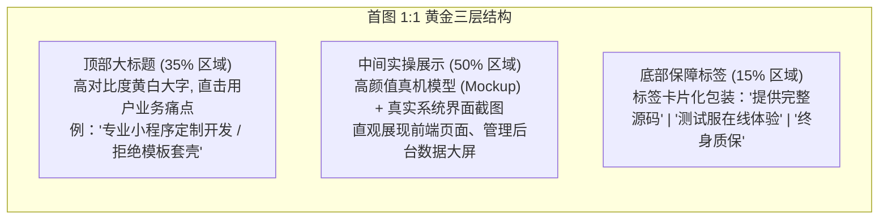

# 爆款商品发布细节、副业类目选择与主图视觉设计

在闲鱼平台上，商品就是你的全天候业务员。许多开发者虽然技术深厚，但往往误选了发布入口、使用了只有寥寥数语的标题（如“做个小程序”），主图随手截一张毫无美感的代码黑底界面，导致在系统推荐算法中彻底沉底、毫无曝光。

掌握**正确的技能副业入口、多类目精确定位、30 字黄金长尾词布局与高转化电商视觉设计**，是源源不断获取精准高客单询盘的决胜手。

---

## 一、 发布入口选择：【我要搞副业】vs 常规闲置专区

很多新手发布技术接单服务时，直接点击底部的“+”号选择“发闲置”，结果商品被系统归类到实体二手类目，交易时被迫填写物流快递单号，极易引发虚假发货处罚。



### 1. 【我要搞副业】专属入口优势
1. **专属服务流量池**：闲鱼官方针对自由职业者、兼职技术人推出的垂直业务板块，享受官方频道页面的独立流量扶持；
2. **免实体物流发货限制**：系统原生支持“在线提供技术服务”的履约状态，彻底规避因没有真实物流轨迹而被判定为“虚假发货”的封店风险；
3. **专属服务字段支持**：支持配置“服务时长”、“按件/按工时报价”、“服务范围保障”、“远程协助方式”等专业字段，增强客户下单信任度。

### 2. 三大核心 IT 技能类目选型与认证匹配

在【我要搞副业】发布技能时，必须根据自身特长精准选择对应的二级/三级类目：

| 核心技能类目 | 涵盖的高频接单方向 | 适配客户画像 | 对应官方认证与标签 |
| :--- | :--- | :--- | :--- |
| **软件开发** | 微信小程序、Web 前后端（Vue/React/Java/Python/Go）、移动端跨平台 APP（Uni-app/Flutter）、爬虫脚本与数据清洗。 | 电商商户、实体店老板、初创团队、需要批量处理数据的白领。 | **软件工程师认证 / 编程开发专家** |
| **网络运维** | Linux 生产环境排障、Docker/K8s 容器化、群晖/威联通 NAS 私有云搭建、软路由配置、内网穿透（FRP/Cloudflare Tunnel）与 SSL 证书配置。 | 极客玩家、中小型企业网管、私有云存储需求者。 | **系统运维专家 / 网络工程师认证** |
| **AI 大模型** | DeepSeek/Qwen/Llama3 本地离线部署（Ollama/vLLM）、企业私有知识库 RAG 搭建、Prompt 提示词调优、AI Agent 智能体工作流设计、ComfyUI 绘画脚本开发。 | 科技初创公司、自媒体创作者、传统行业数字化转型管理者。 | **AI 算法工程师 / 人工智能实战专家** |

---

## 二、 30 字标题撰写黄金公式与长尾词布局

闲鱼系统允许商品标题最多输入 **30 个汉字（60 个字符）**。每一字都是宝贵的搜索流量入口，**必须严格填满 30 个字，杜绝字数浪费**！

```{important}
**闲鱼技术服务标题黄金组合公式：**
$$\text{标题} = \text{核心主关键词 (2\~3个)} + \text{高频业务场景词 (3\~4个)} + \text{主流技术栈词} + \text{交付保障词}$$
```

### 优质标题拆解示范与避坑

* **优秀范例（软件开发 - 小程序方向）**：
  > `微信小程序定制开发外包代写商城跑腿预约同城上门系统制作Vue前端Java后台`
  * *覆盖搜索词*：小程序开发、小程序定制、商城小程序、跑腿系统、预约小程序、同城系统、Vue前端、Java后台外包。
* **优秀范例（AI 大模型与自动化方向）**：
  > `DeepSeek本地私有化部署AI大模型知识库RAG搭建Ollama调试Prompt调优`
  * *覆盖搜索词*：DeepSeek部署、本地大模型、知识库搭建、RAG系统、Ollama调试、Prompt调优。
* **优秀范例（网络运维方向）**：
  > `Linux服务器环境部署Docker运维排障群晖NAS私有云搭建内网穿透配置`
* **常见严重错误**：
  * ❌ 标题仅有几个字（如：“专业开发软件”、“Python接单”，极其浪费搜索词槽位）；
  * ❌ 包含明显的违禁敏感词（如：“毕业设计”、“论文代写”、“抢单外挂”），直接触发系统秒级审核下架甚至封号。

---

## 三、 定价锚点策略：标价机制与拍单基数

在闲鱼发布技术定制类服务时，很多新手不知道该如何标价：

| 标价模式 | 具体操作方式 | 优缺点深度权衡 | 推荐指数 |
| :--- | :--- | :--- | :--- |
| **超低价模式 (标 1 元 / 0.1 元)** | 商品标价 1 元或 0.1 元，意图吸引买家点进来私聊。 | ❌ **极度不推荐**。闲鱼算法已针对 1 元低价引流进行严密降权，系统直接标记为“低质广告”且不给予自然搜索推流。 | 0 星 |
| **拍单基数模式 (标 50 元 / 100 元)** | 标价 100 元，并在描述中写明“总价按需求评估，此链接为定金拍付基数（如总价 1000 元则拍 10 件）”。 | ⭐⭐⭐⭐⭐ **首选推荐**。既符合系统正常价格波动范围，又方便后续根据双方最终约定的总金额灵活拍付。 | 5 星 |
| **真实标准一口价 (标 1,500\~3,000 元)** | 针对标准化小单（如纯企业展示小程序、单页面抓取脚本）直接标明全款。 | ⭐⭐⭐⭐ **推荐用于标准化商品**。精准筛选掉无预算的低质白嫖客户，进来的咨询买家成交意向极强。 | 4 星 |

---

## 四、 首图视觉设计原则与 3 秒吸引法则

买家在闲鱼瀑布流上下滑动浏览时，停留在一张商品主图上的时间**通常不足 3 秒**。首图决定了 80% 以上的点击率（CTR）：



### 首图设计四大纪律
1. **拒绝纯代码黑屏截图**：非技术客户根本看不懂终端命令行和代码，放代码只会吓退客户；必须展示**“漂亮的 UI 界面、手机端真机渲染图与后台统计报表”**。
2. **大字体、高对比度**：在手机仅有 2 英寸大小的商品缩略图上，文字必须保证清晰可辨（推荐使用黑金配色、蓝白配色或极客科技配色）。
3. **作图工具推荐**：
   * **[稿定设计](https://www.gaoding.com/)** / **[创客贴](https://www.chuangkit.com/)** / **Canva 可画**：在搜索栏直接输入“闲鱼主图”或“软件外包主图”，有海量现成的商业化模板，只需一键替换文字并拖入自己的软件截图，3 分钟即可出图。

---

## 五、 高转化商品详情文案框架模板

```markdown
【关于我们】
10年资深技术团队 / 官方认证服务商，专注商业级软件落地，代码规范，信誉保障！

【专业服务类目与范畴】
1. 微信小程序开发：商城零售、同城跑腿、家政预约、多商户入驻、分销分账；
2. AI 大模型应用：DeepSeek 私有化部署、企业专属 RAG 知识库、Agent 智能体定制；
3. 网络与系统运维：Linux 服务器环境搭建、Docker/K8s 容器化、群晖 NAS 搭建、故障排查；
4. Web 全栈与接口：Vue3/React 现代化前端、Java/Python 高性能后端 API。

【为什么选择我们？】
✅ 严谨守时：严格按照双方确认的 PRD 功能清单开发，绝不中途加价！
✅ 安全履约：提供自有测试服务器在线体验，满意确认收货后再交接代码！
✅ 售后无忧：交付包含完整安装部署文档与视频教程，提供 30 天免费质保维护！

⚠️【下单须知】
由于技术定制服务属于非标服务，页面标价为定金拍付基数。直接拍下不发货，请务必先点击右下角【我想要】发送具体需求文档进行评估沟通！
```
