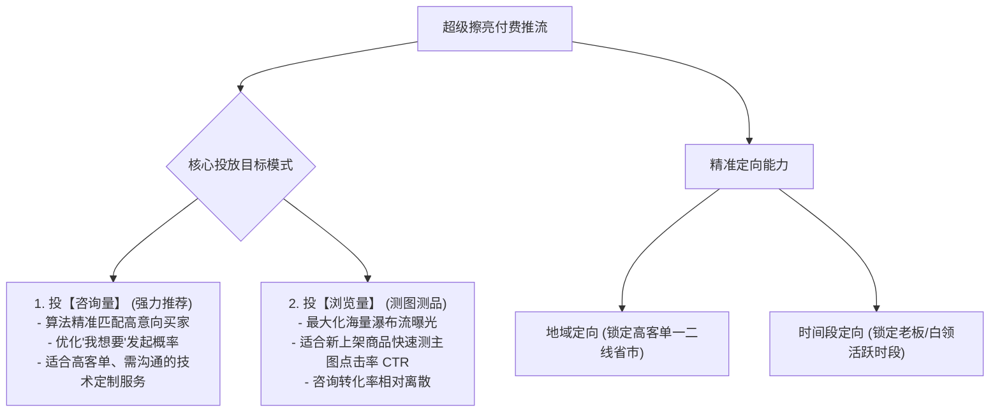
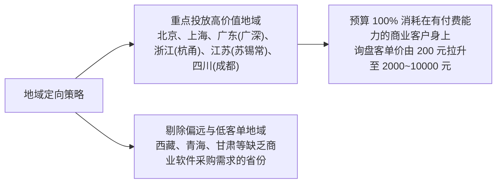
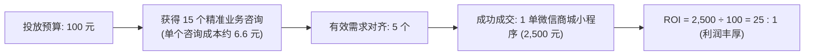
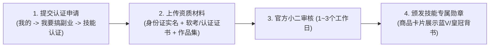
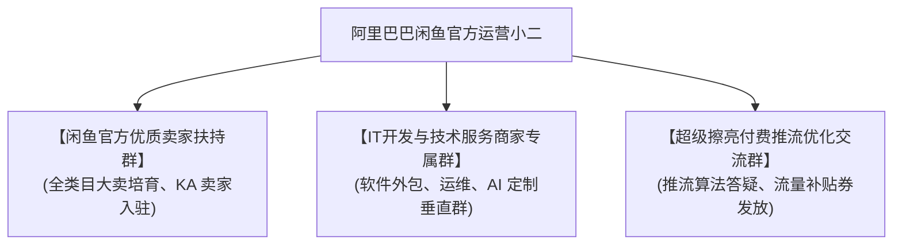
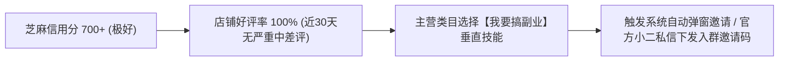

# 04 超级擦亮付费推流、官方技能认证与钉钉商家扶持生态

在闲鱼平台的流量分配体系中，**自然流量是基础底盘，而“官方技能认证 + 超级擦亮付费推流 + 官方小二扶持生态”则是突破流量天花板、获取源源不断高客单商业商单的核心杠杆**。

很多技术人员仅仅把闲鱼当成普通二手跳蚤市场，每天被动等待 1 次免费擦亮，一个月下来咨询寥寥无几。实际上，闲鱼早已发展出成熟的**商业化推流矩阵与垂直服务扶持体系**。

本节系统拆解**超级擦亮付费竞价投放全攻略（投咨询 vs 投浏览、地域精准定向、ROI 测算）、官方技能认证通关秘籍，以及如何进入闲鱼官方钉钉扶持群享受小二直通车与活动流量红利**。

---

## 一、 超级擦亮（Super Polish）：闲鱼付费推流完全指南

“超级擦亮”是闲鱼官方推出的商品精准推流与竞价曝光工具（类似淘宝直通车与抖音 DOU+）。

### 1. 普通擦亮 vs 超级擦亮对比

| 维度对比 | 普通免费擦亮 | 超级擦亮（付费推流） |
| :--- | :--- | :--- |
| **刷新频次** | 每 24 小时每个商品仅限 1 次。 | 不限频次，按预算随时启动与暂停。 |
| **展现位置** | 仅在时间排序列表中有轻微短暂上升。 | 直接插队进入**搜索结果首页前排卡位、猜你喜欢与频道核心推荐位**。 |
| **流量标签** | 普通闲置流量，人群意向随机。 | **算法根据历史行为（如搜索过“小程序”、“开发”）精准圈选意向人群**。 |
| **视觉特权** | 无特殊标识。 | 带有“Hot/超赞/精选”专属角标，吸睛率提升 50% 以上。 |

---

### 2. 投放目标抉择：投【咨询量】 vs 投【浏览量】

在配置超级擦亮推广计划时，系统会提供两种核心优化目标：

#### ① 投【咨询量】（技术外包首选 ⭐⭐⭐⭐⭐）
- **算法底层机制**：闲鱼算法通过大数据分析，仅将你的技术服务展示给那些**近期在闲鱼有高频搜索、加购或发起过“我想要”私聊行为的高意向客户**；
- **为什么必须投咨询**：软件定制不是冲动消费的九块九包邮小商品，客户不可能看一眼就直接拍下，**必须先有私聊咨询才能进入需求评估与报价环节**。获得一个精准咨询，就等于拿到了价值上千元商业订单的谈判入场券！

#### ② 投【浏览量】（测款选品备选 ⭐⭐⭐）
- **适用场景**：新上架了一个“DeepSeek 本地部署”或“群晖 NAS 搭建”的新品，不确定主图是否吸引人。花 10~20 元投浏览量，若 1000 次曝光中点击率超过 8%，说明主图过关，随后立即切换为投【咨询量】。

---

### 3. 精准地域定向（Geo-targeting）实操策略

超级擦亮支持**按省份、地级市进行精准地域定向**。对于技术服务接单者而言，这一功能至关重要！

- **为何必须做地域定向？**
  - 如果进行全国无差别通投，预算极易被偏远地区、无商业预算的散客消耗（如找你几十块钱写作业或纯闲聊的小白）；
  - 将投放地域**严格锁定在经济发达、中小企业密集的沿海与新一线省市**（北上广深、浙江、江苏、成渝），这些地区的实体商家、电商卖家、创业公司具备极强的付费能力，对几千上万元的系统开发报价接受度高。

---

### 4. 出价策略与投产比（ROI）测算模型

#### ① 出价与预算控制建议
- **小步快跑测试**：单计划初始设置 **20 ~ 50 元** 试水，建议选择“智能托管出价”，由系统算法根据竞争热度动态平滑消耗；
- **单次有效咨询成本红线**：在 IT 软件与运维类目下，**单次咨询成本控制在 3 ~ 8 元属于极优水平**。如果单个咨询成本超过 15 元，需立即暂停计划并优化主图与标题。

#### ② 投前自查三要点（杜绝白白烧钱）
1. **查首图**：主图是否具有高对比度大标题与高清界面展示？如果首图模糊，曝光再多也不会有人点击；
2. **查文案**：详情文案是否白纸黑字写清了服务范畴、交付流程与“先聊需求后拍定金”提示？
3. **查店铺信誉**：店铺近 30 天有无中差评？是否有迟延回复的劣迹？信誉不良会导致买家进店后迅速流失。

---

## 二、 闲鱼官方技能认证全流程通关

获得闲鱼官方授予的**“技能认证专家”**或**“金牌技术服务商”**标识，是技术人员在闲鱼建立公信力护城河的关键步骤。

### 1. 技能认证带来的核心收益
- **搜索推荐超级加权**：官方算法对拥有技能认证的卖家给予更高的搜索展示优先级；
- **专属官方信用标识**：商品主图下方展示“技能认证服务者”官方角标，**彻底打消买家“私下付钱被骗跑路”的心理顾虑，咨询成交转化率提升 200% 以上**；
- **免实体发货特权**：系统自动将交易判定为在线技术服务，解除虚拟发货风控限制。

### 2. 认证材料准备清单
1. **身份证明**：二代身份证原件正反面（必须与闲鱼账号实名认证一致）；
2. **专业资质（任选 1~2 项）**：
   - 国家计算机技术与软件专业技术资格（软考中级/高级工程师）；
   - 主流云厂商认证（阿里云 ACP/ACE、腾讯云 TCP、华为云 HCIP/HCIE、AWS 架构师）；
   - 学历证书（计算机软件相关专业专科及以上学历毕业证）；
3. **商业作品集与案例证明**：
   - 个人 GitHub 仓库开源贡献、已上线的微信小程序二维码、管理后台运行截图；
   - 往期合作客户满意的五星好评截图或感谢聊天记录。

---

## 三、 闲鱼官方钉钉交流群体系与生态扶持红利

许多开发者不知道，闲鱼官方在阿里生态内部为高价值卖家建立了庞大的**钉钉官方运营矩阵**。进入官方群是获得平台一手资源与保护伞的最高阶玩法。

### 1. 进入官方钉钉群的四大核心特权

#### ① 阿里小二直通车与误判申诉绿色通道（最核心护城河！）
- 软件外包单子经常涉及“源码下载”、“远程协助”，极易触发闲鱼 AI 风险模型的误判下架甚至违规封号；
- 普通卖家找在线客服只会得到冷冰冰的机器人回复；而在官方钉钉群中，**可以直接 @ 对应行业类目的运营小二**，提供开发文档与真实聊天记录，小二可在内部后台人工加急审核并解封，挽救店铺权重。

#### ② 官方大型营销活动优先报名权
- 官方定期举办平台级大促与专题活动（如“闲鱼兼职日”、“程序员副业专场”、“双十一企业服务狂欢”）；
- 只有官方群内卖家能获得专属报名表单，入选后可在**闲鱼首页弹窗、开屏推荐、副业频道置顶专属会场**获得上百万的免费公域推流！

#### ③ 超级擦亮大额补贴券与推流流量包
- 闲鱼商业化运营小二会定期在钉钉群内空投专属福利：如“超级擦亮满 100 减 30”、“首充 200 赠送 100”推广券、免费擦亮体验包等，极大降低获客测试成本。

#### ④ 掌握一手规则与算法变动风向标
- 平台对服务类目哪类词汇（如“代写”、“外挂”）启动专项治理、对哪类新兴技术（如“DeepSeek 部署”、“AI Agent”）开辟流量扶持入口，小二都会第一时间在群内宣讲，让你永远比同行抢先一步捕捉红利。

---

### 2. 如何获得官方入群邀请资格？

闲鱼官方钉钉群采取**“定向邀请制与指标考核制”**，不对外公开群二维码：

1. **筑牢店铺基础分**：
   - 绑定个人或个体户真实支付宝，确保芝麻信用分达到 700 分（极好）；
   - 积极维护售前售中售后，维持 100% 好评率，绝不与买家在平台发生激烈撕逼与举报；
2. **主动报名招募通道**：
   - 在闲鱼 App 搜索栏搜索“闲鱼副业服务商招募”或进入【我要搞副业】顶部轮播图，填写官方技术服务商入驻问卷，提交手机号与钉钉号；
   - 审核通过后，阿里巴巴运营小二将在 1~3 个工作日内通过钉钉主动发起企业好友添加并将你拉入官方扶持群。
