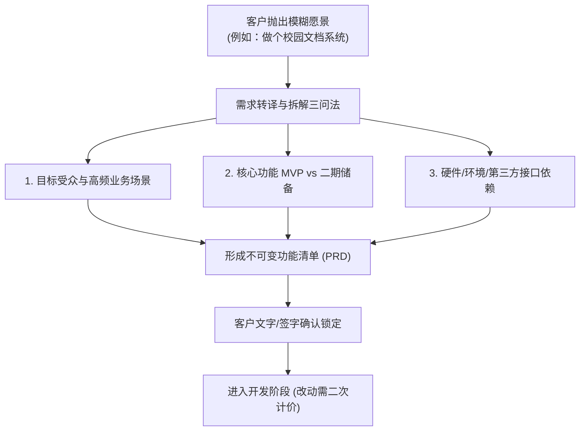
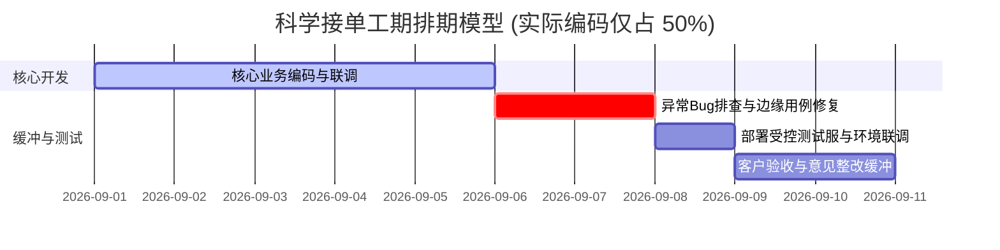
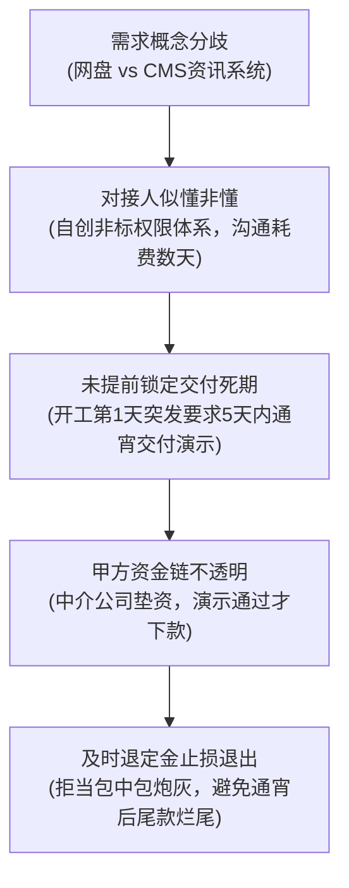

# 02 需求调研、边界锁定与工期缓冲策略

在接单外包领域，**“需求失控（Scope Creep）与工期误判”是导致程序员副业破产、项目烂尾甚至吃上官司的第一大元凶**。

新手程序员往往带着“打工人思维”去接单——客户说一句“想做一个类似于美团外卖的小程序”，程序员便随口回答“这很简单，我两天就能写完后台接口”。结果进入开发后，客户要求加骑手定位轨迹、加微信分账支付、加蓝牙小票打印机、加秒杀高并发集群……最终开发者身心俱疲、交付逾期、尾款拿不到，甚至双方反目成仇。

本节将系统拆解**非技术客户的沟通转译法则、不可变需求边界清单（PRD）锁定 SOP，以及科学的工期缓冲机制**。

---

## 一、 客户沟通心理学与“转译”艺术

副业接单中，客户根据技术认知通常可划分为三类：

| 客户认知画像 | 典型表现与沟通特征 | 核心应对策略与避坑指南 |
| :--- | :--- | :--- |
| **纯商业/小白客户** | 完全不懂技术代码，只懂商业变现与功能表象（“我想做个像小红书一样的社区”）。 | **担任产品架构导师**：帮其收敛欲望，将宏大愿景砍成极简 MVP（最小可行性产品），使用通俗业务词汇，切忌甩技术黑话。 |
| **专业技术主管/甲方研发** | 自身是资深工程师或技术经理，有现成的 API 规范、Gitlab 仓库和明确的技术栈。 | **工程严谨对齐**：遵守其编码规范，按工时/模块报价，提供高标准的单元测试与文档，沟通效率最高。 |
| **“似懂非懂”转包客（最危险）** | 懂一点 Python 脚本或 SQL，但缺乏架构设计能力；频繁发明奇奇怪怪的非标术语（如把网盘称为 CMS、把 RBAC 权限设计得漏洞百出）。 | **严格文档锁定与权威引导**：切忌让其主导技术设计，必须用标准方案（如标准 RBAC 权限模型）降维引导；警惕其作为“多层转包中介”的需求失真。 |



---

## 二、 需求调研“三问落地法”

在报价和收定金之前，开发者必须通过“三问法”将客户口中的“一句话需求”具象化为可执行的工程规格：

### 1. 第一问：目标受众是谁？核心闭环场景是什么？
- **错误问法**：“你后台想用什么数据库？要不要用微服务？”
- **正确问法**：“这个系统日常主要是谁在用？是学生在手机端查成绩，还是老师在电脑端批量导入 Excel？”
- **实战价值**：明确客户端形态（微信小程序、H5 移动端还是 PC 响应式后台），直接决定了前端 UI 的开发工作量。

### 2. 第二问：核心最小闭环功能（MVP）包含哪些？哪些可以放到二期？
- 引导客户砍掉边缘伪需求：“如果下周就要上线第一版，哪 3 个核心页面和功能是必须跑通的？其余的数据统计大屏、积分商城我们列入二期规划。”
- 将庞大的系统切片，确保一期在 1~2 周内快速交付收齐款项。

### 3. 第三问：外部依赖与第三方资质是否已准备就绪？
- **域名与服务器**：国内服务器是否已完成工信部 ICP 备案与公安备案？
- **第三方接口账号**：微信商户支付资质、短信验证码服务商、高德地图 API Key、微信小程序官方认证账号是否已申请下发？
- **硬件联调前提**：如果是嵌入式/物联网单子，实物开发板、传感器与烧录测试环境是否能提前快递寄达？

---

## 三、 不可变需求清单（PRD）锁定 SOP

在收取定金前，必须由开发者出具一份**《项目开发功能确认与边界清单》**，并在微信群或合同附件中要求客户回复“确认以此清单为准”。

### 需求清单标准模板

```markdown
# 【项目名称】：XXXX 校园文库管理系统功能确认清单
甲方客户：张经理
乙方开发：极客工作室
确认日期：2026-XX-XX

### 一、 明确交付功能范围 (正向清单)
1. 用户端 (PC 响应式 Web)：
   - 手机号验证码注册/登录与微信扫码快捷登录
   - 文档检索：按关键词、分类筛选 PDF/Word 文件
   - 文档在线预览 (采用 PDF.js 前端渲染，仅支持 50MB 以内文档)
   - 文档上传下载 (七牛云/阿里云 OSS 存储直传)
2. 权限体系：
   - 采用标准 RBAC 角色控制：普通用户、审核员、超级管理员
3. 管理后台：
   - 用户封禁/解封管理
   - 文档审核流 (通过、驳回及驳回原因备注)

### 二、 明确排除与非本次交付范围 (负向排除清单)
⚠️ 以下内容【不属于】本次 8000 元开发范围，如需新增需另计工时：
1. 不包含移动端原生 APP (Android/iOS) 开发；
2. 不包含视频大文件流媒体切片点播服务；
3. 不包含复杂的文档多人协同在线实时编辑（Office Online 协议）；
4. 服务器、域名、短信包及 OSS 存储云服务费用由甲方直接向云厂商支付。

### 三、 需求变更管理准则 (Change Request)
开发自定金支付日起正式进入开发周期。在此期间：
- 如甲方提出超出上述清单的新功能或流程推倒重构，双方须重新评估开发费用与顺延交付工期；
- 乙方出具《需求变更确认单》，甲方结清增项款项后方予执行。
```

```{warning}
**血泪教训：务必包含“负向排除清单”！**  
很多纠纷的爆发点不在于“你做的东西有 bug”，而在于“客户认为理所当然该有、而你压根没做”的功能（例如客户以为包含全套多角色分销裂变、以为包含海外多语言支持）。白纸黑字列出“不包含的内容”，是防范白嫖的最强护城河。
```

---

## 四、 工期评估与“30% 冗余法则”

接单开发与在企业内部打工最大的区别在于：**企业内部延期只是站会汇报，而商业接单延期可能直接面临违约退款、加倍索赔与差评纠纷**。



### 1. 30% 冗余缓冲定律
- 如果你凭借经验评估一个需求纯写代码需要 **7 个工作日**，向客户承诺的正式交付日期必须至少定为 **10 个工作日**（增加约 30%~40% 冗余时间）。
- **缓冲时间的实际消耗渠道**：
  1. 客户提供测试数据、微信商户秘钥的延误；
  2. 线上环境由于 Nginx、SSL 证书、CORS 跨域引发的非代码环境问题；
  3. 客户验收过程中的微调与审美主观修改；
  4. 开发者自身的突发私事或精力波动。

### 2. 紧急插单与“加急费”机制
- **场景**：客户突然找来：“我明天下午就要答辩/向投资人演示，今晚能不能连夜肝出来？”
- **应对原则**：
  - 首先理性评估可行性：如果核心逻辑存在致命硬门槛，坚决拒单，切勿为了几百块钱把自己的声誉架在火上烤；
  - 若可以熬夜通宵肝出，**必须加收 50%~100% 的加急费**，并在开工前全额收齐或走平台全额托管。
  - 严厉申明：“加急只保证主干流程演示顺畅，不包含深层极值压力测试与全套文档定制”。

---

## 五、 实战案例复盘：从 8k 单子谈崩看需求与工期的失控链条

在副业接单中，曾有一个典型的“8000 元校园文档系统”接单翻车案例，为所有开发者提供了极具价值的避坑样本：



### 深度剖析与避坑教训：
1. **警惕“包中包”转包链条**：中间人往往对技术只知皮毛，既想吃差价又无法清晰描述需求。需求每经过一层传递，失真度就增加 50%。
2. **警惕“拿演示当验收、指望下款再付尾款”的客户**：对方一万多元的流动资金都拿不出来，说明其与上游关系脆弱、违约风险极高。
3. **止损智慧高于沉没成本**：当发现需求不可控、工期不合理、资金无保障时，哪怕已经写了 1~2 天基础框架代码，也要果断**全额退还定金、体面终止合作**。及时退出只损失两天时间，执迷不悟将陷入长达数月的维权泥潭。
