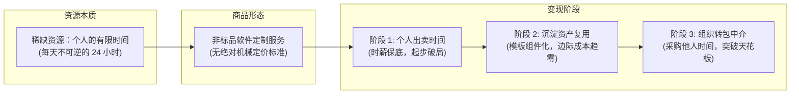

# 01 科学报价公式与市场基准行情表

许多技术开发者在初入外包市场时，最常见的困惑是：“一个微信小程序商城我到底该报 3000、8000 还是 20000？”报高了怕把客户吓跑，报低了又沦为廉价劳动力，累垮身体还倒贴服务器钱。

本节从商业本质出发，系统梳理**副业接单的成本底线测算模型、软件服务非标品特性、高低客单价战略选型，以及一线真实的市场模块化报价基准表**。

---

## 一、 接单的商业本质：出卖时间的非标品交易



1. **时间是不可再生的稀缺资产**：打工是把时间批发卖给单一雇主，外包接单是把闲暇时间切片零售给分散的商业客户。一个人哪怕不吃不睡，一天的物理极限也只有 24 小时。接单只是副业破局的起点，不能一辈子只靠纯敲代码出卖体力。
2. **软件定制属于典型的“非标品”**：工业品（如螺丝钉、手机芯片）有公允出厂价与标准质检流程；而软件外包受制于需求变动、沟通成本、甲乙双方认知差与审美偏好，**其价格上限完全取决于客户的支付能力与开发者的谈判博弈能力**。

---

## 二、 成本底线算法：时薪倒推法

开发者必须建立自己的**绝对保本底线（Walk-away Price）**。低于此底线的单子坚决拒接，否则就是做一单亏一单。

### 1. 个人真实时薪换算公式

$$
\text{日薪} = \frac{\text{主业税前月薪}}{22 \text{（月平均工作日）}}
$$

$$
\text{基础时薪} = \frac{\text{日薪}}{8 \text{（标准工时）}}
$$

- **案例测算**：
  - 假定主业月薪为 **10,000 元**：
    - 日薪 $\approx 10000 \div 22 \approx 454.5 \text{ 元}$；
    - 标准时薪 $\approx 454.5 \div 8 \approx 56.8 \text{ 元/小时}$（约 60 元/小时）。
  - 若主业常态化 996（每天工作 12 小时），则实际被动时薪仅约 $454.5 \div 12 \approx 37.8 \text{ 元/小时}$。

### 2. 需求保本工时估算法

当一个外包需求来临时，开发者预估自身纯编码与联调需要消耗 **10 个小时**：
- **绝对保本底价** $= 10 \text{ 小时} \times 60 \text{ 元/小时} = 600 \text{ 元}$；
- **心理防线**：低于 400~500 元的单子坚决不碰。因为副业消耗的是你的下班休息与健康时间，还要承担客户改需求的沟通摩擦。

```{note}
时薪倒推法只用于**计算自己的心理底牌**，绝对不能直接作为向客户展示的最终报价！直接报底牌等于把博弈筹码拱手让人。
```

---

## 三、 高客单价 vs 低客单价战略选型

副业初期，面对不同金额的单子，应该如何制定接单策略？

| 维度对比 | 低客单价单子（50 ~ 1000 元） | 高客单价单子（5000 ~ 50000+ 元） |
| :--- | :--- | :--- |
| **典型项目** | Bug 修改、静态单页切图、数据爬虫脚本、环境配置、课后小作业。 | 完整自营商城小程序、企业 ERP 系统、软硬件车机物联网平台。 |
| **服务重量** | **轻量级**：1~4 小时解决，不涉及长效售后与复杂运维。 | **重交付**：周期 1~3 个月，涉及合同、发票、UI 评审、多轮测试。 |
| **市场存量** | 需求基数极其庞大，闲鱼/QQ群每天成百上千条。 | 数量少，需要强烈的企业资质背书与行业人脉。 |
| **资金风险** | 坏账损失极小，可走闲鱼/担保秒确认到账。 | 资金占用大，极易遭遇客户拖延尾款、资金链断裂或扯皮烂尾。 |
| **新手适用度** | **强烈推荐（快速出单、破除心魔、积累五星好评）**。 | **谨慎介入**：建议具备团队或中介分包能力后再承接。 |

```{tip}
**战略建议**：新手入局切忌好高骛远看不起几十上百元的小单。一天做 3 个 150 元的轻量接口调试，净入 450 元，一个月就能带来过万增量收入，且毫无资金沉淀与法律维权风险。
```

---

## 四、 市场公允模块化报价基准表

根据一线众包平台、外包公司与独立接单工作室的交易实操，整理出以下模块化计价基准：

### 1. 前端页面开发基准（纯界面及前端交互）
- **PC 端基础静态页**：`80 ~ 120 元/页`（响应式自适应布局、基础表单提交）。
- **移动端/微信小程序页面**：`100 ~ 150 元/页`（常规页面如个人中心、文章列表、图文详情）。
- **复杂图表与交互页面**：`200 ~ 400 元/页`（含 Echarts 大屏看板、复杂拖拽表单、富文本富交互渲染）。

### 2. 后端 API 接口标准化基准（含数据库增删改查）
- **单接口标准价**：`150 ~ 200 元/接口`。
- **计算模型示例**：
  - 一个零售收银后台，包含登录、权限判定、商品分类 CRUD、库存划扣、订单生成、微信扫码支付等共 30 个标准接口：
  - 后端接口开发预算 $= 30 \times 150 \sim 200 = 4,500 \sim 6,000 \text{ 元}$。
  - 前端小程序约 15 个页面 $= 15 \times 120 = 1,800 \text{ 元}$。
  - 项目基准报价区间：约 `6,500 ~ 8,000 元`。

### 3. 学生毕业设计/课程作业报价模型
- 学生客户资金预算偏紧、技术诉求通常只需达到“答辩演示通过”即可。
- **计价策略**：
  - 以商业接口基准价为锚（例如 20 个接口商业报价 4,000 元）；
  - 针对学生群体**打 5 折优惠**，报价 `2,000 元`；
  - 若为现有成熟系统二次微调或现成毕设源码部署，则按 `200 ~ 500 元/套` 快速出货。

---

## 五、 规范化企业项目细化报价模板

当对接企事业单位或外包中介时，对方往往需要一份规范的 Excel 明细表向公司管理层申请立项预算。使用专业化的工时拆解表能极大提升签约溢价能力：

```markdown
| 研发岗位 | 功能模块与交付职责 | 预估工期 (人天) | 人日单价 (元/天) | 模块小计 (元) |
| :--- | :--- | :--- | :--- | :--- |
| **产品经理 (PM)** | 需求调研、业务流程图梳理、Axure 高保真原型图输出 | 2 | 800 | 1,600 |
| **UI 设计师** | 移动端 UI 规范、全套小程序界面设计、切图标注输出 | 3 | 600 | 1,800 |
| **前端工程师** | 微信小程序端架构搭建、12个页面切图与 API 接口联调 | 5 | 800 | 4,000 |
| **后端工程师** | 数据库 ER 模型设计、业务逻辑编写、微信支付/短信对接 | 6 | 900 | 5,400 |
| **测试/运维 (QA)**| 主流程用例测试、Bug 清零、Linux 生产服 Docker 环境部署 | 2 | 600 | 1,200 |
| **项目管理与税费**| 30% 项目缓冲与税票发票统筹 (专票/普票按需计收) | - | - | 2,000 |
| **总计报价** | **预计交付周期：18 个工作日 (含验收缓冲)** | **18 人天**| - | **16,000 元** |
```

```{important}
出具结构化细化报价单不仅能够让非技术客户清晰感知每一分钱的花销去处，更可以在后续出现需求变更时，以此单作为“增项加价”的不可动摇之基准。
```
