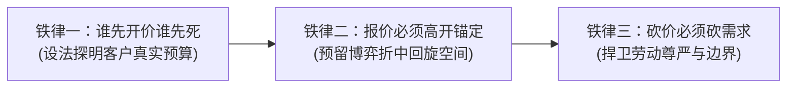
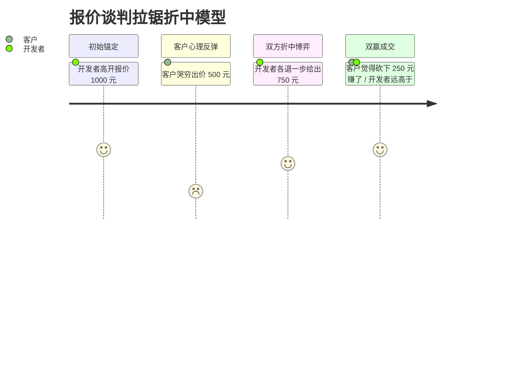
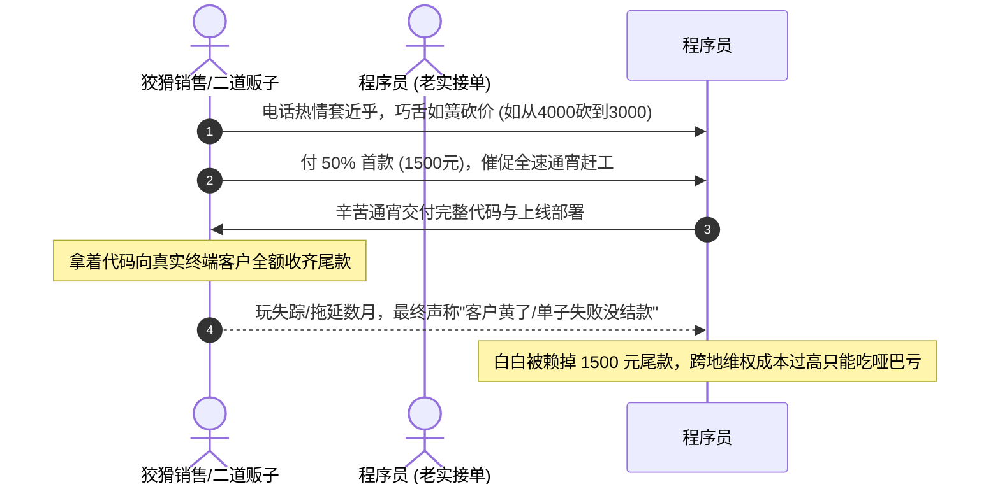

# 02 商业谈判心智、溢价攻防与防坑博弈

在软件接单与项目交易中，**“技术只能决定你能否把系统做出来，而谈判能力才真正决定你能拿到多少利润”**。

很多技术优秀的程序员在职场中被训练成了“线性量化呆板思维”：只认代码行数和客观工时，一到商业谈判桌上就任人宰割——客户一皱眉头就自降身价，遇到油腔滑调的职业销售三言两语便被套牢，甚至白干一个月最后尾款被赖掉。

本节系统拆解**程序员的思维认知盲区、实战谈判三大铁律、砍价防御话术，以及防范职业中介“巧舌如簧骗尾款”的零容忍风控体系**。

---

## 一、 破除程序员的“线性量化呆板思维”

很多新手程序员在接单或派单时，总是执着于寻找一套“绝对客观的数学公式”：
- *“一个用户登录模块，到底应该收 300 还是 500？”*
- *“做自营商城小程序，报 8000 合理还是报 12000 合理？”*

```mermaid
flowchart TD
    subgraph 职场打工人思维 (机械呆板)
        A1["习惯向领导线性汇报"] --> A2["工时严格量化成表格"]
        A2 --> A3["对外谈判老实交代底线:<br/>'这个我加班2天就能写完'"]
        A3 --> A4["客户大幅压价:<br/>'既然才2天，给你300算了'"]
    end
    subgraph 商业自由人思维 (弹性博弈)
        B1["洞察软件非标品属性"] --> B2["价格取决于客户商业价值与预算"]
        B2 --> B3["高锚定报价并保留博弈弹性:<br/>'该架构需考虑高可用与安全加固'"]
        B3 --> B4["稳拿超额利润或折中落袋"]
    end
```

### 商业核心真理：
1. **软件定价取决于客户的“支付能力”与“商业焦虑”，而非你的物理工时**：
   - 同样一套微信分销收银小程序，对于一个手握几十个地级市代理、年流水上千万的销售团队老板，他愿意支付 **20,000 ~ 50,000 元**，因为这是他整个团队运转的生命线；
   - 而对于一个资金紧张的在校大学生，心理上限可能只有 **1,500 元**。
   - 程序员必须学会根据**客户的商业背景与项目预算**动态弹性报价，切忌用“我只要敲两天代码”的打工人心态自我矮化。

---

## 二、 商业谈判三大黄金铁律



### 1. 铁律一：谁先开价谁先死（探明底牌）
- **核心逻辑**：只要你先报出价格，你就将自己的底牌无遮掩地暴露给了对方。
  - 如果一个需求你心里底线 400 元就能做，你一上来就报 400 元：客户如果原本预算是 1,500 元，他会偷着乐，你白白损失了 1,100 元溢价空间；若客户觉得 400 元还贵，你已经退无可退，一降价就击穿底线，谈判直接陷入死局。
- **探底实用金句**：
  > 👨‍💻 **开发者**：“张总，针对您提的这套校园商城管理系统，实现方式有轻量级 MVP 方案也有企业级分布式方案。为了给您匹配最精准的架构与排期，您这边目前规划的**整体预算预期大概在什么区间**呢？”

### 2. 铁律二：如果必须开价，必须“高开锚定”
如果客户反复推脱“我不懂技术，你直接报个一口价”，开发者切记**绝不能报保本底线，必须高开 1.5 ~ 2.5 倍建立锚点**：



- **高开博弈推演**：
  - 你的心理保本底价是 **400 元**；
  - 首次正式报价报 **1,000 元**（树立高质量、稳健架构心理锚点）；
  - **结果 A（客户爽快答应）**：直接以 1,000 元成交，单子获得 2.5 倍暴利超额回报；
  - **结果 B（客户大呼超预算，还价 500 元）**：此时开发者切忌立即妥协，采取“折中战术”：“张总，看您很有诚意，这样吧，咱们各退一步，750 元交个朋友，今天就启动排期！”
  - **最终结局**：成交价 750 元，客户感觉自己凭借谈判能力砍下了整整 250 元，心里非常满足；而开发者相比 400 元底牌净赚了 350 元溢价！

### 3. 铁律三：砍价必须砍需求（绝不无条件降价）
如果客户态度强硬，非要把 1,000 元的项目压死在 400 元：
- **致命错误**：“行吧行吧，400 就 400，我吃点亏给你做。”（这会让客户觉得你之前的报价充满水分，且在后续开发中会变本加厉地索取增项）。
- **防御准则**：“降价必须伴随功能缩水”：
  > 👨‍💻 **专业话术**：“李经理，如果您本次项目整体预算卡死在 400 元，我们完全理解。那么原定的‘微信分销裂变海报生成’和‘导出 Excel 复杂报表’这两个高耗时模块我们先帮您移到二期升级规划中，一期我们先保留最核心的商品展示与在线支付闭环，保证在 400 元预算内保质保量为您上线，您看如何？”

---

## 三、 防御“职业销售与转包老油条”的拿捏套路

在外包接单江湖中，活跃着一批专职的“中介二道贩子与职业软件销售”。他们精通心理学，深谙程序员耳根软、好面子、怕冲突的弱点，其经典收割套路如下：

### 1. 经典套路拆解：“先给一半定金，尾款编借口赖账”



### 2. 程序员自我防护：建立“零容忍”风控机制
1. **警惕“电话里的巧舌如簧”**：遇到喜欢绕开文字记录、频繁打电话诉苦“利润薄、兄弟帮个忙”的中间人，一律提高警惕，凡事必须落实在群聊天记录与需求确认单中；
2. **严守交付款项防线**：在提供源码或部署到客户正式服务器之前，**必须收齐 100% 全款或将尾款全额托管至淘宝/闲鱼平台**。绝对不能轻信“你先上线，我下周给领导走完审批就给你转账”；
3. **推行“一次不诚信，永久拉黑”准则**：
   - 商业合作看人品。如果某个合作方在第一次合作时出现过拖欠尾款、无理砍价、推卸责任等瑕疵，**切勿给第二次机会，立刻将其列入永久黑名单**；
   - 市场上从不缺单子，与人品不端者纠缠只会持续内耗你的精力与情绪。

---

## 四、 坚决拒绝白嫖：“先做个 Demo 看看”与“满意再付款”

| 常见白嫖话术 | 潜台词与真实动机 | 降维反击与标准应对 SOP |
| :--- | :--- | :--- |
| **“你先花两天做个 Demo 给我看，满意了我立马给钱。”** | 想免费套取架构方案或拿去向他的上游客户交差汇报；做完之后对方会以“感觉不合适”直接消失。 | **标准回复**：“我们所有定制研发均按正规流程推进。您可先查看我们过往同类商业成功案例（附脱敏视频/链接）；若需针对性出 Demo 原型，需预付 30% 基础排期立项金，该金额在正式签约后直接抵扣项目尾款。” |
| **“我们公司制度规定，必须做完全部功能、我们满意后才能走打款流程。”** | 转移全部资金与研发风险，把“满意”定义为无限期的主观借口，随时可能单方面违约。 | **标准回复**：“软件工程不存在主观模糊的‘满意’，只有客观确定的‘PRD 验收指标’。我们的合作基石是‘按功能清单逐项对照验收’，支持走淘宝/第三方平台托管担保交易，验收合格自动解冻，资金安全对双方皆有保障。” |
