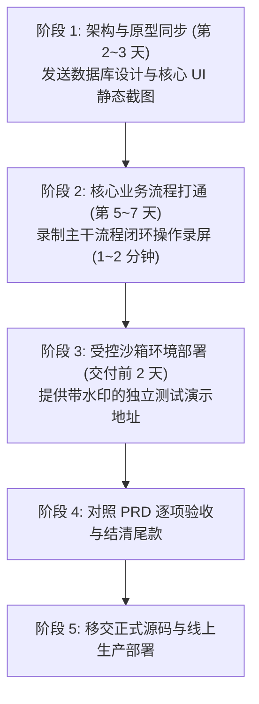
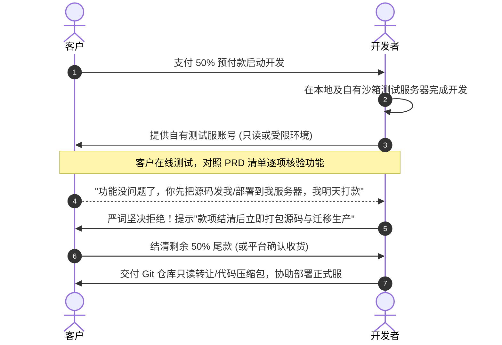
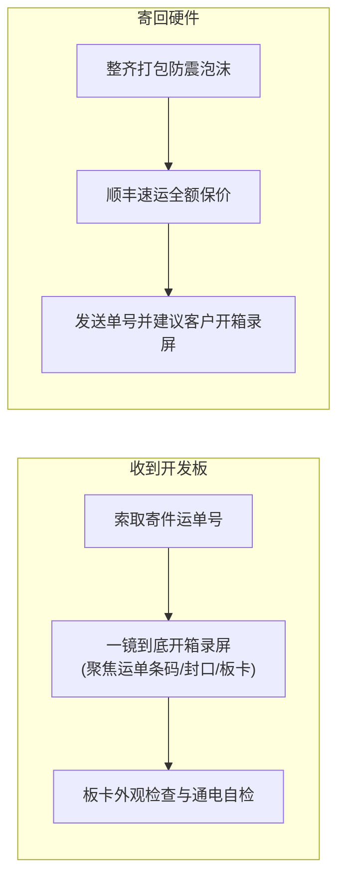

# 01 受控开发、演示隔离与嵌入式防坑交付规范

在软件工程外包履约中，**“源码与线上生产权限是开发者最后的救命稻草”**。一旦在客户付清尾款前将源码或生产环境凭证交出，开发者将彻底丧失一切博弈主动权，面临“客户拿走代码改密失联、无休止找茬扣减尾款”的灾难性境地。

本节系统讲解**里程碑开发节奏把控、自建沙箱演示环境隔离、不可退让的源码交付红线，以及涉及实物开发板的嵌入式单子防坑全流程**。

---

## 一、 开发节奏把控与里程碑可视化同步

很多自由职业者在接单后习惯“闷头苦干”，收了定金后连续一周在群里一言不发，导致客户产生强烈的恐慌与信任危机（“这人是不是卷定金跑路了？”），进而演变为无休止的催促与纠纷。

### 里程碑同步 SOP：
1. **短视频/截图汇报法**：每完成一个核心子模块（如微信扫码登录、商品结算下单），录制一段 30 秒至 1 分钟的手机/电脑操作录屏发到项目群；
2. **文字附带当前进度与下步规划**：
   > 👨‍💻 **汇报示范**：“张总，目前用户端商城核心选购与微信拉起支付功能已开发调通（见上方录屏）。明后两天我们将集中联调‘商户端小票自动打印’与后台发货逻辑，预计周四下午部署至测试服务器供您亲自体验验收。”
3. **消除客户焦虑**：可视化的进度展示让客户清晰感知项目在稳步推进，极大减少打扰频率，同时为后续顺畅结算尾款奠定坚实的心理信任。

---

## 二、 核心交付铁律：沙箱演示隔离与“见全款给源码”

### 1. 绝不提前踏入的三大雷区
1. **绝不把未结款的代码直接部署到客户的私有服务器**：一旦登录客户的阿里云/腾讯云主机并把代码编译上线，客户随时可以修改 SSH 密码、重置密钥，开发者将被瞬间踢出局；
2. **绝不在付清全款前提供 Git 仓库写权限或源码压缩包**：任何“我让技术总监看一眼代码规范就打款”、“财务走报销流程需要代码归档”的借口，一律视为白嫖或违约前兆；
3. **自有测试服设置防御开关**：演示环境部署在开发者自己的轻量云服务器上，数据库配置与第三方密钥掌握在自己手中，必要时在测试端加入动态时间水印。

---

## 三、 嵌入式与物联网（IoT）单子实物防坑全流程

与纯软件开发不同，涉及单片机（STM32、ESP32）、树莓派、传感器与工业机械臂的嵌入式单子，必然伴随着**实体硬件的快递寄送与联调测试**。一线实战中因硬件产生的纠纷极其高发，甚至出现“空包索赔讹诈”案件。

### 1. 硬件寄送三大潜在陷阱
- **骗子“寄空包”倒打一耙**：不良客户寄送空的纸箱或报废废旧电路板，待开发者签收后，对方反咬一口声称“寄去的是价值 8000 元的高精度工业板卡，被开发者偷梁换换或侵吞”，以此报警威胁、冻结账户甚至敲诈勒索；
- **物流运输颠簸损坏**：精密针脚弯折、主板元器件焊点震裂脱落，责任难以界定（快递公司 vs 寄件人 vs 收件人）；
- **硬件版本不一致**：客户寄送的芯片批次或外设引脚与原理图不符，导致固件程序死活调不通。

### 2. 嵌入式交付避坑 SOP 守则

#### 第一步：必须提前获取快递单号
客户寄出开发板后，要求其必须在微信群内提供**清晰完整的快递单号照片**，核对寄件人信息与项目对接人是否一致。

#### 第二步：收件严格执行“一镜到底开箱录屏”
- **操作规范**：
  1. 手机架设在固定支架上，镜头全程不间断；
  2. **特写拍摄**快递外包装上的运单号条形码、箱体六面胶带封口完整度；
  3. 当着镜头使用美工刀开箱，拿出气泡膜包裹物并展开；
  4. 镜头聚焦拍摄电路板型号、丝印标识、元器件有无物理断裂与烧毁痕迹；
- **铁律原则**：**一镜到底，严禁任何后期剪辑与拼接**！若存在剪辑痕迹，在司法鉴定或平台申诉中将直接丧失作为客观证据的法律效力。

#### 第三步：完成开发寄回必须“保价”
- 项目测试完毕寄还客户时，**必须选用顺丰速运并勾选“全额保价服务”**（例如硬件估值 3000 元，保价费仅需十余元）；
- 寄出后在群内附上运单号，并温馨提醒：“李工，硬件已顺丰保价寄回，请您签收时也务必当面拆封并一镜到底录屏验收，确保双方权益保障。”
