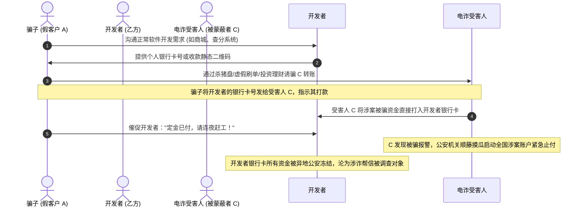
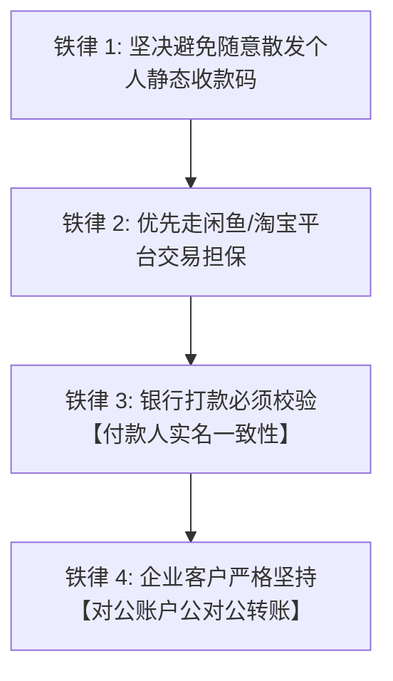
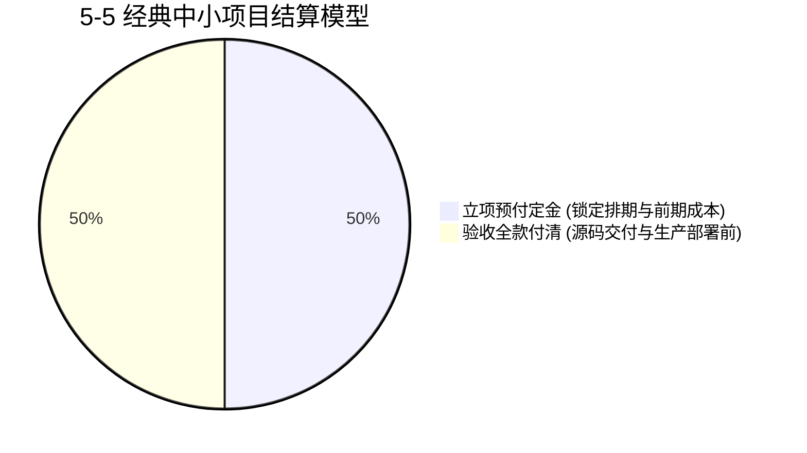

# 02 资金结算安全、防冻卡与财税发票全流程

在网络副业与外包交易中，**“资金安全永远排在技术研发之前”**。很多开发者以为只要代码写好了、钱打进卡里就万事大吉，却不知在电信诈骗猖獗与异地执法的宏观环境下，稍有不慎收到黑灰产诈骗资金，就可能面临个人银行账户被跨省司法冻结数十万元、甚至被列入涉案涉诈“黑名单”的灭顶之灾。

本节系统拆解**黑灰资金洗钱与“三角诈骗”运作机制、资金结算防冻卡铁律、科学付款节点比例，以及自由职业者自然人代开发票全流程**。

---

## 一、 资金安全预警：识破“三角诈骗”与洗钱冻卡风险

### 1. 三角诈骗的隐蔽杀伤力
- 很多自由职业者在群里接单时，客户非常客气、痛快答应几千上万元报价，并主动要求银行转账；
- 实际上与你沟通的“客户 A”只是操盘骗子，真正转账的是千里之外被电信诈骗的“受害人 C”；
- 一旦受害者在当地公安机关报案，根据反电信网络诈骗预警机制，**接收资金的这一级账户（即开发者的银行卡）将被系统自动标记为涉案账户并全额司法冻结，往往波及名下所有银行卡、微信支付与支付宝**。

---

## 二、 资金结算四大防冻卡安全铁律

### 1. 优先走成熟电商平台担保托管
- **低门槛资金护城河**：对于 5000 元以内的散单或陌生客户，优先让客户在**闲鱼**拍下对应商品或定金链接；
- 平台作为法定第三方资金沉淀中介，客户资金先支付给阿里平台托管，既能杜绝诈骗黑钱直接穿透污染个人银行卡，又能保障完工验收后自动解冻划扣。

### 2. 严禁随意对外抛撒静态收款码
- 不要在公开的 QQ 交流群、百度贴吧、微信公众群随意发布微信/支付宝个人收钱码；
- 黑灰产团伙会利用爬虫批量抓取网络上的个人收钱码，将其嵌入非法赌博或欺诈网站作为资金中转洗钱通道。

### 3. 私下转账必须核对“付款人同名一致性”
- 若客户坚持使用银行卡转账，转账前必须在合同或微信沟通中确认对方真实姓名；
- 收款后立即核对网银流水附言中的“付款人户名”：
  - 若微信对接人叫“张三”，但转账方却是一家“XX商贸有限公司”或陌生的“李四”，**必须立刻提高警惕，原路退回并终止合作**，绝不触碰来源不明的第三方资金。

### 4. 机构业务坚持“公对公（B2B）结算”
- 正规企事业单位采购软件服务，均有严格的财务对公打款流程。
- 要求客户必须使用企业对公基本账户，打入开发者成立的工作室对公账户（或税务局代开指定的监管专户），公对公流水审计清晰，从根源上杜绝涉诈涉赌风险。

---

## 三、 付款节点比例规范与尾款防线

### 1. 5-5 黄金模型（推荐中小项目，金额 $\le 20,000$ 元）
- **签约/开工前支付 50%**：覆盖开发者的前期时间投入与服务器部署硬成本，也是检验客户诚意的试金石；
- **沙箱测试通过后支付 50%**：客户在开发者自建的受控测试服对照 PRD 验收合格后，打款付清全部尾款；付清后 1 小时内移交源码并上线。

### 2. 4-4-2 模型（适用于中大型企业级项目，金额 $> 20,000$ 元）
- **第一阶段（40%）**：需求规格说明书（PRD）与 UI 视觉稿签字确认后支付；
- **第二阶段（40%）**：系统功能全部开发完毕、部署到测试服务器并完成主流程跑通后支付；
- **第三阶段（20%）**：正式生产部署上线稳定运行 15~30 天（质保期无重大阻断性 Bug）结清。

---

## 四、 自由职业者发票与财税合规指南

很多企业客户要求“必须提供增值税发票才能报销入账”。没有注册公司的个人开发者切忌去淘宝找非法“代开发票黄牛”（涉嫌虚开发票罪，刑法重罪）。国家税务总局为自由职业者提供了正规合法的**自然人代开渠道**。

### 1. 自然人电子税务局代开技术发票 SOP
- **申请渠道**：各省市“电子税务局”APP、自然人电子税务局 Web 端或微信办税小程序；
- **发票品类选择**：选择**“现代服务 * 软件服务”**或**“现代服务 * 技术研发服务”**；
- **发票种类**：自然人一般只能代开**“增值税普通发票”**（若客户是纳税人需抵扣，部分省份凭合同与营业执照可申请代开 1% 专票）；
- **征收税率核算**：
  - **增值税及附加**：小规模纳税人优惠税率通常为 **1%**；
  - **个人所得税（劳务报酬所得）**：部分地区按经营所得核定征收（约 **0.5% ~ 1.5%**），部分地区按劳务报酬预扣率执行；
  - **综合税负**：一般在开票总额的 **1.5% ~ 3.5%** 之间。

### 2. 商业报价的税费前置约定
开发者在初次沟通报价时，必须将发票责任界定清晰：
> 👨‍💻 **标准商务申明**：“张总，目前为您核算的 8,000 元为纯技术研发净价（不含税）。若贵司需要开具增值税发票入账，需额外增加 3% 的税费代开成本（即税后开票总额为 8,240 元），我们将通过国家税务局正规开具电子发票并同步 PDF 给您。”
