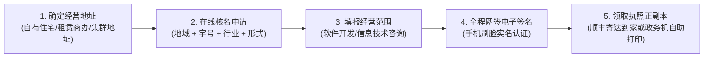
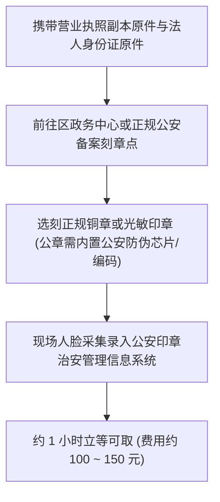

# 01 软件工作室办证、刻章与税务免税申报全指南

当副业程序员的月度接单流水突破 1 万 ~ 2 万元时，必然会遭遇两大发展瓶颈：**一是精力耗尽无法承接更多项目，二是缺乏企业主体资质无法与正规企业签订正规合同、开具企业抬头增值税发票，甚至无法开通微信官方商户号以运营自研商业化产品**。

成立一家低成本的**“个人软件技术工作室”**，是从野生接单散客迈向合规商业化主理人的第一步。本节系统拆解**工作室主体选型、营业执照全程线上办理、正规公章刻制备案，以及享受小微月度 10 万/季度 30 万全额免税红利的定期定额申报 SOP**。

---

## 一、 主体选型：个体工商户 vs 有限责任公司

```mermaid
flowchart TD
    subgraph 形式 A: 有限责任公司 (成立成本高/维护重)
        A1["注册资金实缴制认缴压力"] --> A2["强制开设企业对公账户 (年费几百至数千)"]
        A2 --> A3["强制每月代理记账 (月费 200~500 元)"]
        A3 --> A4["查账征收：企业所得税 25% + 分红个税 20%"]
    end
    subgraph 形式 B: 个体工商户 (极客首选/轻量合规)
        B1["零门槛线上秒批办照"] --> B2["可直接绑定法人私人银行卡结算"]
        B2 --> B3["无需聘请专职会计与出具复杂资产负债表"]
        B3 --> B4["定期定额核定征收：季度 30 万以内 0 增值税"]
    end
```

| 维度对比 | 个体工商户（工作室/服务部） | 有限责任公司（有限公司） |
| :--- | :--- | :--- |
| **开设对公账户** | **非强制**。可直接使用法人名下私人银行卡收款绑定。 | **强制**。必须前往银行网点现场核验场地、开立对公基本户。 |
| **财务记账成本** | **极低（0 元）**。可自行申报定期定额，无需做账。 | **持续支出**。每月必须委托代账会计做凭证报税（2000~6000元/年）。 |
| **商户支付开通** | 支持开通微信商户号、支付宝商户号、微信小程序认证。 | 支持开通所有企业级支付与资质申请。 |
| **税收政策红利** | **享受国家普惠性免税**：月开票额 $\le 10$ 万（季度 $\le 30$ 万）免征增值税。 | 涉及企业所得税与股东分红个税，财务合规要求极高。 |
| **适用阶段** | **副业起步、个人工作室、中小外包中介团队（首选）**。 | 年净利润超 50 万、有股权融资需求、或参与大型国企千万级竞标。 |

```{tip}
对于绝大部分独立开发者，**成立“XX市XX区XX软件开发工作室（个体工商户）”是性价比最高的最优解**。它兼具企业公信力与法人灵活度，彻底摆脱了复杂的财务报表负担。
```

---

## 二、 营业执照办理全流程与资料准备

目前全国各省市政务服务网均已实现个体工商户**全程电子化“秒批/网办”**，全程无需跑线下政务大厅。



### 1. 经营场所地址选型
- **自有住宅/自住房**：各省份均支持“住改商”政策（部分省份需居委会盖章或承诺书）；
- **租赁办公场地**：提供房屋租赁合同与房产证复印件；
- **电商集群注册虚拟地址**：若从事纯线上软件服务或跨平台电商接单，可在当地政务系统选择集群托管地址（淘宝/当地园区代办通常仅需 200~500 元/年）。

### 2. 字号命名规则（四段式）
- **命名公式**：`[行政区划] + [字号] + [行业特征] + [组织形式]`
- **示范案列**：
  - `成都市龙泉驿区极客创想软件技术工作室`
  - `深圳市南山区创智立方信息科技服务部`
  - `杭州市余杭区云创代码网络科技工作室`

### 3. 标准经营范围勾选指南（建议直接复制）
在政务网填报经营范围时，勾选以下核心条目即可覆盖绝大多数技术副业场景：
- **核心主营**：软件开发；计算机系统服务；信息技术咨询服务；网络技术服务；
- **辅助扩充**：数据处理服务；广告设计、代理；技术服务、技术开发、技术咨询、技术交流、技术转让、技术推广。

---

## 三、 公安备案公章刻制（防伪专用章）

拿到营业执照正副本后，需为工作室刻制一枚**正规防伪公章**（微信认证、签署纸质合同、开具授权书必备）。



```{warning}
**切忌淘宝购买未备案的地摊塑料章！**  
私刻未经公安备案的公章在法律上属于伪造印章行为，对外签署合同与资质认证时存在巨大法律无效风险。必须到正规刻章公司录入公安系统并生成独一无二的防伪 13 位印章编码。
```

---

## 四、 电子税务局报道与“定期定额”全额免税申报

营业执照领取后 30 日内，必须登录省税务局完成“税务信息确认（税务报道）”，否则会被税务机关列入“经营异常名录”。

### 1. 征收方式抉择：为什么坚决选择“定期定额征收”？
- **查账征收（繁琐避之）**：税务机关要求你提供健全的会计凭证、账簿与资产负债表，每月必须报送报表，一旦账目不全将面临税务稽查；
- **定期定额征收（极客福音）**：税务局在一定期限内核定一个固定的月度经营额度。在该额度内直接免去复杂的财务做账，实行简易申报。

### 2. 季度 30 万免税红利与安全报送额度测算
- **国家税收支持政策**：小规模纳税人及个体工商户，**月度应税销售额未超过 10 万元（季度销售额未超过 30 万元）的，免征增值税**。
- **定期定额申报价申报技巧**：
  - 登录省级“电子税务局”（如四川电子税务局、广东电子税务局）；
  - 申请“定期定额核定”，建议月度核定经营额填写 **49,000 元 ~ 50,000 元** 左右（切勿踩线顶格填 99,000 元，因为系统根据开票浮动上调时极易突穿 10 万门槛）；
  - **获批效果**：税务系统核定你每月营业额为 49,000 元，处于 10 万元全免税红线之内。在此额度内，增值税为 0，且无企业所得税，所有副业合法落袋！
