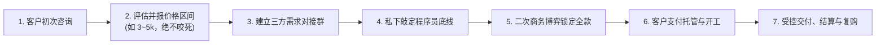
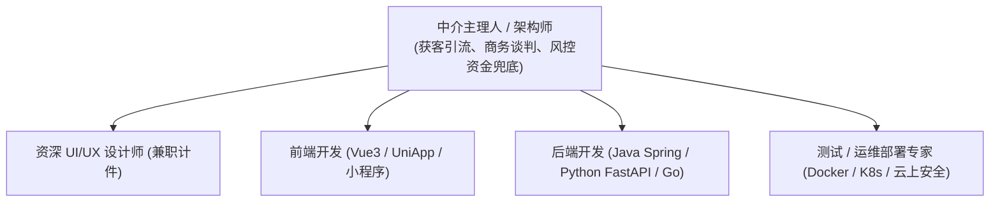

# 02 中介派单运营、合理抽成与分布式团队协同

在软件接单领域，**“从出卖自己时间的苦力，进化为调度他人时间的组织者”**，是打破个人产能天花板的必由之路。

很多人对“中介”一词带有负面偏见，认为中介等同于不劳而获的吸血鬼。然而，**良性的技术派单中介是商业价值的创造者**——你承担了获客引流成本、需求梳理摩擦、客户情绪安抚与履约资金兜底，让一线程序员能够专注在纯粹的代码实现中。

本节系统拆解**正规中介与黑中介的本质区别、中介派单 7 步标准闭环 SOP、合情合理的抽成利润分配公式，以及如何组建高响应的分布式虚拟技术战队**。

---

## 一、 中介商的商业本质：赚信息差还是赚增量预算？

```mermaid
flowchart TD
    subgraph 模式 A: 恶性黑中介 (死局模式)
        A1["向客户收取 5,000 元高额费用"] --> A2["严密封锁客户信息，恶意欺瞒程序员"]
        A2 --> A3["狠命压榨一线开发：'这个活群里2000就有人做'"]
        A3 --> A4["程序员察觉被狠抽50%差价，消极怠工拒绝售后"]
        A4 --> A5["交付烂尾扯皮，项目崩盘口碑全毁"]
    end
    subgraph 模式 B: 良性价值中介 (共赢模式)
        B1["程序员坦诚告知保本底线 3,000 元"] --> B2["中介凭借商业谈判能力向客户拿下 5,000 元"]
        B2 --> B3["增量预算双方合理分润：开发拿 3,500 元 / 中介拿 1,500 元"]
        B3 --> B4["程序员干劲十足提供超预期交付"]
        B4 --> B5["客户满意持续复购与转介绍新单"]
    end
```

### 核心共识：绝不吃程序员的信息差
1. **严禁压榨程序员**：一线程序员是履约交付的基石。如果中介为了多拿差价而恶意压价，让程序员感觉被单方面压榨，最终必然导致代码质量劣质、Bug 满天飞、稍有售后就拉黑跑路；
2. **中介的核心使命是“为团队拔高预算”**：中介利用自身的流量优势和商务谈判能力，把客户原本模糊的预算向高处锚定，**在满足程序员底线预期甚至超额奖励的前提下，合理获得自己的商务抽成**。

---

## 二、 中介派单 7 步闭环 SOP

经过上千单真实外包验证，标准化的派单闭环流程如下：



### 步骤 1：客户初次咨询与需求过滤
- 在闲鱼或全网渠道捕获客户咨询，初步了解业务场景；
- 快速研判：若是违规涉诈黑灰产（赌博、灰产爬虫、刷单）坚决拒接；若需求可行，准备进行下一步拆解。

### 步骤 2：粗颗粒度评估与“报价区间法”
- 在详细 PRD 未明确前，**坚决不能报一口死价**！必须给出一个弹性区间：
  > 👨‍💼 **中介话术**：“李总，您提到的小程序我们团队做过多套同类成熟系统。因目前具体业务逻辑与接口深度还需进一步对齐，以我们过往商业交付经验，整套交付预算大约在 **3,000 ~ 5,000 元** 区间。如果您觉得该预算在可接受范围内，我立刻拉上我们的资深技术主管在群内为您逐条梳理细节！”
- **目的**：区间报价既摸清了客户的支付诚意，又为后续向程序员派单和价格博弈留足了上下浮动空间。

### 步骤 3：建立微信/企微三方需求对接群
- 将意向客户、中介主理人与匹配的一线技术开发者拉入同一对接群；
- 由开发者主导技术可行性交流，引导客户明确核心页面与功能清单。

### 步骤 4：私下对齐程序员的“心理保本底线”
- 需求梳理完毕后，中介**在群外与开发者单独私聊**：
  > 👨‍💼 **私聊话术**：“张工，刚才群里的需求你也看全了。你帮我评估一下你的纯编码工期大概几天？坦白跟我交个底，你这边**最低多少钱能接**？你把真实底线告诉我，我去负责跟客户谈判拔高预算，谈下来的增量部分咱们一起分钱！”
- 假定开发者反馈：“工期约 7 天，我最低 3,000 元能做。”此时中介便手握了最关键的底牌。

### 步骤 5：二次商务博弈与溢价锁定
- 中介返回客户沟通，出具规范的功能清单与项目周期，将价格定在 **4,800 元**：
  - 强调团队技术积累、代码规范、测试环境演示与为期一个月的免费缺陷质保；
  - 若客户还价，折中至 **4,500 元** 锁定成交。

### 步骤 6：客户支付担保与启动开发
- 指引客户在闲鱼拍下对应链接或签署合同打款 50% 定金，定金到账后正式通知程序员开工。

### 步骤 7：成果交付、结清分成与好评裂变
- 开发者录制主流程演示视频发群；客户核对验收通过；
- 客户在平台确认收货（或付清尾款）；
- **中介结账给开发者**：按照 3,000 底线 + 300 奖金，共转账 **3,300 元** 给开发者；中介留存 **1,200 元** 商务利润；
- 引导客户在平台留下 20 字以上五星好评，并赠送后续增项优惠券，促成二次裂变复购。

---

## 三、 中介抽成比例与利润分配模型

| 谈判结果场景 | 商务总成交额 | 程序员所得 | 中介抽成收益 | 利润分配逻辑与心理效果 |
| :--- | :--- | :--- | :--- | :--- |
| **超额溢价成交**<br/>(底线 3k，谈成 5k) | 5,000 元 | **3,500 元**<br/>(底线+500奖金) | **1,500 元**<br/>(占比 30%) | **双赢极致**：程序员拿到超出预期的报酬干劲十足，中介凭谈判实力赚取 30% 超额利润。 |
| **正常基准成交**<br/>(底线 3k，谈成 3.8k) | 3,800 元 | **3,100 元**<br/>(略高于底线) | **700 元**<br/>(占比约 18%) | **良性健康**：中介拿 15%~20% 属于行规公认的合理商务获客与管理成本。 |
| **客户预算严卡**<br/>(底线 3k，客户死咬 3k) | 3,000 元 | **2,800 ~ 3,000 元** | **0 ~ 200 元**<br/>(占比 0%~7%) | **薄利保号**：为了店铺销量权重与留住老客户，中介主动放弃或仅收微薄辛苦费，把绝大部分收益让渡给开发者。 |

```{note}
永远记住：**能持续赚大钱的中介，靠的是“做大蛋糕”，而不是“分走一线开发者的口粮”**。
```

---

## 四、 打造高协同分布式虚拟技术战队

单打独斗的技术人很难接下 2 万元以上的大中型项目。通过建立松散但默契的“分布式虚拟战队”，可以以零底薪成本承接复杂工程：



### 虚拟团队组建与管理心法：
1. **轻量契约化合作**：团队成员无需集中办公，平时各忙各的工作，有单在私密群内抢单派发，按模块结清；
2. **沉淀通用脚手架与组件库**：团队内部统一技术栈（如统一定义前端 UI 组件、后端统一封装 JWT 鉴权与微信支付 SDK），将单次项目代码沉淀为资产，使后续接单效率提升 300%；
3. **“一次失信，永久剔除”**：对团队成员推行严格的品德考核。凡私下跳单撬客户、交付严重拖延失联、或恶意留后门者，直接拉黑并公开通报，维护团队极高的履约声誉。
