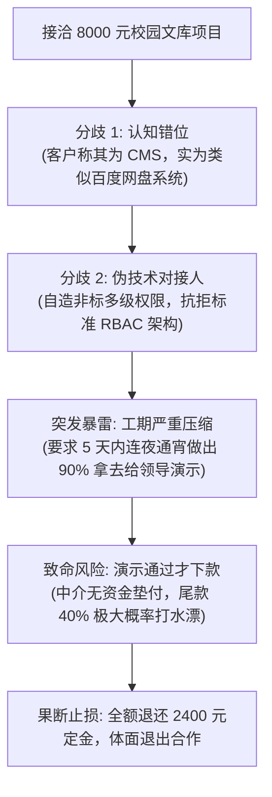
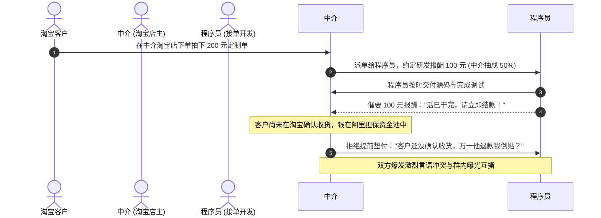
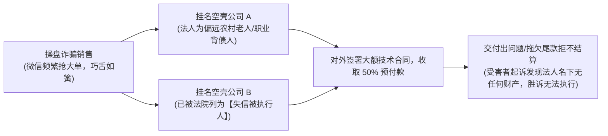

# 01 经典纠纷复盘：谈崩的 8k 单子、利益撕逼与空壳皮包陷阱

在软件接单一线，**每一个惨痛的教训，背后都是真金白银的损失与熬夜心血的付诸东流**。许多开发者由于缺乏实战风控经验，往往在项目推进到一半甚至快交付时才发现掉入了深坑。

本节系统复盘一线技术社群发生的三起极具代表性的**经典翻车与纠纷案例**，提炼出商业契约、利益博弈与资信核验的核心法则。

---

## 案例一：谈崩了一个 8000 元的网盘单子——需求失真与垫资陷阱

### 1. 案情还原与隐患链条
- **需求沟通断层**：客户中间人将“网盘文件库系统”误称为“CMS 内容管理系统”，双方在名词理解上拉锯数天；对于通用权限体系，中间人不懂标准 RBAC 模型，自行画出互相矛盾的多级审核流；
- **排期严重突变**：原本预估 12 天的开发量，甲方突然在视频会议上要求 5 天内必须交付达到“向领导演示下款”的完整度；
- **资金链空手套白狼**：经追问发现，该中间人属于体制内边缘转包商，自身账户拿不出流动资金，必须等 5 天后领导看爽了才能立项拨款；若演示不通过，项目尾款将全额烂尾。

### 2. 深度复盘与避坑启示
1. **警惕“拿演示当验收、等下款再付钱”的空手套客户**：对方连一万多元流动资金都拿不出来，说明其在上游没有任何资信话语权，开发者绝对不能为其垫资熬夜；
2. **止损智慧高于沉没成本**：当察觉需求不可控、工期不合理、资金无保障时，即便已经投入了 1~2 天搭建脚手架，**也要果断将 2400 元定金全额原路退还**。及时止损只损失两天工时，若执意蛮干，通宵一周后将面临数月讨要尾款无门的悲惨结局。

---

## 案例二：200 元淘宝单多方撕逼——中介“权责对等”铁律

一线众包社群发生的第一起公开纠纷，是一笔看似金额极小的 200 元小单，但却精准揭示了外包中介商业模式中的**“风险与收益对等性矛盾”**。

### 1. 矛盾本质剖析：谁该为履约风险买单？
- **中介立场**：客户若中途以主观原因在淘宝申请退款，中介若提前结款给开发，自己将倒贴 100 元现金，因此坚持“客户确认收货后才能结账”；
- **程序员立场**：我严格对照需求把代码写好交付了，客户什么时候点确认收货是中介与客户之间的商业关系，中介不能拖欠劳动报酬；
- **核心病因**：**中介拿了 50% 的暴利抽成（200元单子抽走100元），却试图将 100% 的商业回款信用风险转嫁给底层的程序员！**

### 2. 中介商的风控底层逻辑
1. **高抽成必须匹配高担当**：如果你每单抽成高达 40% ~ 50%，你必须承担起“商业垫资与客户跑路兜底”的责任，程序员交付合格就必须立结报酬，后续退款风险由中介自行承担；
2. **低抽成方可透明共担**：若中介仅收取 10% ~ 15% 的合理撮合协调费，则应在派单前与程序员白纸黑字达成协议：“本项目走淘宝担保，客户确认收货后 1 小时内全额结算，双方风险共担”。

---

## 案例三：识破“职业背债人”与失信空壳公司

在社群实战中，曾有一名活跃分子在群内频繁抢接 2 万 ~ 3 万元的高客单价大项目，随后多名开发者反馈遭遇恶意拖欠尾款、项目拖延纠纷。经工商与司法穿透核查，暴露出一条极为恶劣的**“空壳皮包洗钱收割链条”**：

### 1. 职业背债人套路拆解
- 操盘人员自身根本不在公司工商股东中出现，而是花几千元在偏远地区找完全无偿还能力的失信人员或老人担任法定代表人注册空壳公司；
- 凭借虚假资质在各大社群高价揽单，骗取客户 50% 预付款后外包给廉价兼职；一旦产生纠纷，便仗着“公司法人早就是老赖、名下无财产可供执行”而肆无忌惮地违约赖账。

### 2. 开发者企业资信穿透核查 SOP
在承接任何金额超过 **10,000 元** 的企业项目、签署纸质/电子合同之前，必须使用【天眼查】或【企查查】执行以下三道背景穿透：
1. **核验企业经营状态与成立年限**：成立时间不满 1 年、注册资本为认缴且实缴为 0 的空壳企业，提高警惕；
2. **核查司法风险与失信被执行人**：查看企业及法定代表人名下是否存在“限制高消费”、“被执行人”、“劳动争议仲裁”记录。凡存在未执行标的者，坚决拒签；
3. **核验实际对接人身份**：要求对接人在微信或邮件中出具企业正式授权委托书或工牌名片，绝不与身份不明的所谓“挂靠业务员”进行大额交易。
