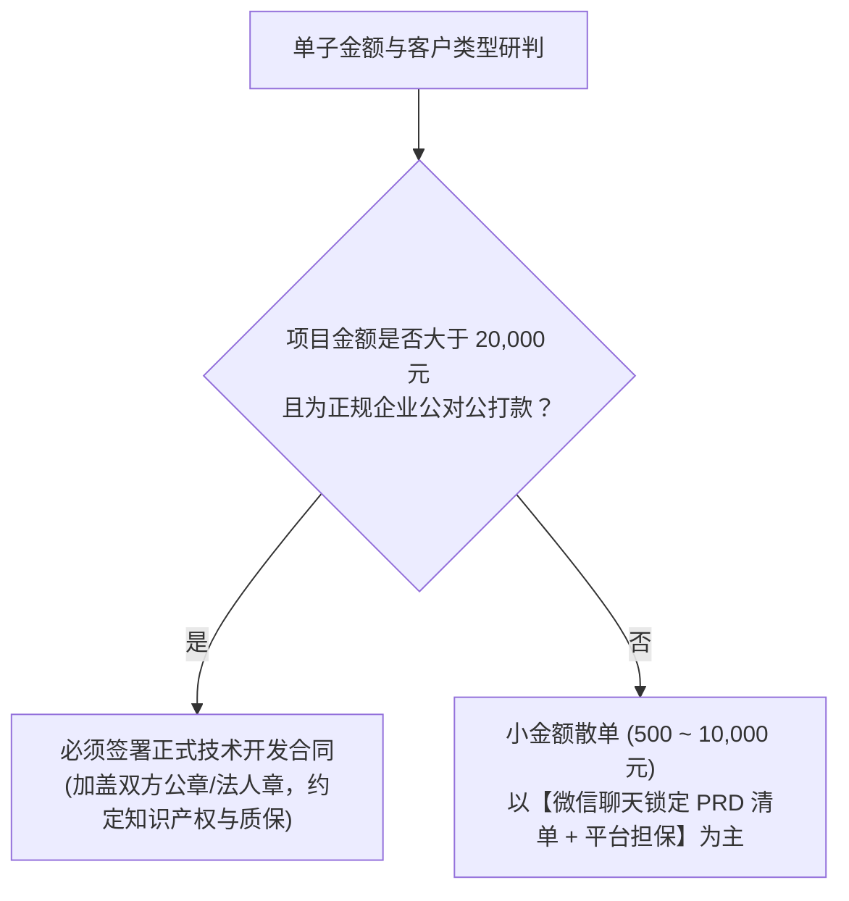
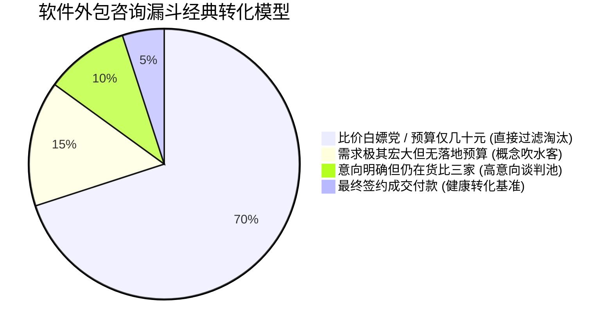
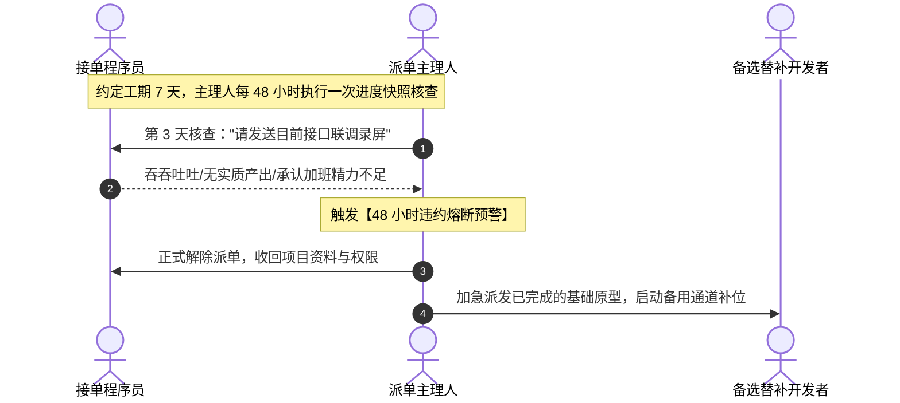
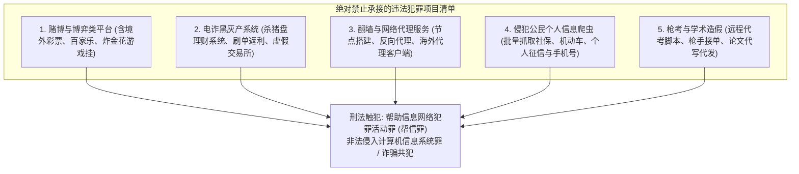

# 02 实战高频答疑：合同效力、成交转化、违约熔断与红线禁区

在自由职业接单与项目派单的日常运营中，技术开发者常常会遭遇各种法律、心理和业务层面的突发困惑。

本节汇总一线接单实战中最高频出现的**五大核心难题**，从我国《民法典》电子合同效力、销售心理博弈防御、交付违约 48 小时熔断机制，到绝对不可触碰的法律合规红线进行终极梳理。

---

## 答疑一：副业接单到底要不要签正式纸质合同？



### 1. 为什么几千元的小单不建议死磕纸质合同？
- **签约与维权成本倒挂**：打印、顺丰邮寄合同、盖章往返耗时数天；万一发生纠纷，几千元的小额标的跨省异地诉讼所消耗的律师费、交通住宿与误工成本远超本金；
- **坦诚定位胜过虚假包装**：很多新手开发者为了显得“专业”，自称是某大型软件研发公司，客户顺理成章要求签署几十页的企业合同与提供对公资质。不如坦诚相告：“我是独立全栈工程师/个体工作室，正因为去除了外包公司的销售和管理溢价，才能给您做到如此极致的高性价比。”

### 2. 《民法典》关于微信沟通的法定书面合同效力
我国《民法典》第四百六十九条明确规定：
> **“以电子数据交换、电子邮件等方式能够有形地表现所载内容，并可以随时调取查用的数据电文，视为书面形式。”**

- **极客实务准则**：在微信群内发布的**《需求功能确认清单》、《价格与交付排期约定》、《微信转账转款备注》**，在我国司法实践中均具备不可动摇的书面合同证据效力。只要双方在群内明确回复“确认”，合同即告法定成立。

---

## 答疑二：咨询量每天四五十人，为什么实际成交率极低？

很多转型派单中介的开发者常有强烈焦虑：“我闲鱼每天有 40 ~ 50 人咨询，但最终成交的只有一两单，我是不是谈判能力太差？”



### 1. 正确建立电商与漏斗转化认知
- **商业常识**：在电商与互联网营销中，**2% ~ 5% 的咨询转化率是行业极其健康的公允标准**。
- 每天 50 人咨询，成交 1 ~ 2 单商业商单，一个月即意味着 30 ~ 60 个交付项目。如果 50 个人人人都想成交，要么说明你的定价低到了亏本贴钱的程度，要么说明你陷入了低价垃圾需求的无底泥潭。

### 2. 快速排雷防内耗：区间报价过滤法
面对大量咨询，**严禁用 1 小时陪客户漫无边际地聊需求**。在第 3 句话直接给出大致价格区间（例如：“此类商城常规交付预算在 4,000 ~ 6,000 元左右”）。如果对方预算只有 300 元，对方会立刻知难而退，为你节省宝贵精力去服务真正有支付能力的优质客户。

---

## 答疑三：临到交付期程序员突然违约做不完，如何应对？

派单主理人最致命的噩梦：约好明天交付客户，今天下午程序员突然在群里发消息：“不好意思，我们公司突然 996 全员加班，这个单子我搞不定了，你找别人吧。”



### 48 小时熔断换人机制：
1. **绝不听信临近交付时的“空头保证”**：凡在项目推进过半（如第 3~4 天）仍拿不出任何阶段性界面录屏与 Git 提交者，一律视为有烂尾风险；
2. **提前 48 小时硬性熔断**：给程序员设立明确规则：“若遇突发私事，**必须至少提前 48 小时主动预警**，我们体面换人；若瞒报拖延直至最后一天违约失联，直接录入开发者协作黑名单并在行业社群通报”。

---

## 答疑四：如何彻底防御职业销售的“电话心理拿捏”？

为什么很多技术开发者在面对职业销售时频频被砍价、被拖延尾款？
- **销售心理战法**：职业销售极其擅长通过**打语音电话**施展话术——在电话中诉苦、套近乎、施加情绪压力，利用程序员不善言辞、碍于情面难以当面拒绝的心理弱点，逼迫程序员退让。

### 防拿捏四不原则：
1. **原则一：不接突发长语音电话**——“张总，目前正在开会/调试代码不便通话，请您将具体诉求文字打在微信项目群中，我逐条为您研判”；
2. **原则二：群内决策，拒绝私聊承诺**——所有涉及价格调整、工期变动的沟通，一律在三方对接群中公开文字确认；
3. **原则三：尾款不松口**——任何“先上线，我下周给你审批”的承诺，一律用标准公函话术回复：“系统财务锁控程序已关联尾款到账回执，尾款入账后服务器密钥将自动解密下发，请您谅解配合。”

---

## 答疑五：死守职业安全底线——绝对不能触碰的“黑五类”红线

自由职业是为了赚取合法增量收入以改善生活，**绝不能为了高额酬金而断送自己的人生自由**。



```{caution}
**终极忠告**：  
遇到给几万块钱要求做“跑分结算平台”、“海外私彩”、或者“爬取某政务 App 数据库”的客户，**哪怕对方给再多的定金，也要毫不犹豫地立刻拒接并拉黑**！赚干净阳光的技术报酬，睡踏实安稳的舒坦好觉，是每一位自由职业者行稳致远的终极护身符。
```
