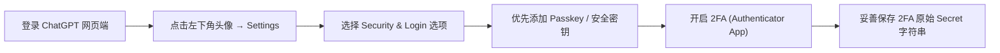
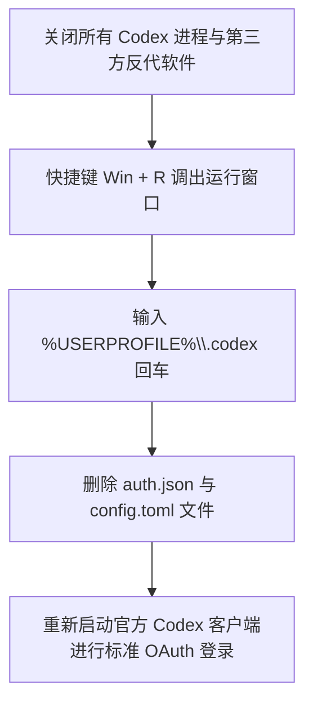
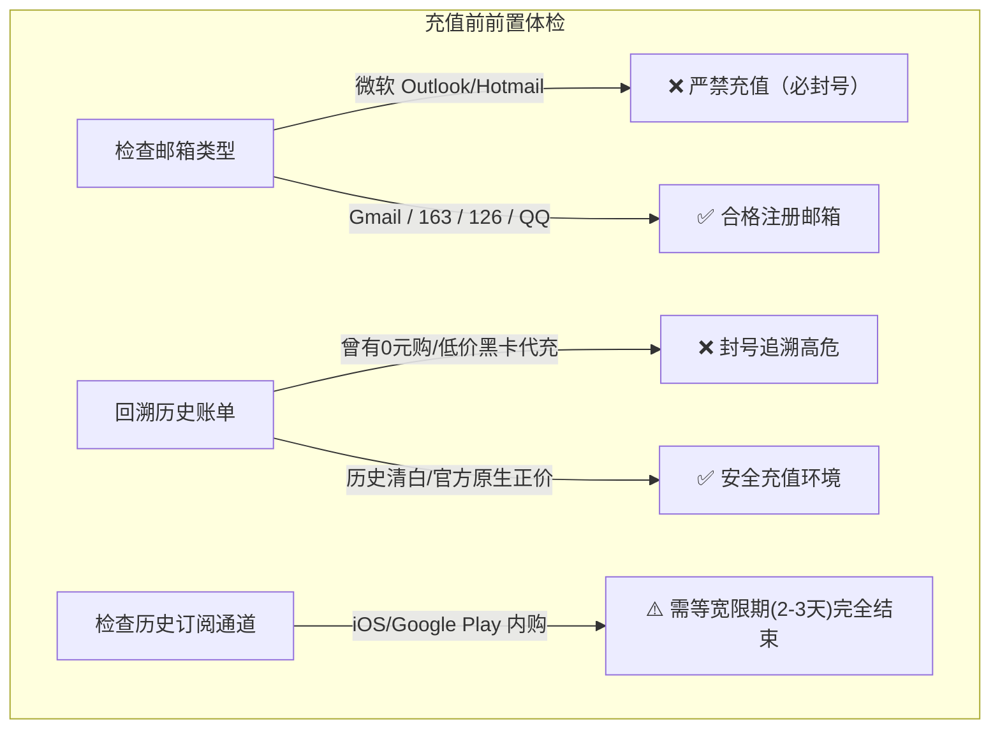

# 1.4 ChatGPT 账号登录实务、2FA 安全加固、Codex 本地重置与正规代充防封全指南

> **核心导语**：在日常大模型开发与学术办公中，采购 ChatGPT 成品号、配置本地开发客户端（如 Codex）、以及升级 Plus/Pro 官方订阅是极为高频的场景。然而，因微软风控、反代软件残留配置污染、脏 IP 节点登录、低价黑卡历史追溯等问题导致的“闪退、报错、封号、掉订阅”层出不穷。本文系统梳理从账号交付、2FA 加固、Codex 本地缓存清理，到官方正规代充防封风控红线与聊天记录防丢方案的全链路最佳实践。

---

## 一、 账号交付形态与三种登录验证实操

采购交付的 ChatGPT 成品账号通常具备不同的验证与安全等级，常见格式分为以下三种：

| 交付类型 | 凭据格式 | 适用场景 | 登录要点与验证机制 |
| :--- | :--- | :--- | :--- |
| **基础直登号** | `outlook邮箱----outlook密码` | 网页端初次登录 | 通过邮箱验证码或微软账号直登，需注意邮箱代理隔离 |
| **独立账密+2FA号** | `GPT账号----GPT密码----2FA密钥` | 长期高频使用、API/客户端 | 最安全的登录模式，无需访问邮箱，直接通过 TOTP 生成 6 位动态验证码 |
| **混合托管号** | `GPT账号----GPT密码----Outlook邮箱+密码` | 带主权邮箱的完整账号 | 建议登录后立即绑定个人安全密钥并开启独立 2FA |

### 1. 2FA (双重身份验证) 动态码快速获取

如果交付凭据中包含一串大写的 2FA 密钥（Secret Key，如 `JBSWY3DPEHPK3PXP`）：

1. 打开 TOTP 动态验证码在线生成工具：[2FA 在线验证码助手 (2fa.fun)](https://2fa.fun/)。
2. 将 2FA 密钥复制粘贴至输入框中。
3. 复制生成的当前 6 位动态验证码（每 30 秒轮替一次）。
4. 在 OpenAI 登录验证界面粘贴该验证码完成双重验证。

```{tip}
手机端强烈推荐使用 **Google Authenticator**、**1Password** 或 **Microsoft Authenticator** App 扫描添加密钥，摆脱对临时网页工具的依赖。
```

### 2. 账号安全加固：自主添加 GPT 独立密码与 2FA 保护

若采购的账号仅有邮箱直登且提示无法在外部修改密码，可通过官方后台主动强化主权控制：



1. **进入设置面板**：点击左下角个人头像 $\rightarrow$ **Settings**（设置） $\rightarrow$ **Security & Login**（账号安全与登录）。
2. **先绑定安全密钥**：在开启 2FA 之前，先点击添加硬件安全密钥（Passkey 或系统 WebAuthn 支持）。
3. **开启 2FA 双重认证**：
   - 选择 **Authenticator App**；
   - 屏幕上会显示二维码和一串 Base32 格式的文本密钥；
   - **务必先截图保存二维码并在备忘录备份纯文本密钥**；
   - 在验证工具输入后，回填 6 位数字激活。

---

## 二、 网页端 vs Codex 桌面端验证差异与本地排障

很多开发者分不清网页版使用与本地 Codex 客户端环境的区别，导致重复接码或无法启动。

### 1. 手机验证码（SMS）要求对比

| 平台 / 场景 | 是否需要海外手机号接码 | 接码生命周期建议 | 常见风控提示 |
| :--- | :--- | :--- | :--- |
| **ChatGPT 网页版** | **不需要** | 仅需邮箱或 2FA 验证 | 无接码弹窗 |
| **Codex 桌面/插件端** | **必须接码** | 建议购买 **1 个月长效号码** | `Phone verification required` |

```{warning}
Codex 在多设备迁移、凭据重置或敏感操作时可能二次校验手机号。使用廉价的一次性短期接码平台可能导致账号无法再次验证，因此进行重要生产力开发时，建议绑定稳定长效的海外虚拟或实体号码。
```

### 2. 关键故障排查：Codex 登录报 `an unexpected error occurred during authentication`

#### 故障根因分析
该错误通常发生在本地先前运行过反代软件（如 CPA、Sub2API 映射工具、CC Switch、第三方代理网关等），这些工具修改了本地系统代理、或在用户主目录遗留了非官方授权的凭据缓存与重定向端口配置。当用户切换回官方原生登录时，Codex 尝试读取旧配置导致握手断裂。

#### 一键恢复官方原生状态步骤



1. 完全退出 Codex 应用程序及系统托盘中驻留的各类反代工具。
2. 键盘按下快捷键 <kbd>Win</kbd> + <kbd>R</kbd> 打开 Windows 运行窗口。
3. 输入路径命令并按回车：
   ```text
   %USERPROFILE%\.codex
   ```
4. 在打开的目录中，彻底删除以下两个文件：
   - `auth.json`（存放旧的 Session 或第三方反代凭据）
   - `config.toml`（存放第三方代理服务器与路由规则）
5. 重新启动 Codex 客户端，触发官方默认浏览器授权完成绑定。

### 3. Outlook 微软邮箱验证报错：关闭代理直连

在登录交付的 Outlook 邮箱收发验证码时，若页面提示“密码错误”、“账号锁定”或“拒绝访问”：

```{admonition} 微软邮箱 IP 规则
:class: important
**登录微软 Outlook/Hotmail 邮箱时，务必关闭网络代理（梯子/VPN），使用中国大陆原生宽带直连访问！**  
微软对频繁跳动的海外数据中心 IP 风控极高，挂代理登录极易触发异地阻断或强制作废密码；直连大陆 IP 反而可以直接正常通过验证。
```

---

## 三、 模型特性与额度防耗避坑（Sol vs Terra）

当前高级账号池与模型梯队中，不同的官方模型消耗额度差异悬殊：

| 模型代号 | 定位与思考模式 | 额度消耗速度 | 推荐使用场景 |
| :--- | :--- | :--- | :--- |
| **GPT-5.6 Sol** | 重度深度推理（Deep Reasoning） | **极快**（数次深度提问即可耗尽多小时额度） | 复杂学术数理推演、跨层架构系统重构、攻坚级 Bug 排查 |
| **GPT-5.6 Terra** | 高速均衡通用生产力 | **正常平稳**（适合日常持久对话） | 日常编程辅助、技术文档撰写、日常业务问答与多轮交谈 |

```{tip}
日常办公与编程建议优先将主力模型切换至 **GPT-5.6 Terra**。避免将 Sol 设为默认对话模型，以防因几句日常寒暄而过早触发 3 小时限制。
```

---

## 四、 官方正价代充风控红线与防封法则

升级 ChatGPT Plus（\$20/月）或 Pro（\$200/月）是保证官方模型高并发与连续性的重要途径。但在委托正规卡商或自行充值时，必须牢记以下核心风控法则：



### 1. 邮箱风控死线：严禁用 Outlook / Hotmail 充值

* **高危死线**：**严禁使用微软邮箱（`@outlook.com`、`@hotmail.com`）注册的账号进行任何官方卡密代充与绑定信用卡！**
* **底层机制**：OpenAI 与 Stripe 对微软免费批量注册域实施了极其严苛的反欺诈风控策略。微软邮箱绑定海外商业虚拟信用卡充值，封控触发率接近 100%。
* **推荐邮箱**：
  - 首选：**Gmail**（国际信誉极高，防封能力最强）。
  - 备选：国内主流商业邮箱（如 **163**、**126**、**QQ 邮箱**）。只要 IP 清洁，国内大型邮箱直登与绑卡充值的稳定性甚至显著高于微软免费邮箱。

### 2. 账号历史清白度：黑产追溯机制

OpenAI 拥有完善的异步风险审计系统：
* **历史“0 元购”清算**：如果账号以往曾利用试用漏洞、低价黑产兑换码或非法虚拟卡进行过充值，即使本次支付使用的是百分之百合规的海外真实商业卡，**也会在触发充值扣款的一瞬间激活风控系统对历史行为的溯源稽查，导致直接被封禁**。
* **干净账号原则**：正价代充请务必使用纯白号或官方纯洁自建号。

### 3. 苹果 App Store / Google Play 订阅宽限期陷阱

如果账号在充值前曾通过 iOS 内购或 Google Play 渠道开通：
* **订阅到期 $\neq$ 宽限期结束**：在商店订阅到期后，OpenAI 针对苹果与谷歌渠道通常有 **2 至 3 天的账单宽限期（Grace Period）**。
* **致命后果**：在此期间直接在 Web 网页端点击绑定外币信用卡充值，会导致 Stripe 校验冲突或重复扣款失败，甚至导致卡片锁定。
* **应对策略**：务必确认苹果/谷歌订阅状态显示为完全过期失效（通常在失效日后等待 48 小时），待网页端明确恢复为免费版（Free 标识）后再行绑卡。

### 4. 充值后致命误区：切勿开启自动扣款与跨级升级

正规第三方代充通常采用的是**单次充值卡（按月充入固定金额，如充入刚好 \$20 或对应开卡额度）**。
* **严禁操作 1**：不要手动点击升级为更高等级（如 Plus 账号随意点击 Upgrade to Pro \$200），一旦扣费失败，Stripe 会直接对账号标记风控违约。
* **严禁操作 2**：在当月订阅到期前，如果卡内无预存资金，应提前在 Settings 中点击取消订阅，或按期委托正规充值商续费，避免因系统月末定时扣费失败触发多次拒付而冻结账户。

---

## 五、 环境纯净度与数字资产灾备

### 1. IP 纯度检测

OpenAI 严查数据中心机房 IP 与被多人污染的共享出口节点。建议在登录重要付费账号前进行纯净度测试：

* **检测网址**：[IP 纯度检测平台 (ippure.com)](https://ippure.com/)
* **安全标准**：
  - 纯净度评分建议 **$\ge 80\%$**；
  - 检查 IP 类型是否为 ISP / Residential（原生家庭住宅宽带最优），避免使用被 Spamhaus、Cloudflare 等标记的严重脏机房 IP；
  - 固定连接节点，严禁在短时间内频繁跨国漂移（如前一秒在新加坡，下一秒切到洛杉矶）。

### 2. 聊天记录持久化备份插件

为防范任何不可抗力导致的封号造成核心代码思路与知识库遗失，建议日常安装会话归档扩展：

* **插件推荐**：[ChatMemo AI 聊天记录备份工具 (chatmemo.ai)](https://chatmemo.ai/)
* **功能特性**：一键导出 ChatGPT / Claude 全量对话历史，支持本地离线 Markdown / JSON 归档与全文搜索，即使主账号遭遇不可抗力封禁，重要沉淀与业务 Prompt 资产依然保存在本地。

---

## 六、 常用工具与权威引用链接库

| 工具/文档名称 | 访问地址 | 核心用途与指引 |
| :--- | :--- | :--- |
| **金山文档 ChatGPT 实操手册** | [kdocs.cn/l/cahY3rfOclPU](https://www.kdocs.cn/l/cahY3rfOclPU) | 账号登录实录、Codex 客户端配置、排障教程视频源引用 |
| **飞书知识库代充指南** | [my.feishu.cn/wiki/...](https://my.feishu.cn/wiki/N43PwSarpi5XGGkhwe0cmOOanve) | 正规代充流程、邮箱禁区、宽限期陷阱与风控红线规范 |
| **2FA 在线动态验证码工具** | [2fa.fun](https://2fa.fun/) | 离线/在线 TOTP 动态双重验证码一键生成 |
| **IP 纯度与风控检测** | [ippure.com](https://ippure.com/) | 节点纯净度扫描、黑名单与机房欺诈风险评分 |
| **ChatMemo 对话资产备份** | [chatmemo.ai](https://chatmemo.ai/) | 官方网页端历史对话自动同步与本地离线备份 |
| **自助充值状态查询平台** | [chongzhi.dev](https://chongzhi.dev/) | 自动化代充状态轮询与订单全流程追踪 |
| **OpenAI 官方使用条款** | [openai.com/policies/terms-of-use](https://openai.com/policies/terms-of-use/) | 官方服务协议与多账号合规使用指导 |

---

## 阶段小结与行动清单

1. **收到账号第一步**：确认格式（Outlook 账密 / 2FA），优先添加独立安全密钥与 TOTP 2FA，解除对临时邮箱的依赖。
2. **Codex 启动报错**：立即通过 `%USERPROFILE%\.codex` 彻底清理残留 `auth.json` 与 `config.toml`。
3. **充值前核心检查**：确认非 Outlook/Hotmail 注册，确认无历史黑卡历史，确认已出苹果/谷歌宽限期。
4. **日常生产力习惯**：主力模型使用 GPT-5.6 Terra，定期使用 ChatMemo 备份对话资产。
