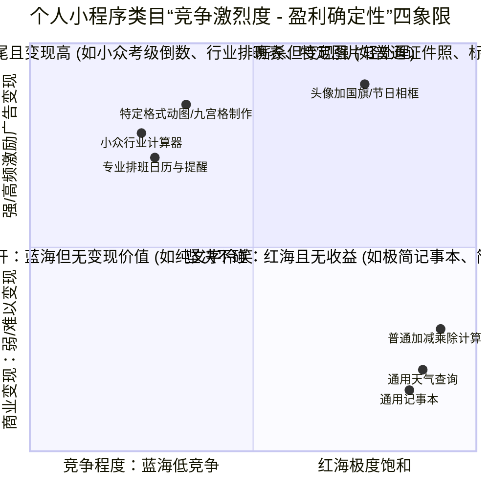
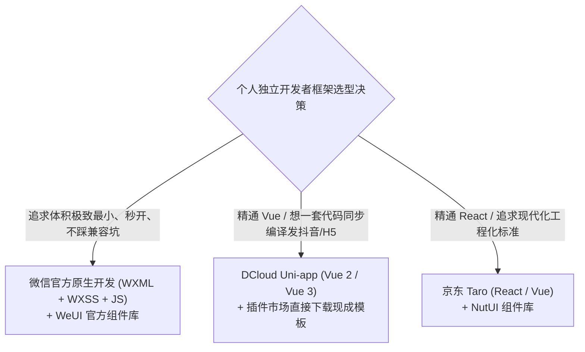
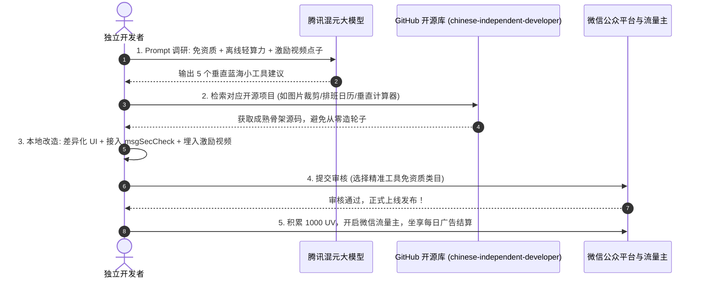

# 6.3 个人小程序全景实战导航站：免资质盈利类目、GitHub开源复用库与腾讯混元需求调研指南 (Mini Program Navigation Station)

> **核心导语：** 汇聚个人主体免资质可做类目、真实盈利商业模型分析、腾讯混元大模型需求挖掘方法论，以及 GitHub 顶级开源小程序复用资源库，助你彻底告别“盲目写代码、提审被驳回”的死循环，站在开源巨人肩膀上实现快速上线与变现！

---

## 📌 导航站建设初衷与痛点共鸣

在独立开发者的交流圈中，几乎每天都能看到类似的心酸经历：
* “花了两个月业余时间，写了一套界面极其炫酷的 AI 人脸微表情生成小程序，提审时被微信直接认定为**‘深度合成技术’**，个人主体无资质一票否决！”
* “做了个表情包广场与打卡社区，想让大家自由交流分享，结果被判定为**‘社交-笔记’**，要求提供企业法人营业执照与 100 万注册资本的增值电信业务许可证（ICP 证）！”
* “第一次做小程序，不知道什么类目能做、什么类目好赚钱、哪些项目已经有人成功上线过，全凭个人直觉盲目从零造轮子……”

这一系列的困惑揭示了一个残酷的事实：**在微信严密受监管的生态中，个人小程序的成功往往不是取决于代码有多复杂，而是取决于“合规边界摸得有多清”、“需求抓得有多准”以及“开发交付跑得有多快”**。

为此，我们构建了这个专属于个人开发者与初创小团队的 **Mini Program Navigation Station（个人小程序全景实战导航站）**。在这里，你不需要从 0 开始摸索，我们将全套官方合规避风港、真实盈利商业模式、腾讯混元需求调研范式与 GitHub 优质开源基座完整汇聚，供你随查随用。

```{mermaid}
flowchart LR
    subgraph StationWorkflow["Mini Program 敏捷实战全景闭环"]
        direction TB
        A["1. 需求调研与挖掘<br/>(腾讯混元模型 + 微信指数验真)"]
        B["2. 锁定免资质类目<br/>(工具/办公/查询/图片处理安全港)"]
        C["3. GitHub 开源基座复用<br/>(1c7/chinese-independent-developer 等)"]
        D["4. 极速二开与合规提审<br/>(Canvas/轻算力 + 内容安全闭环)"]
        E["5. 商业化变现<br/>(1000 UV 开通微信流量主 + 激励视频)"]

        A --> B --> C --> D --> E
    end
```

---

## 💡 一、 商业盈利模式分析：哪些个人小程序能赚钱？

个人开发者资源有限，既没有大厂的海量服务器预算，也没有企业主体的特种行业资质。因此，个人小程序的首要选型铁律是：**“重工具、轻交互；低算力、高长尾；合规绝对安全、变现路径清晰”**。

### 1.1 为什么正规个人小程序首选“轻量工具类”？

1. **合规安全港（免行政审批）**：
   微信官方明确对个人主体开放了【工具 - 图片处理】、【工具 - 办公】、【工具 - 记账】、【工具 - 信息查询】等纯工具类目。这类小程序无需营业执照、无需网信办算法备案，审核速度通常在 2~4 小时以内，极速过审；
2. **服务器边际成本趋近于 0**：
   正规上架的个人小程序严禁无资质调用生图、换脸等深度合成生成式 AI。相反，如果利用**纯前端技术（如 WXML + Canvas 离线绘制、WebAssembly、本地 JavaScript 算法）**完成图像裁剪、加水印、计算器、换算查询等功能，所有计算全在用户手机端执行，**服务器仅需几十元的轻量云甚至单台服务器就能支撑日活数十万访问**，真正做到“睡觉也能躺赚净利润”；
3. **长尾搜索流量巨大（微信 SEO 红利）**：
   微信“搜一搜”拥有 13 亿月活用户的庞大搜索需求。大量用户每天在微信内主动搜索“房贷计算器”、“证件照换底色”、“手持弹幕”、“图片九宫格”、“生肖星座查询”等工具关键词。只要做好小程序的名称、关键词与简介 SEO，每天无需付费买量即可源源不断获取精准搜索流量。

### 1.2 个人小程序三大盈利商业模型对比

| 变现模式 | 准入门槛 | 核心玩法与转化机制 | 收益预期与现金流表现 | 适合场景 |
| :--- | :--- | :--- | :--- | :--- |
| **微信官方流量主 (首选)** | 累计 1,000 独立访客 (UV)，无严重违规记录 | • **Banner 广告**：嵌入在首页底部或详情页<br>• **插屏广告**：在用户操作完成返回时弹出<br>• **激励视频广告 (最赚钱)**：用户主动观看 15~30 秒视频，解锁高清无水印导出、批量导出或高级模板 | 激励视频 eCPM 通常在 **50 ~ 150 元**。日活跃用户 3,000~5,000 的轻量工具，单月广告收益可达 2,000 ~ 6,000 元纯利润 | 图片处理、换算计算器、排班日历、打卡刷题工具 |
| **私域引流与知识付费** | 个人即可操作 | 在小程序内提供基础免费服务，并在“联系作者 / 深度教程”中放置个人微信号或公众号名片，沉淀高净值私域流量，通过售卖高阶视频课、社群会员变现 | 客单价高（几百到上千元），用户黏性与终身价值（LTV）极强 | 技能考试题库、专业行业工具（如跨境算税、摄影参数备忘） |
| **个人赞赏与小额打赏** | 零门槛 | 在“关于我们”页面放置个人微信赞赏码或小打赏按钮 | 偏情怀性质，通常占总收入 5% 以下，属于随喜补充 | 独立情怀类开源工具、治愈系小工具、极客作品 |

### 1.3 流量竞争格局与避坑矩阵



* **避开红海死地**：不要做通用“简易记事本”、“通用加减乘除计算器”、“纯文字天气预报”，各大手机厂商系统自带且微信竞品成千上万，用户用完即走，极难获得流量推荐；
* **深耕蓝海长尾**：寻找“特定人群 + 刚需场景”，例如：护士/乘务员三班倒排班日历、微信朋友圈超长图无损分割、手持 LED 滚动弹幕应援、跨境电商关税与体积重计算器等。

---

## 🤖 二、 需求调研实战：用腾讯自研“混元大模型”与微信指数精准挖掘蓝海

为什么调研微信小程序生态的需求，首选**腾讯混元大模型（Tencent Hunyuan）**？
* **原生生态理解**：混元是腾讯自家底层大模型，天然结合了微信官方开放文档、小程序审核规范语料以及微信搜一搜的中文用户查询意图，比第三方通用模型更精准理解“哪些类目个人能做、哪些会被直接驳回”；
* **规避审核盲区**：它能从源头上避开违规词汇和过度设计，直接输出符合《微信小程序运营规范》的轻量化需求方案。

### 2.1 实战挖掘 Prompt：定向索取高变现个人工具清单

你可以直接将以下经过实战调优的结构化 Prompt 发送给腾讯混元（或主流大模型），进行蓝海需求轰炸：

````markdown
你是一位深谙微信小程序生态、独立开发者商业化与腾讯官方审核规则的资深产品专家。

【背景与限制】：
1. 主体限制：我只能申请【个人主体】小程序，绝对不可涉及增值电信许可证（禁止社交论坛、社区广场、用户动态留言互动）和算法备案（禁止生成式AI、文生图、AI换脸等深度合成）；
2. 成本限制：个人开发者预算有限，要求“纯前端 Canvas/JS 本地计算”或“极低服务器算力开销”，不支持重型 GPU 推理；
3. 盈利要求：核心盈利模式为【微信流量主广告】，尤其是引导用户主动触发【激励视频广告】（如导出高清成果、解锁进阶小功能）。

【请你为我输出 5 个高潜力的小程序工具项目】：
对每一个项目，请严格按照以下格式分析：
1. 项目名称与定位（最好体现微信搜索 SEO 关键词）；
2. 命中的微信官方免资质服务类目（如：工具 - 图片处理 / 办公 / 信息查询）；
3. 解决的用户痛点与高频使用场景；
4. 技术实现路径（说明如何用纯前端 Canvas 或离线 JS 实现，无需高额服务器算力）；
5. 激励视频广告埋点设计（用户在什么环节最愿意心甘情愿看 15 秒广告？）；
6. 微信搜索指数与竞争分析（如何通过差异化功能避开红海竞品？）。
````

### 2.2 微信官方数据二次验真法

在大模型给出一组产品灵感后，务必通过以下两步官方工具进行实操验证：
1. **微信搜一搜下拉词分析**：在微信搜索框输入核心词（如“排班”、“拼图”、“计算”），观察下拉联想词列表。联想词越丰富，代表微信真实用户的自发搜索频次越高；
2. **微信指数（小程序内搜索“微信指数”）**：输入备选关键词，查看近 30 天或 90 天的指数波动。稳定在 **10 万 ~ 100 万** 指数区间的细分词，正是个人独立开发者的黄金获客蓝海！

---

## 🚀 三、 拒绝从 0 造轮子：GitHub 开源项目库精选与复用指南

独立开发的核心奥义在于**“站在开源巨人的肩膀上做二次包装与体验打磨”**。千万不要花几个月去写基础底层。在 GitHub 上，无数中国独立开发者已经开源了成熟、完备且被微信验证过的优秀小程序源码。

### 3.1 核心航标：中国独立开发者项目列表 (chinese-independent-developer)

这是中国开源独立开发者社区中影响力最大、最全面的实战商业宝库：

* 🌐 **项目 GitHub 仓库**：[https://github.com/1c7/chinese-independent-developer](https://github.com/1c7/chinese-independent-developer)
* 💡 **核心价值**：
  * 收录了数百位中国独立开发者全栈开发、成功上线并实现稳定月现金流（MRR）的真实产品；
  * 包含大量在微信小程序、海外 Web SaaS、iOS App 上成功跑通商业模式的源码与案例剖析；
  * 记录了大量关于“冷启动获客”、“产品定价”、“避坑防封”的极客真实复盘总结。

### 3.2 独立开发者高分优质开源小程序精选复用库

以下整理了一批在 GitHub 上广受好评、适合个人主体免资质类目、可直接二次开发调优的高分开源项目：

| 领域分类 | 优质开源项目推荐 | 技术栈与亮点 | 核心复用价值与商用改造点 |
| :--- | :--- | :--- | :--- |
| **图片与表情处理** | **[wx-image-cropper](https://github.com/1977474741/image-cropper)**<br>(微信小程序图片裁剪利器) | 纯原生 WXML + Canvas，支持平移、旋转、缩放、任意比例裁剪 | 零依赖纯前端完成。可包装为“证件照裁切”、“朋友圈九宫格切图”，导出加水印时埋入激励视频 |
| | **[wxa-plugin-canvas](https://github.com/wechat-miniprogram/wxa-plugin-canvas)**<br>(微信官方 Canvas 海报组件) | 微信官方出品，基于 JSON 配置快速绘制朋友圈分享海报 | 秒级合成高品质节日祝福卡片、打卡日签，完美适配各端机型 |
| **效率办公与生活** | **[wx-calendar](https://github.com/treadstone/wx-calendar)**<br>(精美多功能打卡日历) | 原生小程序组件，支持农历、节气、倒数日、自定义日程标记 | 二次封装为“护士/工人轮班排班日历”、“考研倒数备忘”，配合订阅消息推送下发日程提醒 |
| | **[calculator-miniprogram](https://github.com/topics/miniprogram-calculator)**<br>(场景计算器合集) | 纯 JavaScript 离线算力，支持房贷、个税、单位换算 | 改造为“外贸体积重换算”、“二手车折旧测算”等小众垂直工具，极度契合微信搜索长尾 |
| **教育与答题刷题** | **[wx-exam-system](https://github.com/topics/wechat-miniprogram-exam)**<br>(轻量刷题考试小程序) | 本地 JSON 题库加载，支持模拟考试、错题本、成绩统计 | 个人免资质属于【教育 - 在线教育/驾校】，可导入考驾照科目一、电工证考证等公共题库，错题重做引导激励视频 |
| **生活便民展示** | **[cookbook-miniprogram](https://github.com/topics/wechat-cookbook)**<br>(离线家常菜谱图文) | 纯本地数据缓存，图文步骤清晰，支持搜索收藏 | 个人免资质属于【餐饮 - 菜谱】。绝不涉及外卖下单，纯内容分享，审核秒过，流量主变现极其稳定 |

### 3.3 小程序主流跨端与开发框架选型推荐



1. **微信官方原生开发 + WeUI**：
   * 优势：零构建成本，小程序包体积最小（通常几百 KB），运行性能最佳，微信最新官方能力第一时间原生支持；
   * 建议：单人开发简单工具（< 5 个页面），首选原生。
2. **Uni-app（Vue 技术栈）**：
   * 优势：国内独立开发者最推崇的开发方式。生态中拥有极其庞大的 **DCloud 插件市场**，海量现成的“计算器”、“相册切图”、“答题刷题”现成模板，一键导入即可运行；
   * 建议：想要一套代码同时发布到微信小程序、抖音小程序和 Web 端，首选 Uni-app。

---

## 📋 四、 极简实战闭环 SOP：从选题到上线四步法

对于想在业余时间快速拿到正反馈的开发者，建议按照以下**敏捷四步法则**进行落地：



1. **第一天：确定选题与开源基座**
   * 用腾讯混元大模型生成 3~5 个点子，通过“微信指数”筛选出检索量稳定且竞争小的方向；
   * 在 GitHub 上找到 1~2 个功能契合度在 70% 以上的开源项目，下载并在本地跑通。
2. **第二天：本地二开与特色包装**
   * 替换界面的图标、色调与名称，优化交互体验；
   * 将核心计算或图片处理完全放在前端完成，降低后端负载；
   * 如涉及用户自定义输入文本或上传图片，务必接入官方免费的 `msgSecCheck` 内容安全校验；
   * 埋设好激励视频广告点（例如：免费导出提供标清，看 15 秒视频直接导出 4K 原画）。
3. **第三天：打包提审与配置**
   * 对照[第7阶段 09章官方免资质类目全景对照表](../../wxapp_sphinx_from_zero/stage7_audit_mastery/09_personal_developer_ecosystem_pros_cons_and_zero_qualification_category_matrix.md)，精准选择二级类目（如【工具 - 图片处理】）；
   * 提审备注清晰写明：“本小程序为纯本地离线工具，不涉及用户社交互动与第三方在线支付”。
4. **第七天及以后：流量冷启动与变现**
   * 分享至精准社群、朋友圈或小红书做初始种子用户积累；
   * 达到 1,000 UV 后，进入微信公众平台后台一键开通【流量主】，开启睡后被动收入。

---

## 🔗 相关扩展与交叉参考

* 📖 **小程序合规必修**：[第7阶段 09. 微信小程序生态实战全景复盘：个人开发者得失权衡与全量免资质类目权威对照表](../../wxapp_sphinx_from_zero/stage7_audit_mastery/09_personal_developer_ecosystem_pros_cons_and_zero_qualification_category_matrix.md)
* 📖 **大模型对话精选**：[阶段二：大模型对话与 Prompt 沉淀](../stage2_llm_dialogues_and_prompts/index.md)
* 📖 **独立开发者思考录**：[阶段四 03. 独立黑客的心态修炼与长期主义](../stage4_business_insights_and_thinking/03_indie_hacker_mindset.md)
* 🌐 **外部高价值信源**：
  * [中国独立开发者项目列表 (chinese-independent-developer)](https://github.com/1c7/chinese-independent-developer)
  * [微信官方个人主体开放服务类目规范](https://developers.weixin.qq.com/minigame/product/material/#%E4%B8%AA%E4%BA%BA%E4%B8%BB%E4%BD%93%E5%B0%8F%E7%A8%8B%E5%BA%8F%E5%BC%80%E6%94%BE%E7%9A%84%E6%9C%8D%E5%8A%A1%E7%B1%BB%E7%9B%AE)
  * [腾讯混元大模型官方平台](https://hunyuan.tencent.com/)
