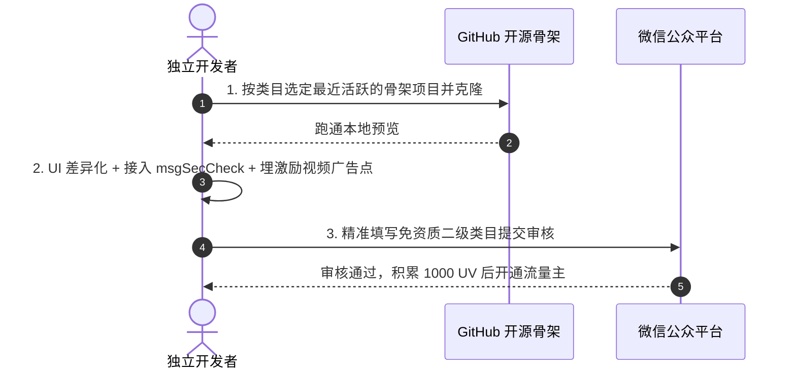

# 6.3 个人小程序全景实战导航站：免资质大类小类与开源复用库矩阵 (Mini Program Navigation Station)

> **导语：** 按微信官方免资质大类 / 小类分类，每类给出可直接二次开发的 GitHub 开源项目。所有链接已经过自动化 HTTP 200 验证。**使用策略：选题 → 找开源骨架 → 二次开发差异化 → 精准类目提审 → 1000 UV 后开通流量主。**

---

## 🧭 两个必读的资源航标

### 独立开发者案例库
| 项目 | 链接 | 用途 |
| :--- | :--- | :--- |
| **中国独立开发者项目列表** | [1c7/chinese-independent-developer](https://github.com/1c7/chinese-independent-developer) | 31k+ Stars。收录中国独立开发者已上线、跑通 MRR 现金流产品的案例与变现思路 |
| → 程序员专版 | [README-Programmer-Edition.md](https://github.com/1c7/chinese-independent-developer/blob/master/.github/pages/README-Programmer-Edition.md) | 专门面向技术型独立开发者的产品列表与变现案例精选 |

### 微信小程序开源项目汇总库
| 项目 | 链接 | 用途 |
| :--- | :--- | :--- |
| **awesome-github-wechat-weapp** | [opendigg/awesome-github-wechat-weapp](https://github.com/opendigg/awesome-github-wechat-weapp) | 按 UI、框架、工具类分类的综合汇总库，用于快速找到各类小程序开源资源 |
| **腾讯云开发案例库** | [TencentCloudBase/awesome-cloudbase-examples](https://github.com/TencentCloudBase/awesome-cloudbase-examples) | 腾讯官方维护，包含大量基于云开发（CloudBase）的免服务器小程序实战案例 |
| **腾讯 miniprogram-skills** | [TencentCloudBase/awesome-miniprogram-skills](https://github.com/TencentCloudBase/awesome-miniprogram-skills) | 腾讯官方整理的小程序实战技巧合集，从基础 Todo 到 AI 集成与云存储均有覆盖 |

---

## 🛠️ 开发框架与 UI 底座选型

| 框架 / 组件库 | 仓库 | 特点 |
| :--- | :--- | :--- |
| **微信官方全功能示例** | [wechat-miniprogram/miniprogram-demo](https://github.com/wechat-miniprogram/miniprogram-demo) | 官方权威示例，覆盖组件、API、云开发，首选参考 |
| **WeUI 原生组件库** | [wechat-miniprogram/weui-miniprogram](https://github.com/wechat-miniprogram/weui-miniprogram) | 微信官方视觉规范组件库，体积极小，适合简洁工具 |
| **TDesign 企业级 UI** | [Tencent/tdesign-miniprogram](https://github.com/Tencent/tdesign-miniprogram) | 腾讯官方企业设计体系，现代审美，持续维护 |
| **Vant Weapp** | [youzan/vant-weapp](https://github.com/youzan/vant-weapp) | 23k+ Stars，轻量成熟，生态最活跃的第三方 UI 库 |
| **Uni-app 跨端框架** | [dcloudio/uni-app](https://github.com/dcloudio/uni-app) | Vue 语法，一套代码发微信/抖音/H5，插件市场海量现成模板 |
| **Taro 跨端框架** | [NervJS/taro](https://github.com/NervJS/taro) | React 语法，京东开源，工程化标准高 |
| **TS 类型定义** | [wechat-miniprogram/api-typings](https://github.com/wechat-miniprogram/api-typings) | 官方 TypeScript 类型声明，2024+ 新项目建议引入 |
| **高性能运行时** | [wechat-miniprogram/glass-easel](https://github.com/wechat-miniprogram/glass-easel) | 微信小程序运行时底层框架，了解底层机制用 |

---

## 📚 按免资质大类 / 小类的开源项目矩阵

> ⚠️ **选项目时注意**：查看仓库最后提交时间（Last commit）。优先选 2023 年后仍有维护的项目。旧项目可作为代码逻辑参考，但需要自行升级基础库适配。

---

### 大类：【工具】

#### 小类：图片处理

> 策略：前端 Canvas 离线计算为主，算力成本接近 0。导出高清/去水印时引导激励视频，eCPM 高。

| 项目 | 仓库 | 说明 |
| :--- | :--- | :--- |
| **we-cropper** | [we-plugin/we-cropper](https://github.com/we-plugin/we-cropper) | 经典图片裁剪库。双指缩放、旋转、等比裁剪。可做证件照裁切、头像加边框 |
| **Painter 海报引擎** | [Kujiale-Mobile/Painter](https://github.com/Kujiale-Mobile/Painter) | JSON 配置驱动，快速生成朋友圈分享海报、节日日签 |
| **painter-custom-poster** | [lingxiaoyi/painter-custom-poster](https://github.com/lingxiaoyi/painter-custom-poster) | Painter 的可视化编辑扩展，支持拖拽布局设计 |
| **mini-ps** | [zixiCat/mini-ps](https://github.com/zixiCat/mini-ps) | 基于 Uni-app 的"迷你 Photoshop"：图文多层编辑、涂鸦、滤镜、海报导出 |
| **DuduCanvas** | [willian12345/DuduCanvas](https://github.com/willian12345/DuduCanvas) | Canvas 面向对象封装，支持多行文本与图形组合，适合九宫格切图、水印叠加 |
| **LuckyCanvas** | [LuckDraw/lucky-canvas](https://github.com/LuckDraw/lucky-canvas) | 高性能跨端 Canvas 组件，底层帧动画引擎可复用于轻互动工具 |
| **photo-edit** | [nimoat/photo-edit](https://github.com/nimoat/photo-edit) | 功能完整的图片编辑小程序：裁剪、涂鸦、加文字、拼长图 |
| **recycle-view** | [wechat-miniprogram/recycle-view](https://github.com/wechat-miniprogram/recycle-view) | 官方长列表虚拟滚动组件，用于展示大量图片/表情包时保持流畅 |

**表情包专项资源（【工具 - 图片处理】类目，需去社区化）：**

| 资源 | 链接 | 说明 |
| :--- | :--- | :--- |
| **ChineseBQB 中国表情包大全** | [zhaoolee/ChineseBQB](https://github.com/zhaoolee/ChineseBQB) ｜ [在线浏览](https://zhaoolee.github.io/ChineseBQB/) | **中国人聊天表情包大集合**，可在线查看下载，是制作表情包工具类小程序的优质素材数据源 |
| **ChineseBQB 小程序版** | [F-loat/ChineseBQB-weapp](https://github.com/F-loat/ChineseBQB-weapp) | 基于 ChineseBQB 数据集开发的微信小程序，可直接参考其数据接入与展示逻辑 |
| **表情包制作器 sorry** | [xtyxtyx/sorry](https://github.com/xtyxtyx/sorry) | "为所欲为"表情包 GIF 生成器，含微信小程序版本，支持用户自定义文字生成搞笑 GIF |
| **表情包小程序** | [xiaoshouchen/meme-mini-program](https://github.com/xiaoshouchen/meme-mini-program) | 曾积累过万用户的表情包小程序，已开源，可参考其用户增长与变现策略 |
| **头像壁纸表情包** | [chenaild/mars_picture](https://github.com/chenaild/mars_picture) | 头像 + 壁纸 + 表情包三合一展示下载，内含激励视频广告变现实现 |

---

#### 小类：办公 / 时间管理

| 项目 | 仓库 | 说明 |
| :--- | :--- | :--- |
| **wx_calendar（老牌日历）** | [treadpit/wx_calendar](https://github.com/treadpit/wx_calendar) | 2k+ Stars，支持农历、节气、自定义标记。适合改造为倒班日历、考研倒计时 |
| **wx-calendar（新版高质量）** | [lspriv/wx-calendar](https://github.com/lspriv/wx-calendar) | 399+ Stars，2024 年活跃维护，现代架构，功能更完善，推荐新项目使用这个 |
| **Calendar 日程提醒** | [LetMeFly666/Calendar](https://github.com/LetMeFly666/Calendar) | 日历 + 备忘录 + 微信订阅消息提醒全栈实现 |
| **wechat-pomodoro** | [shisaq/wechat-pomodoro](https://github.com/shisaq/wechat-pomodoro) | 番茄工作法时钟，解决小程序后台计时与动画平滑问题 |
| **官方示例集** | [oopsguy/wechat-miniprogram-examples](https://github.com/oopsguy/wechat-miniprogram-examples) | 648 Stars，包含 TodoList、番茄钟等开箱即用示例 |
| **computed 扩展** | [wechat-miniprogram/computed](https://github.com/wechat-miniprogram/computed) | 官方出品，为原生自定义组件提供 computed/watch 能力，现代小程序开发必备 |

---

#### 小类：记账 / 备忘录

> ⚠️ 数据必须仅限用户个人可见，绝不能做成公开展览的社区广场。

| 项目 | 仓库 | 说明 |
| :--- | :--- | :--- |
| **momento-miniapp** | [pudongping/momento-miniapp](https://github.com/pudongping/momento-miniapp) | Uni-app + Vue 3，"时光账记"，多账本、周期记账、倒数日、图表分析，配套 Go 后端 |
| **jiezhang** | [yigger/jiezhang](https://github.com/yigger/jiezhang) | 483 Stars，基于 Taro 多端记账，代码结构清晰，支持预算与图表统计 |
| **TallyRoom** | [ddddnake/TallyRoom](https://github.com/ddddnake/TallyRoom) | 微信云开发，聚会/牌局场景多人分账结算，无需自建服务器 |

---

#### 小类：预约 / 排号

> 仅限展示服务信息、接受预约时段，**严禁在线资金结算**。

| 项目 | 仓库 | 说明 |
| :--- | :--- | :--- |
| **meeting 会议室预约** | [007gzs/meeting](https://github.com/007gzs/meeting) | 387 Stars，Django 后端，时段占用可视化查询、预约审核 |
| **SmartSportV 场馆预约** | [3075426724/SmartSportV](https://github.com/3075426724/SmartSportV) | 273 Stars，体育场馆时段预约，直观时间网格选座 |
| **reservatioclient 美业预约** | [378526425/reservatioclient](https://github.com/378526425/reservatioclient) | 美容美发/工作室预约，含服务展示、技师选择、提醒通知 |
| **bee 叫号排队** | [woniudiancang/bee](https://github.com/woniudiancang/bee) | 餐饮点餐排队叫号完整方案，可剥离出纯排号模块 |

---

#### 小类：信息查询 / 综合工具箱

> 微信搜一搜长尾流量入口，用户高频主动搜索，结合 Banner 广告稳定变现。

| 项目 | 仓库 | 说明 |
| :--- | :--- | :--- |
| **tools-applet 全能工具箱** | [LittleWhite1995/tools-applet](https://github.com/LittleWhite1995/tools-applet) | 绝大部分运算在本地完成，服务器成本近乎为 0 |
| **60swechat 早报 + 工具** | [heiyuan0801/60swechat](https://github.com/heiyuan0801/60swechat) | Uni-app，60 秒读懂世界早报 + 汇率/密码/油价实用查询 |
| **一个木函** | [insoxin/weapp-One_Wooden_Letter](https://github.com/insoxin/weapp-One_Wooden_Letter) | 30+ 便民工具合集，曾长期位居工具类榜单 |
| **fresh-weather 天气** | [ksky521/fresh-weather](https://github.com/ksky521/fresh-weather) | 329 Stars，云开发 + 原生，清新天气小程序完整实现 |
| **垃圾分类 EcoSort** | [woyaoxingfua/EcoSort](https://github.com/woyaoxingfua/EcoSort) | 原生 + Node.js，垃圾分类查询全栈实现，WeUI 视觉 |

---

### 大类：【教育】

#### 小类：在线教育 / 驾校 / 考试刷题

> 仅限个人题库练习与打卡记录（禁止发证与有偿正规培训）。考试交卷查解析时埋入激励视频是最顺手的变现点。

| 项目 | 仓库 | 说明 |
| :--- | :--- | :--- |
| **QuestionWechatApp** | [kesixin/QuestionWechatApp](https://github.com/kesixin/QuestionWechatApp) | 功能最全面的刷题系统：顺序/随机/背题/专项/错题集/排行榜 |
| **ExamOnline（多题型）** | [wulivictor/ExamOnline](https://github.com/wulivictor/ExamOnline) | 支持单选、多选、判断、阅读理解等 8 种题型，含多媒体图文题库 |
| **xzs-wechat** | [mindskip/xzs-wechat](https://github.com/mindskip/xzs-wechat) | 学之思在线考试，成熟商业级系统，界面专业 |
| **ExamOnline（云开发）** | [YeeMu/ExamOnline](https://github.com/YeeMu/ExamOnline) | 微信云开发版，免服务器、免域名，适合快速上线验证垂直市场 |
| **考试成绩记录** | [xlzy520/exam-score-reporter](https://github.com/xlzy520/exam-score-reporter) | 记录每次考试成绩，自定义科目，可视化图表分析成绩趋势 |

---

### 大类：【餐饮】

#### 小类：菜谱（禁止外卖下单、禁止在线交易）

| 项目 | 仓库 | 说明 |
| :--- | :--- | :--- |
| **HowToCook** | [Anduin2017/HowToCook](https://github.com/Anduin2017/HowToCook) | **60k+ Stars**。程序员做饭指南，中文最标准精确的结构化菜谱数据源，可作为题库 |
| **cook（隔离食用手册）** | [YunYouJun/cook](https://github.com/YunYouJun/cook) | 6k+ Stars，按现有食材匹配菜谱，纯前端离线 Vue，可直接改造为小程序 |
| **RecipeOfEverything** | [MondayYuan/RecipeOfEverything](https://github.com/MondayYuan/RecipeOfEverything) | 基于微信云开发的菜谱小程序，含搜索历史与收藏功能 |
| **jiayouxiaochu** | [hexbay/jiayouxiaochu](https://github.com/hexbay/jiayouxiaochu) | 家有小厨，含菜谱发布、步骤拆解与图文收藏 |

---

### 大类：【快递业与邮政】

#### 小类：快递物流查询（禁止代揽件、禁止在线收费）

| 项目 | 仓库 | 说明 |
| :--- | :--- | :--- |
| **wechat-weapp-logistics** | [RRRoger/wechat-weapp-logistics](https://github.com/RRRoger/wechat-weapp-logistics) | 全国快递实时轨迹查询，支持扫码识别单号 |

---

### 大类：【体育】

#### 小类：运动打卡 / 成绩记录

| 项目 | 仓库 | 说明 |
| :--- | :--- | :--- |
| **PopRun 跑步记录** | [Chef5/PopRun](https://github.com/Chef5/PopRun) | 跑步里程、轨迹可视化 + 打卡海报合成，完整全栈实现 |
| **Energym 运动记录** | [7gugu/Energym](https://github.com/7gugu/Energym) | 基于手机传感器的步数与运动轨迹记录，纯本地离线 |
| **SmartSportV** | [3075426724/SmartSportV](https://github.com/3075426724/SmartSportV) | 体育场地预约（也可归属本类目），含完整前端与管理后台 |

---

## ⚡ 极速落地三步法

1. **Day 1 — 选骨架**：按类目找上述仓库，`git clone` 并在微信开发者工具本地跑通；
2. **Day 2 — 改造**：替换主题色/图标，添加差异化功能，接入 `msgSecCheck` 内容安全（如涉及用户输入），在关键导出/完成节点埋入激励视频广告；
3. **Day 3 — 提审**：对照官方类目填写对应免资质二级类目，提审备注说明"纯工具类/离线本地处理/不涉及社交互动"。

---

## 🔗 交叉参考

* **合规类目全景对照表**：[第7阶段 09. 微信小程序生态全景复盘](../../wxapp_sphinx_from_zero/stage7_audit_mastery/09_personal_developer_ecosystem_pros_cons_and_zero_qualification_category_matrix.md)
* **微信官方个人主体类目规范**：[开发者文档直达](https://developers.weixin.qq.com/minigame/product/material/#%E4%B8%AA%E4%BA%BA%E4%B8%BB%E4%BD%93%E5%B0%8F%E7%A8%8B%E5%BA%8F%E5%BC%80%E6%94%BE%E7%9A%84%E6%9C%8D%E5%8A%A1%E7%B1%BB%E7%9B%AE)
