# 智能体团队怎么分工？

用老板、专员和验收的比喻，讲清子智能体、智能体团队、经理模式、任务交接、并行执行，以及高级模型调用其他模型时真正需要的边界和检查。

## 阅读边界

本文依据原始课程的研究笔记、课程结构和发布文案整理。涉及产品、模型、版本、平台规则、价格或资格等可能变化的信息，实践前应以当前官方资料和实际环境为准。

## 智能体团队：到底谁来分工？

一个总负责人，多个专员，再加一道验收。

想象你是项目负责人，桌上同时来了研究、写代码、做测试三件事。一个人全包，当然可以，但很快就会被来回切换拖慢。智能体，也就是能观察、调用工具并完成目标的软件角色，可以像一名会用工具的专员。

智能体团队，是让多个专员各自负责一块，再由一个总负责人安排顺序、传递信息和验收结果。所以它像老板带团队：老板不亲自写每一行代码，但要说清目标、分配工作、处理冲突，最后检查交付。

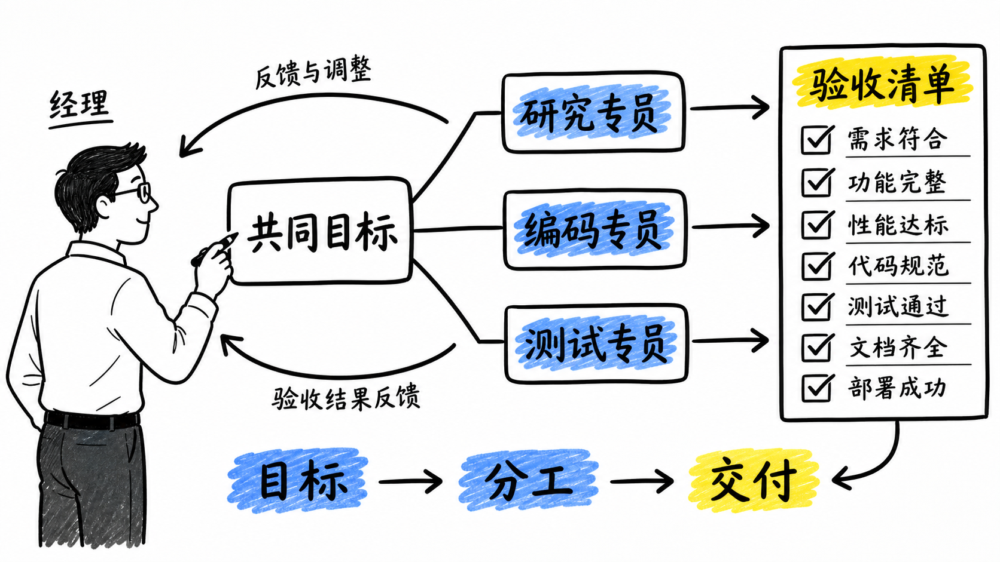

图解：老板站在白色画板前，中央写“共同目标”，下面三条粗线分别连接“研究专员”“编码专员”“测试专员”，右侧有一张醒目的“验收清单”，箭头回到老板；左下角用小字标注“目标 → 分工 → 交付”。蓝色高亮并行任务，黄色高亮验收。不要出现完整视频标题。

## 子智能体：总智能体的临时专员

重点不在名字，而在谁保留最终控制权。

子智能体，通常是总智能体为了完成一个局部任务，临时请来的专员。它做完研究、扫描代码或生成测试建议，再把结果交回总智能体；总智能体仍然负责下一步。

智能体团队关注的是整体协作：可以有多个长期角色，也可以有一个经理、几个工人和一个评审。一句话区分：子智能体更像一次外包任务，团队更像一套持续运转的组织。

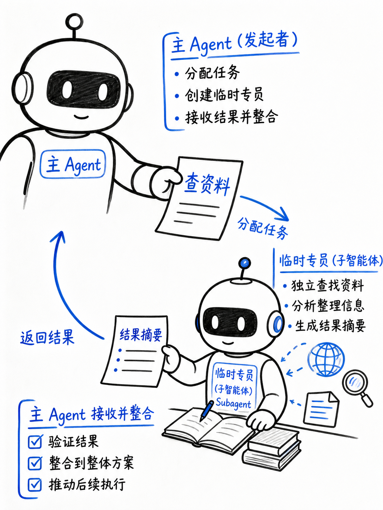

图解：竖向构图，一个大号“主 Agent”在上方，把一张写着“查资料”的任务单交给下方一个小号“子智能体（Subagent）”，返回一张“结果摘要”；旁边用小字写“临时专员”，箭头单向往返。中文清晰，留白仅用于全幅构图，不做边框。

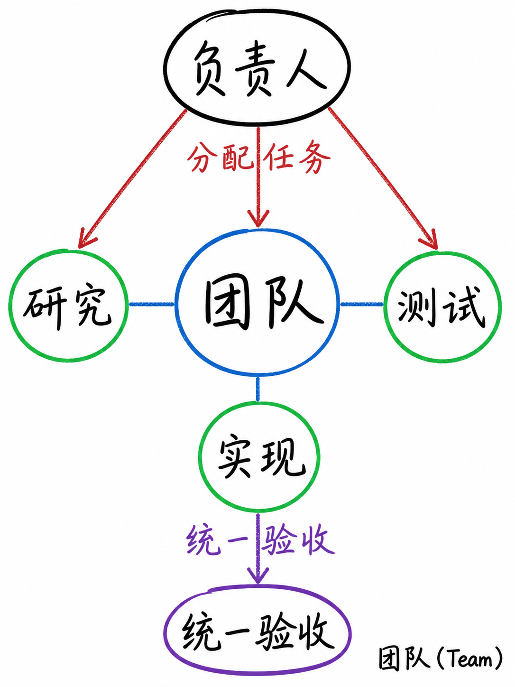

图解：竖向构图，中央“团队”节点连接三个同等大小的角色：“研究”“实现”“测试”，上方“负责人”分配任务，下方“统一验收”；用三条不同颜色粉笔线表示协作。内部标签必须中文，英文只在“团队（Team）”旁小字出现。

## 经理模式：总智能体只管指挥与验收

把专员当工具调用，最终答案仍由经理整合。

最容易理解的架构叫经理模式：一个总智能体保留用户对话和最终输出。它把研究、实现、测试这些专员暴露成可调用的工具，按需要并行或串行安排。

专员的上下文可以被限制在自己的任务里，返回结构化结果，而不是把所有聊天记录都塞进每个模型。最后经理要做的不只是拼接答案，还要检查证据、运行结果和验收标准；不通过，就退回重做。

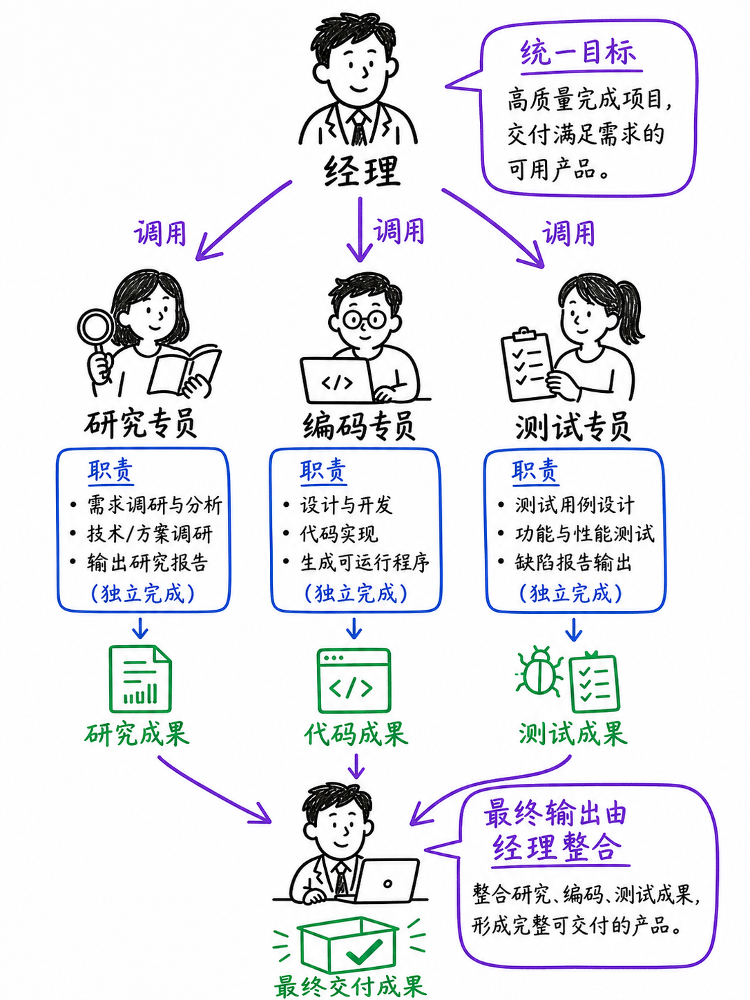

图解：竖向构图，顶部一个“经理 Agent”，下面三个独立专员节点“研究专员”“编码专员”“测试专员”，经理用三支箭头调用他们；左边小字“统一目标”，右边小字“最终输出仍由经理整合”。紫色强调调用关系，避免人物肖像。

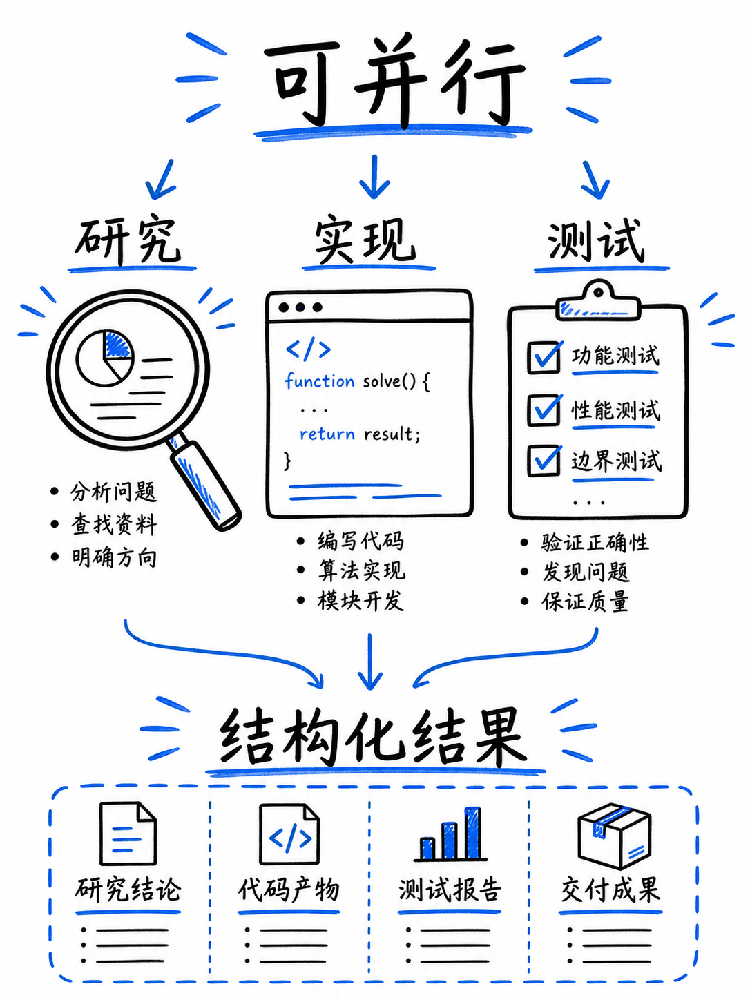

图解：竖向构图，三个专员同时工作：放大镜对应“研究”，代码窗口对应“实现”，勾选表对应“测试”；顶部标注“可并行”，底部标注“结构化结果”。黑色线稿配蓝色荧光高亮，文字清晰。

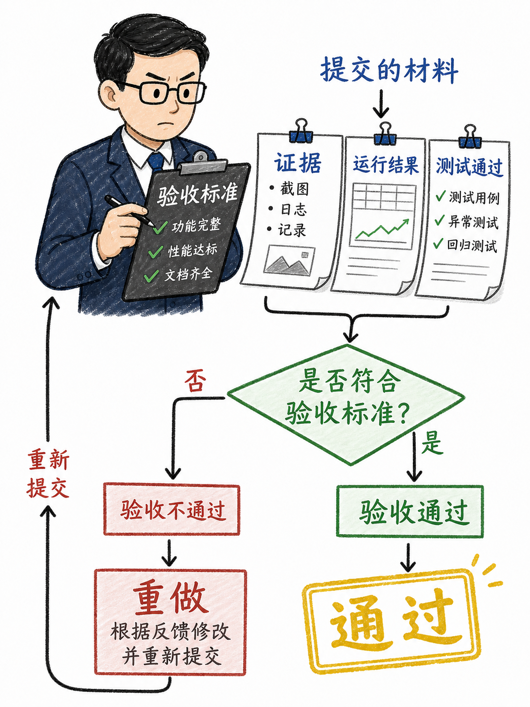

图解：竖向构图，经理拿着“验收标准”，依次查看三张结果纸；纸上写“证据”“运行结果”“测试通过”，最后盖上“通过”印章；若失败，红色叉号箭头回到“重做”。中文大字，黄色高亮验收。

## 高级模型能指挥低级模型吗？可以，但要接好接口

模型级别不是组织能力，协议、权限和验收才是。

高级模型当然可以指挥较便宜或较快的模型，前提是它们有稳定的调用接口，并能返回可检查的结果。在本地，终端复用器只是管理多个终端窗口的工具：它能方便并行观察，但它本身不会替你分工和判断质量。

例如，上层编码助手可以通过脚本或子进程调用另一个命令行模型的无交互模式，让它负责一个明确的小任务，再读回文字或结构化结果。更稳的做法是给每个模型独立目录、明确输入输出格式、最小权限和超时；不要只开五个终端，然后期待它们自动形成团队。

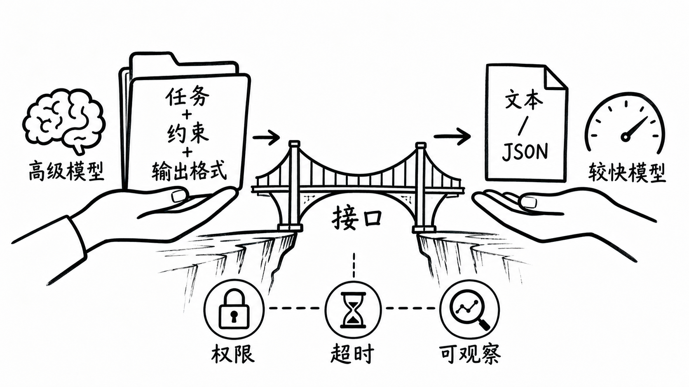

图解：横向流程：左侧“高级模型”把写有“任务 + 约束 + 输出格式”的文件夹交给右侧“较快模型”，右侧返回“文本 / JSON”；中间有一座写着“接口”的桥，桥下写“权限、超时、可观察”。不要做品牌 logo。

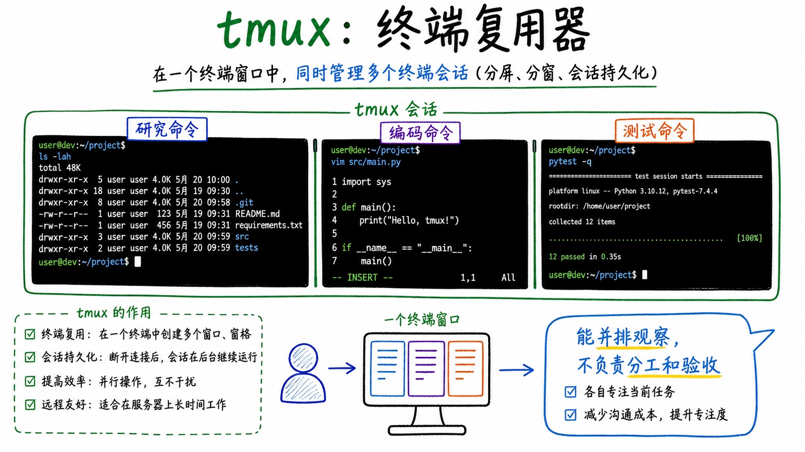

图解：横向手绘终端窗口示意，三个并排面板写“研究命令”“编码命令”“测试命令”，顶部小字“tmux：终端复用器”，旁边用醒目注释“能并排观察，不负责分工和验收”。不要使用真实软件 logo。

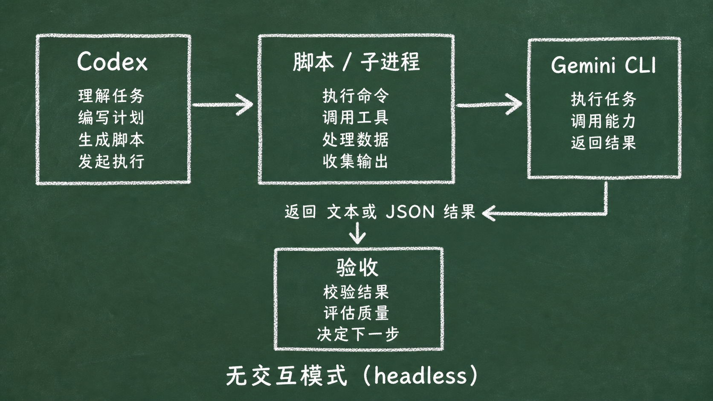

图解：横向流程图，左侧写“Codex”，箭头经过“脚本 / 子进程”，指向右侧“Gemini CLI”；右侧再输出“文本或 JSON 结果”返回“验收”。底部小字“无交互模式（headless）”。品牌名只做准确纯文字标签，不画 logo。

## 推理行动循环像一个人边做边想

团队协作则把思考、执行和复核拆给不同角色。

推理行动循环，意思是一个智能体观察信息、想一步、调用工具，再根据结果继续循环。它像一个能力很强的人边查边做，路径灵活，适合目标清楚但步骤难以提前写完的任务。

人类团队则会把工作拆开：研究员先查资料，工程师实现，测试员挑错，负责人决定是否交付。多智能体团队可以模拟这种分工，但还没有自动拥有人的常识、责任感和跨角色沟通默契。

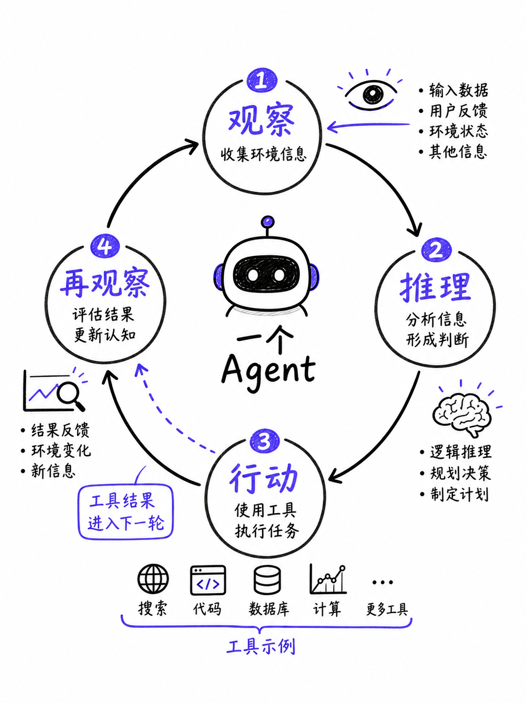

图解：竖向循环箭头围成四步圆环：“观察”“推理”“行动”“再观察”，中心写“一个 Agent”；旁边小字“工具结果进入下一轮”。蓝紫色高亮循环方向，线条简洁。

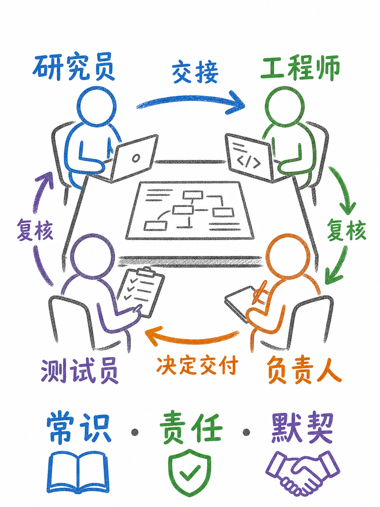

图解：竖向构图，四个简化人物图标围绕一张项目桌：“研究员”“工程师”“测试员”“负责人”，箭头标注“交接”“复核”“决定交付”；底部小字“常识、责任、默契”。不画具体人脸。

## 真正像团队的关键：任务拆开，结果验收

先从低风险、可测量、可回滚的工作开始。

如果你要自己搭一支智能体团队，先写清每个角色的输入、输出、权限和完成标准。再决定哪些任务并行，哪些任务必须等前一步通过；把失败重试、人工审批和日志记录放进流程。

适合多智能体的，通常是可以拆分、彼此相对独立，而且结果能被测试或比较的工作。不适合的，是目标含糊、权限很大、出错代价很高，却没有人负责最后验收的工作。

记住：多智能体不是把一个模型复制很多份，而是把协作关系设计出来，再用验收把它关进边界里。

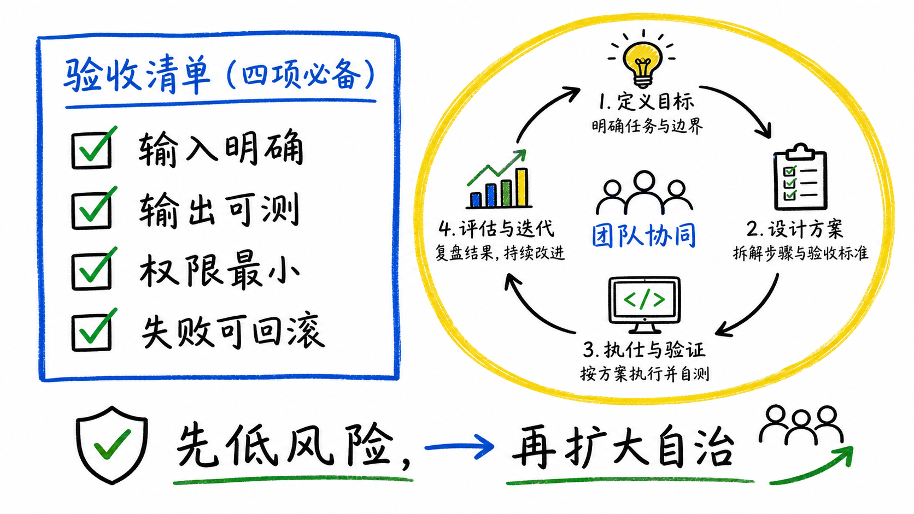

图解：横向验收清单，左侧四个带勾项目：“输入明确”“输出可测”“权限最小”“失败可回滚”，右侧一个团队流程被黄色框圈住，底部写“先低风险，再扩大自治”。黑板风格的白底手绘技术图。

## 小结

把问题拆成目标、约束、证据和验证四部分，通常比直接寻找唯一答案更可靠。先用本文的框架完成一次小范围验证，再根据真实反馈调整下一步。

## 参考资料

以下链接来自原始课程研究笔记；动态信息请以其当前页面为准。

- [https://openai.github.io/openai-agents-python/multi_agent/](https://openai.github.io/openai-agents-python/multi_agent/)
- [https://openai.github.io/openai-agents-python/agents/；https://openai.github.io/openai-agents-python/handoffs/](https://openai.github.io/openai-agents-python/agents/；https://openai.github.io/openai-agents-python/handoffs/)
- [https://microsoft.github.io/autogen/stable/user-guide/agentchat-user-guide/tutorial/teams.html](https://microsoft.github.io/autogen/stable/user-guide/agentchat-user-guide/tutorial/teams.html)
- [https://github.com/google-gemini/gemini-cli/blob/main/docs/cli/headless.md](https://github.com/google-gemini/gemini-cli/blob/main/docs/cli/headless.md)
- [https://github.com/google-gemini/gemini-cli/blob/main/docs/cli/cli-reference.md](https://github.com/google-gemini/gemini-cli/blob/main/docs/cli/cli-reference.md)
- [https://github.com/google-gemini/gemini-cli/blob/main/docs/core/subagents.md](https://github.com/google-gemini/gemini-cli/blob/main/docs/core/subagents.md)
- [https://www.cheasy.de/tmux.pdf](https://www.cheasy.de/tmux.pdf)
