# ASR错字，怎么纠正？

> 对应短视频主题：ASR错字，怎么纠正？  
> 资料核验与更新：2026-09-12

ASR把声音变成文字，但数字、标点、同音词和方言都会让原始结果失真。这条视频带你看懂错误从哪来，以及规则、神经网络和人工复核怎样配合。

## 阅读边界

本文依据原始课程的研究笔记、课程结构和发布文案整理。涉及产品、模型、版本、平台规则、价格或资格等可能变化的信息，实践前应以当前官方资料和实际环境为准。

## ASR 是什么？先看声音到文字

它不是录音机，而是在多个候选文字里做判断。

ASR错字，怎么纠正？先把这个问题说完整：自动语音识别，就是把人说的话转换成文字。它听到的不是字，而是声音里的音素、停顿和上下文，再从候选文字里选出最可能的一串。

所以原始输出更像一份听写草稿，后面还需要格式化、纠错和语义优化。

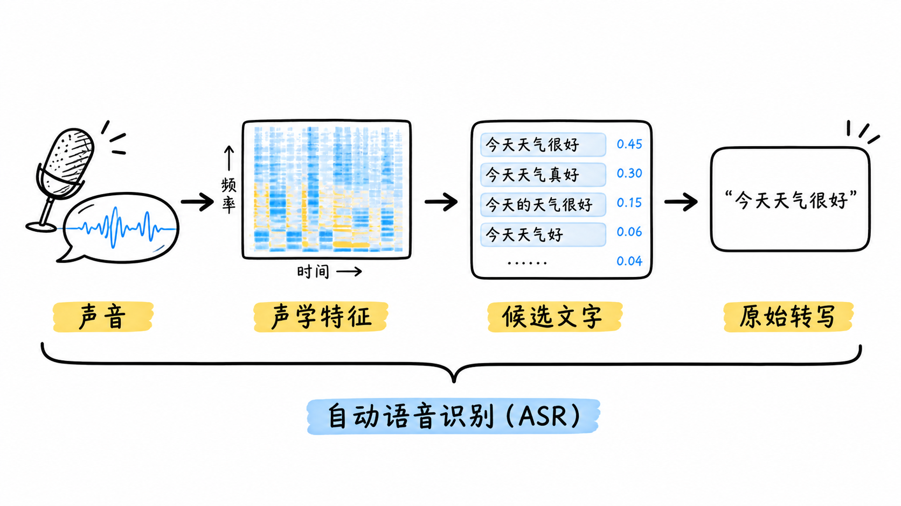

图解：语音识别基础流水线：从原始声学波形、声学特征提取到候选词生成与初稿转写。

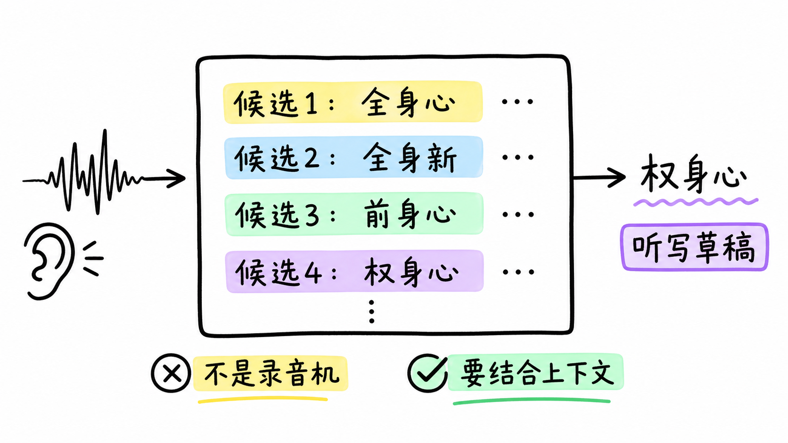

图解：识别黑盒与转写草稿：声学概率生成初步文本，仍需依赖上下文进一步校准。

## ASR 内部：四步把声音猜成句子

每一步都可能把误差带到下一步。

第一步把连续声音切成可计算的声学特征，第二步判断这些声音更像哪些发音单位。第三步用语言上下文给候选词排序，第四步再输出文字和时间戳。

因此数字、产品名和人名会因为词表太少而错，连读、噪声和口音会让声音本身变难。

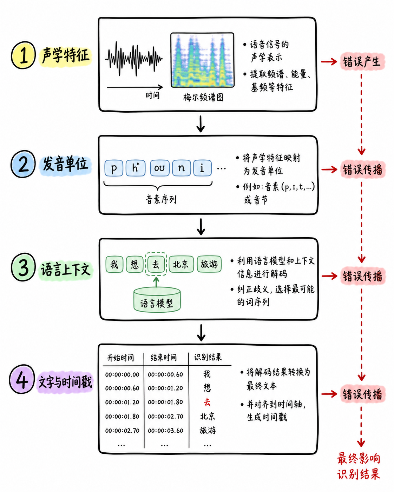

图解：四阶段误差传递链：声学特征、发音单元、语言上下文到最终时间戳对齐。

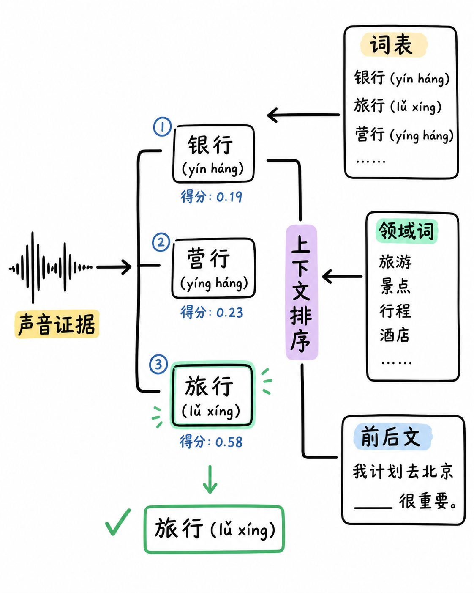

图解：上下文排序与候选消歧：结合词表与前后文语义判定同音候选词。

## 原始输出常见问题：先做错误分型

不同错误，要用不同修复手段。

第一类是数字和专有名词，比如版本号、公司名、地名，声音短，候选却很多。第二类是标点缺失和断句错误，字可能都对，但读起来没有层次，搜索和摘要也会受影响。

第三类是同音词混淆，比如“背景”和“北京”，单看发音难分，必须把上下文一起看。

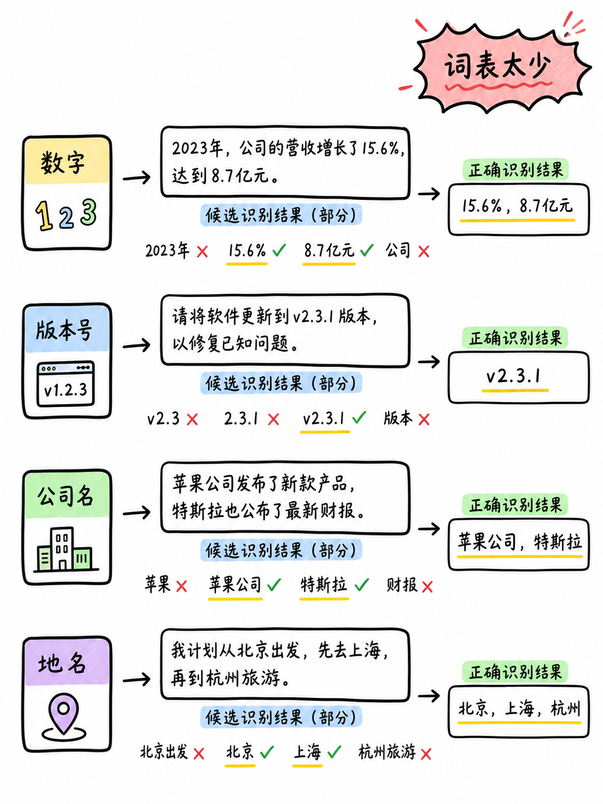

图解：专有名词与领域实体识别：数字、技术术语与人名的专项纠错路径。

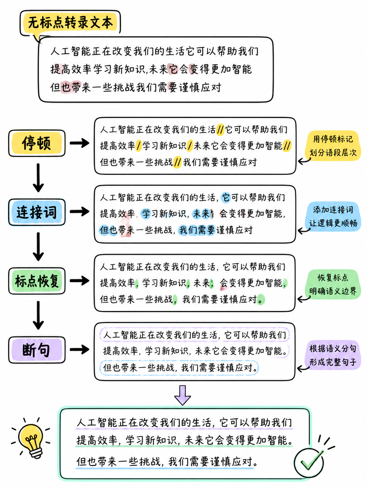

图解：停顿检测与标点恢复：依据语音节奏与语法连词实现自然长句断句。

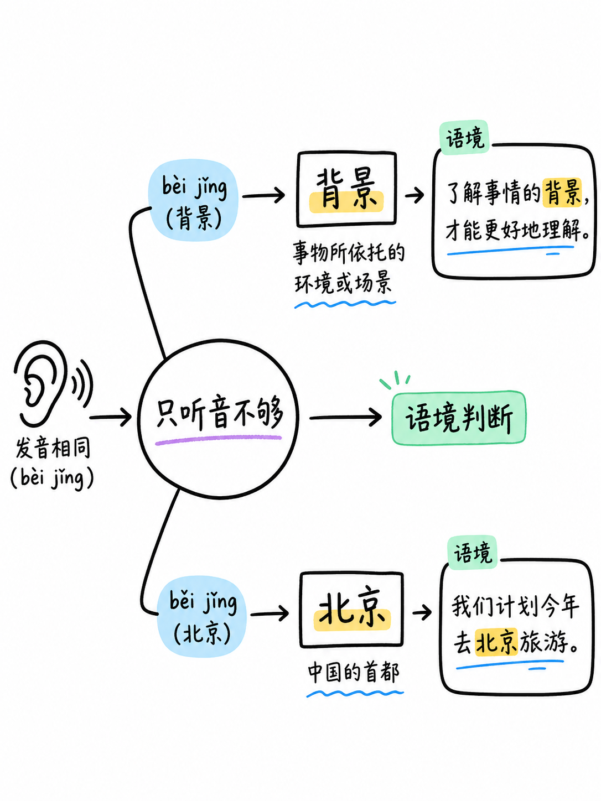

图解：同音词语义判别：根据句子语境消除发音相同但含义完全不同的歧义词。

## 规则匹配 vs 神经网络：谁来改

工程上常见的答案不是二选一，而是分层协作。

规则匹配适合固定词表和确定格式，比如把常见误写统一换成产品名，快、稳、好追溯。神经网络更擅长看整句语义，能补标点、重排断句，也能在多个同音词里选更合理的那个。

但模型可能过度润色，所以更稳的做法是先用规则守住术语，再让模型做语义优化，最后对关键内容人工复核。

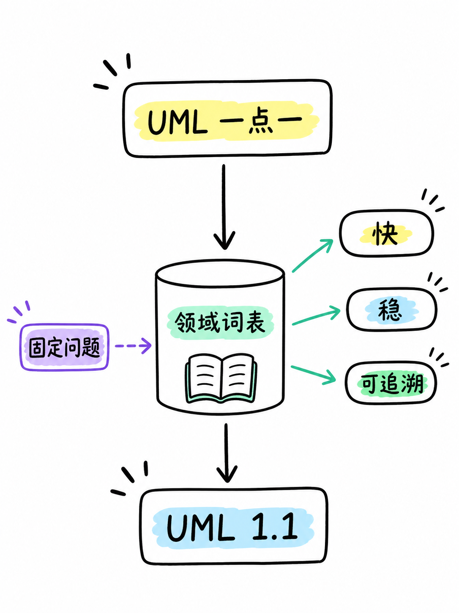

图解：基于规则与领域词典纠错：确定性高、执行速度快、专有名词零容忍保障。

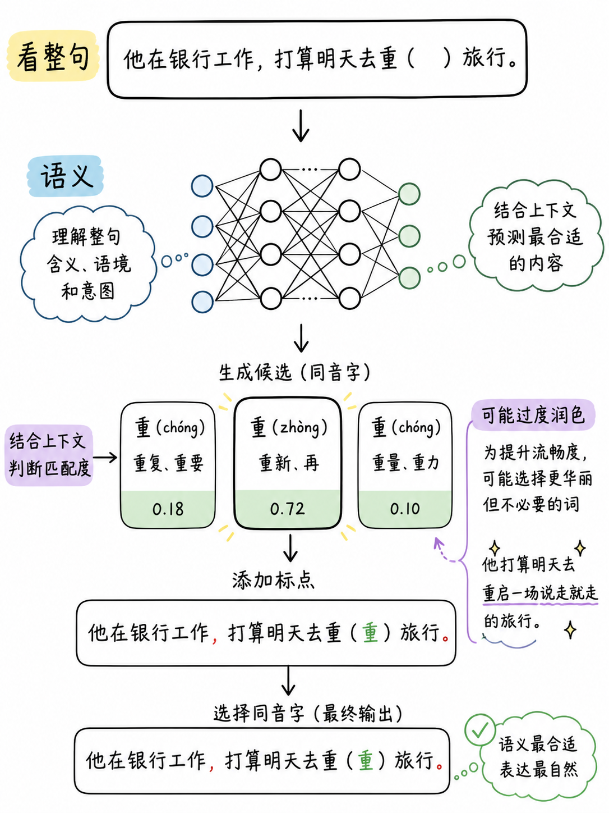

图解：神经网络上下文润色：理解全局句式语义，但需警惕过度脑补与事实改变。

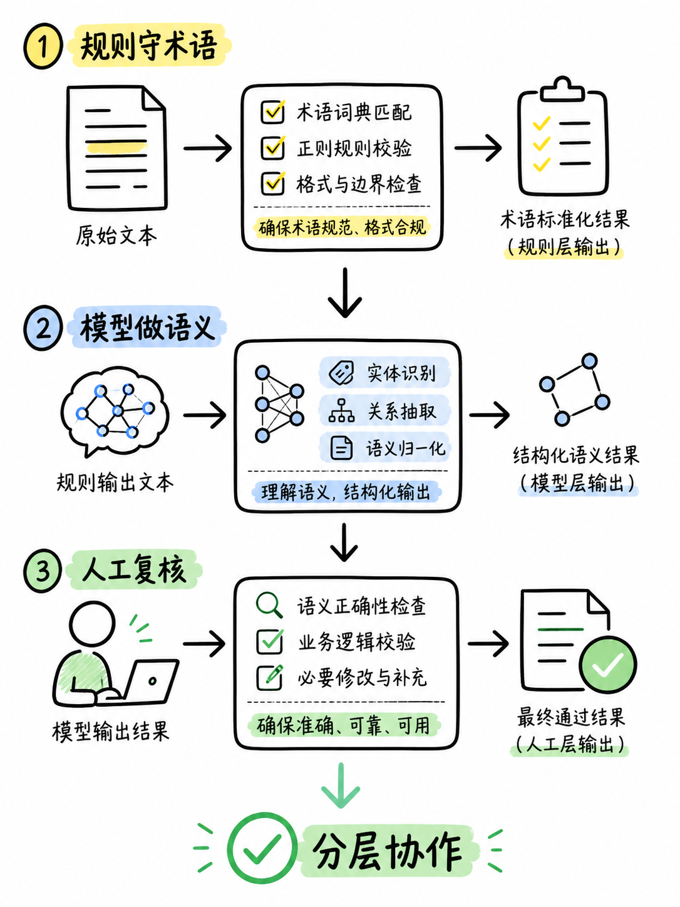

图解：分层混合纠错方案：词典规则锁定术语，大模型润色句意，关键事实人工复核。

## 三个典型案例：从“能看”到可发布

纠错不是把句子写漂亮，而是把事实保住、把意思说清。

案例一，数字和专名先查词表，比如“UML 一点一”不能被改成听起来相近的普通词。案例二，先按停顿和连接词补标点，再检查主语、动作和结果有没有被断开。

案例三，同音词不能只靠相似字音，要用领域词表、句法和上下文联合判断；不确定时宁可标记待审。

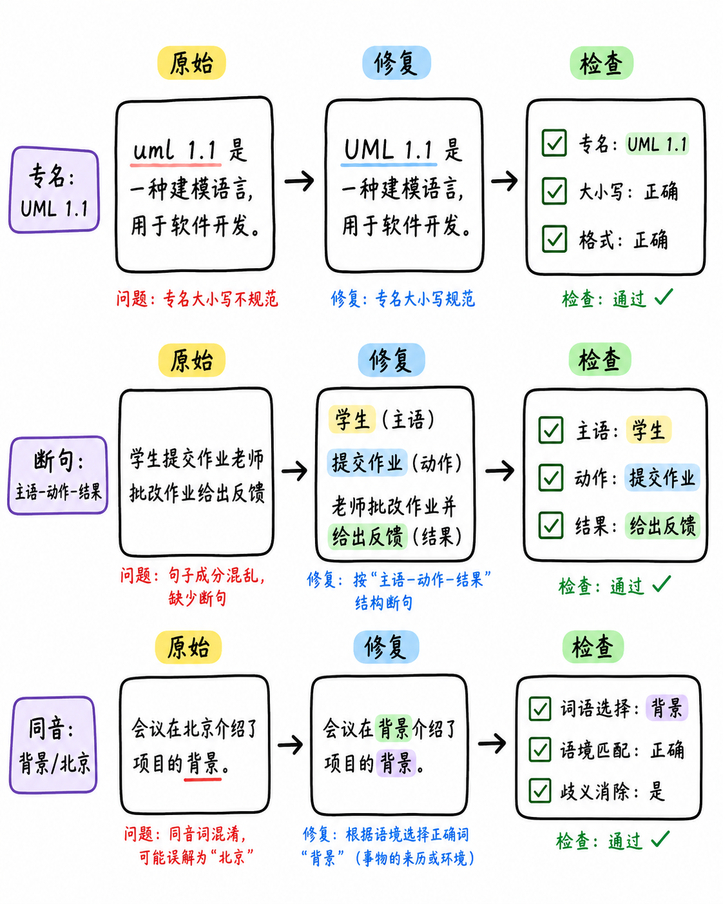

图解：典型纠错对照：专名映射、断句重组与同音修正的实际处理效果。

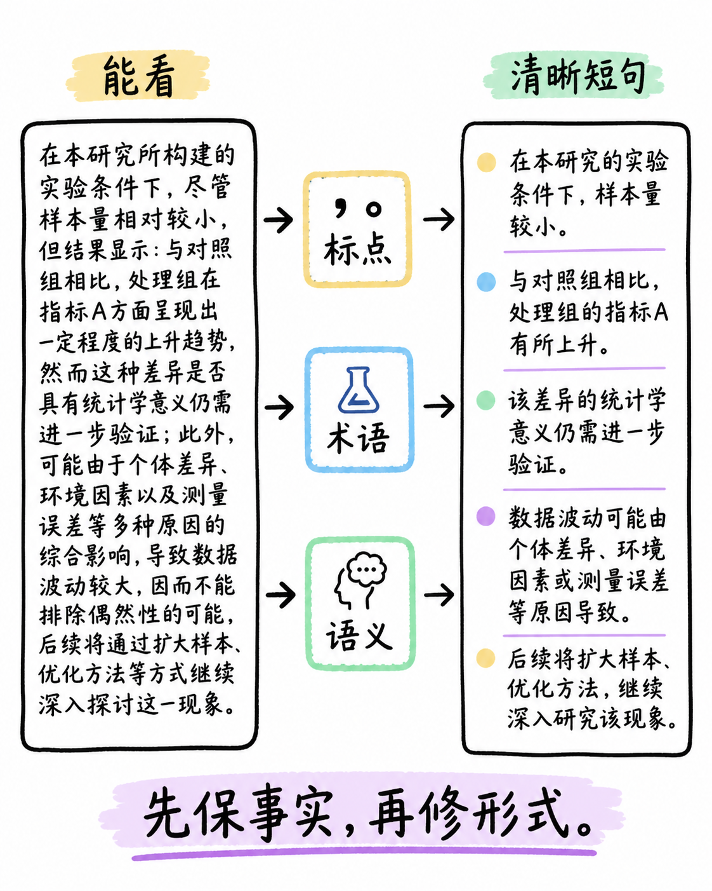

图解：转写优化原则：优先保障核心事实准确，再逐步修正标点与行文形式。

## 方言怎么处理？把数据和策略补齐

没有代表性的语音数据，模型就很难稳定覆盖真实口音。

方言处理的第一步，是收集目标地区、说话速度、设备和噪声都真实的语音，并配上人工转写。第二步先评估错误类型，再决定加领域词表、短语提示、发音数据，还是训练更贴近场景的定制模型。

最后把原始转写、纠错结果和人工抽检分开记录：ASR负责提供证据，编辑负责确认事实，文本优化负责让人读得顺。

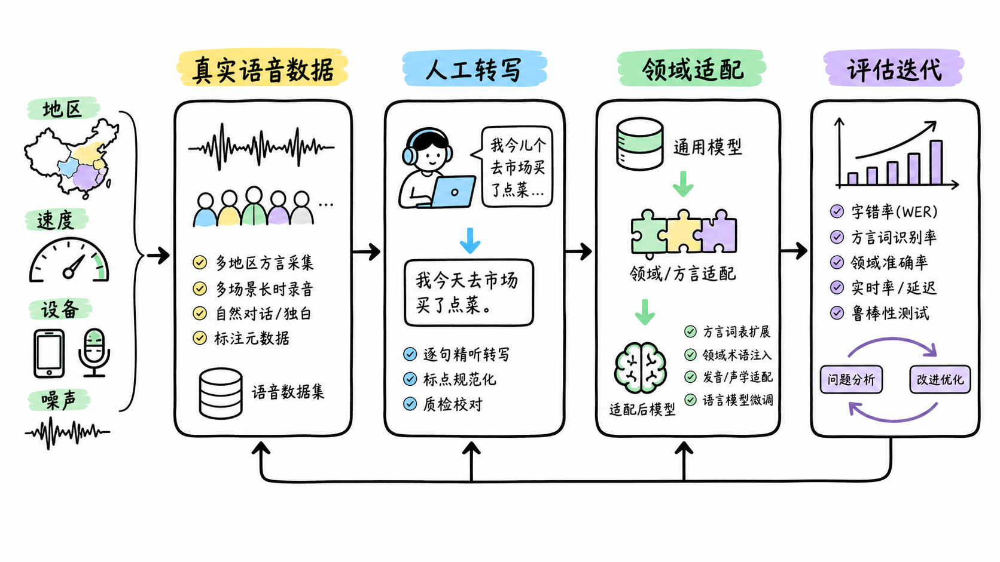

图解：方言与口音适配全景：采集真实声学数据、定制声学模型与领域词表微调。

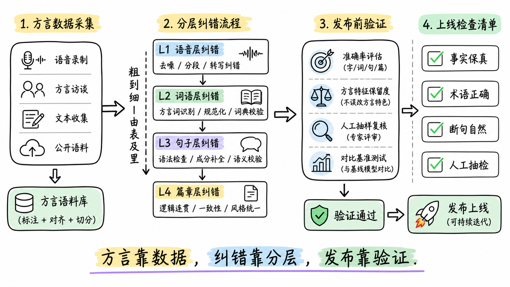

图解：语音文本交付清单：事实保真、术语准确、停顿自然与定期人工抽检。

## 小结

把问题拆成目标、约束、证据和验证四部分，通常比直接寻找唯一答案更可靠。先用本文的框架完成一次小范围验证，再根据真实反馈调整下一步。

## 参考资料

以下链接来自原始课程研究笔记；动态信息请以其当前页面为准。

- [https://en.wikipedia.org/wiki/Speech_recognition](https://en.wikipedia.org/wiki/Speech_recognition)
- [https://en.wikipedia.org/wiki/Word_error_rate](https://en.wikipedia.org/wiki/Word_error_rate)
- [https://www.ibm.com/think/topics/speech-recognition](https://www.ibm.com/think/topics/speech-recognition)
- [https://public.dhe.ibm.com/software/pervasive/info/products/Introduction_to_Speech_Recognition.pdf](https://public.dhe.ibm.com/software/pervasive/info/products/Introduction_to_Speech_Recognition.pdf)
- [https://learn.microsoft.com/en-us/azure/ai-services/speech-service/custom-speech-overview](https://learn.microsoft.com/en-us/azure/ai-services/speech-service/custom-speech-overview)
- [https://learn.microsoft.com/azure/ai-services/speech-service/improve-accuracy-phrase-list](https://learn.microsoft.com/azure/ai-services/speech-service/improve-accuracy-phrase-list)
- [https://learn.microsoft.com/en-ie/azure/ai-services/speech-service/how-to-custom-speech-test-and-train](https://learn.microsoft.com/en-ie/azure/ai-services/speech-service/how-to-custom-speech-test-and-train)
- [https://arxiv.org/abs/2111.10746](https://arxiv.org/abs/2111.10746)
- [https://arxiv.org/abs/2104.10747](https://arxiv.org/abs/2104.10747)
- [https://arxiv.org/abs/2111.08400](https://arxiv.org/abs/2111.08400)
- [https://arxiv.org/abs/2308.03423](https://arxiv.org/abs/2308.03423)
