# Caddy、Apache、Nginx，怎么选？

> 对应短视频主题：Caddy、Apache、Nginx，怎么选？  
> 资料核验与更新：2026-09-12

这是一篇根据原始课程研究资料、讲解结构与发布文案整理的读者版图文。

## 阅读边界

本文依据原始课程的研究笔记、课程结构和发布文案整理。涉及产品、模型、版本、平台规则、价格或资格等可能变化的信息，实践前应以当前官方资料和实际环境为准。

## Web 服务器：到底做什么？

请求进入 · 文件返回 · 后端转发

Caddy、Apache 和 Nginx 都能当 Web 服务器，但它们的设计思路和适用场景并不一样。今天我们用最直白的方式，看看它们到底该怎么选。浏览器发来请求，服务器可以直接返回 HTML、样式和图片等静态文件。

如果请求需要业务计算，服务器就把它转给后端应用，这个入口角色叫反向代理。

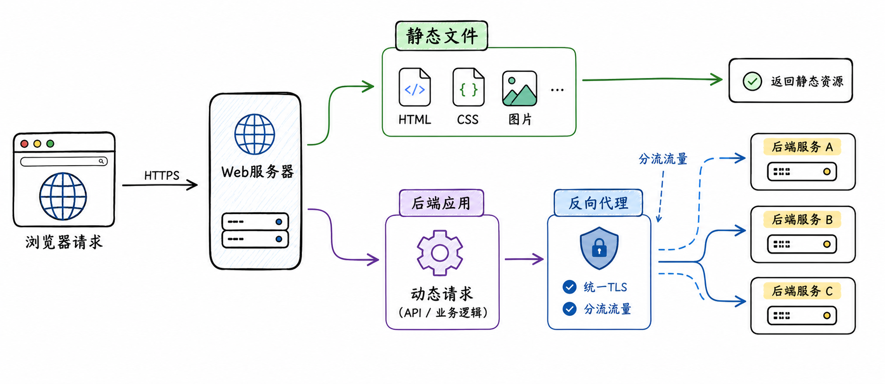

图解：Web 服务器核心职责：连接处理、静态资源交付、反向代理与 TLS 终结。

## Apache：成熟的模块化路线

1995 起步 · 模块生态 · 多处理模型

Apache HTTP Server 的故事始于 1995 年，开发者把 NCSA httpd 的修复和改进汇成共同版本。它后来形成成熟的模块体系，认证、重写、代理、虚拟主机和日志都能按需组合。

Apache 还能选择多进程、多线程或事件处理模型，优点是灵活，代价是配置和排障更复杂。

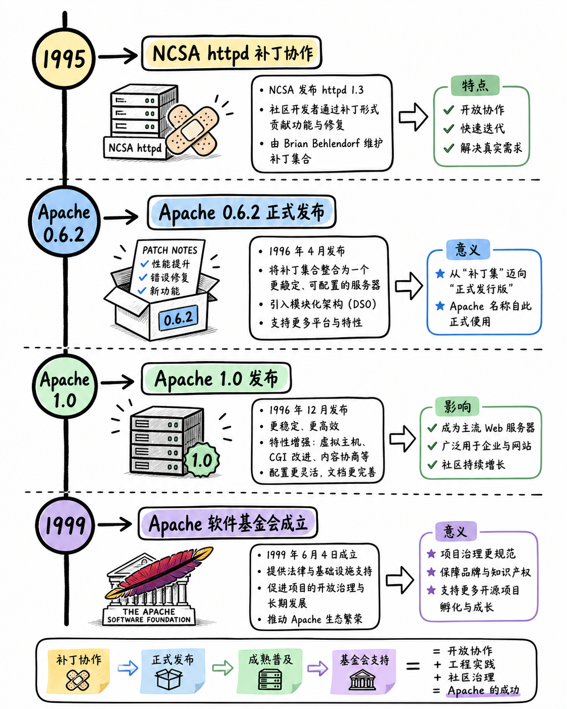

图解：Apache HTTP Server 演进史：进程/线程并发模型与稳定可靠的企业级积淀。

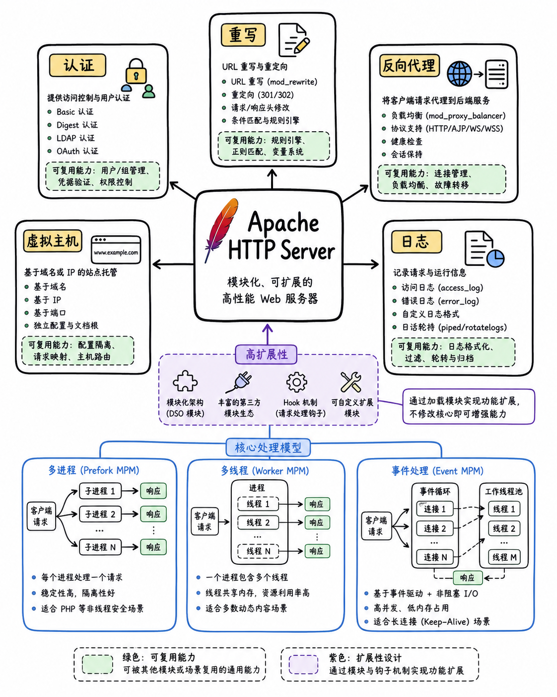

图解：Apache 模块化架构：丰富的多处理模块（MPM）与动态功能扩展机制。

## Nginx：为连接规模换一条路

C10K 背景 · 事件驱动 · 负载均衡

Nginx 在 2000 年代初面对的是 C10K 问题，也就是同时处理大量连接的挑战。它采用事件驱动和非阻塞思路，用较少的工作单元管理许多连接，减少等待带来的浪费。

因此 Nginx 常被放在应用前面，负责静态文件、反向代理、缓存和负载均衡。

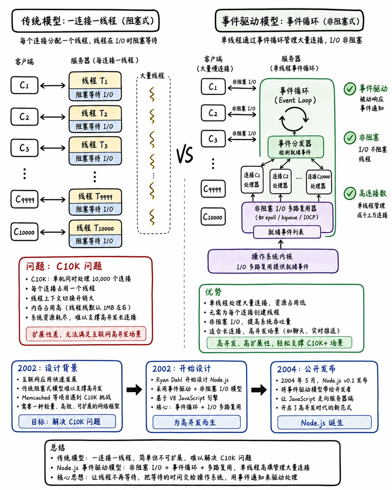

图解：Nginx 的诞生与破局：事件驱动非阻塞架构应对 C10K 高并发连接挑战。

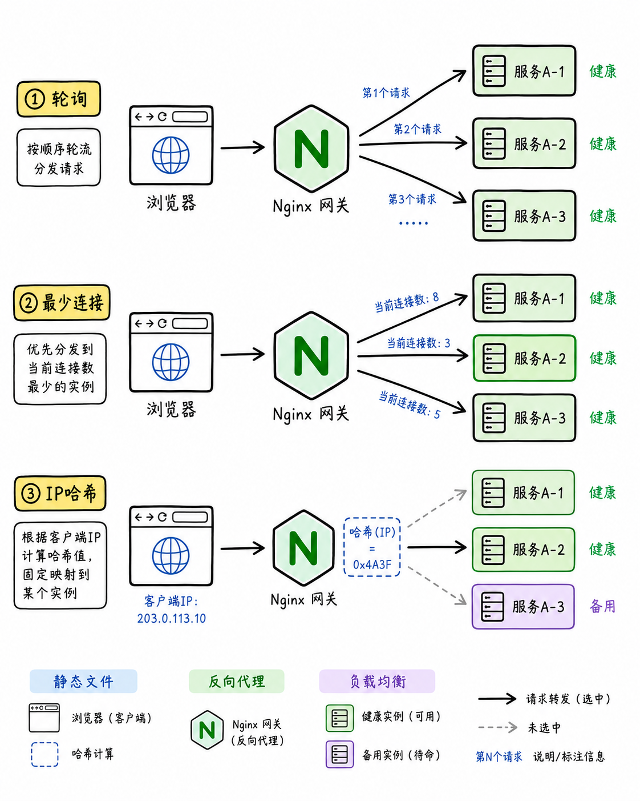

图解：Nginx 反向代理与负载均衡拓扑：统一网关路由、动静分离与后端解耦。

## Caddy：把安全默认值前置

Caddyfile · 自动 HTTPS · 简洁部署

Caddy 从 2015 年起把现代 Web 的安全体验放到产品前台，配置也尽量贴近站点意图。Caddyfile 通常从域名开始，再写 file_server 或 reverse_proxy 这样的配置指令。

更有辨识度的是自动 HTTPS：它能申请和续期证书，并把 HTTP 请求重定向到 HTTPS。

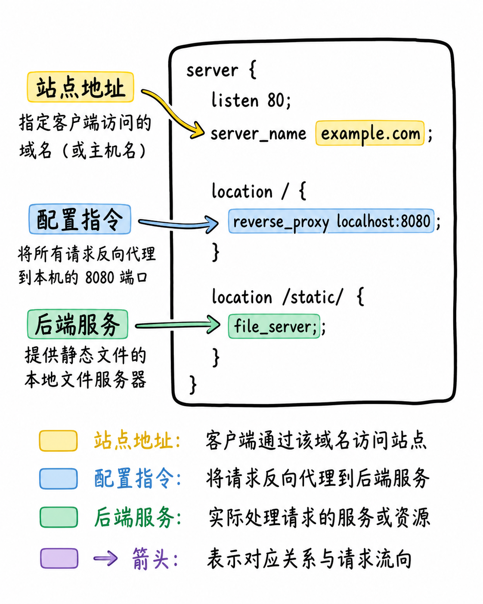

图解：Caddy 极简配置（Caddyfile）：声明式语法与自动化默认最佳实践。

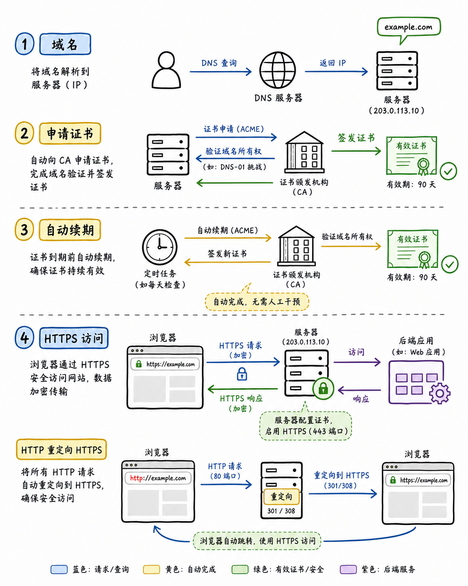

图解：Caddy 自动 HTTPS 证书管理：集成 ACME 协议与自动化申请、续期与挂载。

## 三者对比：别只问谁更快

优势 · 代价 · 适用边界

看重成熟模块、灵活规则和既有团队经验，Apache 的长期资产很有价值。看重大量连接、静态分发和多实例代理，Nginx 的架构习惯通常更贴近目标。

看重自动 HTTPS、简洁配置和快速上线，Caddy 往往能减少首次运维成本。

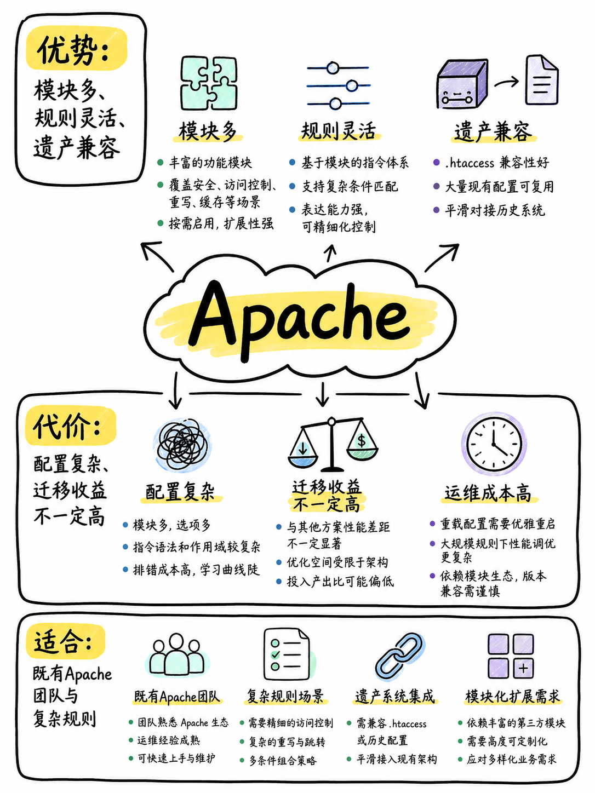

图解：Apache 适用定位：依赖 .htaccess 灵活目录配置与传统老旧应用托管。

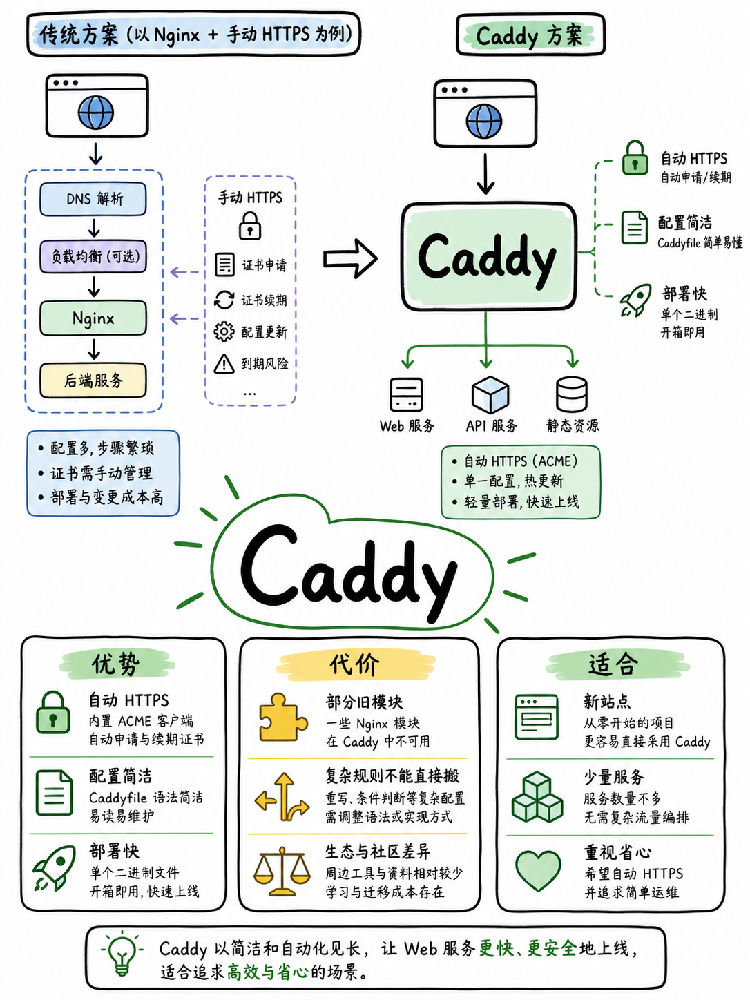

图解：Caddy 适用定位：个人项目、现代微服务与追求免维护 HTTPS 的敏捷场景。

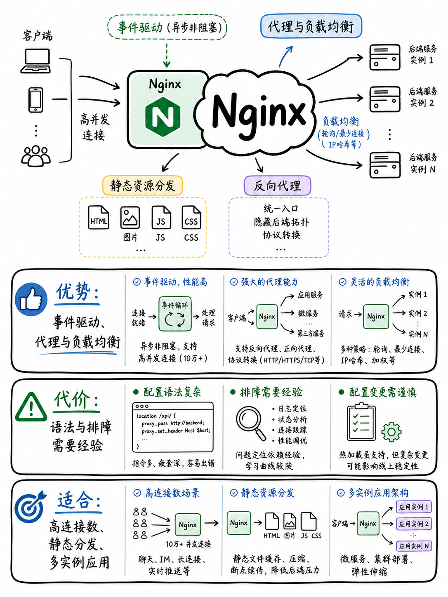

图解：Nginx 适用定位：高并发流量入口、核心反向代理与成熟生产级网关集群。

## 最后：按场景做选择

遗产 · 流量 · 上线成本，先看约束

已有 Apache 模块、规则和运维经验，就先评估迁移成本，不要为了追潮流重写一切。面向大量连接、静态资源和多实例应用，可以优先评估 Nginx 的代理与负载均衡能力。

新建小型站点，最在意自动 HTTPS 和少量配置，可以先试 Caddy。所以，遗产看 Apache，流量看 Nginx，上线省心看 Caddy；最后用同一套压测、日志和监控验证答案。

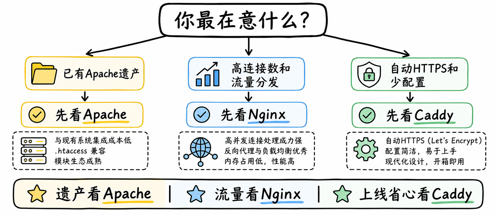

图解：Web 服务器选型决策路径：按并发规模、运维复杂度与自动化需求做决定。

## 小结

把问题拆成目标、约束、证据和验证四部分，通常比直接寻找唯一答案更可靠。先用本文的框架完成一次小范围验证，再根据真实反馈调整下一步。

## 参考资料

> 📌 **查阅提示**：点击下方超链接可直接复制对应网址，粘贴至手机或电脑浏览器中即可查阅官方完整技术文档与规范。

- [【Apache 官方文档】Apache HTTP Server 架构与核心概念](https://httpd.apache.org/docs/current/en/)  
  *说明：Apache 官方文档，详细介绍多处理模块（MPM）、目录级别配置与企业级模块化生态。*
- [【Nginx 官方博客】Nginx 架构演进二十年与事件驱动模型](https://blog.nginx.org/blog/celebrating-20-years-of-nginx)  
  *说明：回顾 Nginx 如何以单线程异步非阻塞事件驱动模型化解 C10K 高并发连接危机。*
- [【Nginx 官方指南】HTTP 负载均衡与反向代理最佳实践](https://nginx.org/en/docs/http/load_balancing.html)  
  *说明：官方指导反向代理网关搭建、轮询/加权调度算法与后端健康检查配置。*
- [【Caddy 官方文档】Caddy Web Server 架构概览与核心特性](https://caddyserver.com/docs/)  
  *说明：Caddy 官方手册，展示现代 Go 语言编写的高性能 Web 服务器整体能力。*
- [【Caddy 官方文档】Automatic HTTPS 自动证书申请与续期机制](https://caddyserver.com/docs/automatic-https)  
  *说明：深入解析 Caddy 如何通过 ACME 协议与 Let's Encrypt 达成 100% 自动化的 TLS 证书生命周期管理。*
- [【Caddy 官方文档】Caddyfile 声明式反向代理指令（reverse_proxy）](https://caddyserver.com/docs/caddyfile/directives/reverse_proxy)  
  *说明：极简一行配置实现高可用微服务反向代理、负载均衡与 WebSocket 穿透。*
- [【MDN 权威指南】什么是 Web 服务器？工作原理与底层协议](https://developer.mozilla.org/en-US/docs/Learn_web_development/Howto/Web_mechanics/What_is_a_web_server)  
  *说明：Mozilla 官方教学指南，系统拆解 HTTP 连接、文件系统映射与网关中转机制。*
