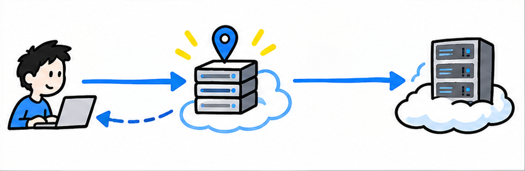
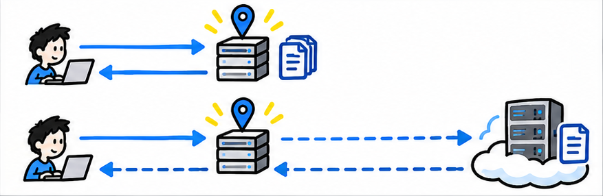
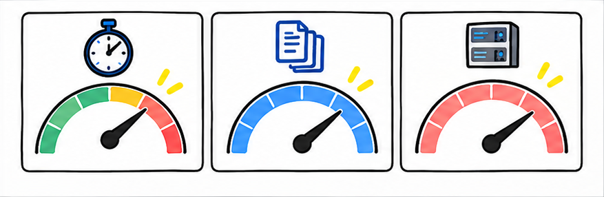

# CDN 都加速了，为什么网站有时候反而更慢？

从缓存命中、缓存键、回源路径到诊断指标，完整看懂 CDN 偶发变慢的原因。

## 阅读边界

本文依据原始课程的研究笔记、课程结构和发布文案整理。涉及产品、模型、版本、平台规则、价格或资格等可能变化的信息，实践前应以当前官方资料和实际环境为准。
原始研究记录标注的时间为：2026-08-25。
该课程原始包被归为“仅保留源资料”；本文只根据现有文字材料整理，不把它表述为已完成的视频成片。
本页配图为依据正文新绘的 AI 辅助教学示意图；它们并非原始课程包内的素材，也不代表原始成片画面。

## CDN 是机会，不是速度保证

内容分发网络把边缘节点放在用户和源站之间。

CDN，也就是内容分发网络，本质上是在用户和源站之间增加一层边缘节点。它不会把网络变成直线，只是让一部分内容有机会从更近的位置交付。

当边缘带来的收益小于额外处理和转发成本，某些请求就可能反而更慢。

## 先看请求走了哪条路

很多 CDN 会用四种常见状态描述缓存结果。

关键分界是缓存命中，也就是边缘节点已经有可以直接使用的内容副本。HIT 表示边缘直接返回缓存，通常不需要等待源站。

MISS 表示边缘没有现成副本，请求还要回到源站再取一次。BYPASS 表示这次不缓存，EXPIRED 表示缓存已过期，两种情况也可能等待源站。

## 为什么命中率会掉下来？

整体快不快，取决于多少请求能留在边缘。

缓存命中率，就是有多少可缓存请求由边缘节点直接回答。缓存可以直接使用的时间太短，边缘就会更频繁地联系源站。

缓存键，也就是区分副本的规则，如果塞进过多查询参数、Cookie 或请求头，同一份内容就会被拆成许多版本。动态页面、私有数据和不同边缘节点的冷缓存，也会让回源比例升高。

## 缓存之外，还有路径与源站

边缘节点选得不理想，或者源站很慢，等待仍会累积。

还有一类慢，与缓存是否命中无关，而是请求被送到了哪里。域名解析，就是把网站名称映射到服务器地址，CDN 常用它来选择边缘节点。

但路由上的最近，不一定等于实际延迟最低，节点负载也可能变化。一旦缓存未命中，边缘到源站的距离和拥塞还会加入总等待。

源站本身处理得慢，CDN 只能转发这份慢，无法凭空消除处理时间。

## 怎么判断，怎么优化？

先用数据拆路径，再让缓存策略匹配真实内容。

排查时，先把一个慢请求拆成边缘之前、边缘内部和回源三段。先看缓存状态和 Age；Age 也就是缓存响应的估算年龄，可以帮助判断是否复用了旧副本。

再看缓存命中率和回源等待时间，把快的 HIT 与慢的 MISS 分开比较。优化时，静态和动态内容分开配置，缓存键只保留真正改变响应的字段，并设置合理的缓存时间。

最后仍要优化源站和链路，因为 CDN 是放大器，不是速度保证。

## 小结

把问题拆成目标、约束、证据和验证四部分，通常比直接寻找唯一答案更可靠。先用本文的框架完成一次小范围验证，再根据真实反馈调整下一步。

## 参考资料

以下链接来自原始课程研究笔记；动态信息请以其当前页面为准。

- [https://en.wikipedia.org/wiki/Content_delivery_network](https://en.wikipedia.org/wiki/Content_delivery_network)
- [https://www.rfc-editor.org/rfc/rfc9111.html](https://www.rfc-editor.org/rfc/rfc9111.html)
- [https://www.rfc-editor.org/rfc/rfc9211.html](https://www.rfc-editor.org/rfc/rfc9211.html)
- [https://www.rfc-editor.org/rfc/rfc3568.html](https://www.rfc-editor.org/rfc/rfc3568.html)
- [https://docs.aws.amazon.com/AmazonCloudFront/latest/DeveloperGuide/ConfiguringCaching.html](https://docs.aws.amazon.com/AmazonCloudFront/latest/DeveloperGuide/ConfiguringCaching.html)
- [https://docs.aws.amazon.com/AmazonCloudFront/latest/DeveloperGuide/cache-hit-ratio.html](https://docs.aws.amazon.com/AmazonCloudFront/latest/DeveloperGuide/cache-hit-ratio.html)
- [https://docs.aws.amazon.com/AmazonCloudFront/latest/DeveloperGuide/understanding-the-cache-key.html](https://docs.aws.amazon.com/AmazonCloudFront/latest/DeveloperGuide/understanding-the-cache-key.html)
- [https://docs.aws.amazon.com/AmazonCloudFront/latest/DeveloperGuide/programming-cloudwatch-metrics.html](https://docs.aws.amazon.com/AmazonCloudFront/latest/DeveloperGuide/programming-cloudwatch-metrics.html)
- [https://developers.cloudflare.com/cache/concepts/cache-responses/](https://developers.cloudflare.com/cache/concepts/cache-responses/)
- [https://developers.cloudflare.com/cache/concepts/cache-control/](https://developers.cloudflare.com/cache/concepts/cache-control/)
