# ChatGPT Images 2.5：可控图像创作工作流

> 对应短视频主题：ChatGPT Images 2.5：可控图像创作工作流  
> 资料核验与更新：2026-09-12

可控图像创作的重点不只是一次性生成令人惊艳的单幅画面，而是把参考图、草图、局部编辑、多轮修订与人工验收组织为可复用、可审计的工程化工作流。无论模型能力如何，文字准确、主体一致和局部修改不影响全图，仍需要用具体结果验证。

## 阅读边界

本文依据原始课程的研究笔记、课程结构和发布文案整理。涉及产品、模型、版本、平台规则、价格或资格等可能变化的信息，实践前应以当前官方资料和实际环境为准。

## 从一次性抽奖到可控迭代工作流

早期的文生图工具通常把提示词直接映射到生成画面，用户若对局部细节不满意，往往只能重新抽卡，造成创作效率低下且难以保留满意部分。现代可控图像创作则将创作流程分化为阶段性输入：锁定主体、参考样式、多轮局部重绘，使每次修改都有据可循。

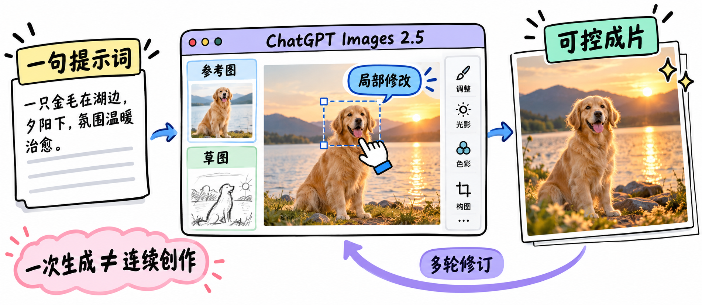

图解：可控图像创作工作台：整合参考图、文本提示、精准局部编辑与最终复核验收。

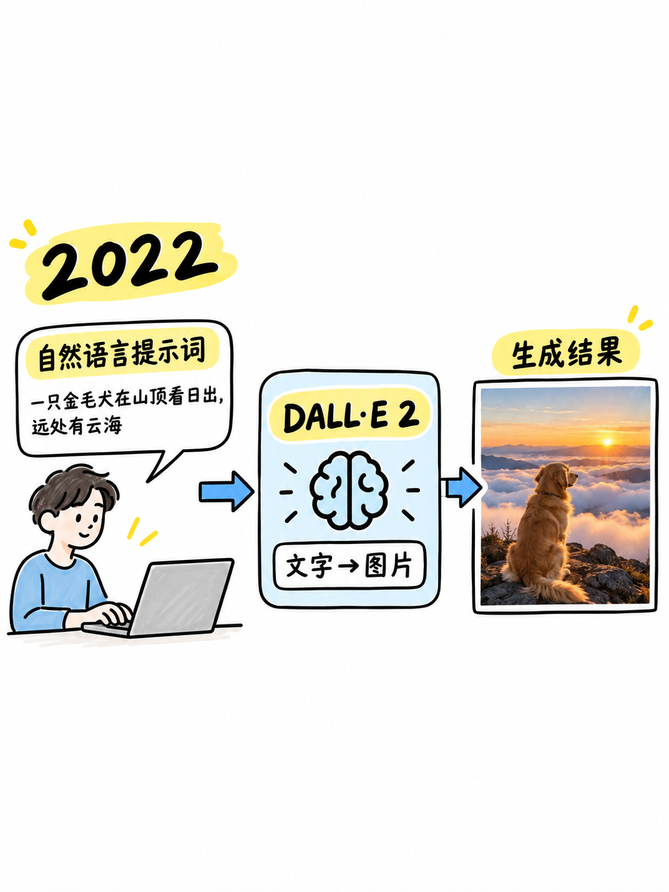

图解：早期图像生成模式：单次抽卡式生成，局部微调难以精确保留已有画面结构。

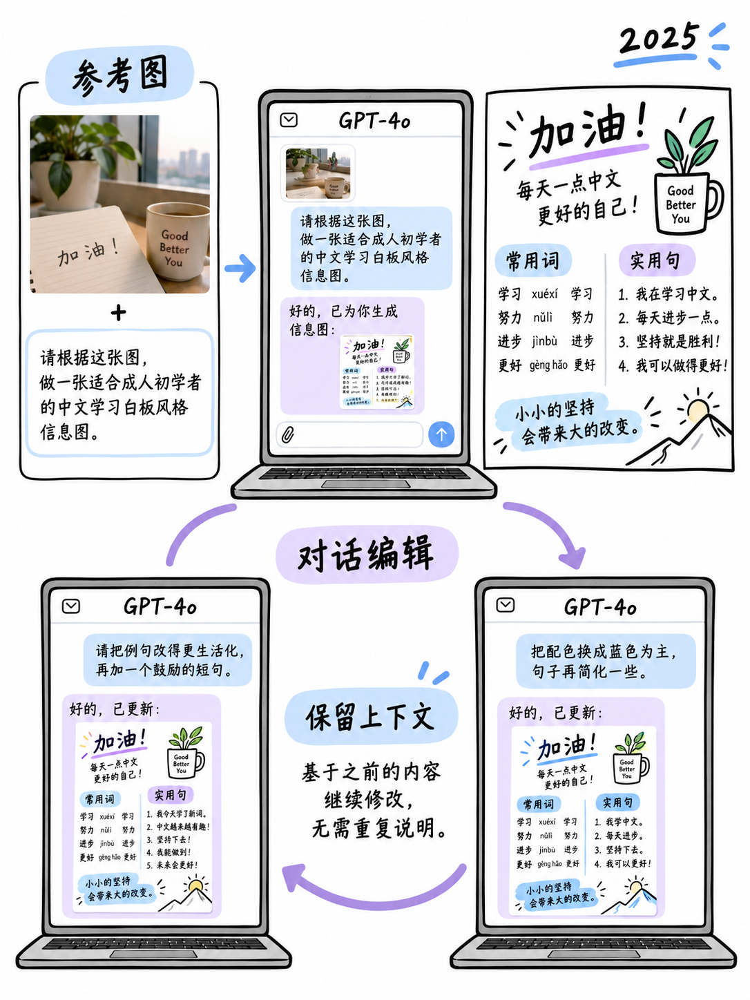

图解：多模态对话引导：通过自然语言上下文持续沟通与多轮修正画面细节。

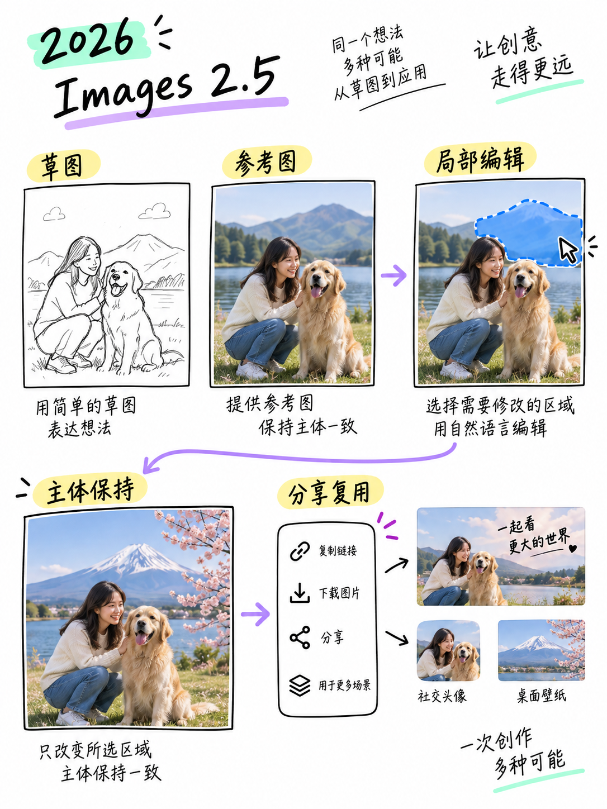

图解：Images 2.5 核心逻辑：以结构化参考与精细化修订为导向的可控创作机制。

## 局部编辑与主体一致性控制

商业设计中最核心的诉求是主体一致性与局部精确修改。局部编辑（Inpainting）允许创作者圈定特定区域并指明修改意图，严格锁死未选区域的像素与结构；而主体一致性控制则确保同一角色或产品在不同视角、姿态和光影下始终保持视觉特征统一。

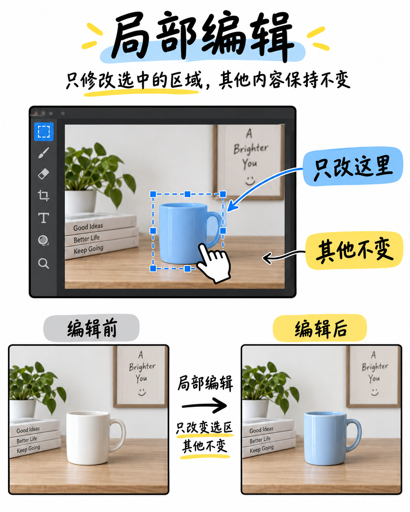

图解：局部精准编辑：锁定非修改区域，仅在指定遮罩内重绘特定属性与元素。

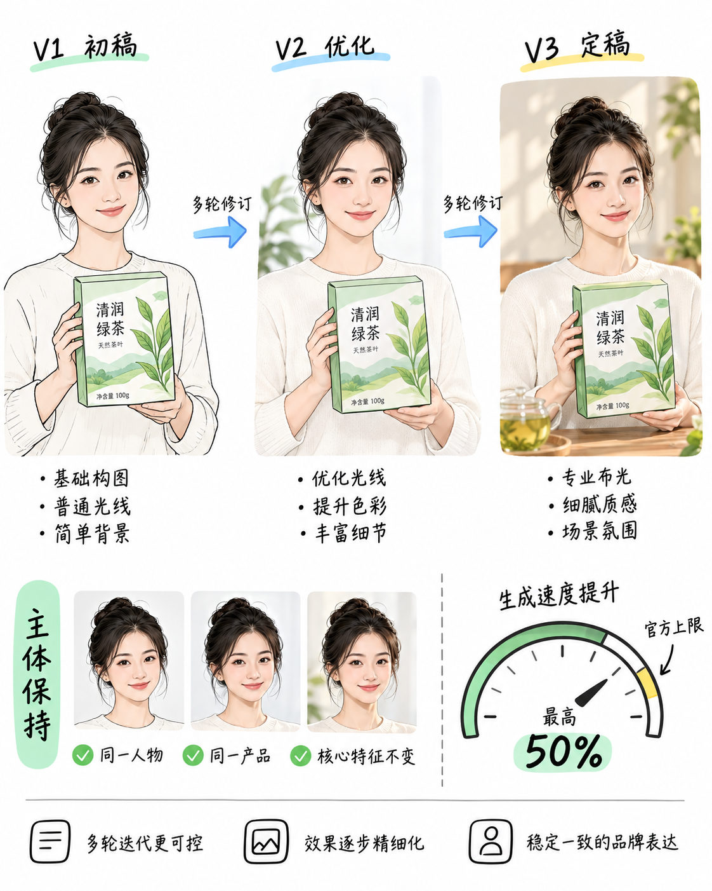

图解：主体一致性校验：对照参考图比对外形特征、配色方案、构图比例与文字准确度。

## 草图引导、模板复用与团队协同

通过提供简易线稿或构图草图作为空间约束，能极大降低模型对文字描述的理解偏差。同时，将成熟的品牌版式与视觉资产沉淀为可复用的构图模板，配合团队成员之间的批注与评审机制，才能构建出专业级视觉设计生产力流水线。

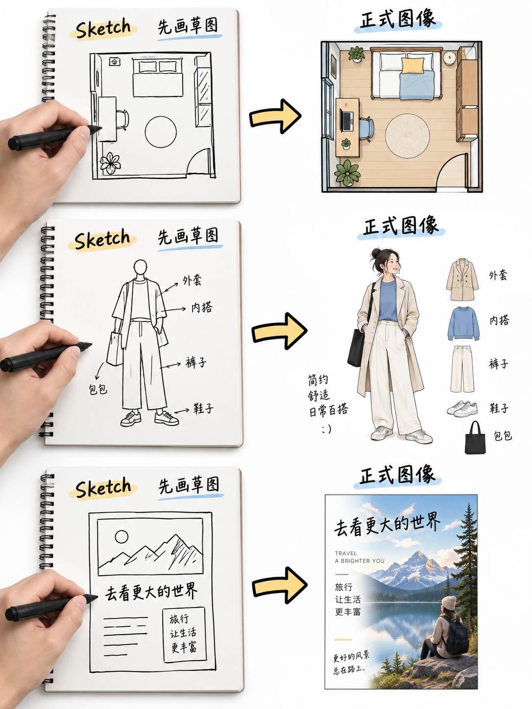

图解：草图约束输入：先以简明手绘线稿锁定空间构图，再由模型智能填充质感与细节。

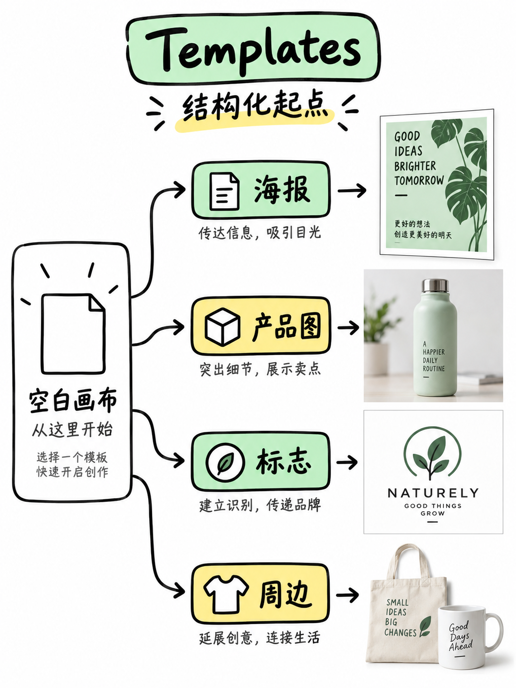

图解：视觉模板复用：沉淀品牌规范、版式结构与色彩系统，实现批次创作一致性。

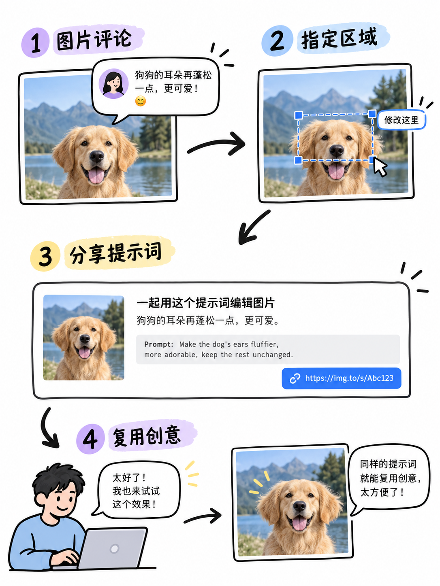

图解：多人协同流转：以结构化批注提出修改意见，保留历史版本实现高效迭代。

## 光影特效修饰与商业落地合规边界

添加光效、质感与背景装饰时，必须服从画面主体与信息可读性，避免喧宾夺主。在最终交付商业使用前，必须由人工严格核对文字拼写、人物肖像授权、版权素材使用边界及潜在违规风险，确保生成物符合商业交付标准。

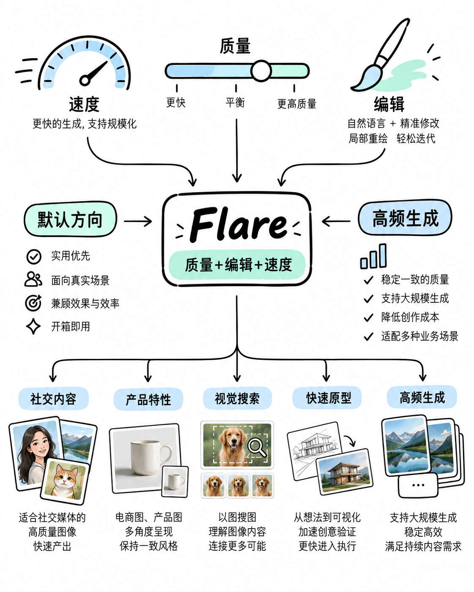

图解：光影特效协调：光照角度与环境渲染服从画面主体，保持视觉层级清晰。

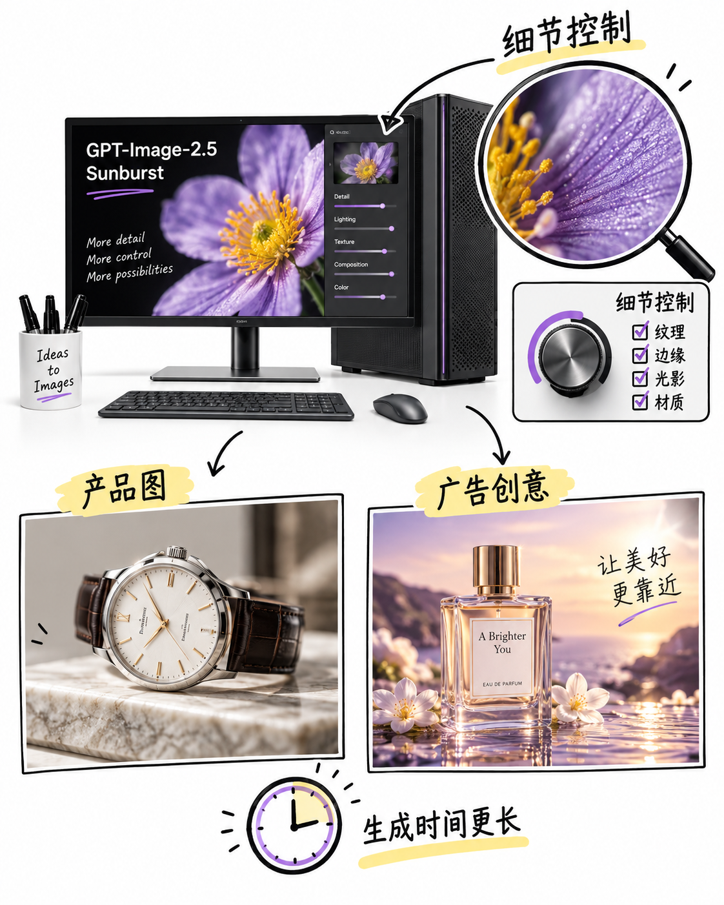

图解：背景置换示例：在更换局部装饰或背景时，严格防止误改主体轮廓与结构。

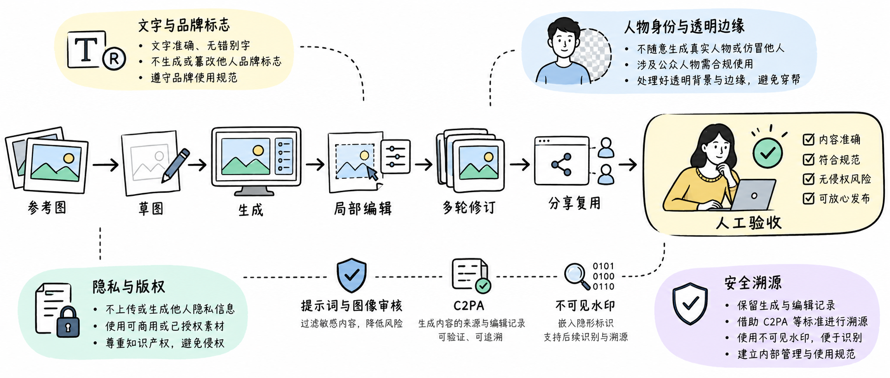

图解：商业交付验收边界：人工检查文本拼写、版权归属、肖像权合规与品牌使用规范。

## 小结

可控图像创作的核心不是依赖运气抽奖，而是通过草图约束、局部重绘、主体参考与模板沉淀，把生成式 AI 纳入可重复、可审查的设计工作流中。商业发布前必须经过严格的人工合规核验。

## 参考资料

以下链接来自官方权威技术文档与行业规范；动态规则请以其当前页面为准。

- [OpenAI DALL·E 3 / Images Documentation](https://platform.openai.com/docs/guides/images)
- [Stable Diffusion Inpainting Best Practices](https://huggingface.co/docs/diffusers/using-diffusers/inpaint)
- [W3C Design Token Community Group](https://www.w3.org/community/design-tokens/)
