# CI/CD 怎么选？GitHub Actions、GitLab CI 与 Jenkins 深度选型

> 对应短视频主题：CI/CD 怎么选？三条流水线  
> 资料核验与更新：2026-09-12

CI/CD 的核心不是争论哪款工具更流行，而是让每一次代码变更都能经过自动化编译、测试验证、容器镜像构建、环境部署与快速回滚的可审查闭环。GitHub Actions、GitLab CI/CD 与 Jenkins 的根本分歧，来自代码托管形态、团队运维控制力与私有化定制深度。

## 阅读边界

本文依据原始课程的研究笔记、课程结构和发布文案整理。涉及产品、模型、版本、平台规则、价格或资格等可能变化的信息，实践前应以当前官方资料和实际环境为准。

## CI/CD 核心流水线与交付链路

持续集成负责保障代码质量与构建制品；持续交付负责把经过验证的不可变制品安全发布到目标环境。一套健壮的流水线必须包含清晰的触发事件、独立的构建环境、可靠的制品库（Registry）以及在出现故障时能一键回退的历史版本保护机制。

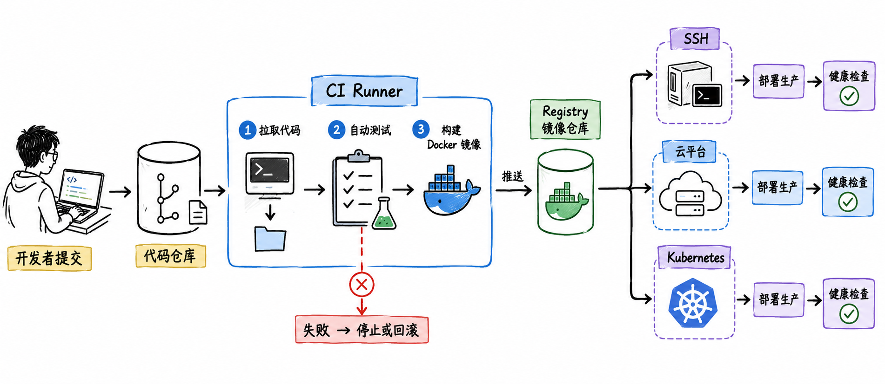

图解：CI/CD 持续交付总览：从代码提交、自动化测试、构建打包到生产部署与反馈。

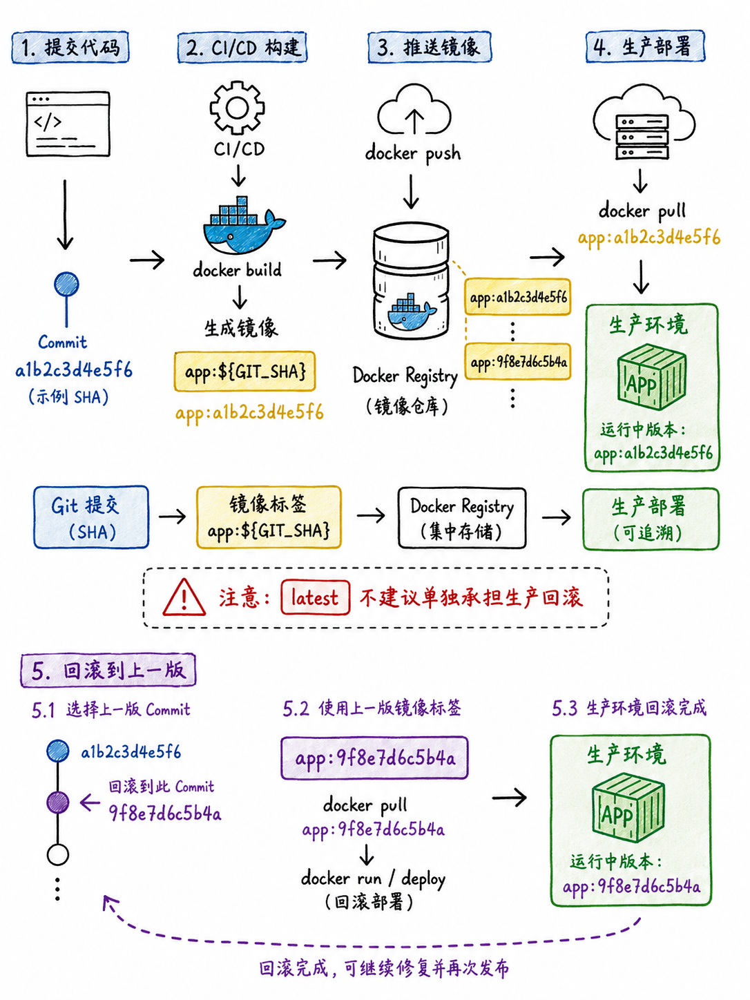

图解：核心流水线阶段：明确定义输入约束、阶段依赖、单元测试与失败阻断策略。

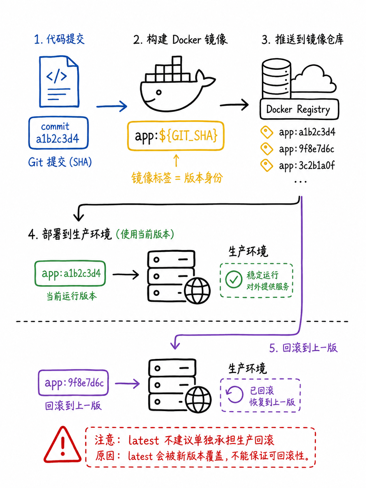

图解：不可变制品管理：语义化版本标签、镜像仓库准入与秒级回滚保障。

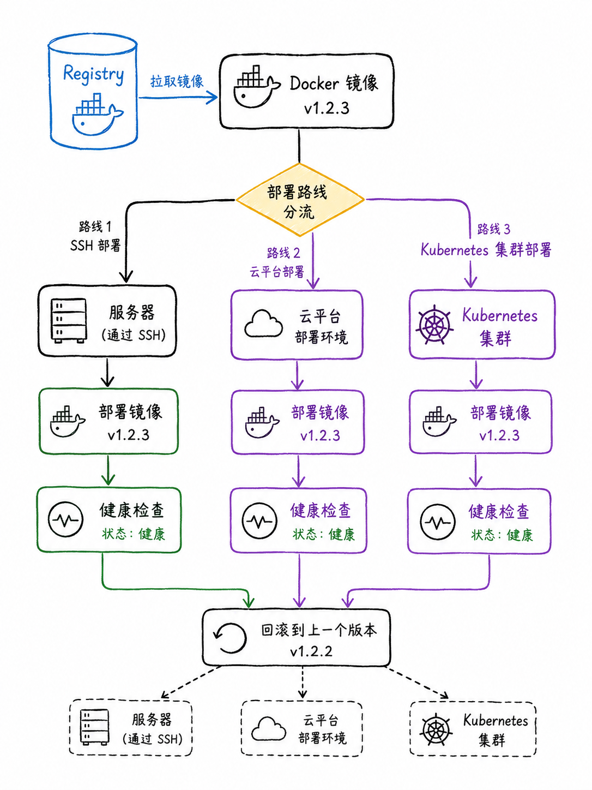

图解：多样化部署通道：支持 SSH 传统虚机、云厂商发布 API 与 Kubernetes 集群接入。

## 代码托管原生派：GitHub Actions 与 GitLab CI

如果代码已经托管在 GitHub 或 GitLab 上，原生集成的流水线通常能大幅减少网络穿透与认证配置成本。GitHub Actions 拥有庞大的开源社区生态与丰富的市场插件；GitLab CI/CD 则贯彻了完整的 DevOps 一体化平台哲学，通过一套统一的权限体系管理代码仓库、流水线与容器镜像库。

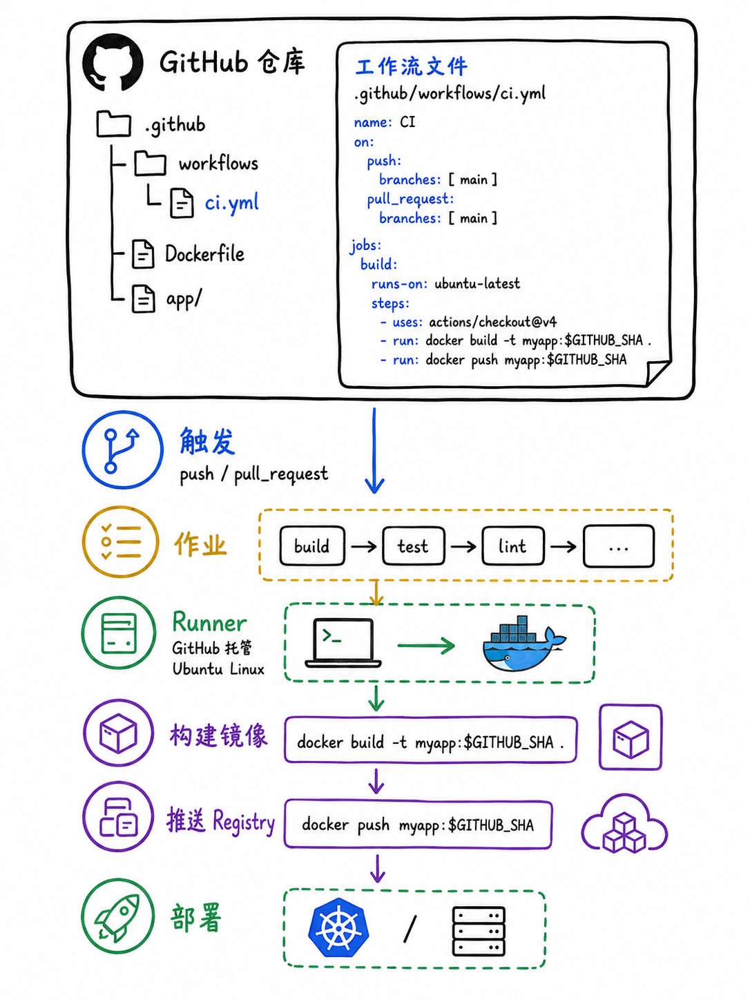

图解：GitHub Actions 原生集成：利用丰沛的开源 Action 市场与代码仓库事件无缝联动。

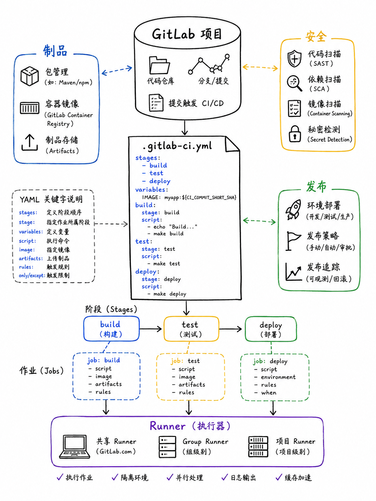

图解：GitLab CI/CD 一体化架构：单应用管理代码分支、Runner 编排与环境部署门禁。

## 自建私有化标杆：Jenkins 控制器与复杂定制

Jenkins 依然是内部私有云、异构遗留系统与高合规要求场景下的中流砥柱。其主从（Controller/Agent）分布式调度架构能够横跨 Windows、Linux、嵌入式设备等多架构物理机器，数千款插件几乎能与企业内任何遗留工具深度打通，但相应的插件升级与维护成本也最为沉重。

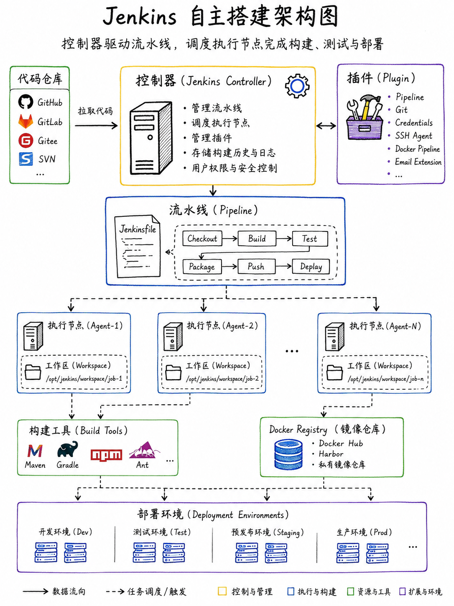

图解：Jenkins 主从分布式架构：Controller 统一调度、海量 Agent 分布式并发与插件生态。

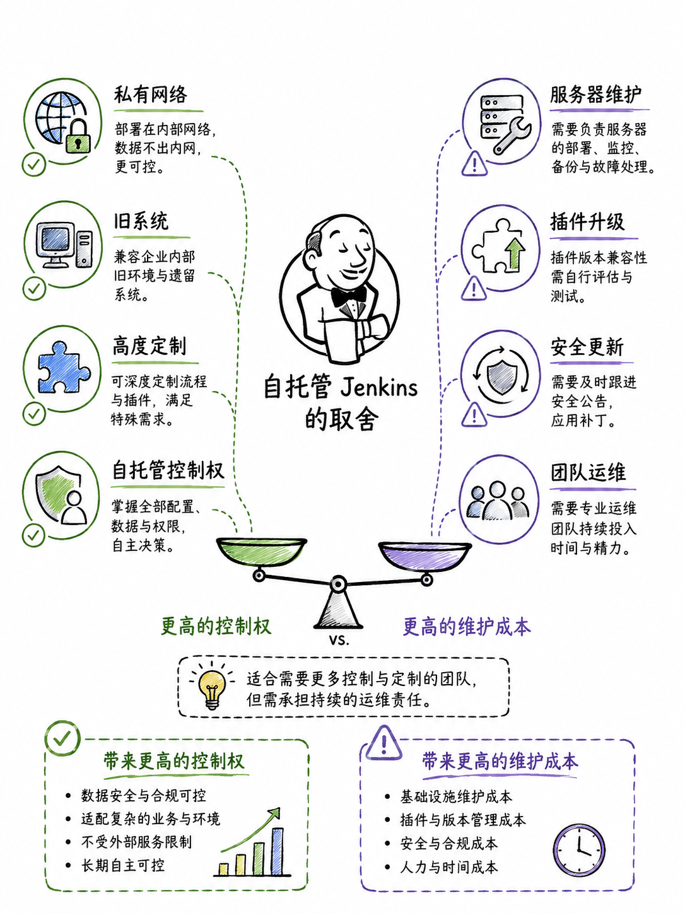

图解：私有化异构集成：适合企业内部隔离内网、物理机集群与定制编译硬件环境。

## 三维对比矩阵与生产发布护栏

选型时不仅要看功能列表，更要评估执行器（Runner/Agent）的资源隔离度、敏感凭据的安全作用域，以及生产部署时的审批卡点。生产环境发布必须配备环境隔离策略与人工双人核验机制，杜绝开发测试凭据越权访问生产集群。

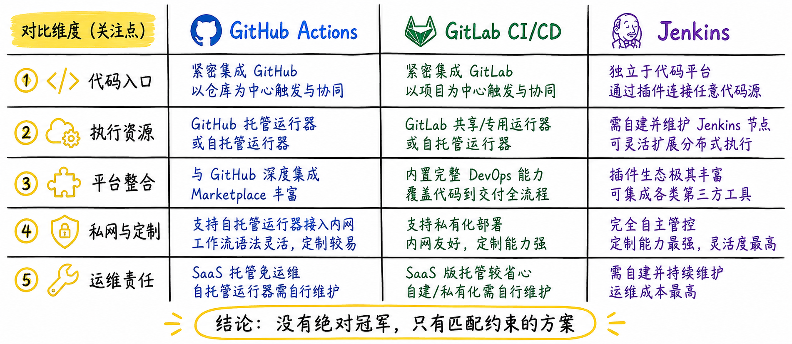

图解：三大流水线特性对比：托管形态、学习成本、生态丰富度与运维负担全景透视。

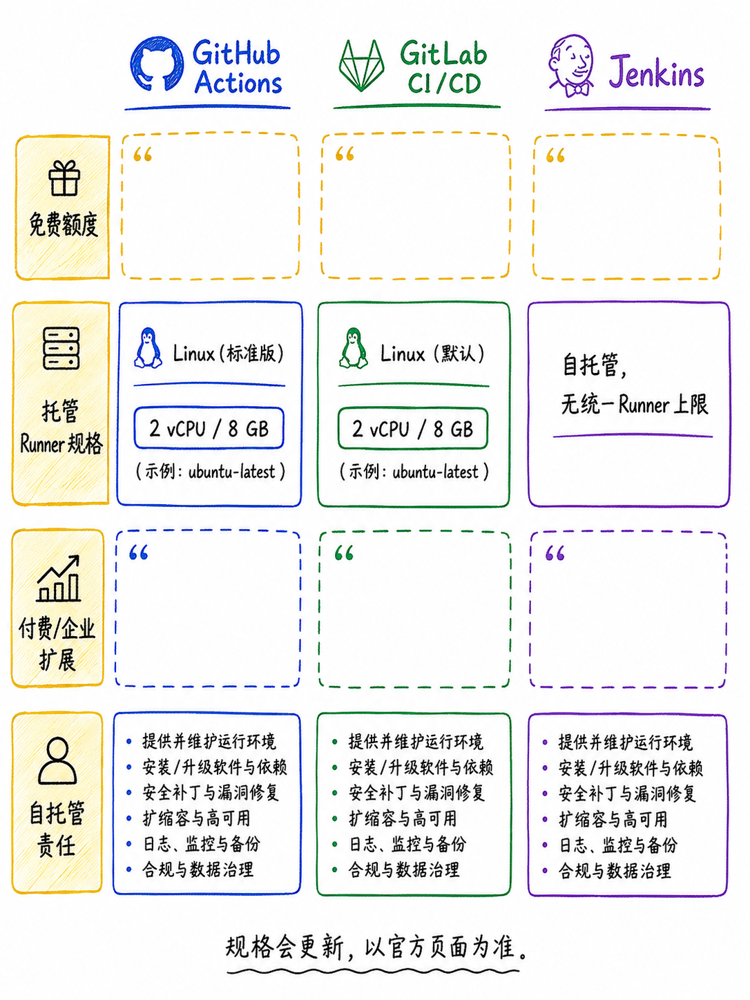

图解：Runner 资源管理：容器隔离、并发队列容量管控与自托管执行器扩展。

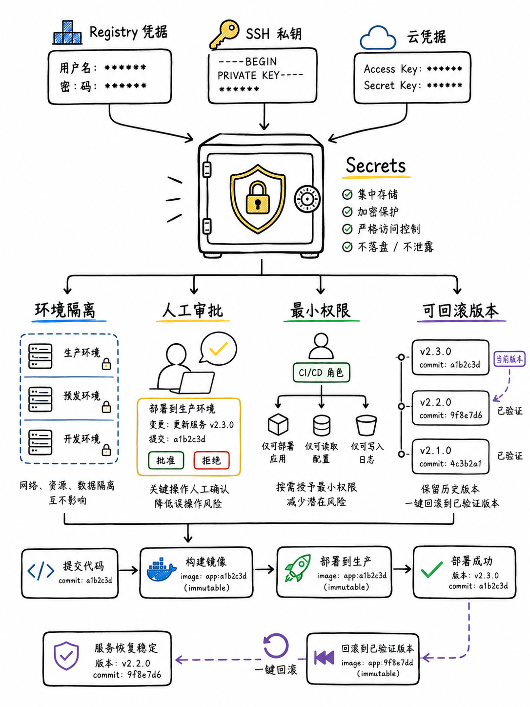

图解：生产安全护栏：基于环境分层的审批流程、金丝雀观测与自动化健康探针。

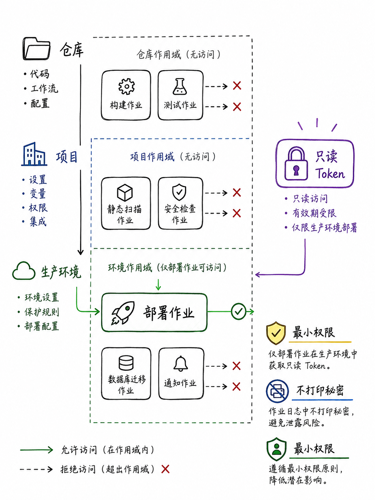

图解：凭据最小权限：严格区分开发、预发布与生产密钥，禁止全局明文透传。

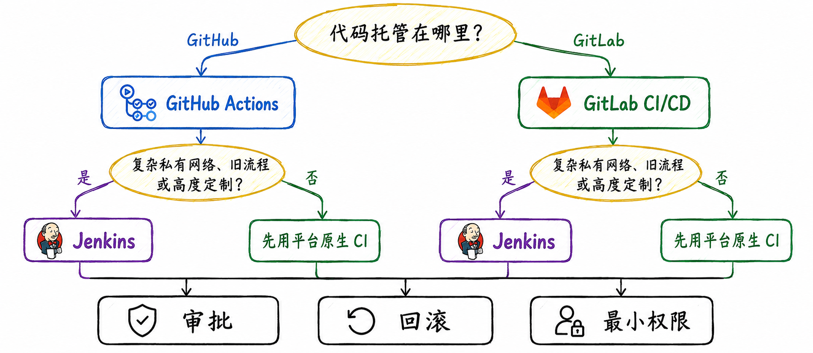

图解：CI/CD 选型决策树：按代码宿主、内网合规与专用硬件需求做决定。

## 小结

代码托管在 SaaS 首选 GitHub Actions；自建企业内网代码站首选 GitLab CI；复杂异构硬件和深度私有化系统首选 Jenkins。无论工具如何，环境隔离与凭据权限永远是流水线的第一道防线。

## 参考资料

以下链接来自官方权威技术文档与行业规范；动态规则请以其当前页面为准。

- [GitHub Actions Documentation](https://docs.github.com/en/actions)
- [GitLab CI/CD Documentation](https://docs.gitlab.com/ee/ci/)
- [Jenkins User Documentation](https://www.jenkins.io/doc/)
