# CI/CD 推模式还是拉模式？GitOps 原理与最佳实践

> 对应短视频主题：CI/CD 推还是拉？GitOps怎么做  
> 资料核验与更新：2026-09-12

传统 CI/CD 流水线习惯于在外部把镜像推送到生产集群，这意味着外部系统必须持有生产集群的高权限凭据。GitOps 彻底反转了这一逻辑：它把 Git 仓库作为系统期望状态的唯一真实来源，通过在集群内部运行的控制器主动拉取并调谐实际状态，实现了零外部凭据泄露风险的声明式运维。

## 阅读边界

本文依据原始课程的研究笔记、课程结构和发布文案整理。涉及产品、模型、版本、平台规则、价格或资格等可能变化的信息，实践前应以当前官方资料和实际环境为准。

## 持续交付、持续部署与推拉之争

持续交付（CDelivery）保证每个构建版本都具备随时上线的可靠品质，但上线时刻仍由人控制；持续部署（CDeployment）则在所有自动化门禁通过后无缝进入生产。传统的推模式（Push-based）由 CI 系统直接调用集群 API 执行部署，随着系统增多，外部流水线所持凭据成为重大安全单点。

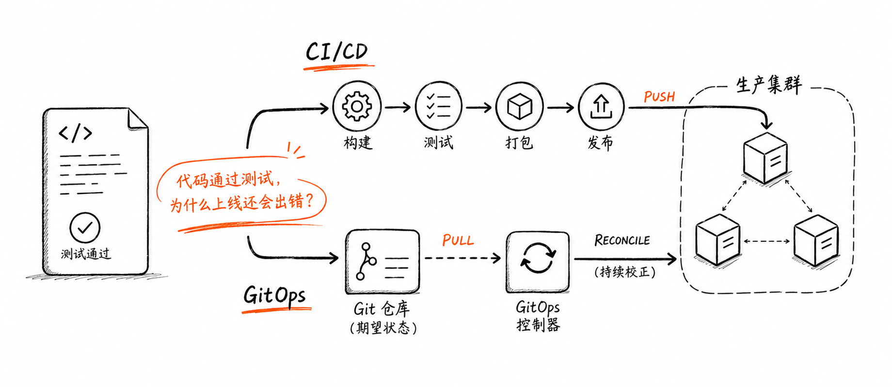

图解：传统推模式与 GitOps 拉模式总览：构建验证与集群状态协调的职责解耦。

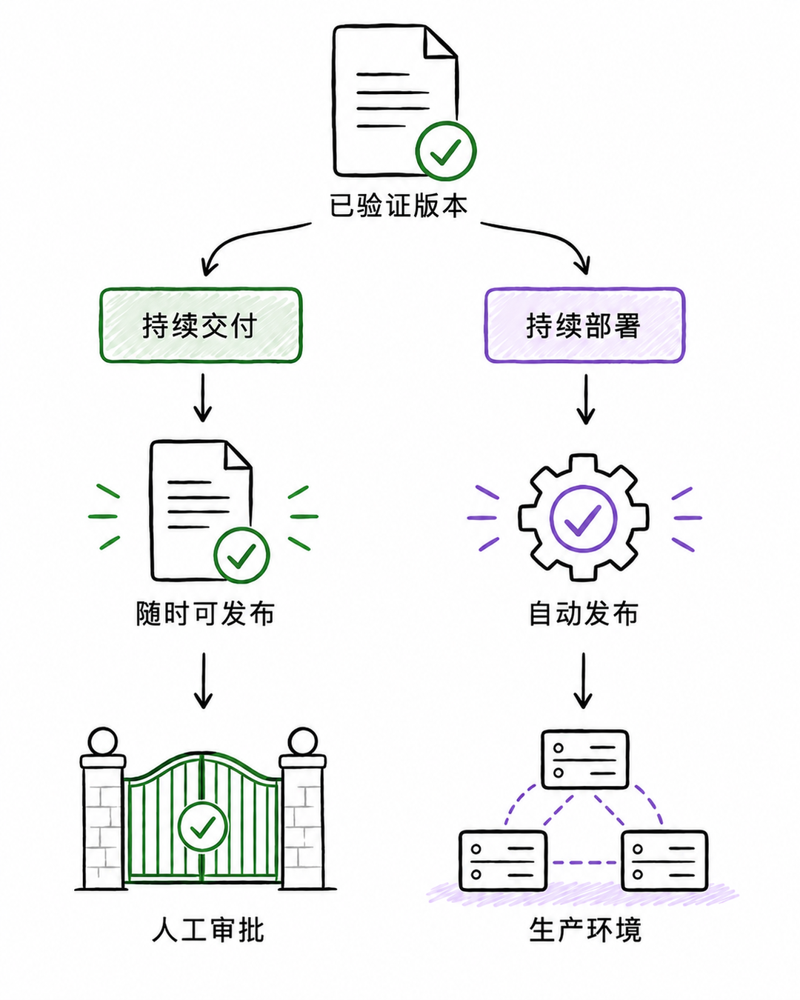

图解：交付与部署边界：持续交付保留人工上线控制点，持续部署全自动化上线。

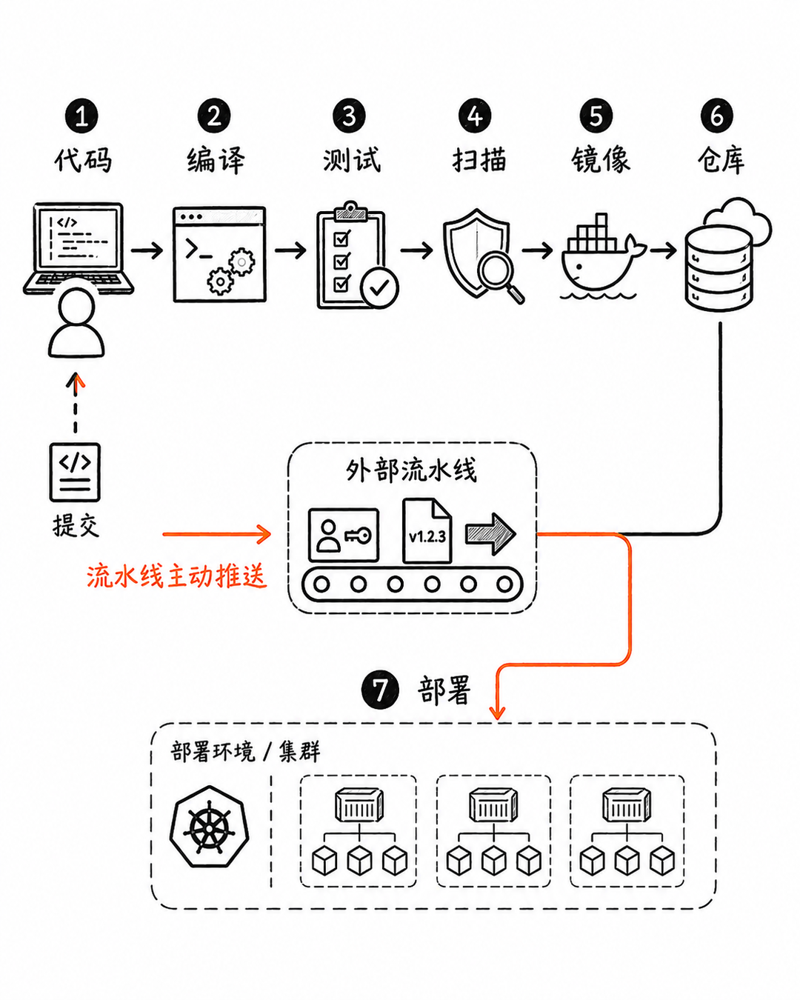

图解：传统推模式流水线：外部系统手握生产集群管理员凭据，存在暴露扩散风险。

## Git 作为唯一事实源与调谐循环

在 GitOps 架构中，整个系统的期望状态完全由 Git 仓库中的声明式文件（如 Kubernetes YAML 或 Helm/Kustomize 清单）定义。集群内部的 GitOps 控制器（如 Argo CD 或 Flux）运行一个恒定的协调循环（Reconciliation Loop）：实时监听 Git 仓库变更，并与集群实际运行状态进行比对。

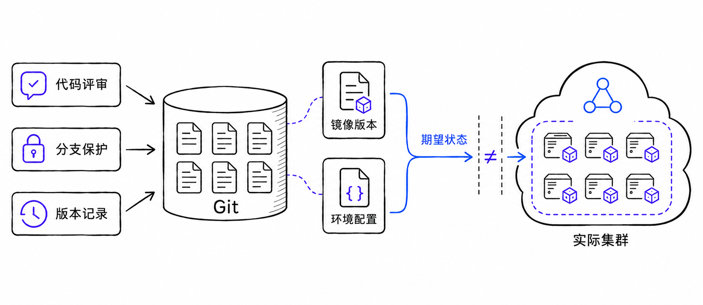

图解：Git 唯一事实源：所有环境配置、镜像版本与网络策略均在版本库中严格受控。

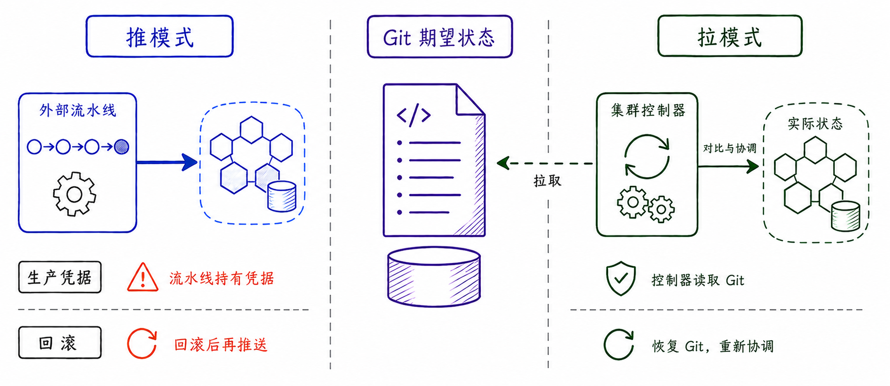

图解：架构与安全对比：外部直接推入 vs 集群内部单向向外拉取并自我修正。

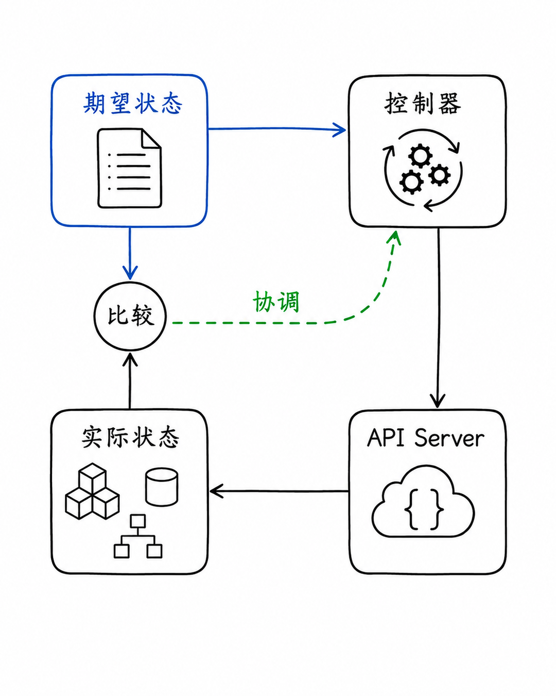

图解：持续调谐循环：比对 Git 期望状态与运行状态，一旦发生差异立即发起自动修复。

## 配置漂移阻断与快速回滚

如果有人通过 kubectl 在生产集群上手动修改了容器副本数或环境变量，GitOps 控制器会立即检测到这一配置漂移（Drift），并在几秒内将其自动纠正还原为 Git 中声明的状态。如果发布的新版本存在缺陷，只需在 Git 仓库中执行一次 `git revert`，集群便会自动同步回滚到上一个健康版本。

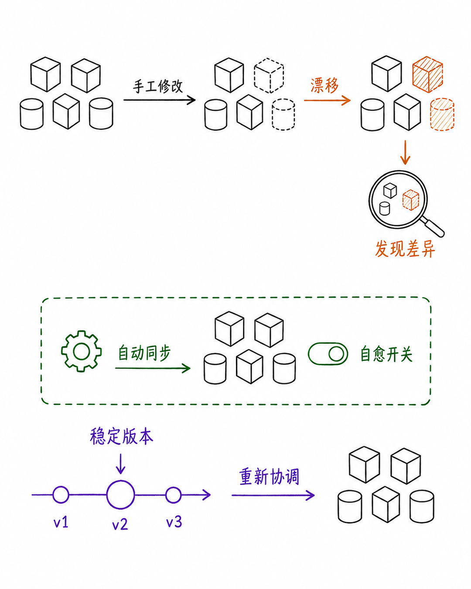

图解：配置漂移自动纠偏与 Git 一键回滚：依靠提交历史获得完整的版本审计追踪。

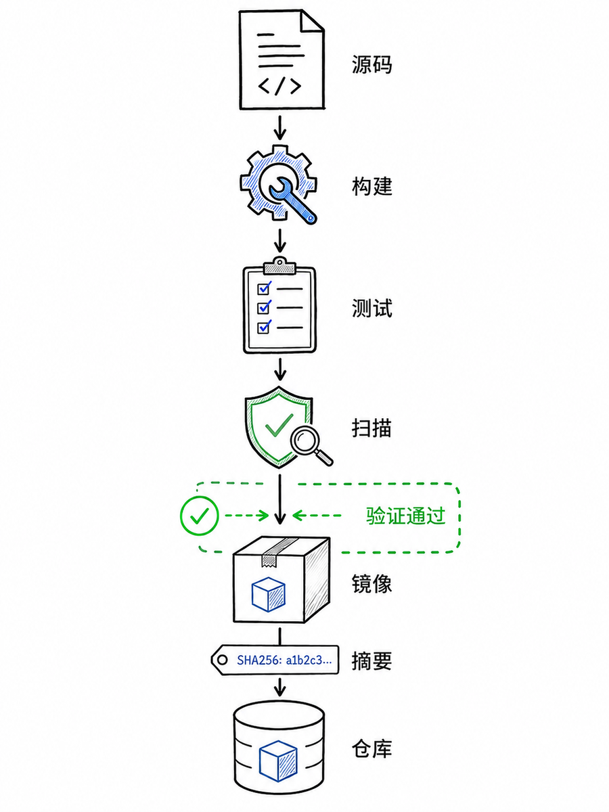

图解：CI 系统职责收敛：专注于运行测试、代码扫描并生成不可变的容器制品镜像。

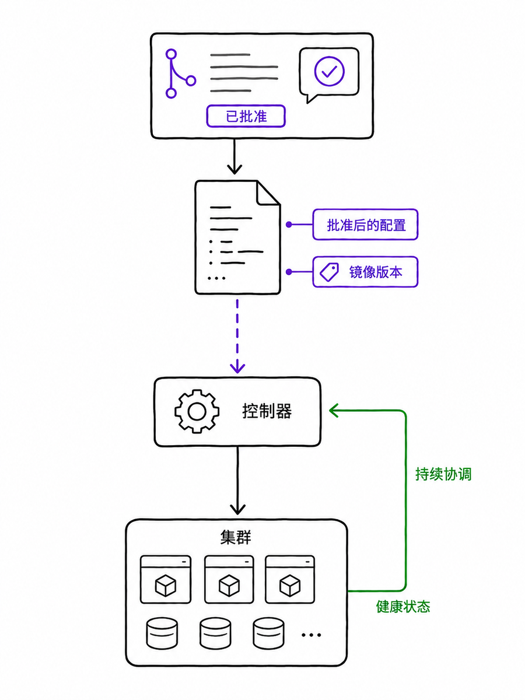

图解：CD 部署职责外包：GitOps 控制器专职监听配置仓库，负责制品到集群的映射。

## 安全边界与选型决策树

GitOps 虽然安全性极高，但也有其适用边界：机密凭据必须配合 Sealed Secrets 或 External Secrets Operator 剥离，避免明文存入 Git；数据库结构变更（Migration）等不可逆操作通常需要专用流水线配合。生产落地时应配合金丝雀渐进式发布，构筑多道安全防护门禁。

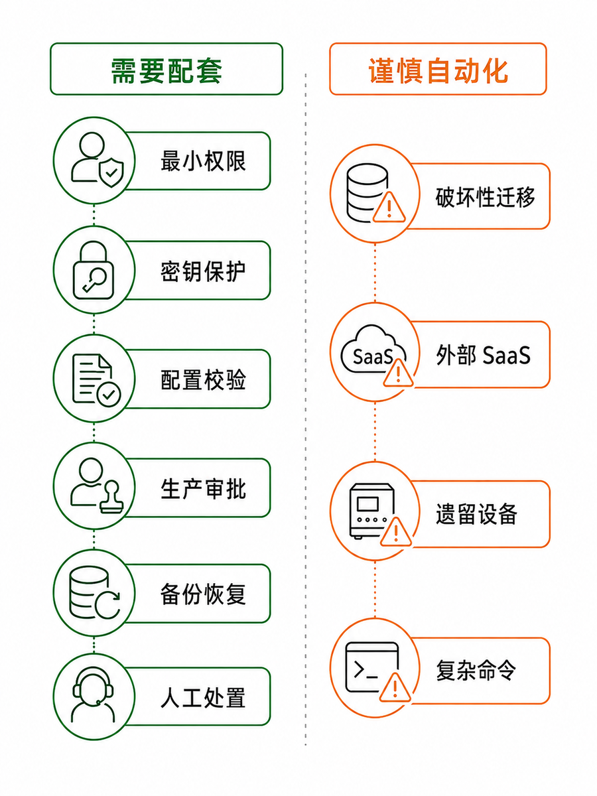

图解：安全约束与机密管理：必须将敏感凭据从明文仓库解耦，配合外部密文同步机制。

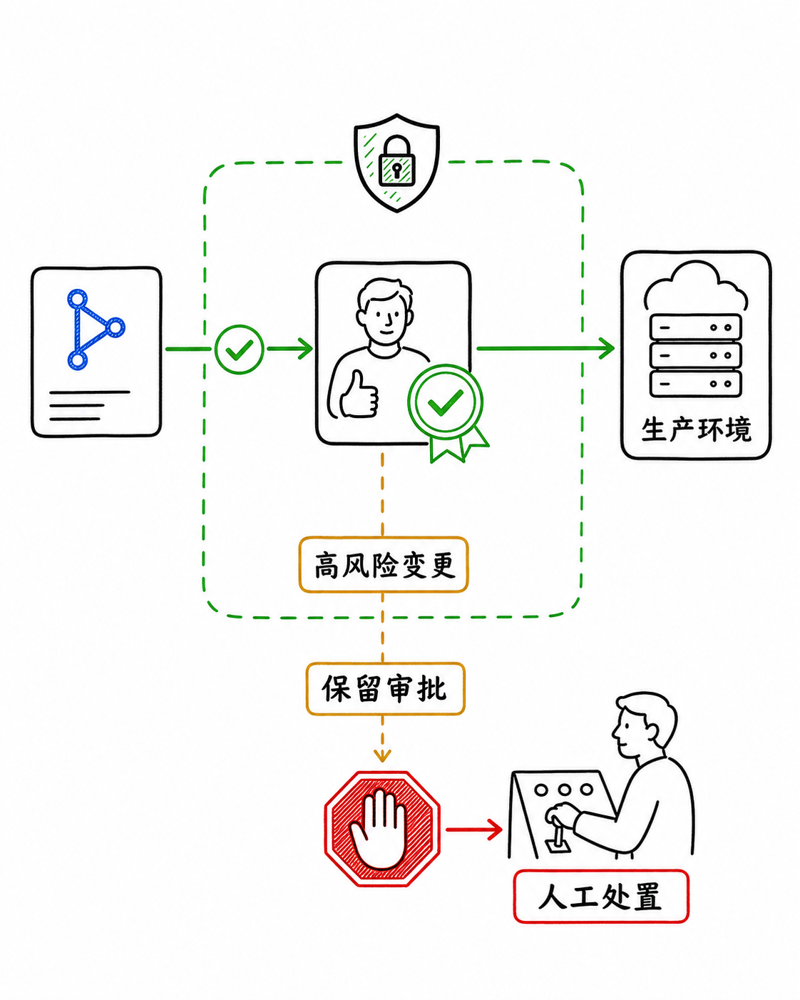

图解：生产安全门禁：集成自动化健康检查、指标监控门限与异常自动切断。

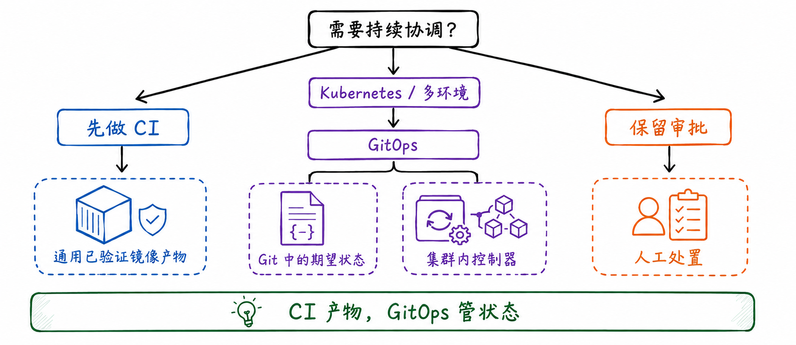

图解：GitOps 实施决策树：按集群规模、合规审计要求与团队 Kubernetes 基础选型。

## 小结

推模式适合单体应用与小型敏捷团队；拉模式（GitOps）是大规模微服务与云原生生产环境的黄金标准。CI 专注造制品，GitOps 专注管状态，职责分离才能安全交付。

## 参考资料

以下链接来自官方权威技术文档与行业规范；动态规则请以其当前页面为准。

- [OpenGitOps Principles](https://opengitops.dev/)
- [Argo CD Documentation](https://argo-cd.readthedocs.io/)
- [Flux CD Documentation](https://fluxcd.io/docs/)
