# 免费会员与企业产品：四家 AI 怎么选

一张白板图看懂 Claude、ChatGPT、Gemini 与 Grok 的免费版、个人会员、动态额度、企业治理和 API 边界。

## 阅读边界

本文依据原始课程的研究笔记、课程结构和发布文案整理。涉及产品、模型、版本、平台规则、价格或资格等可能变化的信息，实践前应以当前官方资料和实际环境为准。

## 免费、会员、企业：四家 AI 怎么比？

先看产品体系，再看价格与额度。

免费、会员、企业，Claude、ChatGPT、Gemini 与 Grok 怎么比？先用入口、模型、额度和治理四条线来看。

这样比较的就不只是一个聊天页面。而是一整套产品体系。

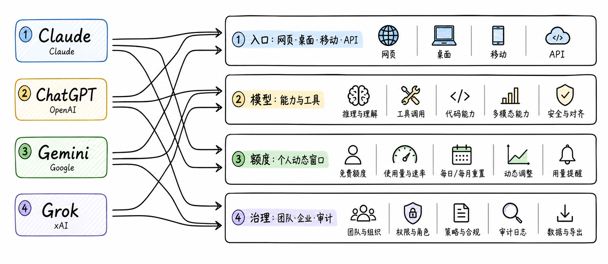

图解：“overview”这张示意图用于解释“免费、会员、企业：四家 AI 怎么比？”的关键关系；阅读时可结合本节的步骤、边界与结论逐项核对。

## 产品入口：同品牌不等于同能力

网页、桌面、移动与 API，承担的任务不同。

产品入口，决定你怎么使用这家 AI。网页、桌面、移动和 API，承担的任务不同。

网页版通常最完整，适合对话、搜索、文件和研究。桌面版更贴近本地文件、代码、终端和通知。

移动版适合语音、拍照和快速继续任务。API 则面向程序接入。

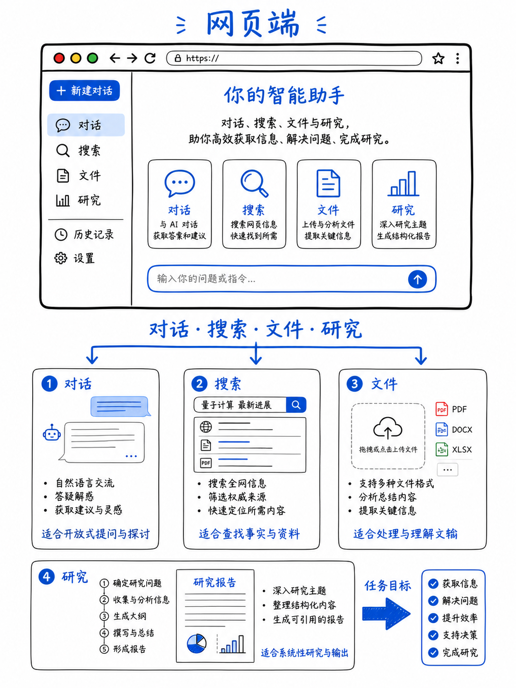

图解：“web”这张示意图用于解释“产品入口：同品牌不等于同能力”的关键关系；阅读时可结合本节的步骤、边界与结论逐项核对。

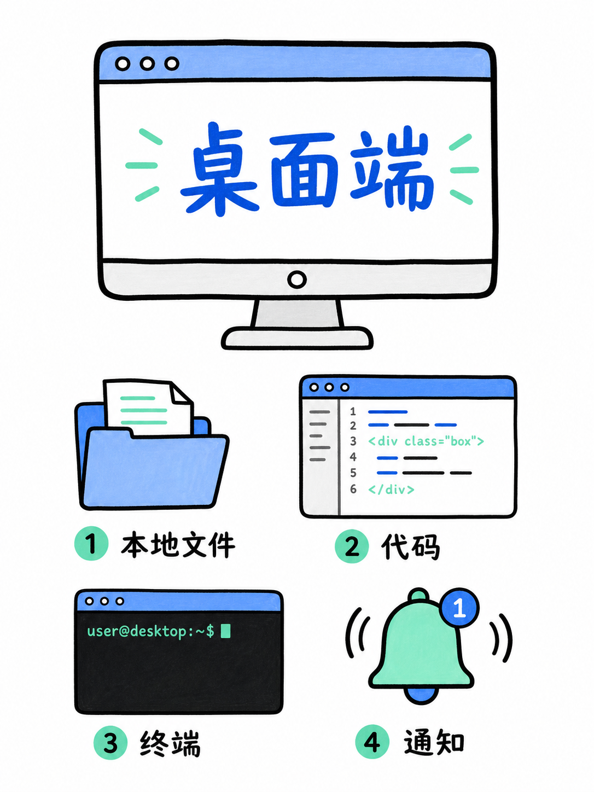

图解：“desktop”这张示意图用于解释“产品入口：同品牌不等于同能力”的关键关系；阅读时可结合本节的步骤、边界与结论逐项核对。

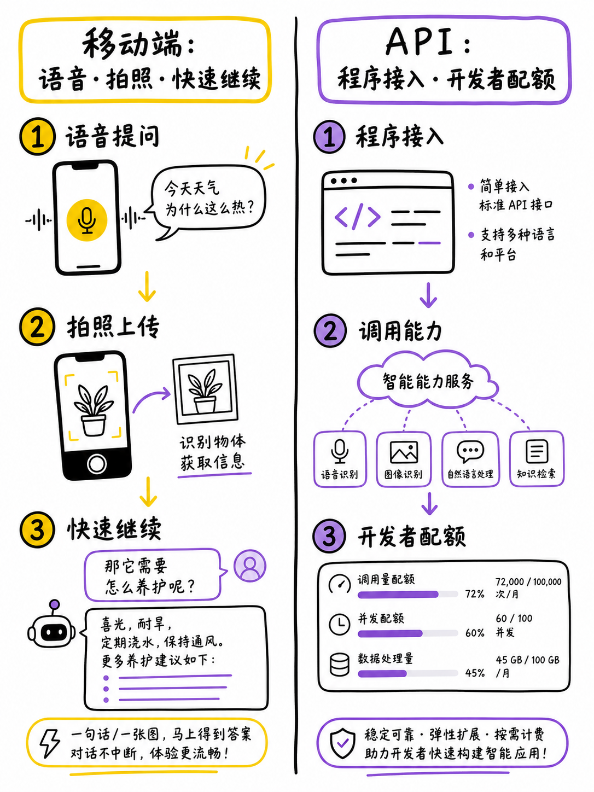

图解：“mobile api”这张示意图用于解释“产品入口：同品牌不等于同能力”的关键关系；阅读时可结合本节的步骤、边界与结论逐项核对。

## 个人层级：免费版和会员差在哪？

四家都在提高上限，但权益不是一张固定表。

免费版和个人会员差在哪？先看模型、工具和使用量。

四家的免费版都适合低频对话。免费版也会提供部分文件、图像、语音或搜索体验。

个人会员通常会增加模型选择和工具用量。它也可能增加文件、图像、研究、语音和智能体额度。

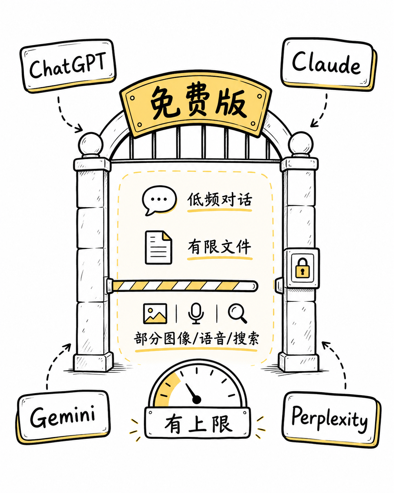

图解：“free”这张示意图用于解释“个人层级：免费版和会员差在哪？”的关键关系；阅读时可结合本节的步骤、边界与结论逐项核对。

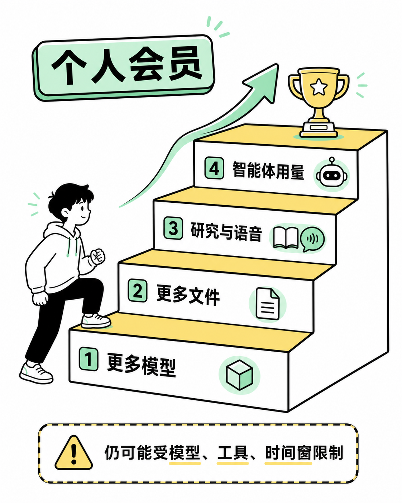

图解：“paid”这张示意图用于解释“个人层级：免费版和会员差在哪？”的关键关系；阅读时可结合本节的步骤、边界与结论逐项核对。

## 四家会员：升级价值怎么读？

不要只比较套餐名字，要看实际权益。

四家会员的升级价值怎么读？不要只比较套餐名字，要看实际权益。

Claude 的升级重点是更多使用量、Claude Code、Projects 和研究。ChatGPT 与 Gemini 更强调模型、搜索、文件、多模态和研究。

Grok 的付费权益会提高消息、搜索、多媒体或智能体使用量。这些名称相似，但额度和适用入口仍要分别核对。

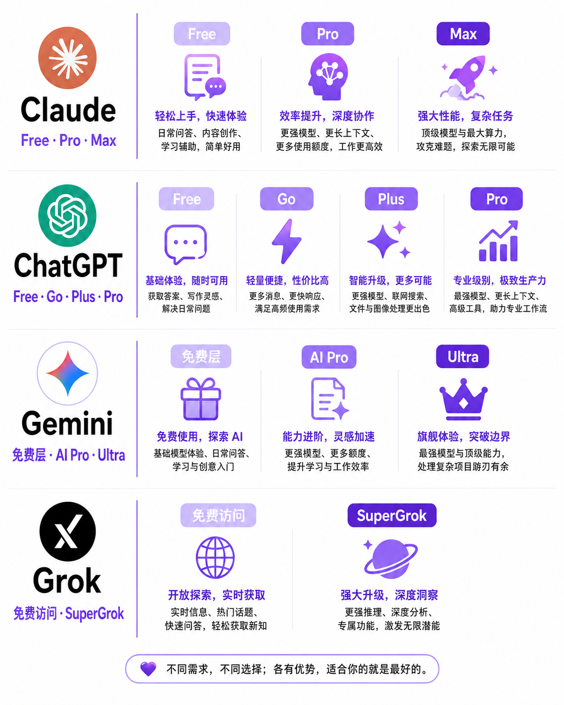

图解：“consumer plans”这张示意图用于解释“四家会员：升级价值怎么读？”的关键关系；阅读时可结合本节的步骤、边界与结论逐项核对。

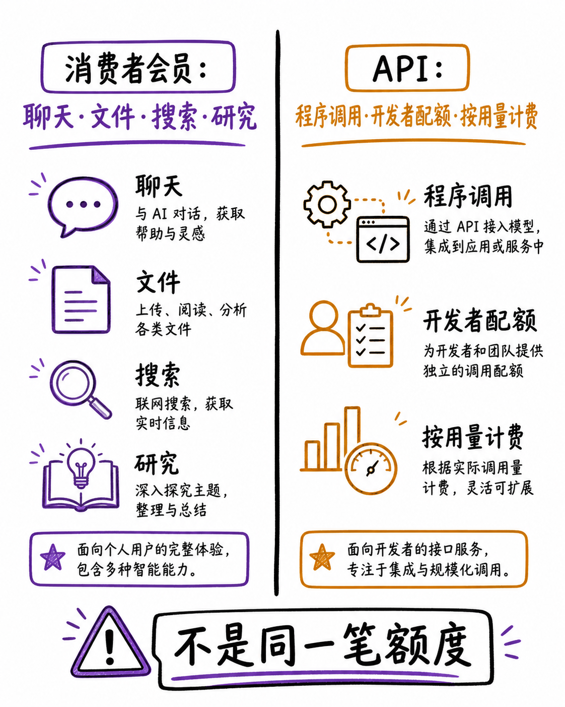

图解：“api boundary”这张示意图用于解释“四家会员：升级价值怎么读？”的关键关系；阅读时可结合本节的步骤、边界与结论逐项核对。

## 使用额度：为什么会动态变化？

额度通常受模型、工具、负载和时间窗口影响。

使用额度为什么会动态变化？关键是看影响额度的几个变量。

额度会随模型、工具和时间窗口变化。高峰时段和高负载任务，也可能更快触达上限。

所以一次体验，不能代表永久固定配额。购买会员，通常是增加余量，不等于绝对无限。

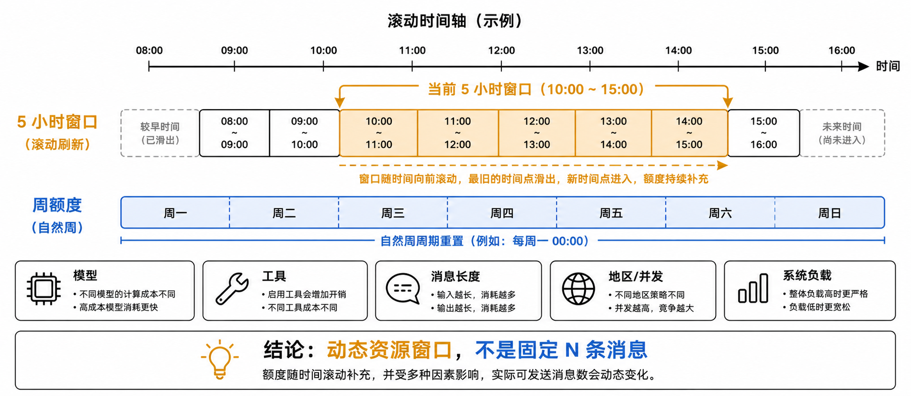

图解：“windows”这张示意图用于解释“使用额度：为什么会动态变化？”的关键关系；阅读时可结合本节的步骤、边界与结论逐项核对。

## 企业产品：买的不只是消息更多

核心价值是身份、权限、审计、数据和组织部署。

企业产品，解决的是多人使用和组织治理。它通常包含统一登录、成员管理和工作区。

还要看权限、审计、数据保留和合同支持。API 和云平台是开发接入，通常单独计费。

所以企业订阅和 API 配额，不是同一件事。

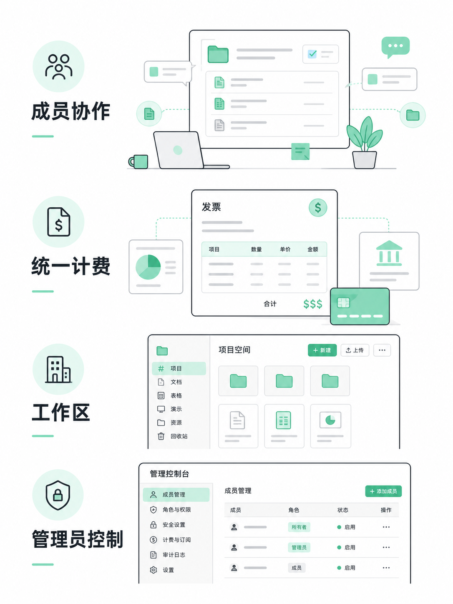

图解：“team workspace”这张示意图用于解释“企业产品：买的不只是消息更多”的关键关系；阅读时可结合本节的步骤、边界与结论逐项核对。

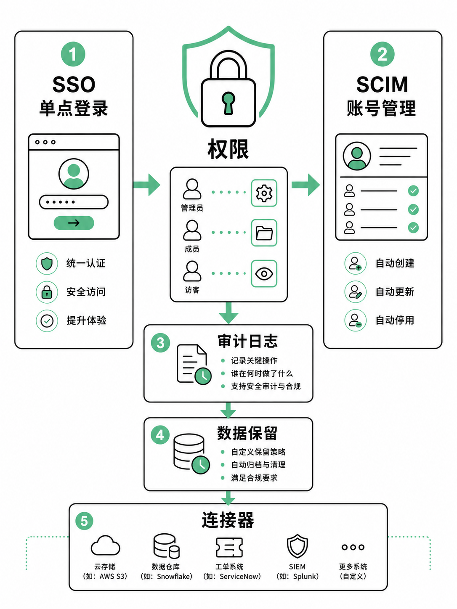

图解：“enterprise governance”这张示意图用于解释“企业产品：买的不只是消息更多”的关键关系；阅读时可结合本节的步骤、边界与结论逐项核对。

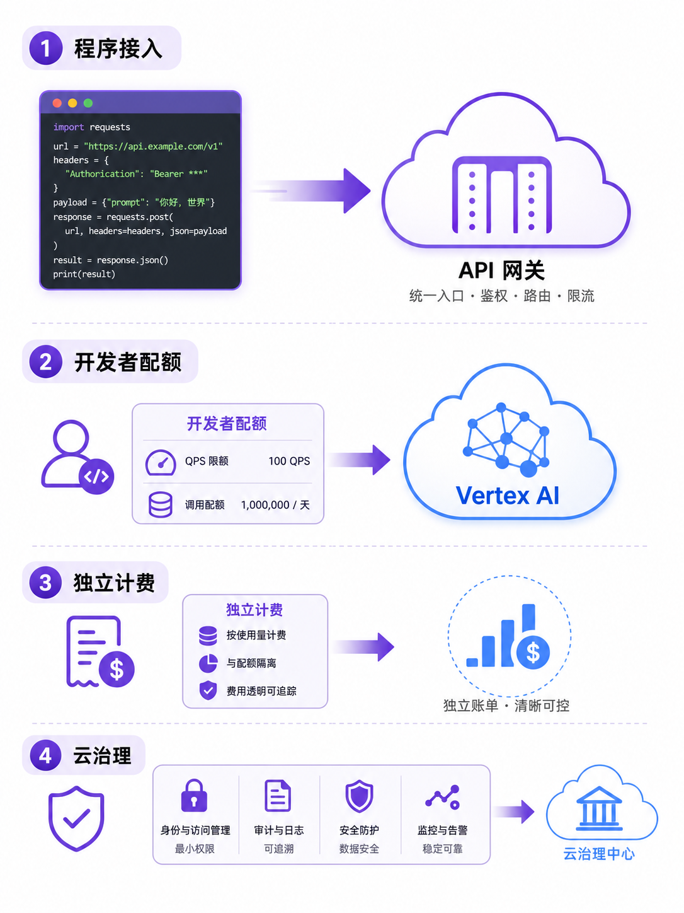

图解：“api cloud”这张示意图用于解释“企业产品：买的不只是消息更多”的关键关系；阅读时可结合本节的步骤、边界与结论逐项核对。

## 最终选型：先问任务，再核对官方

个人看效率，团队看协作，企业看治理，开发看 API。

先给结论：四家没有一个答案适合所有人。个人高频使用，先比较模型、工具和实际额度。

团队协作，比较工作区、管理员能力和共享成本。企业部署，核对身份、权限、审计、数据边界和合同支持。

程序接入，单独评估 API，不要把会员当开发配额。最后用真实任务小测，再回到官方页面确认价格、地区和限制。

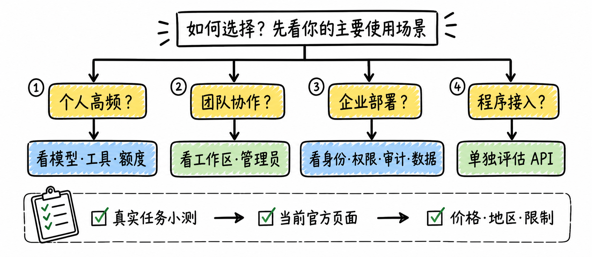

图解：“decision”这张示意图用于解释“最终选型：先问任务，再核对官方”的关键关系；阅读时可结合本节的步骤、边界与结论逐项核对。

## 小结

把问题拆成目标、约束、证据和验证四部分，通常比直接寻找唯一答案更可靠。先用本文的框架完成一次小范围验证，再根据真实反馈调整下一步。

## 参考资料

以下链接来自原始课程研究笔记；动态信息请以其当前页面为准。

- [https://claude.com/pricing；https://support.claude.com/en/articles/11049762-choose-a-claude-plan；https://support.claude.com/en/articles/11049741-what-is-the-max-plan](https://claude.com/pricing；https://support.claude.com/en/articles/11049762-choose-a-claude-plan；https://support.claude.com/en/articles/11049741-what-is-the-max-plan)
- [https://support.claude.com/en/articles/9797531-what-is-the-enterprise-plan](https://support.claude.com/en/articles/9797531-what-is-the-enterprise-plan)
- [https://help.openai.com/en/articles/9275245-chatgpt-free-tier-faq；https://help.openai.com/en/articles/11487671-flexible-pricing-for-the-enterprise-and-team-plan；https://help.openai.com/en/articles/11481834-chatgpt-rate-card-business-enterpriseedu/](https://help.openai.com/en/articles/9275245-chatgpt-free-tier-faq；https://help.openai.com/en/articles/11487671-flexible-pricing-for-the-enterprise-and-team-plan；https://help.openai.com/en/articles/11481834-chatgpt-rate-card-business-enterpriseedu/)
- [https://support.google.com/gemini/answer/16275805?hl=en；https://support.google.com/googleone/answer/14534406](https://support.google.com/gemini/answer/16275805?hl=en；https://support.google.com/googleone/answer/14534406)
- [https://docs.x.ai/grok/overview；https://docs.x.ai/developers/pricing；https://docs.x.ai/developers/models](https://docs.x.ai/grok/overview；https://docs.x.ai/developers/pricing；https://docs.x.ai/developers/models)
