# Claude、ChatGPT、Gemini 与 Grok：能力优势与应用对比

> 对应短视频主题：Claude、ChatGPT、Gemini 与 Grok：能力优势与应用对比  
> 资料核验与更新：2026-09-12

用一张任务地图看懂四家模型的能力侧重、Agent 长跑与真实选型方法。

## 阅读边界

本文依据原始课程的研究笔记、课程结构和发布文案整理。涉及产品、模型、版本、平台规则、价格或资格等可能变化的信息，实践前应以当前官方资料和实际环境为准。

## 四大模型，怎么选？

先把四家放进同一张任务地图，再谈怎么选。

Claude、ChatGPT、Gemini 与 Grok，怎么选？先把四家放进同一张任务地图，再看真实任务。因为模型能力会和任务类型、工具权限、实时信息以及复核成本一起变化。

这条课程先看四家侧重，再用同一套真实任务方法做选型。

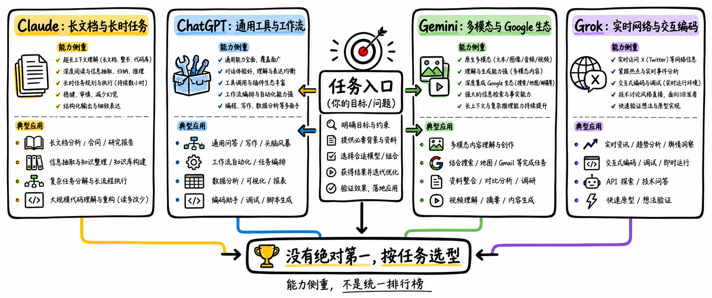

图解：四大主流大模型核心侧重：Claude 长文本、ChatGPT 通用工作流、Gemini 多模态生态、Grok 实时网络互补。

## 能力矩阵：差异在哪里？

先看比较维度，再看四家在同一任务集上的侧重。

四家模型的能力差异在哪里？先固定同一任务集和比较维度。Gemini 的优势线索是多模态与 Google 生态，Grok 的差异是实时网络与交互编码。

推理、编程、上下文、智能体和企业能力，都要绑定具体型号与权限来核对。

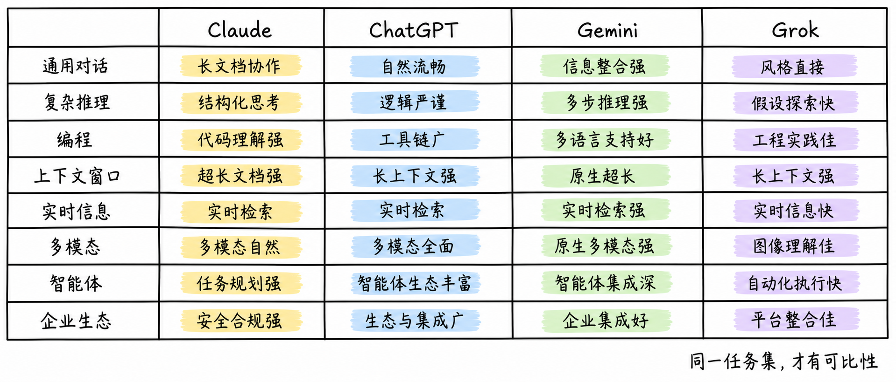

图解：核心能力维度对照矩阵：涵盖长上下文、推理、编程、多模态、实时检索与企业支持。

## Claude 与 ChatGPT：两条工作流

长文档协作，还是多工具工作台？先看任务的主要工作流。

Claude 与 ChatGPT，长文档协作还是多工具工作台？先判断任务的主要工作流，再看哪家值得测试。ChatGPT 更适合优先测试搜索、文件、电脑操作和多工具协同的通用工作流。

两者都不是无条件领先，成本、延迟、拒答和工具调用稳定性都要实测。

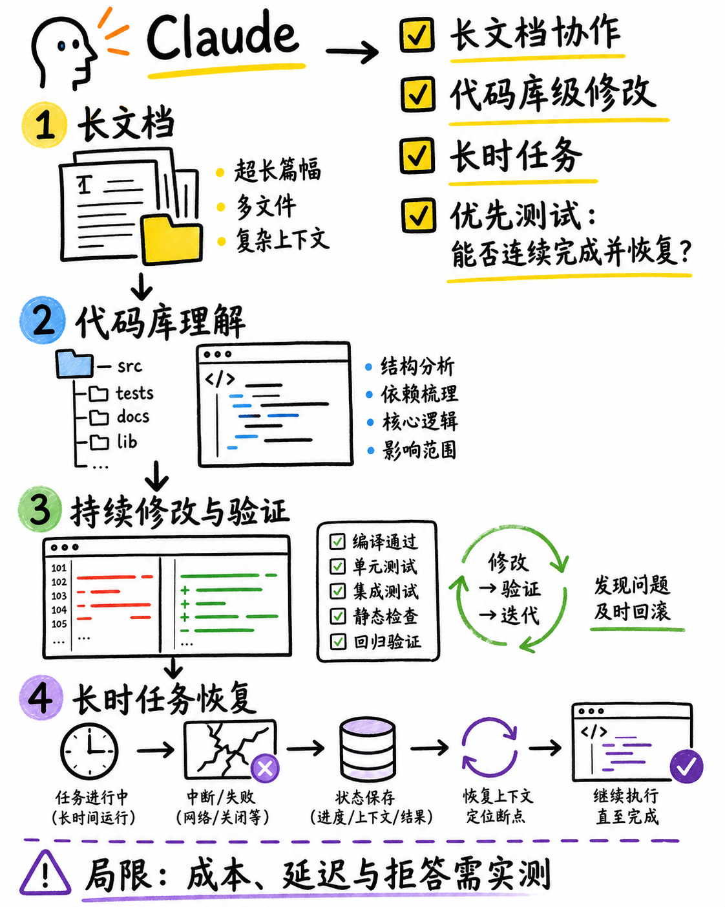

图解：Claude 核心优势链路：长上下文消化、复杂代码库重构与长时任务协作。

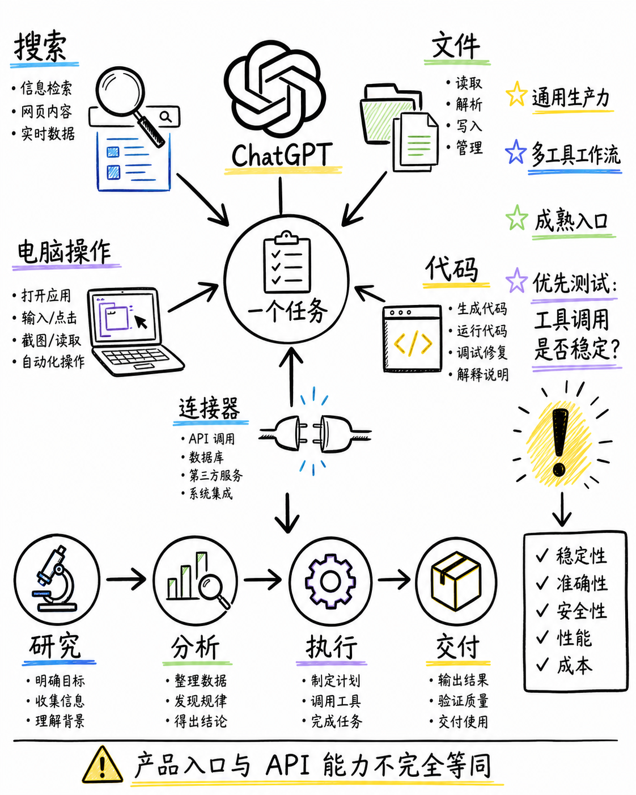

图解：ChatGPT 核心优势链路：丰富工具生态、Advanced Data Analysis、Canvas 与多工具统一编排。

## Gemini 与 Grok：生态还是实时？

多模态与 Google 生态，还是 Web/X 与互动编码？先看信息来源和交互方式。

Gemini 与 Grok，多模态生态还是实时网络？先看任务的信息来源和交互方式。如果任务深度连接 Google Search、Workspace 或 Cloud，Gemini 的生态整合值得优先验证。

Grok 的差异化在实时 Web、X 信息、交互编码和长时智能体，但社交信息必须交叉核验。

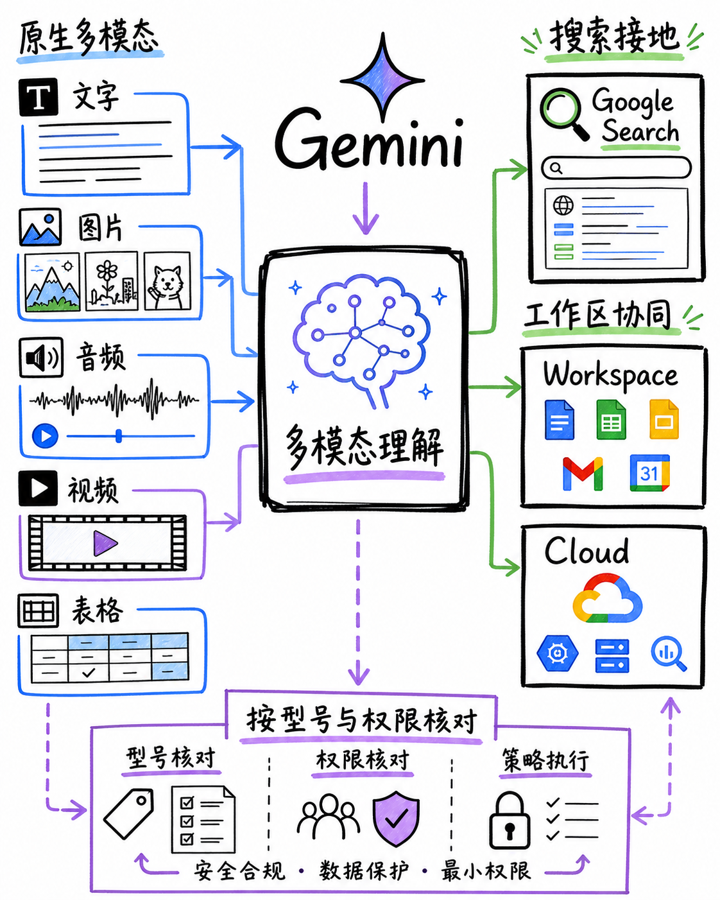

图解：Gemini 核心优势链路：原生音视频多模态处理、超长上下文窗口与 Google 生态协同。

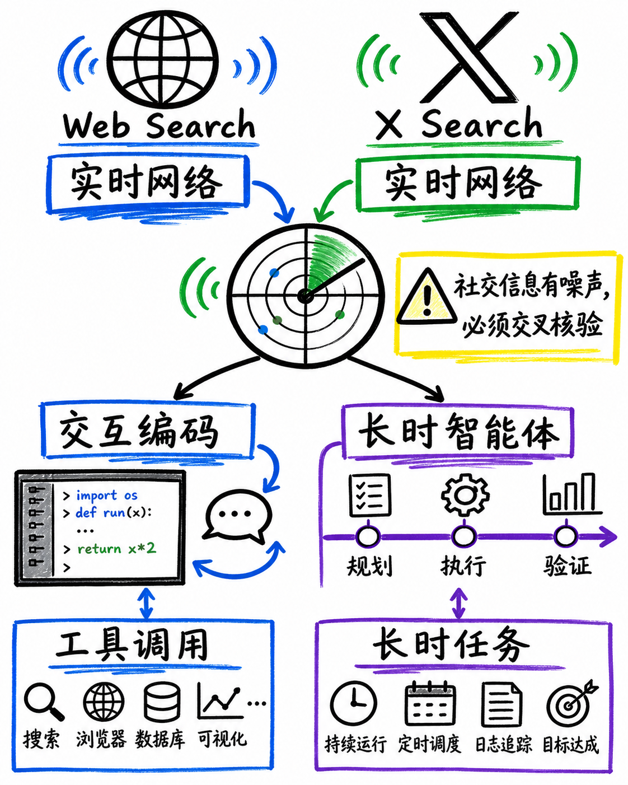

图解：Grok 核心优势链路：X 实时社交网络检索、热点事件追踪与快速交互编码。

## 典型用途：先测哪一家？

先按资料形态、工具链和时效性缩小候选，再做小测。

面对不同典型用途，先测哪一家？先看资料形态、工具链和时效性三个判断标准。软件开发、个人办公和企业助手，先测工具调用、测试闭环、权限和审计。

实时新闻、舆情、图像视频和音频任务，先测来源覆盖、交叉核验与最终媒体质量。

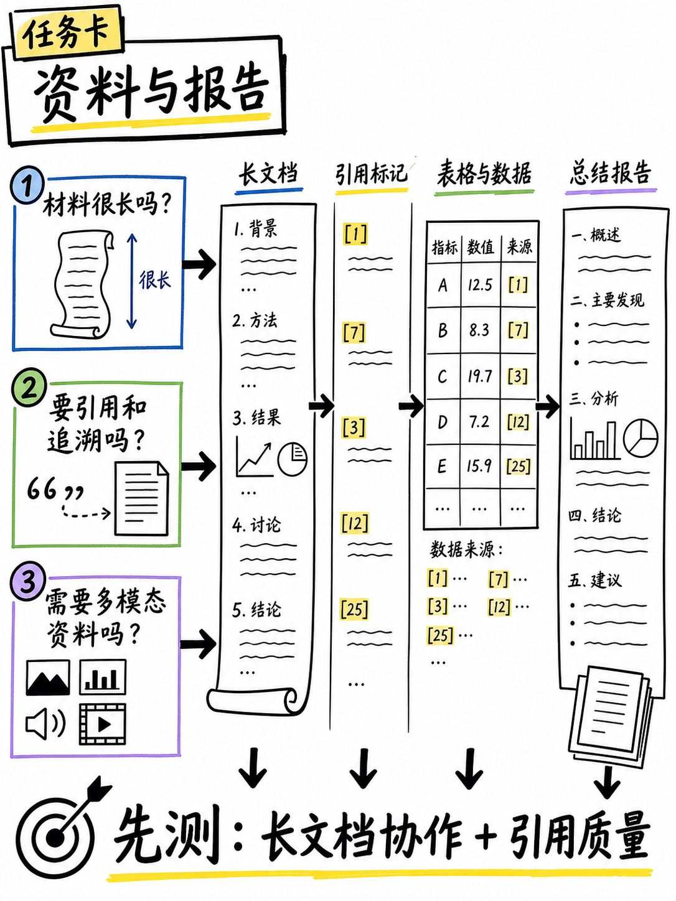

图解：长文档与综合研究报告场景：优先评估长文档协作与信息引用质量。

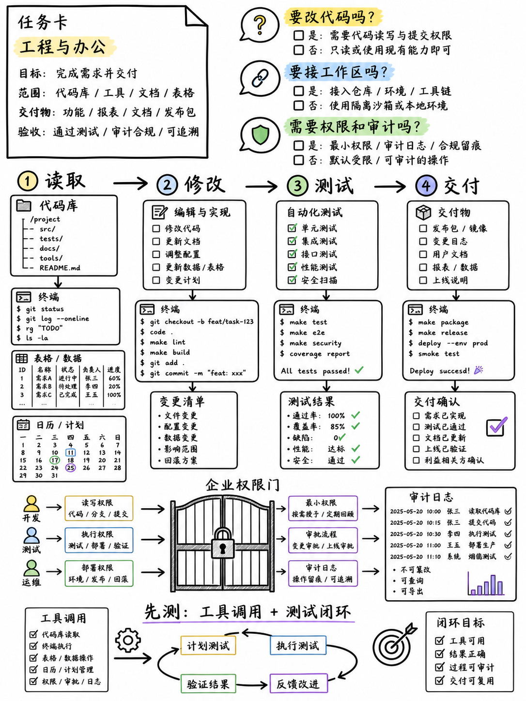

图解：大型软件工程场景：优先评估跨文件代码重构、工具调用与测试闭环。

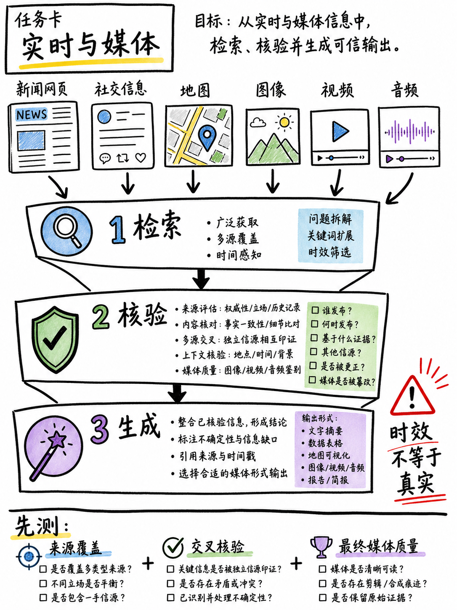

图解：实时信息与多媒体场景：优先评估信息源覆盖、交叉核验与最终产物质量。

## Agent 长跑：怎么公平测试？

先定义完整率、可靠性和恢复能力，再比较一次任务循环。

Agent 长跑，怎么公平测试？先定义完整率、可靠性和恢复能力，再观察任务循环。公平测试要记录任务规划、记忆保持、工具使用、验证循环和中断恢复。

还要看资源控制、可观察性与安全性，而不是只看一次回答漂不漂亮。

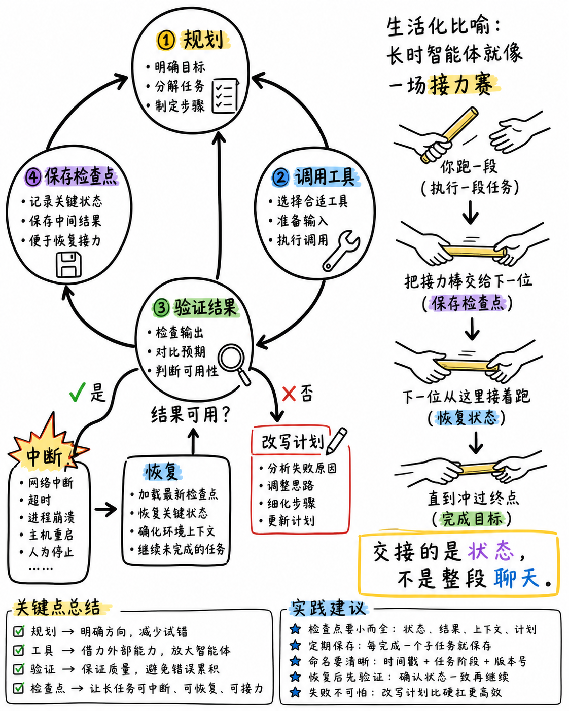

图解：智能体闭环执行流：规划、工具调用、结果验证与状态检查点流转。

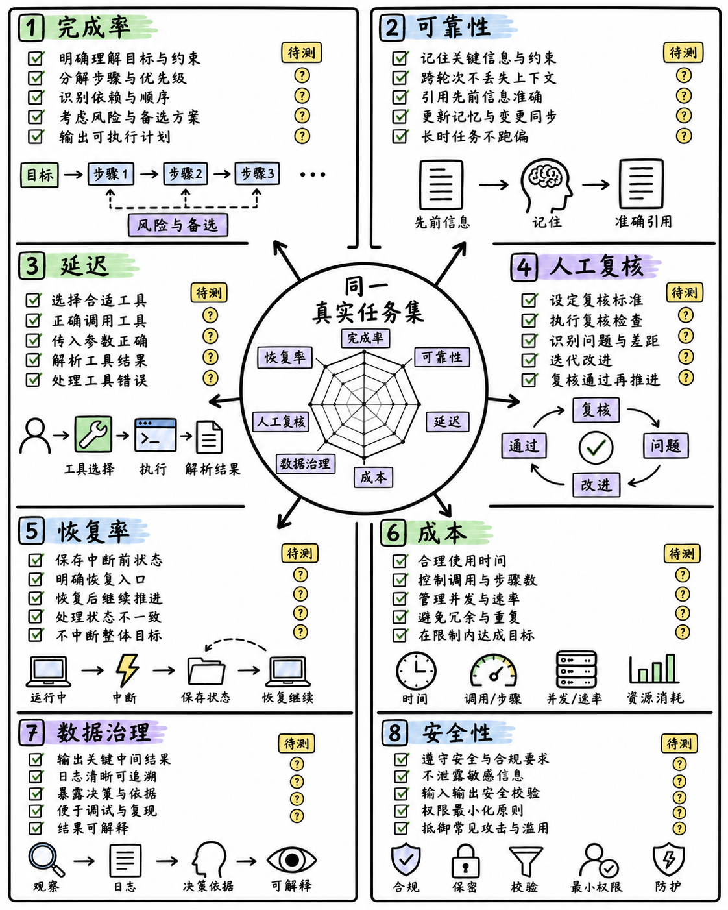

图解：大模型多维评测清单：拒绝脱离实际的雷达跑分，建立基于真实业务的任务测试集。

## 最终选型：先做小测

先按任务标准做小测，再用官方文档确认能力边界。

最终选型应该先做什么？先给结论：按真实任务标准做小测，再决定主力。如果多模态且在 Google 生态，优先测 Gemini；如果实时 Web、X 与互动编码重要，优先测 Grok。

最后用完成率、可靠性、延迟、成本、数据治理、人工复核和恢复率，决定谁做你的主力。

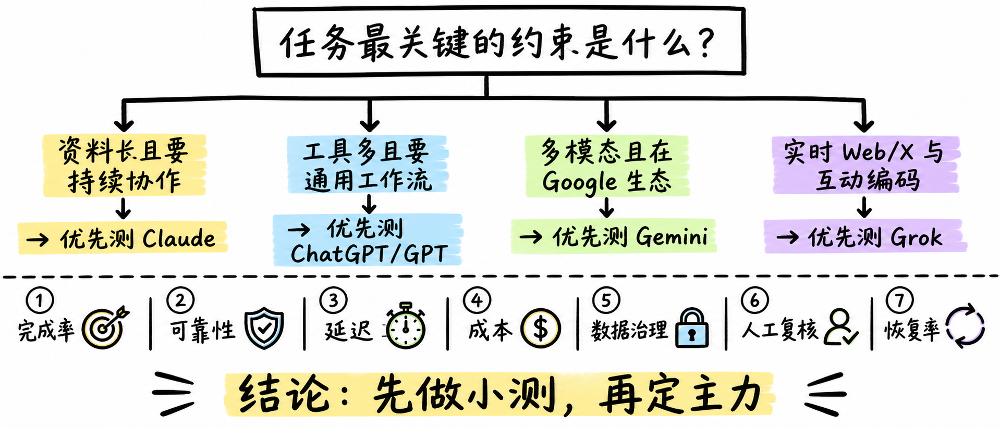

图解：主流大模型选型决策树：按长文档、通用工具、多模态或实时检索约束进行先验测试。

## 小结

把问题拆成目标、约束、证据和验证四部分，通常比直接寻找唯一答案更可靠。先用本文的框架完成一次小范围验证，再根据真实反馈调整下一步。

## 参考资料

> 📌 **查阅提示**：点击下方超链接可直接复制对应网址，粘贴至手机或电脑浏览器中即可查阅官方完整技术文档与规范。

- [【Anthropic 官方文档】Claude 模型家族与上下文窗口规范](https://platform.claude.com/docs/en/build-with-claude/context-windows)  
  *说明：详述 Claude 3.5 Sonnet 与 Haiku 的长上下文支持与工程化优化策略。*
- [【OpenAI 官方文档】OpenAI 模型体系与能力矩阵指南](https://platform.openai.com/docs/models)  
  *说明：涵盖 GPT-4o、o1 推理模型以及开发者 API 接口能力边界。*
- [【OpenAI 官方发布】ChatGPT 深度自主智能体技术概览](https://openai.com/index/introducing-chatgpt-agent/)  
  *说明：官方发布关于 ChatGPT 自主操作电脑与多工具编排的技术原理解析。*
- [【Google 官方文档】Gemini 多模态模型系列与实时搜索接入](https://ai.google.dev/gemini-api/docs/models/gemini)  
  *说明：官方说明 Gemini 1.5/2.0 原生音视频多模态处理与 Google 实时搜索 Grounding 能力。*
- [【xAI 官方发布】Grok 4.6 实时推理能力与技术架构](https://x.ai/news/grok-4-6)  
  *说明：xAI 官方关于 Grok 高性能并发与全球实时数据流的技术报告。*
- [【斯坦福大学 HELM】大语言模型整体评估基准体系](https://crfm.stanford.edu/helm/index.html)  
  *说明：学术界权威的多维度大模型综合评估评测标准与开源用例基准。*
