# Cloudflare怎么接？免费够用吗？

> 对应短视频主题：Cloudflare怎么接？免费够用吗？  
> 资料核验与更新：2026-09-12

用一条请求链路讲清 Cloudflare 的 DNS、反向代理、CDN、TLS、DDoS 与 WAF，再比较 Free、Pro、Business 的适用边界，并演示网站接入的关键步骤。方案与价格以官方页面为准。

## 阅读边界

本文依据原始课程的研究笔记、课程结构和发布文案整理。涉及产品、模型、版本、平台规则、价格或资格等可能变化的信息，实践前应以当前官方资料和实际环境为准。
原始研究记录标注的时间为：2026-09-02（以当日可访问的官方文档为准）。

## Cloudflare：它站在哪里？

先看清访客、边缘入口与源站的关系

Cloudflare 到底是什么？先把它放到网站入口来看。它不是装在你电脑里的插件，而是站在访客和源站之间的一层网络服务。

访客访问域名，Cloudflare 先接住请求，再决定放行、缓存，还是转给源站。

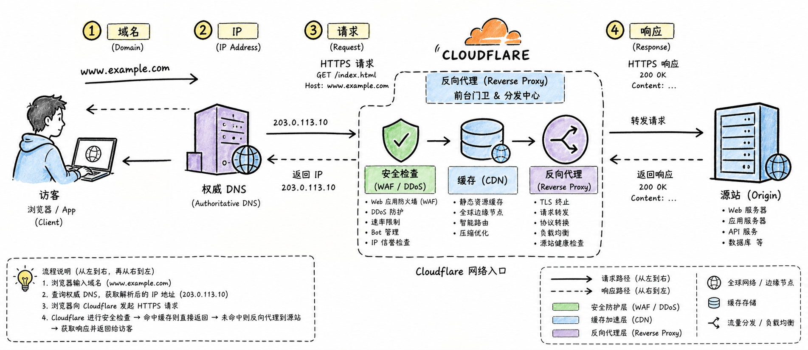

图解：浏览器请求从左侧出发，经过中央标注“Cloudflare：DNS + 边缘网络 + 安全入口”的云状网络节点，再到右侧“源站服务器”；在路径上画出“域名 → IP → 请求 → 响应”的粗箭头，源站放在后台仓库隐喻中，Cloudflare 像前台门卫兼分发中心。局部标签必须准确写出“访客”“权威 DNS”“反向代理（Reverse Proxy）”“源站（Origin）”“缓存（CDN）”“安全检查（WAF / DDoS）”。去掉顶部横幅式大标题，知识标签填满横向画面。

## Cloudflare 怎么运作？

DNS 找路，Anycast 就近接入，反向代理再处理请求

Cloudflare 怎么运作？可以把一次访问拆成三步来看。第一步是 DNS，也就是把域名翻译成 IP 地址的互联网通讯录。完整接入后，Cloudflare 成为这个域名的权威 DNS，返回的是 Anycast 地址。

这个地址会把访客带到合适的边缘节点，而不是直接暴露源站地址。开启代理，也就是橙云之后，Cloudflare 就站到请求路径中间。

缓存命中时，边缘节点直接返回内容；没命中时，才回源取内容。

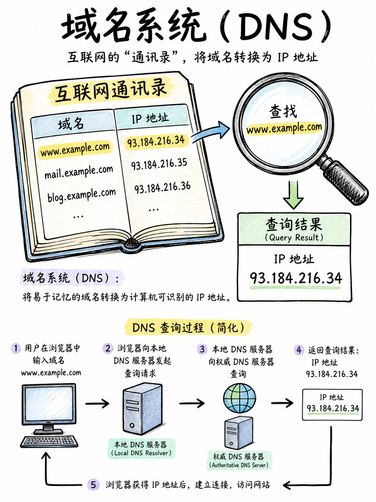

图解：这张图展示一本简洁的“互联网通讯录”与域名 `www.example.com`，箭头指向 IP 地址；旁边用放大镜标注“DNS：把名字找到地址”。必须出现“域名系统（DNS）”“域名”“IP 地址”“查询结果”，对象大而清楚，无外框。

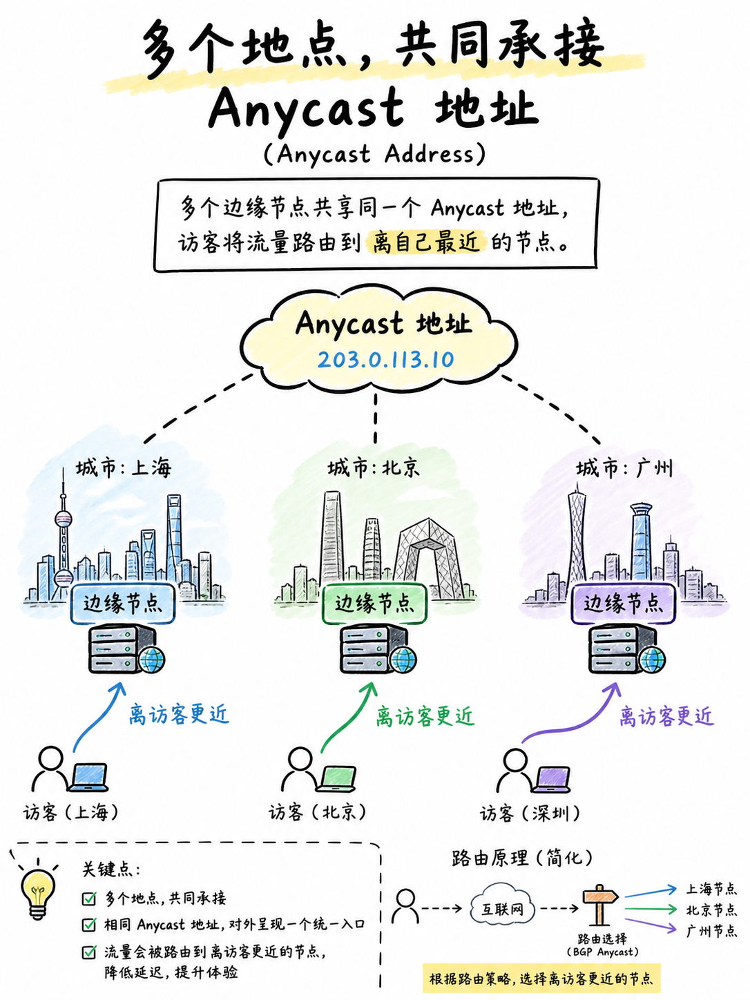

图解：这张图展示三个分布在不同城市的边缘节点共同接住一个“Anycast 地址”，访客箭头进入最近节点；标注“多个地点，共同承接”“Anycast 地址”“离访客更近”。使用蓝色表示请求，绿色表示就近接入，标签为简体中文。

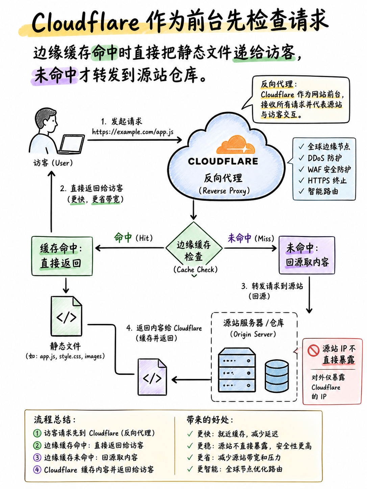

图解：这张图展示 Cloudflare 作为前台，先检查请求，再把静态文件从“边缘缓存”直接递给访客；没有命中时再转发到“源站仓库”。标注“反向代理”“缓存命中：直接返回”“未命中：回源取内容”“源站 IP 不直接暴露”。

## Cloudflare 的核心功能

加密、抗攻击、按规则检查，作用在同一条请求链路上

Cloudflare 的核心功能是什么？可以把它们放在同一条请求链路上看。TLS 负责给通信加密，而且访客到 Cloudflare、Cloudflare 到源站可以分别建立连接。DDoS 防护则是在大量请求挤向入口时，先在边缘识别和缓解攻击。

WAF，也就是 Web 应用防火墙，会按规则检查网址、参数和请求内容。所以 Cloudflare 的价值，不只是把网页放得更近，还把检查点放到了源站前面。

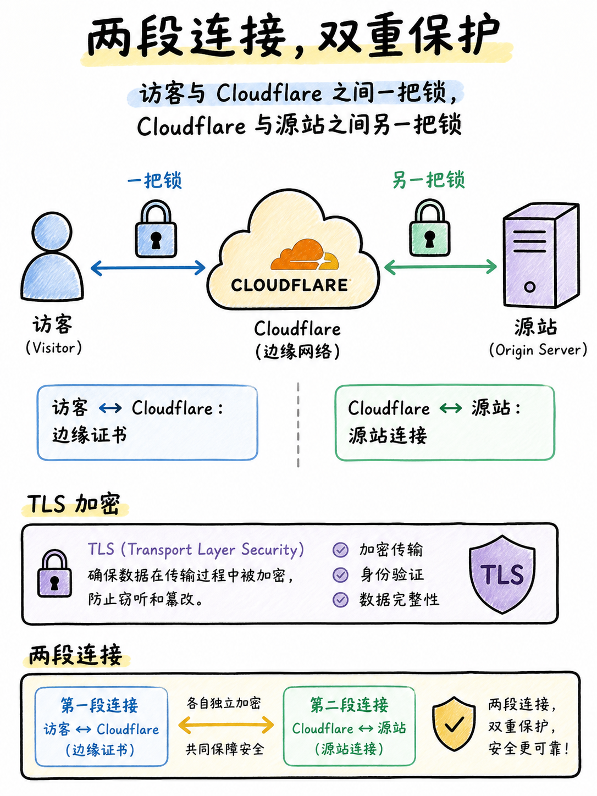

图解：这张图展示访客与 Cloudflare 之间一把锁、Cloudflare 与源站之间另一把锁，标注“访客 ↔ Cloudflare：边缘证书”“Cloudflare ↔ 源站：源站连接”“TLS 加密”。说明“两段连接”而非错误地画成一条魔法隧道。

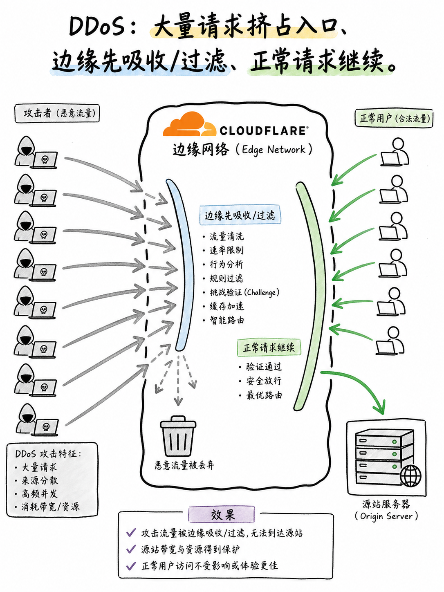

图解：这张图展示大量灰色攻击箭头撞向 Cloudflare 边缘网络，绿色正常用户从旁边通过到源站；标注“DDoS：大量请求挤占入口”“边缘先吸收/过滤”“正常请求继续”。不画夸张爆炸。

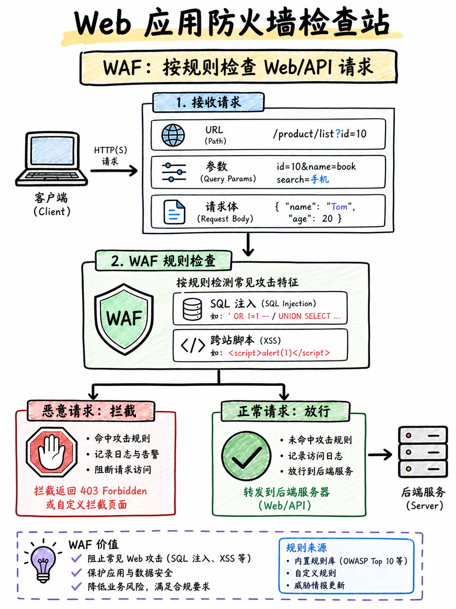

图解：这张图展示一个 Web 应用防火墙检查站，输入包括“URL、参数、请求体”，规则筛出“SQL 注入 / XSS”并拦截，正常请求打绿勾；标注“WAF：按规则检查 Web/API 请求”“恶意请求：拦截”“正常请求：放行”。

## 免费版够用，还是该升级？

不要先看价格，先看站点风险、规则复杂度与运维需求

免费版够用，还是该升级？判断标准不是功能数量，而是站点风险和控制需求。Free 通常已经覆盖权威 DNS、基础代理、自动 HTTPS 和 DDoS 防护。个人站、博客和简单展示站，先用免费版往往就能建立一层基础防护。

Pro 的重点不是一个神奇加速按钮，而是更细的规则、托管防护和机器人控制。Business 更适合关键业务、多人运维，或者需要更强可见性与支持的团队。

价格和具体配额会变化，购买前一定回到 Cloudflare 官方方案页核对。

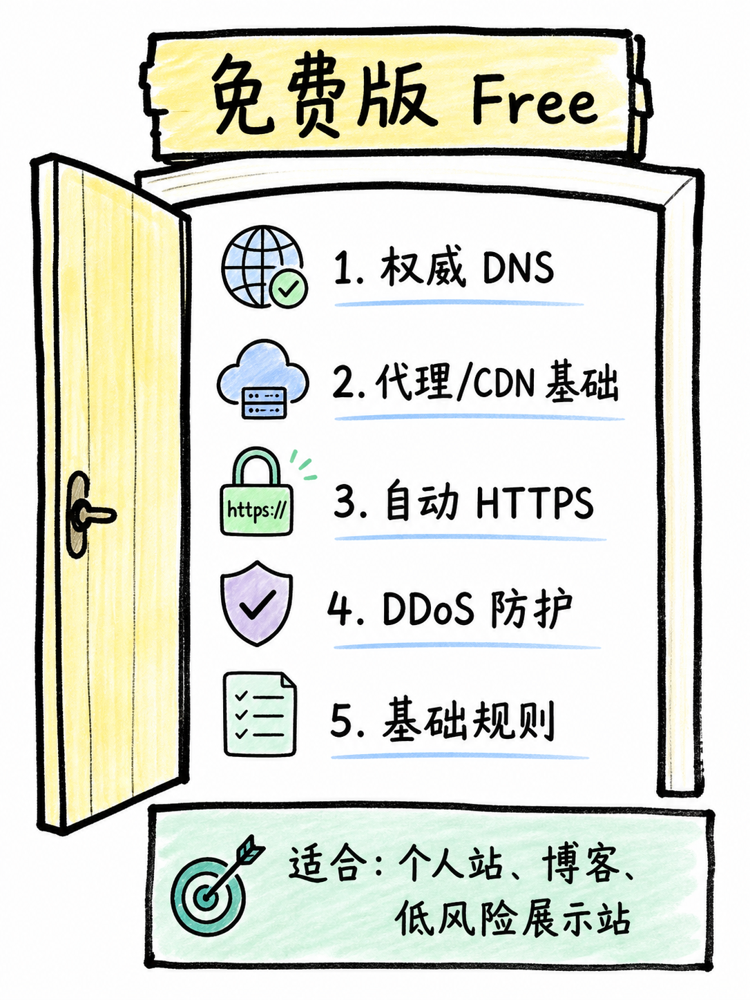

图解：这张图展示“免费版 Free”作为基础门，包含“权威 DNS”“代理/CDN 基础”“自动 HTTPS”“DDoS 防护”“基础规则”；角落写“适合：个人站、博客、低风险展示站”。不写实时价格。

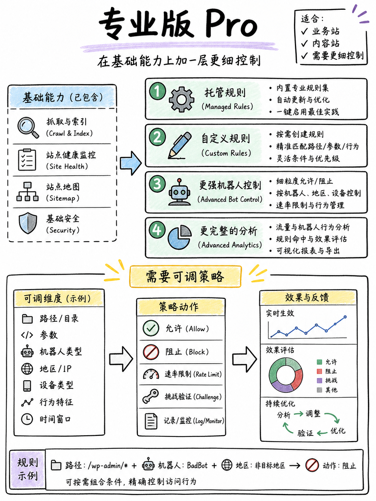

图解：这张图展示“专业版 Pro”在免费基础上增加更细的“托管规则”“自定义规则”“更强机器人控制”“更完整的分析”；角落写“适合：业务站、内容站、需要更细控制”。用黄色强调“需要可调策略”。

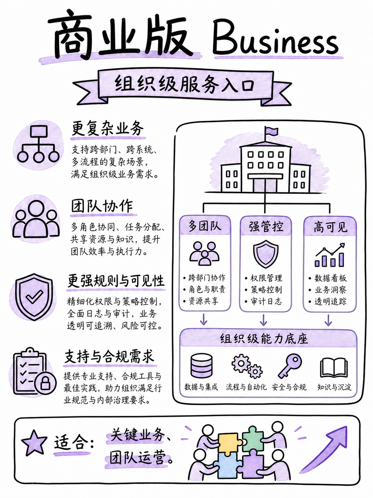

图解：这张图展示“商业版 Business”在更高可靠性与运维支持上加厚，出现“更复杂业务”“团队协作”“更强规则与可见性”“支持与合规需求”；角落写“适合：关键业务、团队运营”。用紫色表示组织级扩展，避免虚构具体 SLA 数字。

## 把网站接上 Cloudflare，怎么做？

控制台与域名注册商两边配合，顺序比按钮更重要

把网站接上 Cloudflare，怎么做？流程可以概括为四步。先在 Cloudflare 添加你的域名，选择方案，然后扫描并核对 DNS 记录。逐条核对网站、邮箱和验证记录，尤其不要漏掉 MX、TXT 这类记录。

然后到域名注册商，把原来的域名服务器 NS 替换成 Cloudflare 提供的两个地址。等待注册商传播并显示 Active，之后再检查 Web 记录是否开启橙云代理。

最后用浏览器和站点监控验证 HTTPS、登录、接口、缓存和回源是否正常。

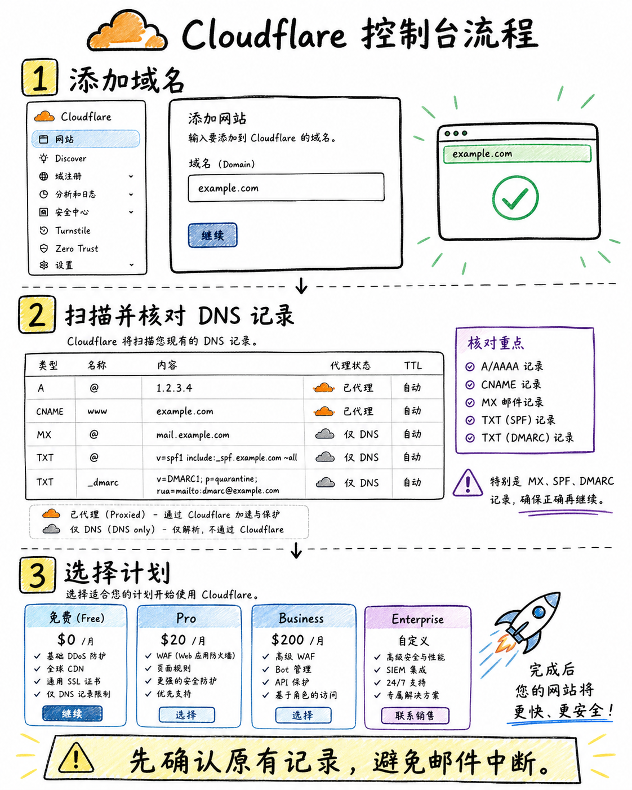

图解：这张图展示 Cloudflare 控制台流程界面（不是网页截图，手绘信息图即可）：步骤 1“添加域名”，步骤 2“扫描并核对 DNS 记录”，步骤 3“选择计划”。必须出现“先确认原有记录，避免邮件中断”。

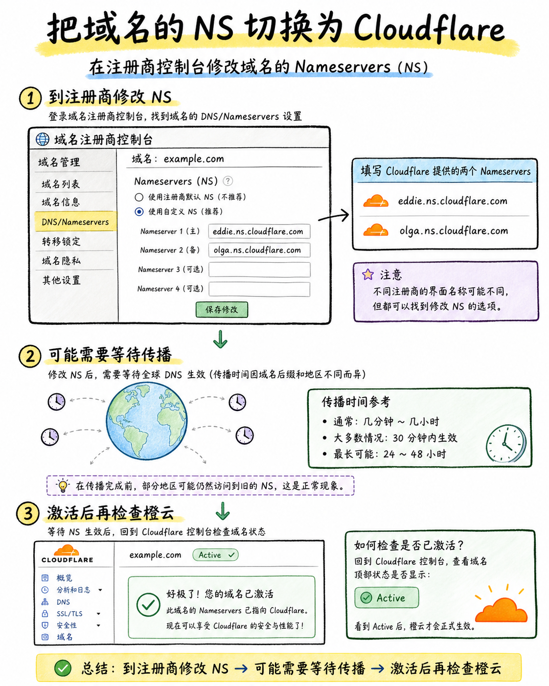

图解：这张图展示域名注册商控制台把原 NS 切换为 Cloudflare 提供的两个 nameserver，旁边画状态检查“等待生效 → Active”；标注“到注册商修改 NS”“可能需要等待传播”“激活后再检查橙云”。

## 最后记住：免费够不够？

用风险和控制需求做决定，不用功能清单制造焦虑

最后，免费版到底够不够？先给结论，再看什么情况下需要升级。如果只是个人站或简单展示站，通常免费版就够用。如果业务依赖稳定访问、规则很多、团队协作或需要更细分析，再考虑升级。

把口诀记成三步：先改 NS，再核对 DNS，最后按需开启橙云和安全规则。Cloudflare 不是替你做完运维，而是把网站入口变成一个更可控的服务层。

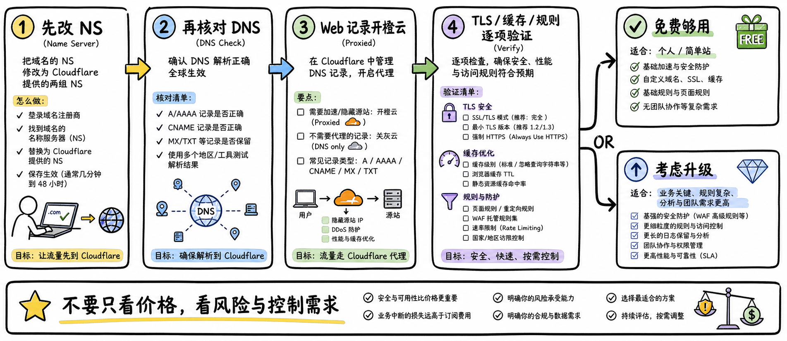

图解：这张图展示一条完整口诀链：“先改 NS → 再核对 DNS → Web 记录开橙云 → TLS/缓存/规则逐项验证”，右侧分叉“免费够用：个人/简单站”“考虑升级：业务关键、规则复杂、分析与团队需求更高”。结尾标注“不要只看价格，看风险与控制需求”。无顶部横幅大标题，整板饱满。

## 小结

把问题拆成目标、约束、证据和验证四部分，通常比直接寻找唯一答案更可靠。先用本文的框架完成一次小范围验证，再根据真实反馈调整下一步。

## 参考资料

> 📌 **查阅提示**：点击下方超链接可直接复制对应网址，粘贴至手机或电脑浏览器中即可查阅官方完整技术文档与规范。

- [【Cloudflare 官方文档】Cloudflare 边缘网络核心工作原理](https://developers.cloudflare.com/fundamentals/concepts/how-cloudflare-works/)  
  *说明：官方解析反向代理、Anycast 任播网络与分布式安全清洗中心拓扑。*
- [【Cloudflare 官方文档】DNS 代理状态（小橙云）与仅 DNS 模式](https://developers.cloudflare.com/dns/proxy-status/)  
  *说明：详解开橙云代理与灰云穿透源站的本质区别及对流量安全的影响。*
- [【Cloudflare 官方文档】域名 Nameserver 修改与生效指引](https://developers.cloudflare.com/dns/nameservers/update-nameservers/)  
  *说明：如何在各类注册商后台修改权威 NS 记录并完成平滑迁移。*
- [【Cloudflare 官方文档】Web 应用防火墙（WAF）托管规则集](https://developers.cloudflare.com/waf/)  
  *说明：Cloudflare 托管安全规则、自定义拦截策略与速率限制防护手册。*
- [【Cloudflare 官方文档】SSL/TLS 加密模式全解析（Flexible/Full/Strict）](https://developers.cloudflare.com/ssl/)  
  *说明：详细对比灵活加密、完全加密与严格加密证书的安全性与防中间人攻击配置。*
- [【Cloudflare 官方文档】DDoS 防护机制与自动化防御规范](https://developers.cloudflare.com/ddos-protection/)  
  *说明：三到七层未计量 DDoS 流量清洗与智能防护策略说明。*
