# 计算机从哪里来？

> 对应短视频主题：计算机从哪里来？  
> 资料核验与更新：2026-09-12

从算盘、巴贝奇分析机，到 ENIAC、存储程序和个人电脑，用一条清晰的线看懂计算机为什么会出现、又怎样一步步变成今天的样子。

## 阅读边界

本文依据原始课程的研究笔记、课程结构和发布文案整理。涉及产品、模型、版本、平台规则、价格或资格等可能变化的信息，实践前应以当前官方资料和实际环境为准。

## 计算机从哪里来？

从算盘、机械计算到存储程序，追踪五次关键跃迁

计算机是怎么起源的？它又怎样发展成今天的样子？答案不是某一年突然蹦出来，而是一连串需求推动的结果。

我们沿着五个关键词，看懂这条演进路线。

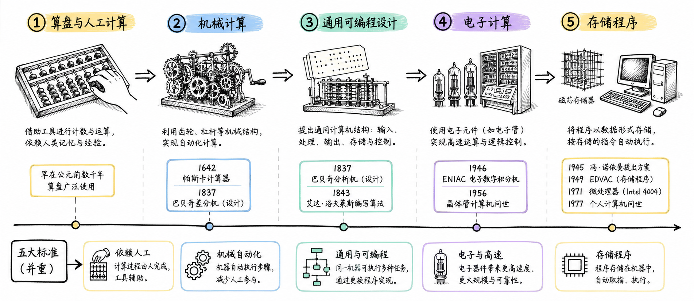

图解：计算机发展演进长卷：从机械计算、电子计算到存储程序与现代微处理器。

## 机械时代：先让计算自动起来

算盘解决重复劳动，巴贝奇把机器想成可编程系统

最早的计算工具，不是电脑，而是算盘、计数板和对数表。它们减轻了重复劳动，却不能自己判断下一步做什么。

1822年，巴贝奇设计差分机，让齿轮自动计算并打印数表。后来他提出分析机，第一次把存储、运算和程序控制放到一台机器里。

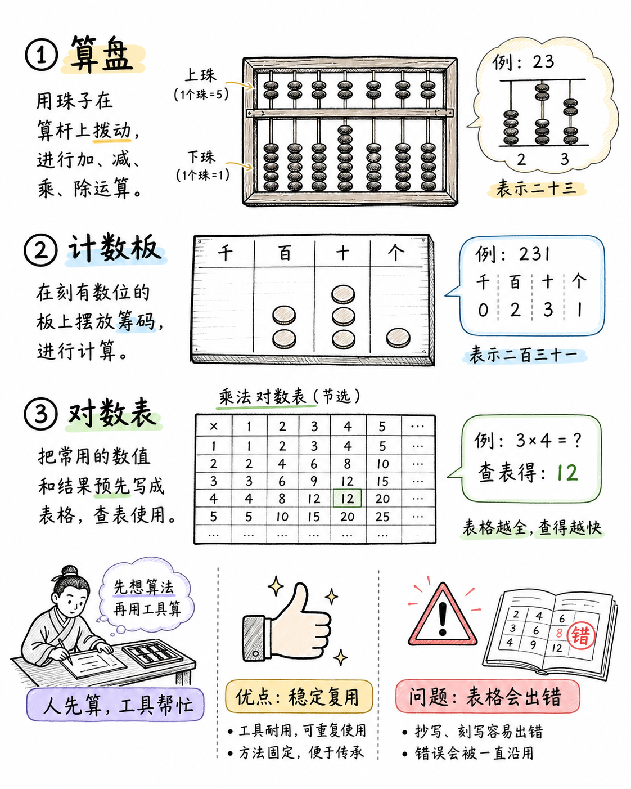

图解：早期辅助计算工具：算盘、筹算板与纳皮尔对数表（人为主导，工具辅助）。

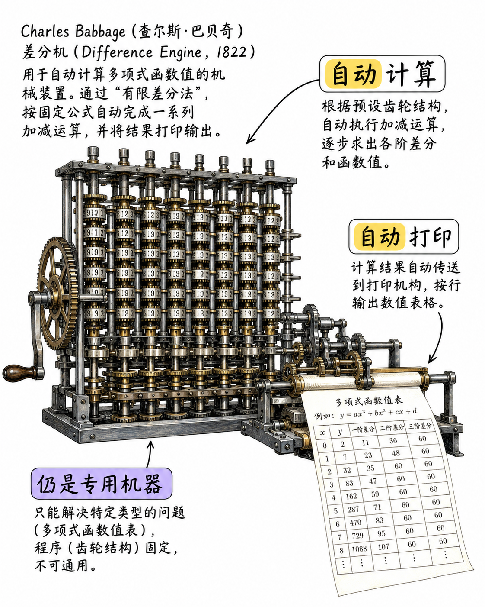

图解：1822 差分机，齿轮自动计算并打印数表。

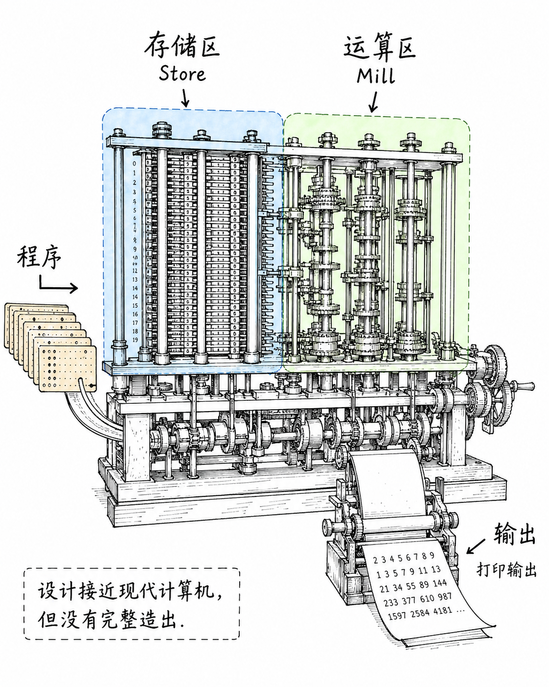

图解：1837 分析机，存储区、运算区、穿孔卡程序控制。

## 分析机：现代计算机的设计雏形

程序不再是手工操作，而是一串可以执行的步骤

分析机虽然没有完整造出来，但它已经像一台现代计算机。它有存储区，保存数字；有运算区，处理数字；还有穿孔卡输入程序。

艾达·洛芙莱斯在1843年写下计算伯努利数的步骤。这类算法说明，机器不只会算数，也能按规则执行一连串操作。

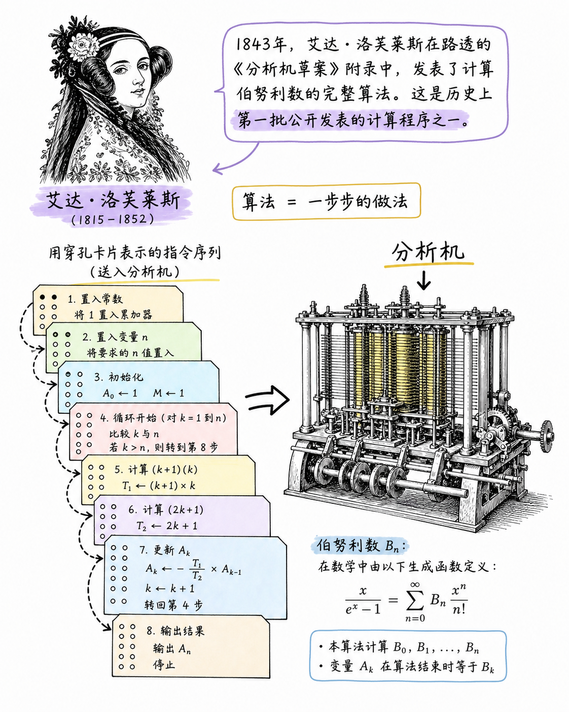

图解：查尔斯·巴贝奇 1822 年差分机：利用精密齿轮系统实现多项式数表的自动打印。

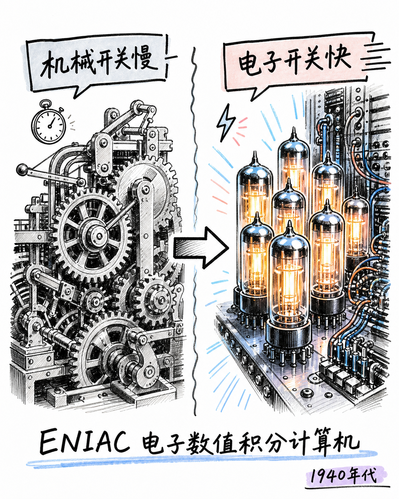

图解：1837 年分析机设计构想：运算器（Mill）、存储区（Store）与穿孔卡片程序控制。

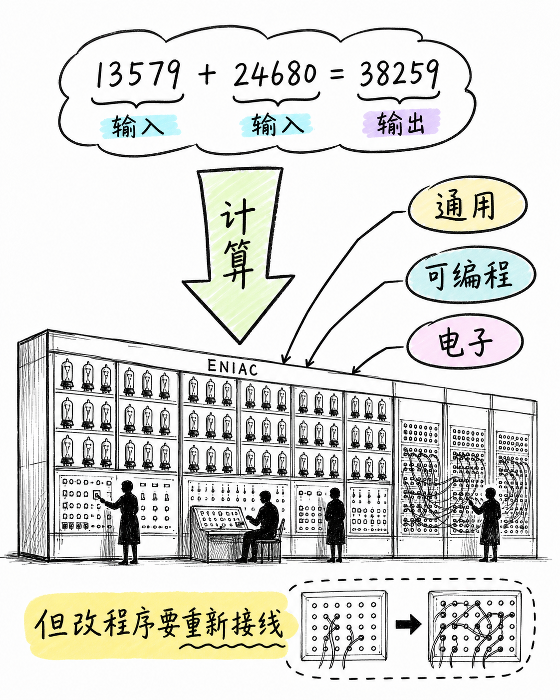

图解：艾达·洛芙莱斯与世界上首个计算机算法（1843 年伯努利数计算程序）。

## 电子化之后，速度与通用性一起跃迁

真空管带来速度，存储程序让改任务不必重新接线

到了1940年代，真空管把机械开关换成电子开关，计算速度大幅提高。1945年前后，ENIAC成为早期电子通用计算机的代表。

但它改程序很麻烦，常常要重新插拔线路和开关。存储程序思想改变了这一点：程序和数据都放进记忆里，机器按指令自动运行。

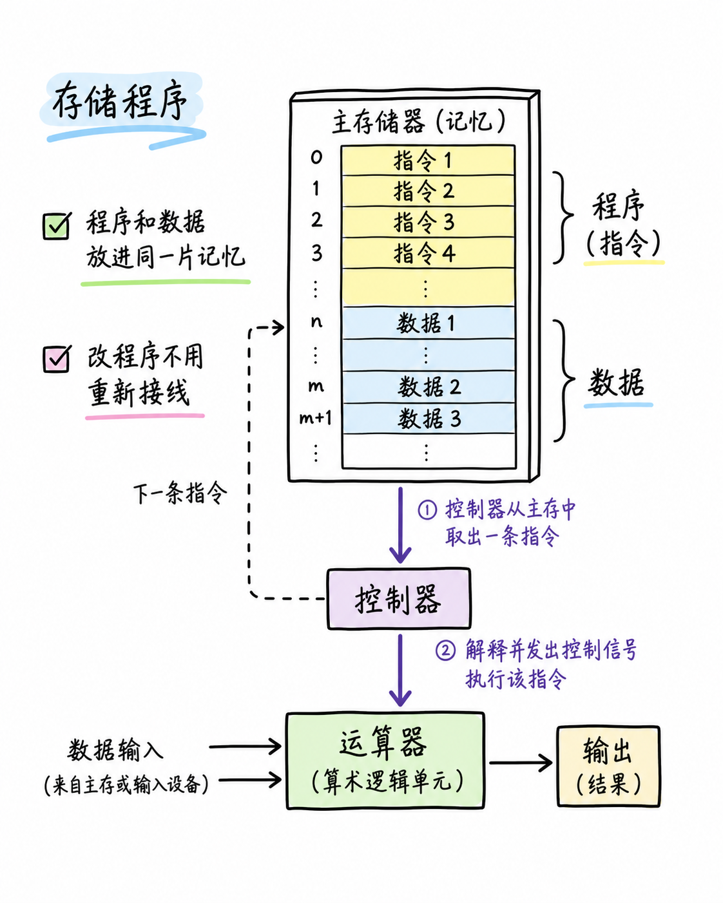

图解：算法概念的物理实例化：将人类解题思维转化为机器可执行的步进指令。

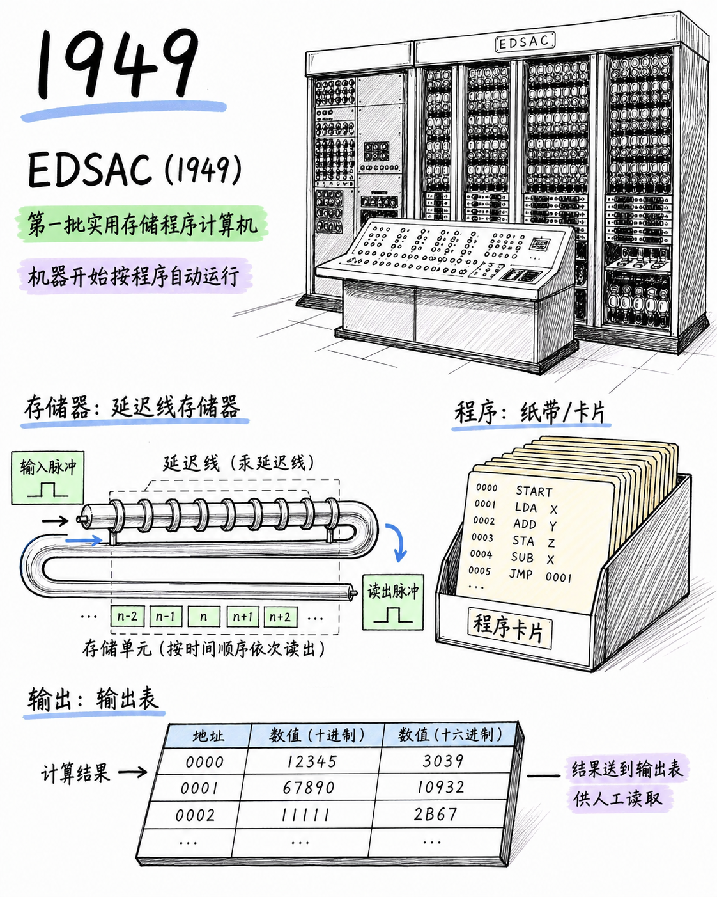

图解：程序指令、内存存储与运算核心之间的互动关系演进。

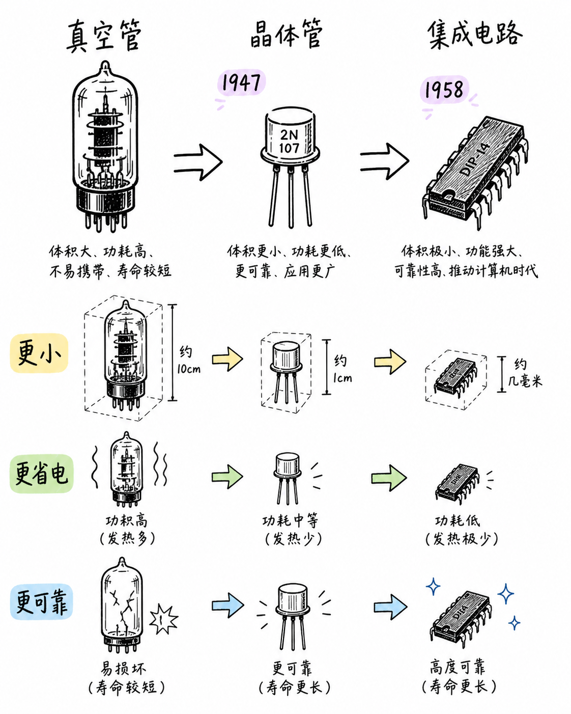

图解：电子化跃迁：真空电子管取代机械齿轮，实现纳秒级高速逻辑开关。

## 晶体管与集成电路：机器开始变小

更小、更省电、更可靠，计算从少数机构走向更多人

1947年晶体管出现，后来集成电路把更多开关放进更小的芯片。机器因此更小、更省电，也更可靠。

计算机从实验室和大型机构，逐渐走进办公室和家庭。

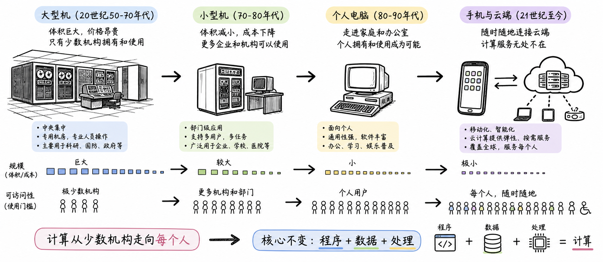

图解：ENIAC 开启电子通用计算时代：计算速度质的飞跃与硬连线编程的局限。

## 一条线看懂计算机历史

需求推动自动化，技术推动速度，架构推动通用性

所以，计算机不是某个人某天突然发明的。它先把计算做得更自动，再做得更快，最后做得更通用。

下次再问第一台计算机是哪一台，先问清楚：你说的是哪一种第一？

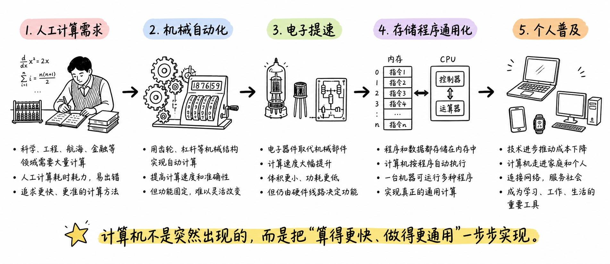

图解：计算机历史七十年总结：算力需求驱动机械自动化、电子提速与通用软件生态繁荣。

## 小结

把问题拆成目标、约束、证据和验证四部分，通常比直接寻找唯一答案更可靠。先用本文的框架完成一次小范围验证，再根据真实反馈调整下一步。

## 参考资料

> 📌 **查阅提示**：点击下方超链接可直接复制对应网址，粘贴至手机或电脑浏览器中即可查阅官方完整技术文档与规范。

- [【维基百科】计算机科学与计算机器发展史](https://en.wikipedia.org/wiki/History_of_computing)  
  *说明：从古代机械算盘、近代差分机到电子计算机的七十年跨越全景。*
- [【计算机历史博物馆】计算历史里程碑时间线](https://www.computerhistory.org/timeline/computers/)  
  *说明：全球最大的计算机历史博物馆官方展陈资料与权威历史档案。*
- [【科学博物馆档案】查尔斯·巴贝奇分析机手稿与设计原稿](https://collection.sciencemuseumgroup.org.uk/documents/aa110000065)  
  *说明：英国科学博物馆保存的世界上首部通用可编程机械计算机设计图纸与说明。*
- [【宾夕法尼亚大学档案】ENIAC 首台通用电子计算机历史回顾](https://www.seas.upenn.edu/about/history/eniac/)  
  *说明：1946 年世界首台通用电子数字计算机的工程设计、真空管运用与重新连线限制。*
