# 容器安全扫描：Trivy、Grype 与 Snyk 深度选型

> 对应短视频主题：容器安全扫描：三工具怎么选？  
> 资料核验与更新：2026-09-12

容器安全扫描的目标不是单纯刷出一张冗长吓人的漏洞清单，而是建立从镜像分层、软件物料清单（SBOM）证据链到流水线自动化门禁与漏洞修复闭环的工程防线。Trivy、Grype 与 Snyk 核心定位不同，选型应综合团队的扫描范围、制品审计需求与安全运营协作成本来决定。

## 阅读边界

本文依据原始课程的研究笔记、课程结构和发布文案整理。涉及产品、模型、版本、平台规则、价格或资格等可能变化的信息，实践前应以当前官方资料和实际环境为准。

## 容器安全扫描的表面与 SBOM 证据链

一个容器镜像不仅仅包含业务代码，还包括基础操作系统包（如 deb、rpm、apk）以及各类应用语言运行时依赖（如 npm、pip、maven、cargo）。软件物料清单（SBOM）是记录容器内部组件清单的结构化事实证据，是进行漏洞精准比对与软件供应链审计的核心基础。

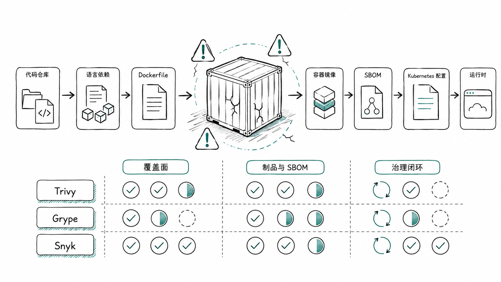

图解：容器全生命周期扫描表面：操作系统依赖、语言级包、IaC 模板与敏感凭据。

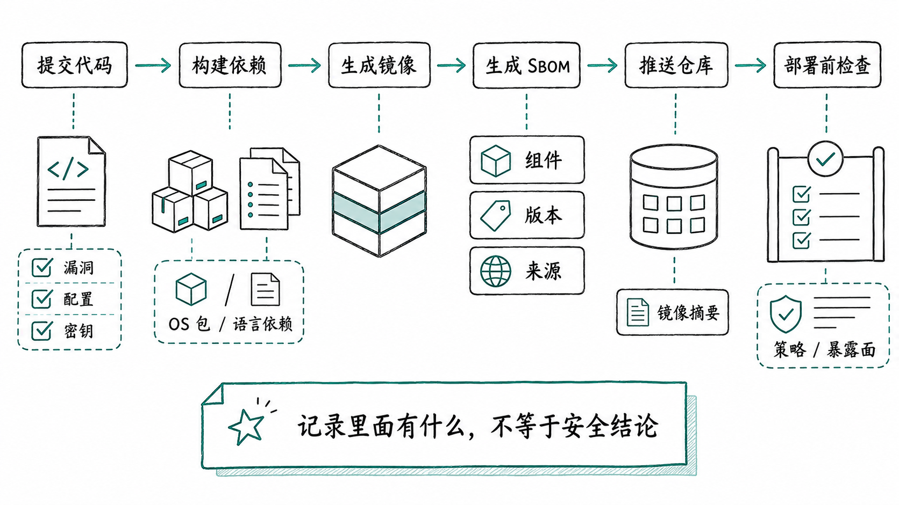

图解：SBOM 与漏洞匹配：通过清晰的制品成分清单，快速与国家漏洞库（CVE）进行比对。

## 全能开源守护者：Trivy 的多维覆盖

Aqua Security 出品的 Trivy 凭借极高的一体化集成度成为开源社区首选。它不仅能扫描容器镜像的 OS 与语言依赖漏洞，还能同时检查 IaC 基础设施模板配置缺陷（如 Terraform、Kubernetes 配置漏洞）以及代码库中误提交的明文密钥，适合希望用单个 CLI 工具统一扫描体系的团队。

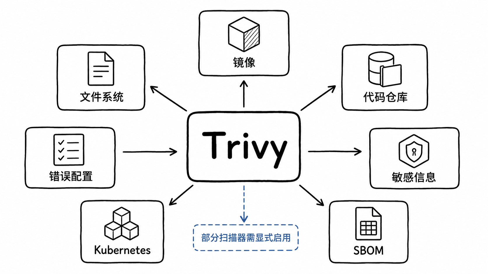

图解：Trivy 多维扫描能力：单二进制工具覆盖镜像 CVE、配置漂移、IaC 隐患与密钥泄露。

## 供应链合规利器：Syft 与 Grype 黄金组合

Anchore 团队遵循 UNIX 哲学打造了 Syft 与 Grype 这一对专业工具：Syft 专注以极高精度生成符合 SPDX 和 CycloneDX 工业标准的 SBOM 文件；Grype 则专注于将这些 SBOM 文件与丰富更新的漏洞数据库进行比对。这种职责解耦非常适合需要严格制品留档与外部合规审计的企业团队。

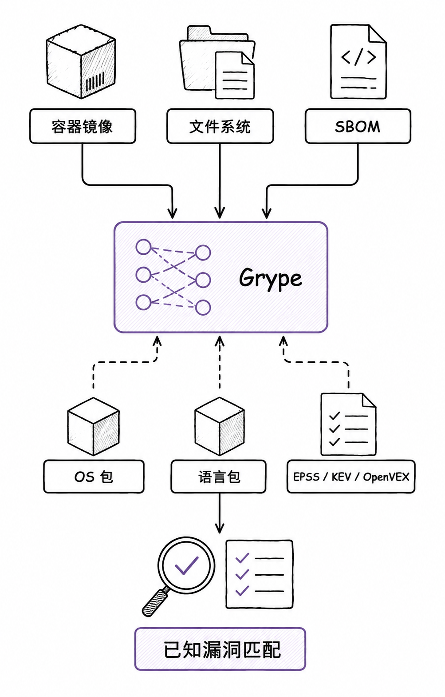

图解：Grype 专注于高效漏洞匹配：精准解析镜像分层，高速查询多来源 CVE 数据库。

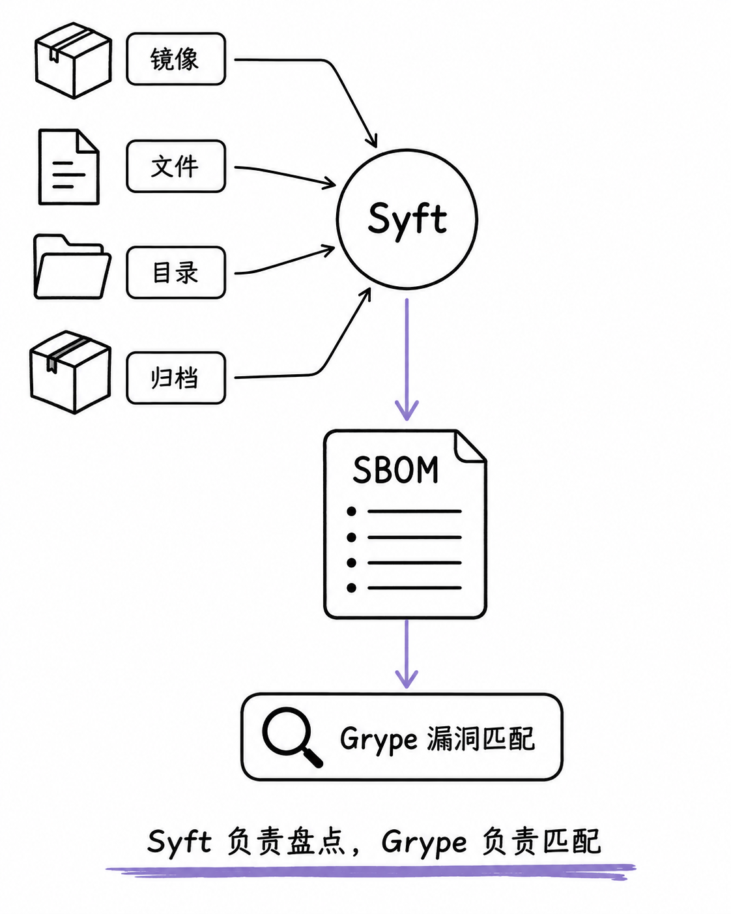

图解：Syft 与 Grype 协同流：Syft 负责成分解构产出标准 SBOM，Grype 专注漏洞比对。

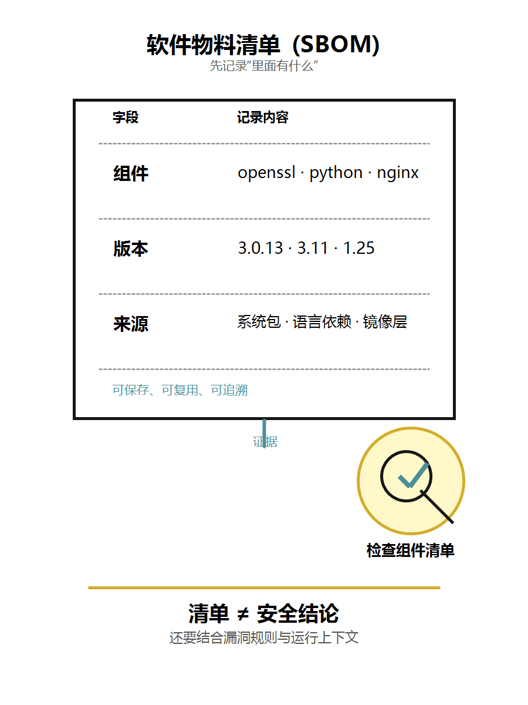

图解：软件物料证据链留存：作为出厂交付凭证，支持事后零日漏洞（0-Day）秒级回溯排查。

## 企业级修复平台：Snyk 与流水线门禁闭环

Snyk 的最大优势在于它不仅仅是扫描器，更是一套赋能开发者的修复生态。它能直接在 GitHub/GitLab 上发起包含最小升级版本的修复 Pull Request，并在企业层面制定统一的安全策略门禁。但无论静态镜像如何安全，生产环境仍需配合运行时防护（如 Falco）构筑立体纵深防御。

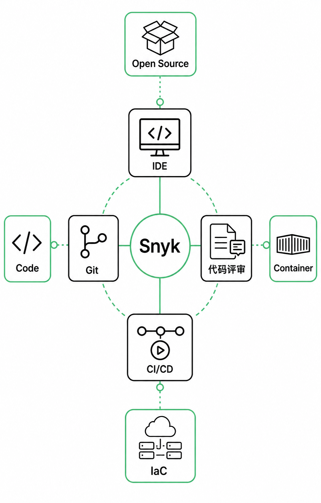

图解：Snyk 开发者优先安全平台：深入 IDE、代码仓库与容器构建流水线全程监控。

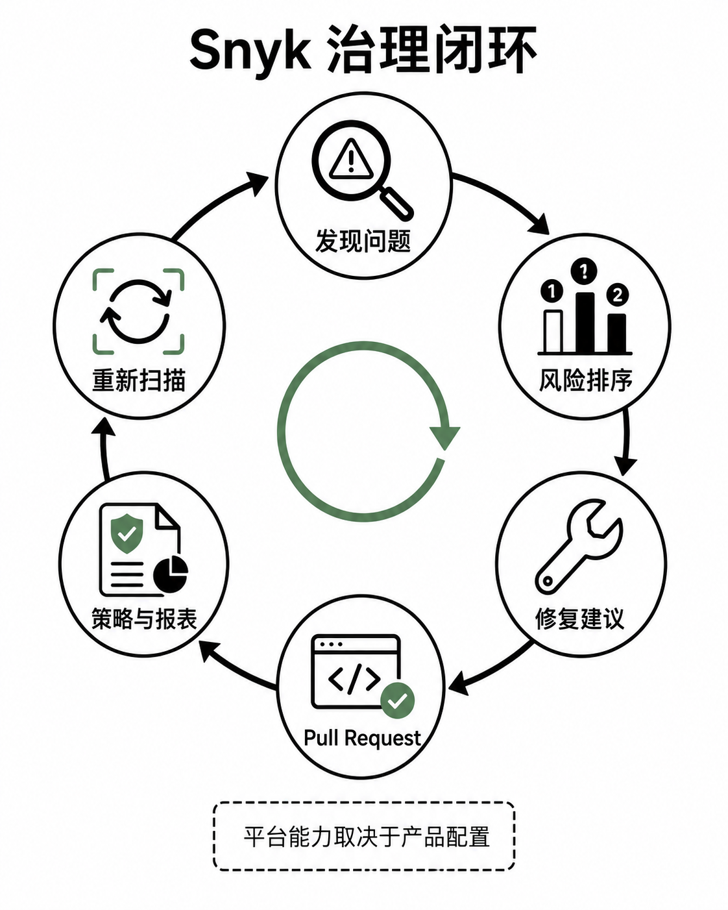

图解：漏洞修复闭环：一键发起无冲突依赖升级 PR，打通从发现到修复的最后一公里。

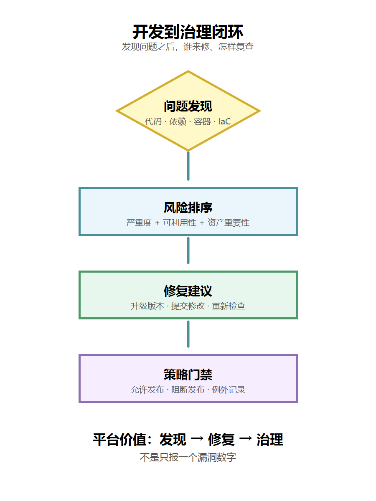

图解：企业安全门禁：针对严重等级（Critical/High）设置硬性阻断，阻断危险镜像入库。

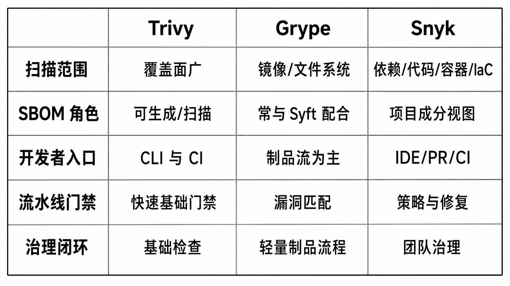

图解：三大工具横向对比：开源协议、扫描速度、数据库丰富度与企业运营成本。

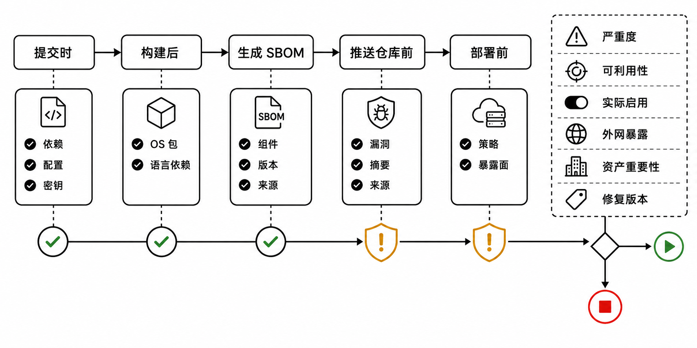

图解：多阶段流水线防线：代码提交扫依赖、构建完成扫镜像、部署前扫策略准入。

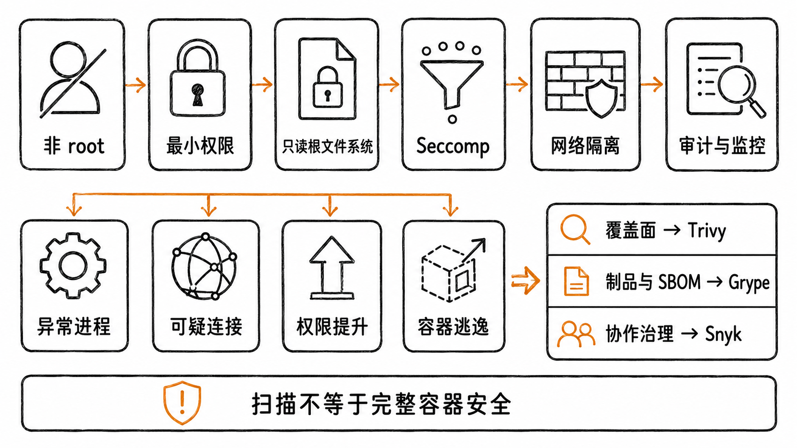

图解：静态扫描与运行时防护互补：构建期扫已知 CVE，运行期拦截未知入侵与异常行为。

## 小结

求全求快用 Trivy；严格合规审计用 Syft + Grype；重度依赖开发者自动化修复闭环且有预算选 Snyk。静态扫描守住出厂质量，运行时监控守住线上边界。

## 参考资料

以下链接来自官方权威技术文档与行业规范；动态规则请以其当前页面为准。

- [Trivy Official Documentation](https://aquasecurity.github.io/trivy/)
- [Grype & Syft by Anchore](https://github.com/anchore/grype)
- [Snyk Container Documentation](https://docs.snyk.io/products/snyk-container)
