# K8s、Docker Compose 与 Nomad 怎么选？容器编排深度横评

> 对应短视频主题：K8s、Docker Compose、Nomad怎么选？  
> 资料核验与更新：2026-09-12

编排工具的核心价值是让多个相互协作的服务能够自动化部署、自愈恢复、网络互通与弹性扩缩容。但编排技术的选型切忌盲目追求工业级标准，必须紧密结合业务实际运行规模、团队运维人手以及系统异构负载情况来权衡。

## 阅读边界

本文依据原始课程的研究笔记、课程结构和发布文案整理。涉及产品、模型、版本、平台规则、价格或资格等可能变化的信息，实践前应以当前官方资料和实际环境为准。

## 三类编排工具的设计哲学与适用形态

Docker Compose 专注于单主机上的多容器微服务定义，用一个 YAML 文件理清依赖、端口与卷挂载，心智负担极低；Kubernetes 则是云原生事实标准，提供了近乎无限的扩展能力与完备的声明式集群生态；Nomad 则坚持单二进制极简哲学，兼顾容器与传统非容器进程统一调度。

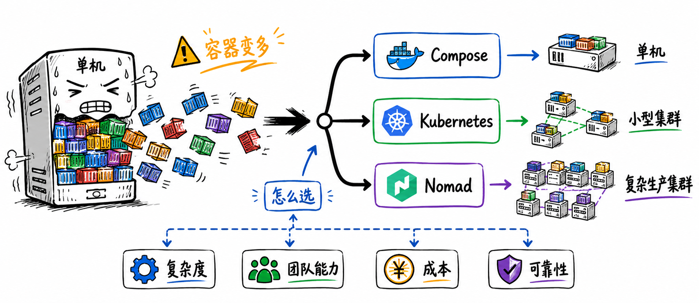

图解：容器编排三剑客选型总览：从轻量单机编排到跨机房分布式集群调度。

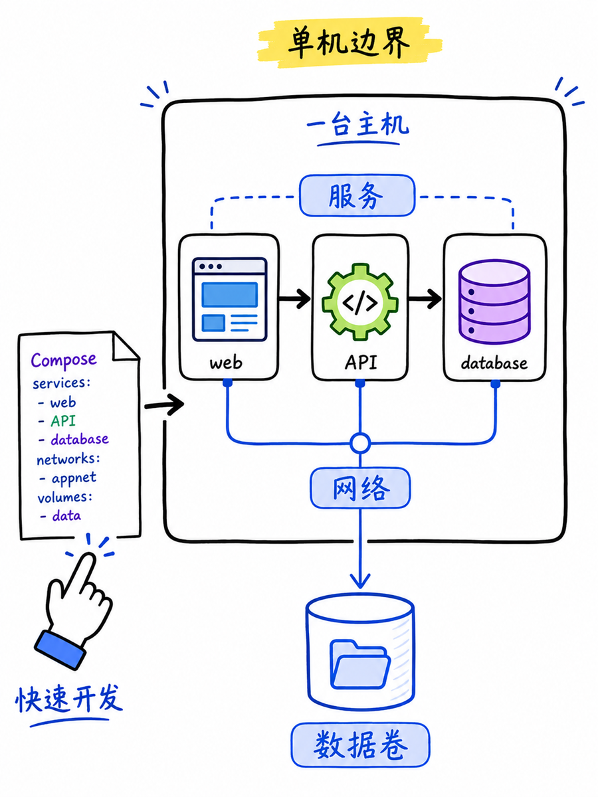

图解：Docker Compose 单机形态：简单快捷定义服务拓扑，本地开发测试的不二之选。

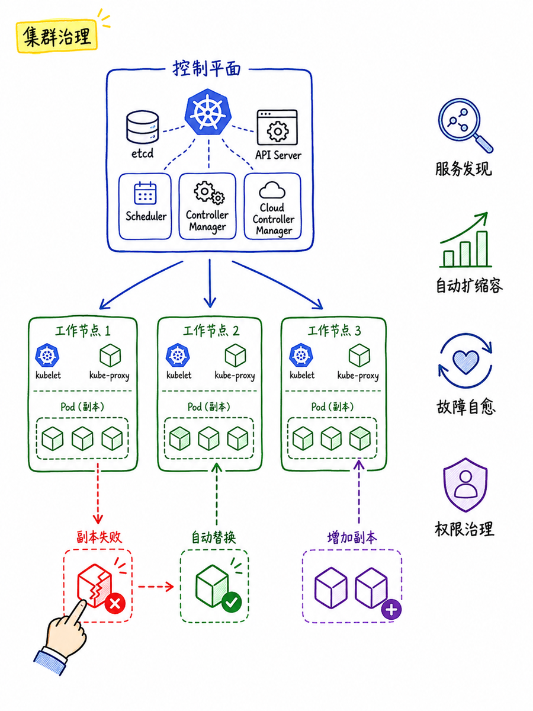

图解：Kubernetes 分布式集群架构：Master 控制平面、Node 工作节点与海量 CRD 扩展。

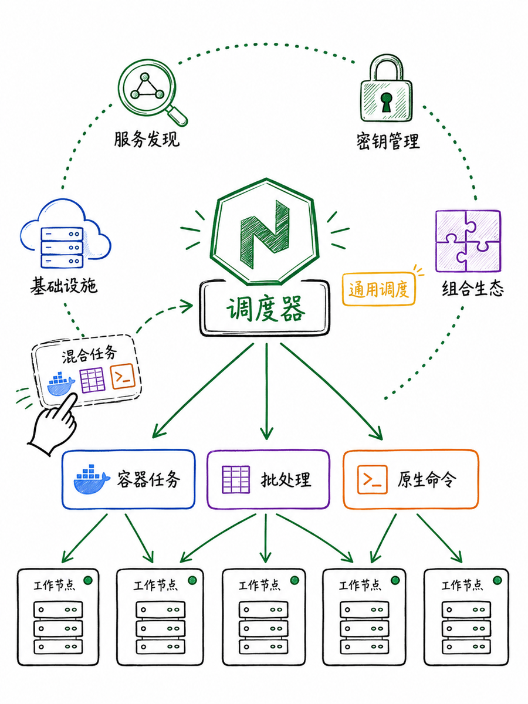

图解：Nomad 极简调度器：基于单二进制文件的声明式集群管理，性能卓越且运维极轻。

## 从单机到集群编排的真实鸿沟

很多团队以为从 Docker Compose 迁移到集群调度只是换一个配置文件，但在生产集群中，你必须同时面对分布式网络（CNI）、持久化存储卷（CSI）、动态服务发现、跨机器健康探针以及滚动升级中的流量摘除等复杂命题，运维负担呈指数级上升。

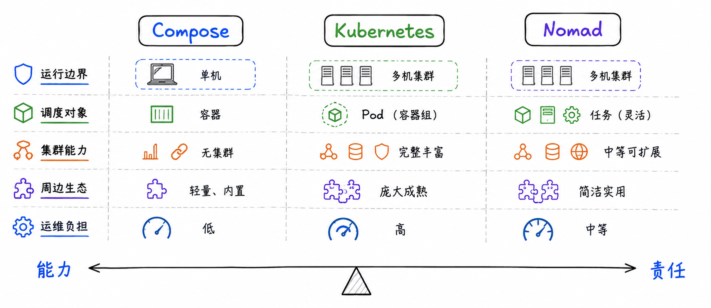

图解：三大编排方案对比：学习曲线、集群运维开销、调度延迟与生态丰富度对照。

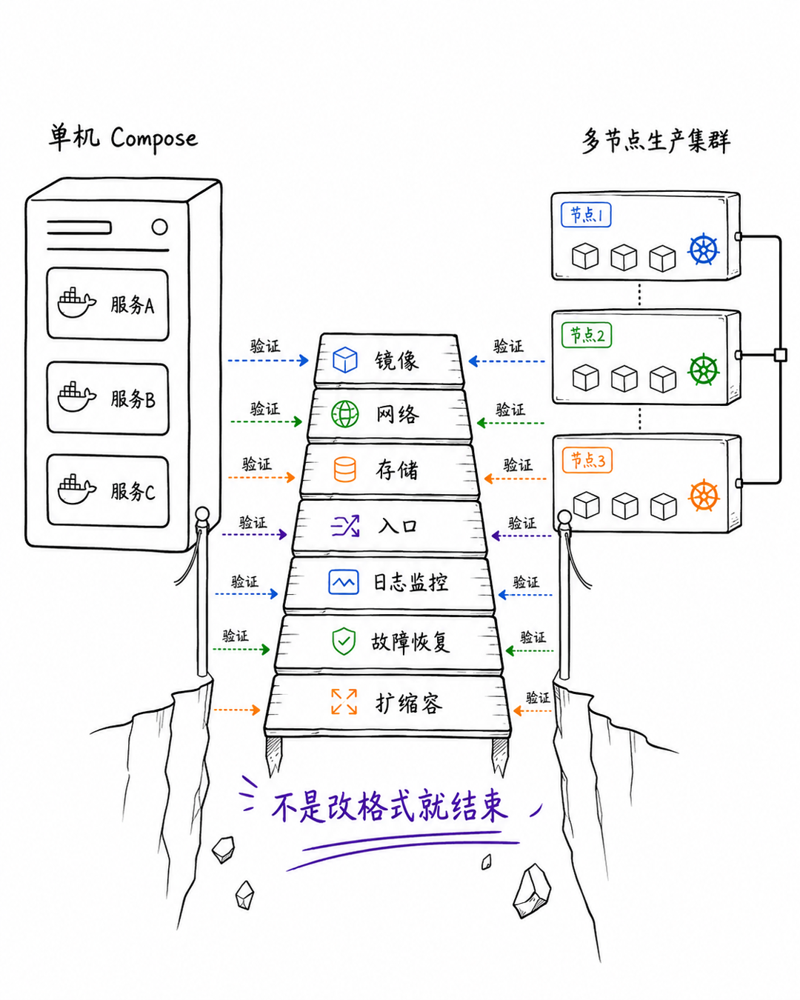

图解：单机到集群的工程跨度：服务发现、负载均衡、跨节点网络与存储挂载的复杂度。

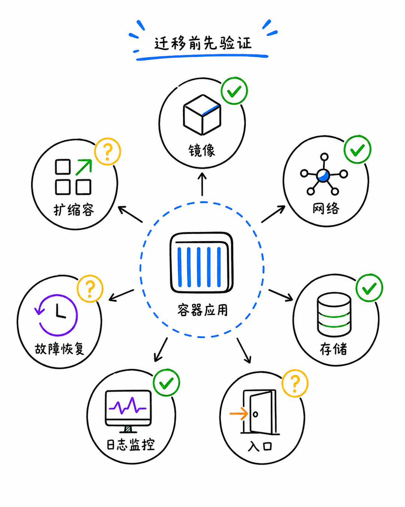

图解：集群演进迁移核对清单：评估配置拆分、监控告警、备份策略与故障应急准备。

## 平滑过渡与混合工作负载演进

如果觉得标准 Kubernetes 太过庞大沉重，轻量级的 K3s 是非常优秀的过渡方案，它将 etcd 与所有控制组件高度内聚，占用极低内存却拥有 100% 兼容的 K8s API。而如果企业内部不仅有容器，还有大量的原生 Java Jar 包、Windows 进程或批处理任务，Nomad 的多驱动混合调度优势便无可替代。

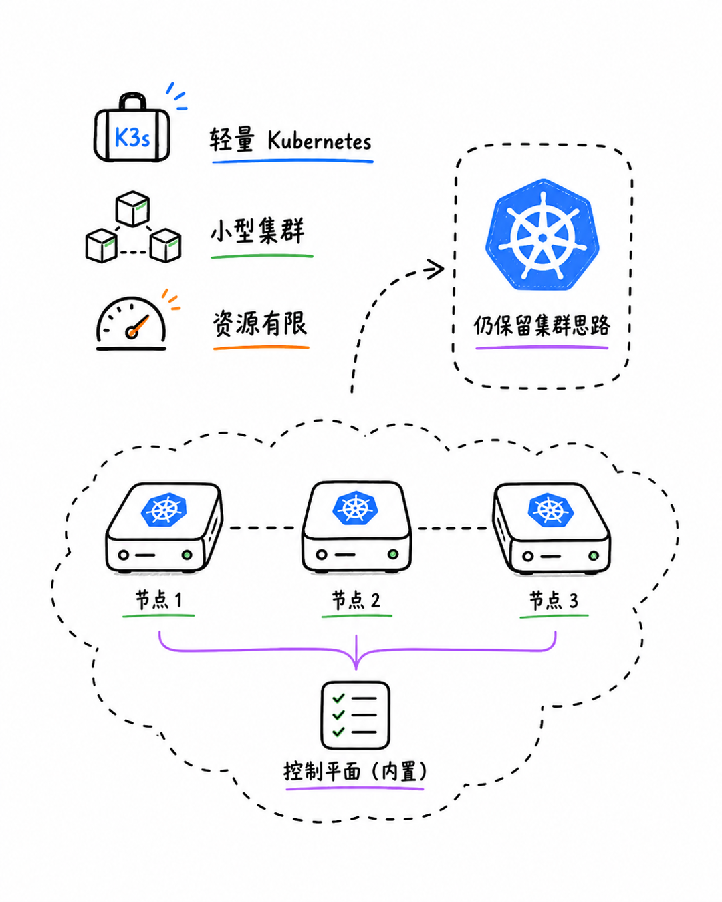

图解：K3s 轻量级路线：裁剪老旧云厂商代码，兼具完整 K8s API 与极低资源消耗。

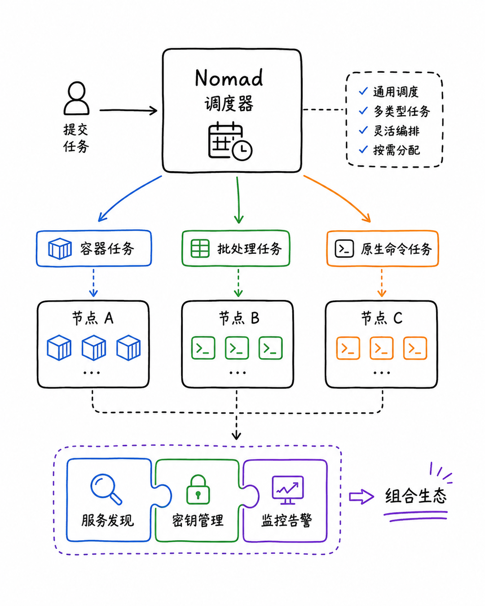

图解：Nomad 混合负载统一纳管：在同一套集群中混合调度 Docker 容器、Jar 包与原生可执行文件。

## 典型业务场景与最终落地树

不要因为技术流行而引入运维灾难。1-3 台服务器运行内部小应用，Docker Compose 加定时脚本通常就足够可靠；业务高并发、跨云容灾与弹性伸缩必须上 Kubernetes；而对于 10-50 台机器、运维资源紧张且存在混合遗留系统的团队，Nomad 往往能带来最高的投入产出比。

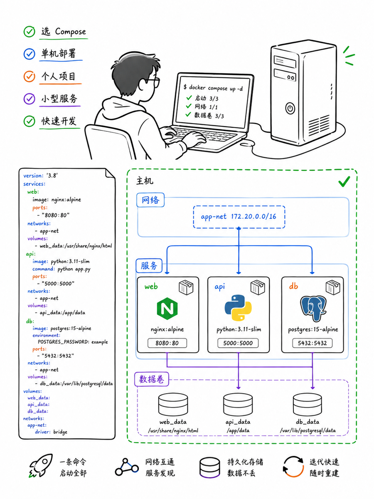

图解：Docker Compose 最佳落地：初创项目 MVP、研发本地联调与独立工具箱环境。

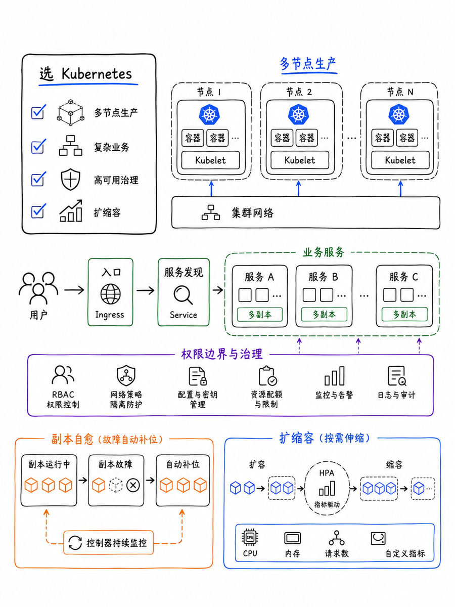

图解：Kubernetes 最佳落地：大型微服务架构、动态弹性伸缩与复杂云原生应用生态。

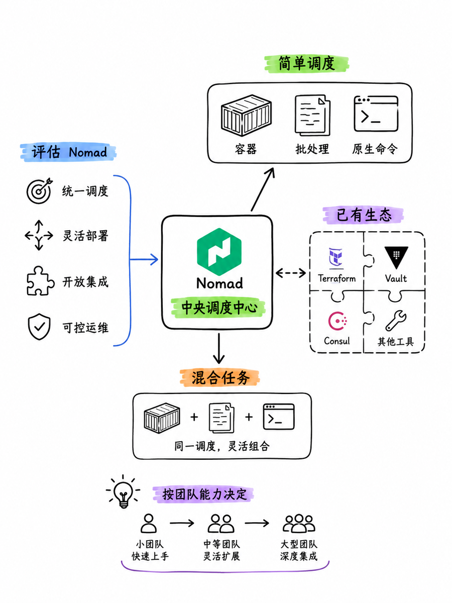

图解：Nomad 最佳落地：中小规模高并发集群、跨数据中心调度与追求极简运维团队。

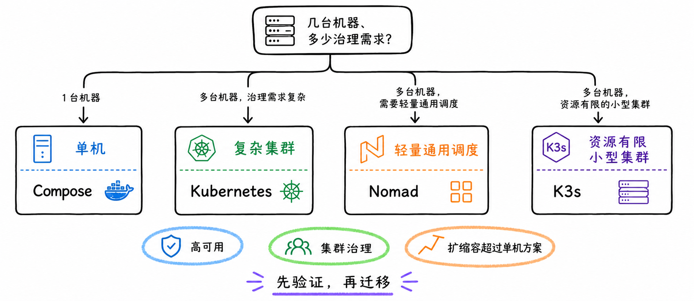

图解：容器编排技术选型决策树：按集群规模、业务复杂度与团队运维能力做决定。

## 小结

单机服务组合选 Docker Compose；复杂集群和微服务生态选 Kubernetes；追求极简运维或混合负载调度选 Nomad。能用单机解决的问题，绝不轻易引入集群复杂度。

## 参考资料

> 📌 **查阅提示**：点击下方超链接可直接复制对应网址，粘贴至手机或电脑浏览器中即可查阅官方完整技术文档与规范。

- [【官方资料】Docker Compose Overview](https://docs.docker.com/compose/)  
  *说明：官方权威技术规范与开发者实现参考手册。*
- [【官方资料】Kubernetes Documentation](https://kubernetes.io/docs/home/)  
  *说明：官方权威技术规范与开发者实现参考手册。*
- [【官方资料】HashiCorp Nomad Documentation](https://developer.hashicorp.com/nomad/docs)  
  *说明：官方权威技术规范与开发者实现参考手册。*
