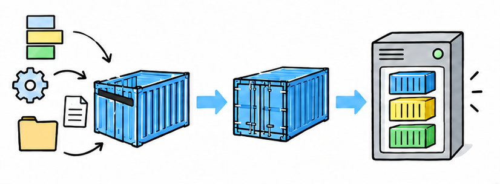
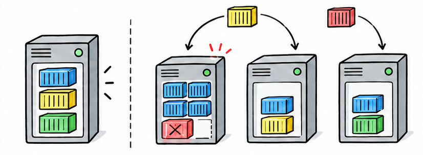
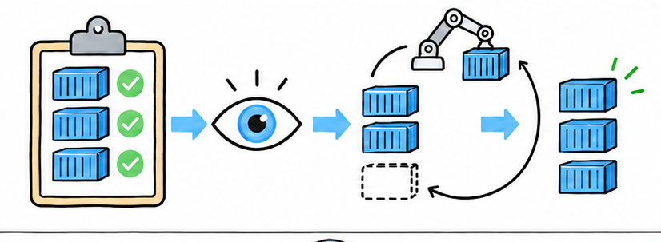
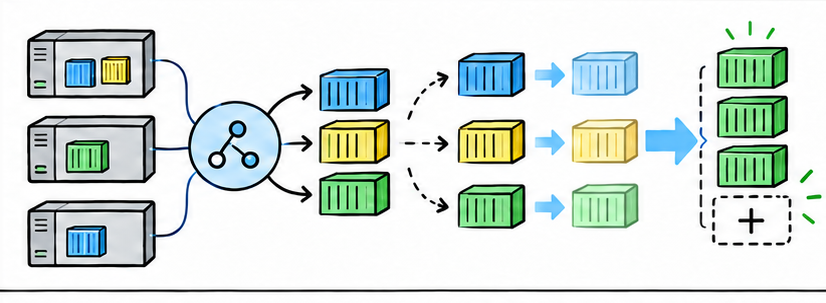
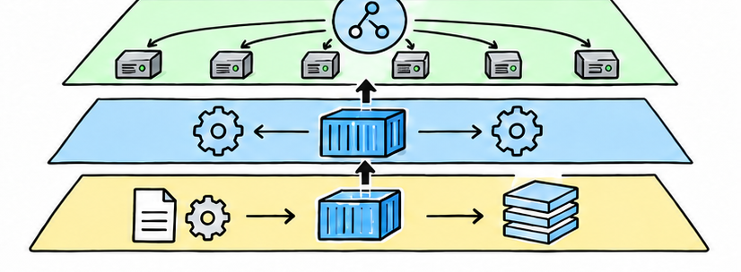
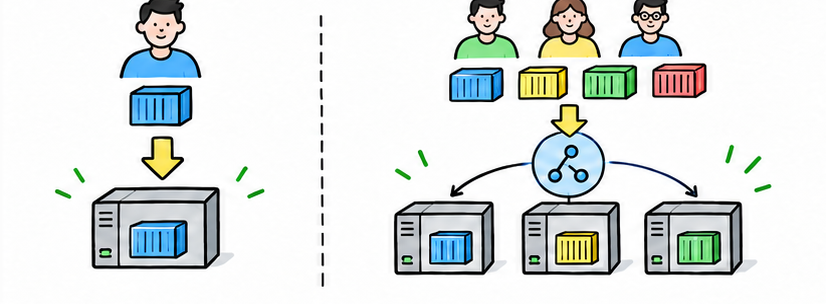

# 有了 Docker，为什么还非要 K8s 不可？两者到底是不是竞争关系？

> 对应短视频主题：有了 Docker，为什么还非要 K8s 不可？两者到底是不是竞争关系？  
> 资料核验与更新：2026-09-12

从容器镜像、单机运行到集群调度和自愈，一次讲清 Docker 与 Kubernetes 为什么常常配合使用，以及什么时候根本不必上 K8s。

## 阅读边界

本文依据原始课程的研究笔记、课程结构和发布文案整理。涉及产品、模型、版本、平台规则、价格或资格等可能变化的信息，实践前应以当前官方资料和实际环境为准。
原始研究记录标注的时间为：2026-08-26。
本页配图为依据正文新绘的 AI 辅助教学示意图；它们并非原始课程包内的素材，也不代表原始成片画面。

## Docker 管容器，K8s 管一群容器

先分清包装与集群管理，问题就简单了一半。

Docker 最擅长的，是把应用、依赖和配置做成标准镜像，再启动为隔离的容器。它解决了在我电脑上能跑，换台机器却跑不起来的问题。

Kubernetes，常简称 K8s，是管理许多容器和许多机器的系统。所以 Docker 更像标准货箱，K8s 更像持续安排货箱位置和运行状态的调度系统。

## 一台机器好管，多台机器就会失控

规模扩大后，启动容器只是运维工作的第一步。

只有一台服务器和几个容器时，Docker 加 Compose 往往已经够用。当机器变多，团队必须决定每个容器放在哪里，还要避免某台机器被塞满。

容器崩溃或整台机器掉线后，还要及时在有容量的机器上补回副本。发布新版本时，也要逐步替换旧容器，不能让所有副本同时停机。

## K8s 的核心，是持续纠偏

你声明想要的状态，控制系统不断修正现实。

K8s 的核心叫期望状态，也就是你想让系统始终保持的样子。例如你声明网页服务需要三个副本，控制系统就持续观察实际到底有几个。

如果一个副本消失，K8s 会创建新的副本，并把它安排到合适的节点。这种控制循环，把许多依赖人工值守的动作变成了可重复的自动纠偏。

## 规模变大后，需要一套集群工具箱

K8s 把常见的分布式运维问题做成统一能力。

调度会根据处理器和内存需求，把容器放到资源合适的节点。服务发现和负载均衡，为不断变化的容器副本提供相对稳定的访问入口。

滚动发布会分批替换副本，让新旧版本在受控过程中完成交接。水平扩缩容，就是根据负载增加或减少副本，而不是手工逐台启动容器。

## 不是竞争关系，而是不同层级

真正需要比较的，是同一层里的替代方案。

Docker 构建出的标准容器镜像，仍然可以交给 Kubernetes 集群运行。K8s 在节点上通过容器运行时接口，调用兼容的运行时真正启动容器。

Kubernetes 一点二四移除内置的 Docker 适配层，并不等于 Docker 镜像不能用了。因此 Docker Engine 与 K8s 多数时候不是同层竞争，而是开发打包与集群管理的配合。

真正和 K8s 更接近竞争的，是 Docker Swarm、其他编排器或托管应用平台。

## 别为先进而上，要看问题规模

K8s 是复杂度投资，不是技术等级考试。

如果只有少量服务、单台服务器和可接受的停机风险，Docker 加 Compose 通常更简单。不想管理集群时，还可以选择平台即服务或托管容器产品。

当多节点、多副本、频繁发布、弹性和故障恢复变成日常问题，K8s 的统一控制才开始值回成本。即使使用托管 K8s，团队仍要承担网络、权限、存储、监控和升级带来的复杂度。

结论是两者通常协作而非竞争，是否上 K8s 应由真实运维痛点决定。

## 小结

把问题拆成目标、约束、证据和验证四部分，通常比直接寻找唯一答案更可靠。先用本文的框架完成一次小范围验证，再根据真实反馈调整下一步。

## 参考资料

> 📌 **查阅提示**：点击下方超链接可直接复制对应网址，粘贴至手机或电脑浏览器中即可查阅官方完整技术文档与规范。

- [【维基百科】Docker 容器技术原理与历史](https://en.wikipedia.org/wiki/Docker_(software))  
  *说明：基于 Linux 内核 cgroups 与 namespaces 实现应用打包与进程隔离的开创性工具。*
- [【维基百科】Kubernetes 容器编排平台架构](https://en.wikipedia.org/wiki/Kubernetes)  
  *说明：源于 Google Borg 系统的生产级开源容器集群自动化部署与扩缩容平台。*
- [【Docker 官方指南】什么是容器与镜像？基础概念手册](https://docs.docker.com/get-started/docker-concepts/the-basics/what-is-a-container/)  
  *说明：官方解析只读镜像分层、联合文件系统与运行期容器实例的本质差异。*
- [【Docker 官方指南】Docker Compose 生产多容器服务编排](https://docs.docker.com/compose/how-tos/production/)  
  *说明：单主机环境下声明式服务拓扑编排、环境变量注入与网络隔离实践。*
- [【Kubernetes 官方概念】Kubernetes 控制器架构与协调循环](https://kubernetes.io/docs/concepts/architecture/controller/)  
  *说明：Kubernetes 官方核心机制：控制器如何持续将系统实际状态拉回期望状态。*
- [【Kubernetes 官方博客】弃用 Dockershim 深度答疑（CRI 标准化）](https://kubernetes.io/blog/2022/02/17/dockershim-faq/)  
  *说明：澄清 K8s 移除 Dockershim 的真相：拥抱轻量标准化容器运行时 containerd，与 Docker 镜像完全兼容。*
