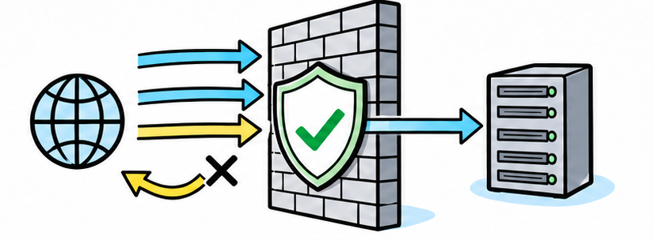
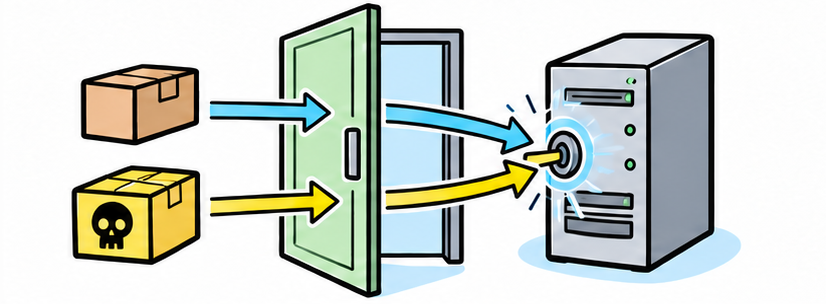
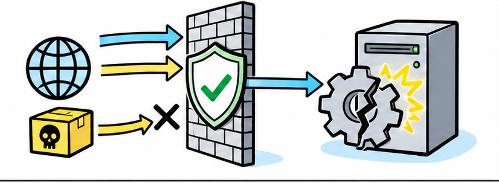
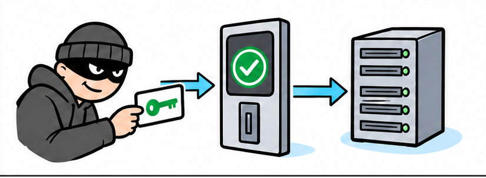
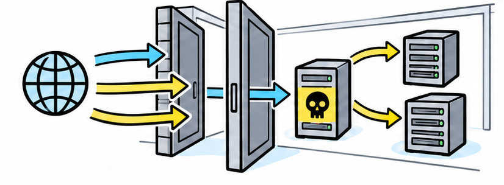
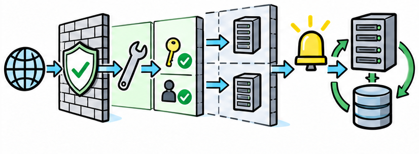

# 有了防火墙，为什么服务器还是照样被攻破？

用黑板图解看懂防火墙的能力边界，以及漏洞、账号、错误配置和内部横向移动如何绕过单一防线。

## 阅读边界

本文依据原始课程的研究笔记、课程结构和发布文案整理。涉及产品、模型、版本、平台规则、价格或资格等可能变化的信息，实践前应以当前官方资料和实际环境为准。
本页配图为依据正文新绘的 AI 辅助教学示意图；它们并非原始课程包内的素材，也不代表原始成片画面。

## 防火墙管的是网络通行

它按规则决定哪些连接可以进出，而不是自动判断整台服务器是否安全。

防火墙可以理解成网络边界上的门卫。它主要按照地址、端口、协议和策略，决定哪些网络连接可以通过。

## 对外服务必须留一扇门

网站要被访问，就必须允许正常请求进入。

网站想让外界访问，就必须允许像 HTTPS 这样的正常连接进入。攻击者也可以把恶意内容放进看起来合法的请求里，从同一个开放入口到达应用。

## 防火墙不会自动修补漏洞

连接被允许之后，真正处理数据的是服务器上的软件。

如果服务器软件存在已知漏洞，防火墙不会替它安装补丁。注入漏洞是指应用把用户输入错误地当成命令执行，访问控制失效则会把权限给错人。

这些问题发生在软件和业务逻辑里，单靠网络通行规则看不出来。

## 攻击者还可能拿着真钥匙

账号被盗后，恶意访问可能表现得像一次正常登录。

攻击者也可能通过钓鱼、恶意软件或数据泄露拿到真实账号。当登录凭据和访问入口都合法时，普通防火墙很难仅凭网络连接识别账号已经被盗用。

## 配置错误会把边界开得太宽

一条过度宽松的规则，就可能让本不该公开的服务暴露出去。

有些服务器把管理端口、数据库或临时测试服务直接暴露到互联网。如果防火墙规则过度宽松，它只会忠实执行错误配置，而不会替管理员判断业务风险。

## 一旦进入，攻击可能在内部扩散

边界防火墙不一定能看到同一内部网络中的每一次访问。

一台服务器被攻破后，攻击者就获得了内部网络中的立足点。来自同一内部网络的横向移动，可能不会经过最外层的边界防火墙。

攻击者于是可以继续寻找共享账号、弱权限和其他系统，把一次入侵扩大成更大事故。

## 真正需要的是纵深防御

纵深防御，就是用多层相互补位的措施降低进入概率并限制损失。

真正可靠的做法叫纵深防御，也就是让多层安全措施相互补位。除了收紧防火墙，还要及时修补漏洞、使用多因素认证、最小权限和网络分段。

再配合集中日志、异常告警、可靠备份和事件响应，才能在攻击发生时尽早发现、限制影响并恢复。

## 小结

把问题拆成目标、约束、证据和验证四部分，通常比直接寻找唯一答案更可靠。先用本文的框架完成一次小范围验证，再根据真实反馈调整下一步。

## 参考资料

以下链接来自原始课程研究笔记；动态信息请以其当前页面为准。

- [https://csrc.nist.gov/pubs/sp/800/41/r1/final](https://csrc.nist.gov/pubs/sp/800/41/r1/final)
- [https://nvlpubs.nist.gov/nistpubs/legacy/sp/nistspecialpublication800-41r1.pdf](https://nvlpubs.nist.gov/nistpubs/legacy/sp/nistspecialpublication800-41r1.pdf)
- [https://owasp.org/Top10/2025/0x00_2025-Introduction/](https://owasp.org/Top10/2025/0x00_2025-Introduction/)
- [https://owasp.org/Top10/2025/A01_2025-Broken_Access_Control/](https://owasp.org/Top10/2025/A01_2025-Broken_Access_Control/)
- [https://www.cisa.gov/news-events/cybersecurity-advisories/aa23-278a](https://www.cisa.gov/news-events/cybersecurity-advisories/aa23-278a)
- [https://www.cisa.gov/known-exploited-vulnerabilities-catalog](https://www.cisa.gov/known-exploited-vulnerabilities-catalog)
- [https://csrc.nist.gov/pubs/sp/800/207/final](https://csrc.nist.gov/pubs/sp/800/207/final)
- [https://www.cisa.gov/audiences/small-and-medium-businesses/secure-your-business/use-logging-on-business-systems](https://www.cisa.gov/audiences/small-and-medium-businesses/secure-your-business/use-logging-on-business-systems)
