# 长时 Agent，怎么不失忆？

把长时自主任务拆成记忆、计划、监控和交接四个环节，解释 AI 助手为什么会中断、漂移，以及怎样把任务稳稳续上。

## 阅读边界

本文依据原始课程的研究笔记、课程结构和发布文案整理。涉及产品、模型、版本、平台规则、价格或资格等可能变化的信息，实践前应以当前官方资料和实际环境为准。

## 长时 Agent，怎么不失忆？

连续推进目标，靠的不是把上下文无限拉长。

长时自主任务，指的是助手要连续完成很多步，而且中间会遇到新信息和新限制。它不是把一次回答写得更长，而是要让每一步都接得上前一步。

一步做错，后面可能继续放大；中途停掉，还要能从正确位置重新开始。

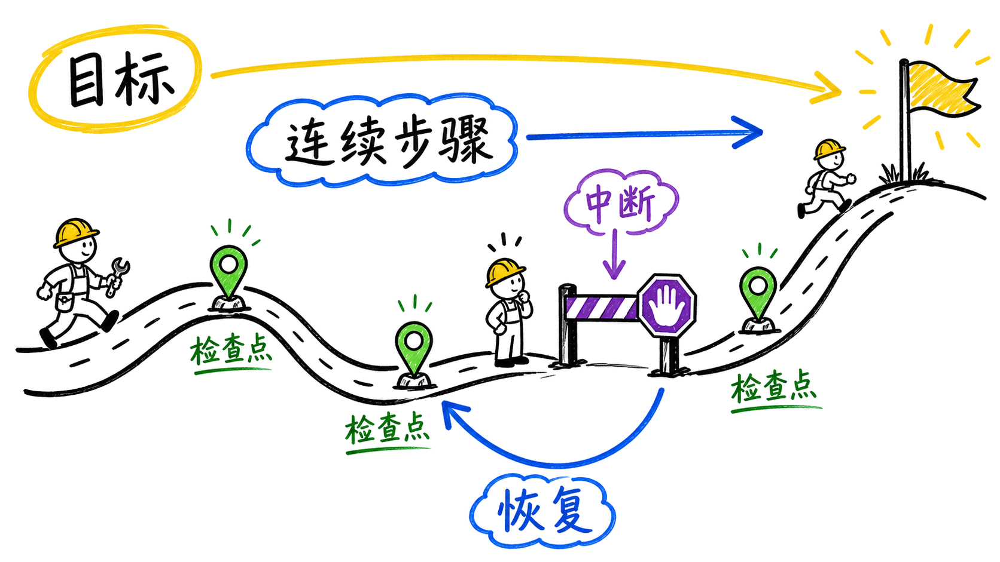

图解：“horizon”这张示意图用于解释“长时 Agent，怎么不失忆？”的关键关系；阅读时可结合本节的步骤、边界与结论逐项核对。

## 上下文不是任务记忆

记住聊天内容，不等于记住已经做过什么。

大模型的上下文像桌面上的便签，能看见，但会被长度、压缩和换话题影响。真正的任务记忆，还要记录目标、已完成步骤、关键决定、失败原因和下一步。

发生中断时，助手不是从头猜，而是从最近一次可信检查点恢复。

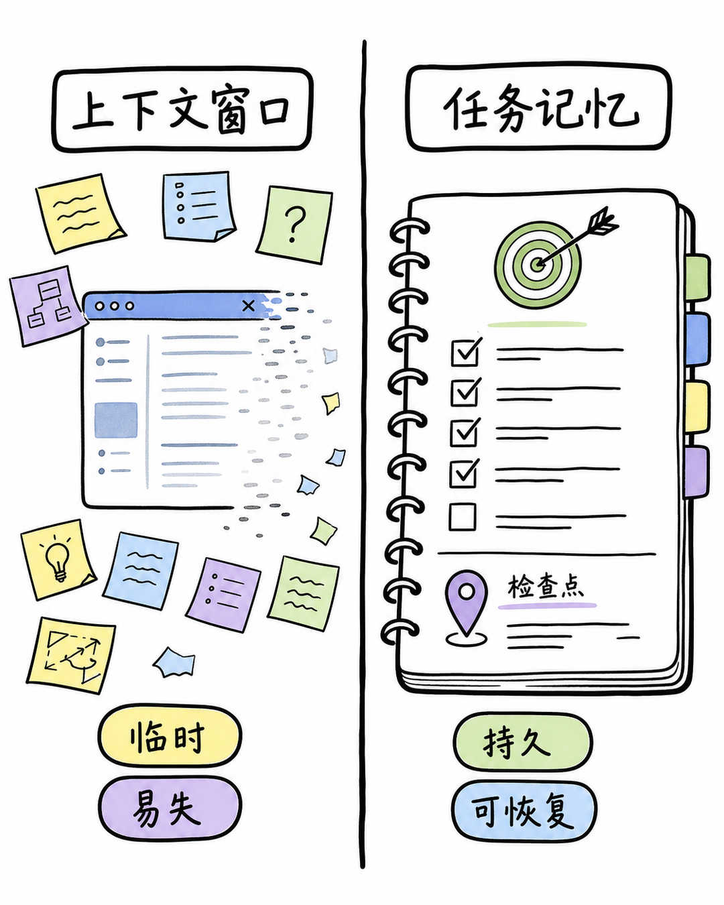

图解：“context memory”这张示意图用于解释“上下文不是任务记忆”的关键关系；阅读时可结合本节的步骤、边界与结论逐项核对。

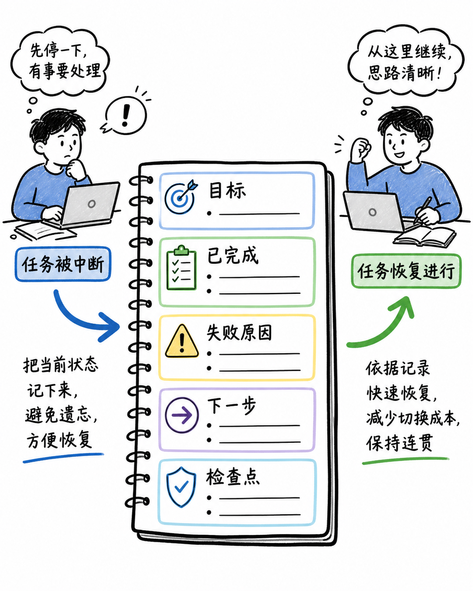

图解：“memory card”这张示意图用于解释“上下文不是任务记忆”的关键关系；阅读时可结合本节的步骤、边界与结论逐项核对。

## 计划不是清单，是控制杆

计划要能被执行、更新，也能在失败后改写。

长时任务先要有一个可检查的目标，再拆成有依赖关系的短步骤。工作清单不是摆设，完成一项就更新一项，阻塞时要写清原因和替代路径。

每轮执行都把结果喂回计划，必要时重排顺序，而不是盲目照着旧清单走。

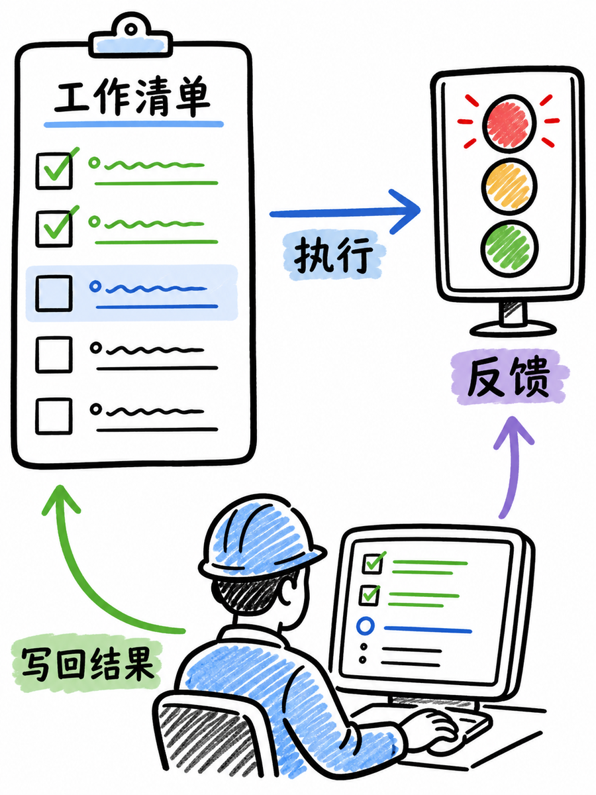

图解：“loop”这张示意图用于解释“计划不是清单，是控制杆”的关键关系；阅读时可结合本节的步骤、边界与结论逐项核对。

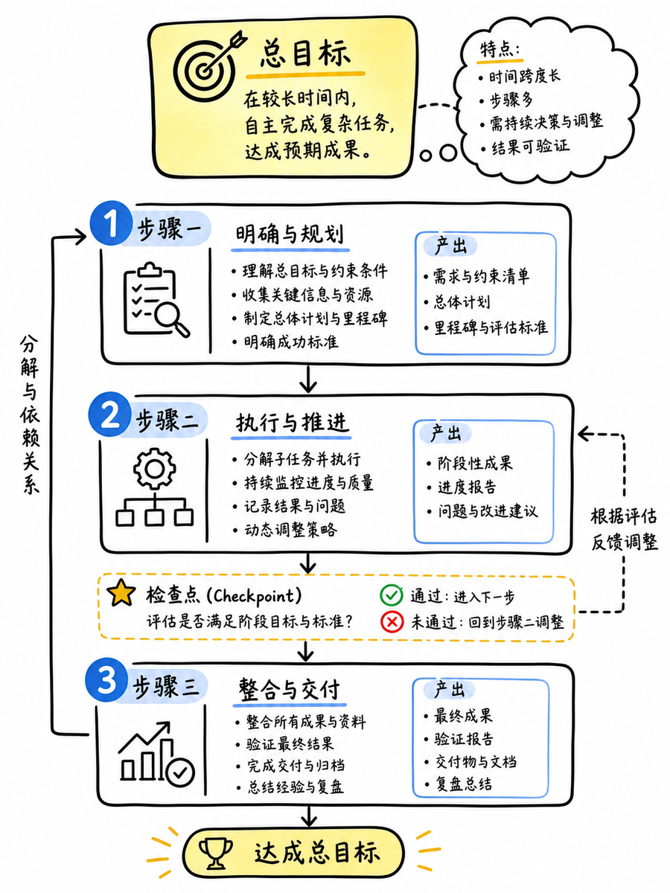

图解：“plan”这张示意图用于解释“计划不是清单，是控制杆”的关键关系；阅读时可结合本节的步骤、边界与结论逐项核对。

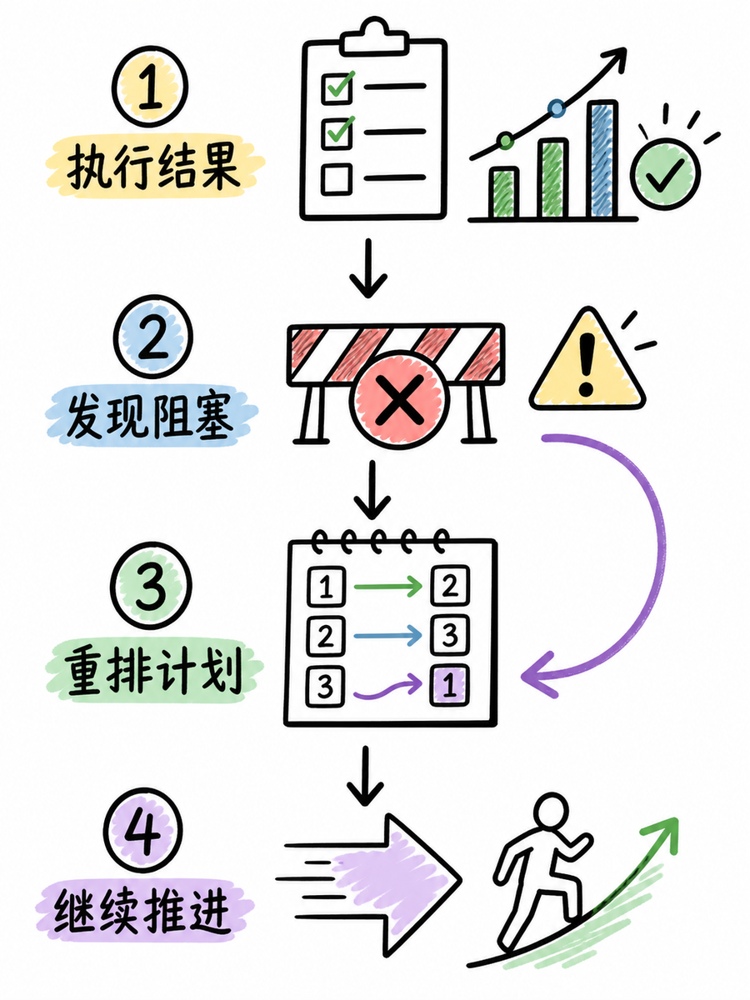

图解：“reorder”这张示意图用于解释“计划不是清单，是控制杆”的关键关系；阅读时可结合本节的步骤、边界与结论逐项核对。

## 中断后怎么接着做？

把长对话压缩成下一位助手能执行的交接。

一种实用做法，是让脚本循环监控状态信号，发现任务结束、失败或空闲后再触发下一步。长对话交接时，只保留目标、现状、证据、风险和下一步动作，写进一个可读文件。

这样无论是 Claude Code 的子任务、Codex 的执行监控，还是普通脚本，都能从同一份状态继续。

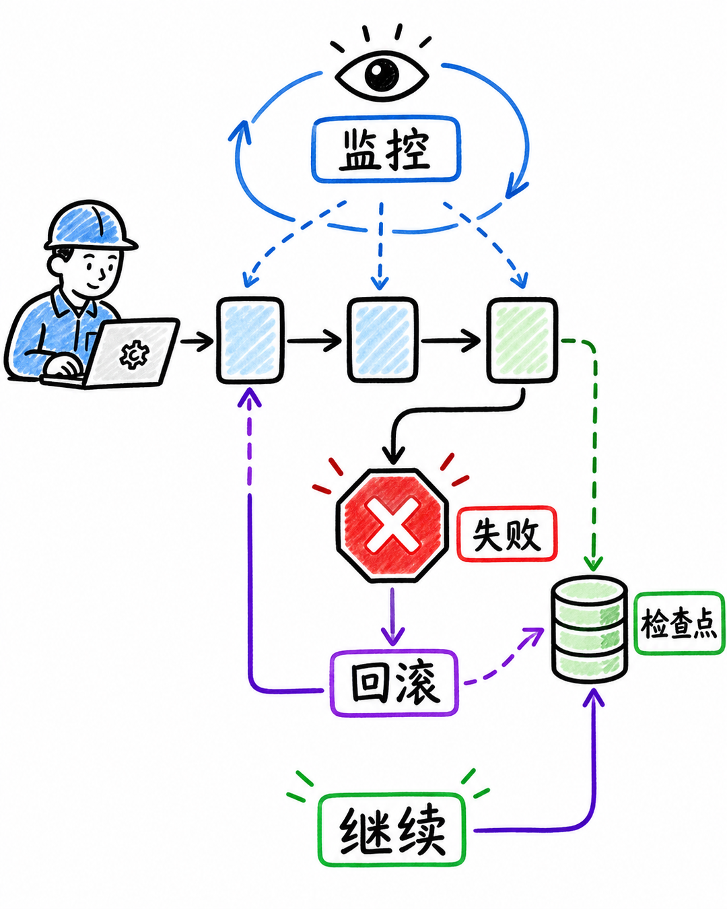

图解：“checkpoint recovery”这张示意图用于解释“中断后怎么接着做？”的关键关系；阅读时可结合本节的步骤、边界与结论逐项核对。

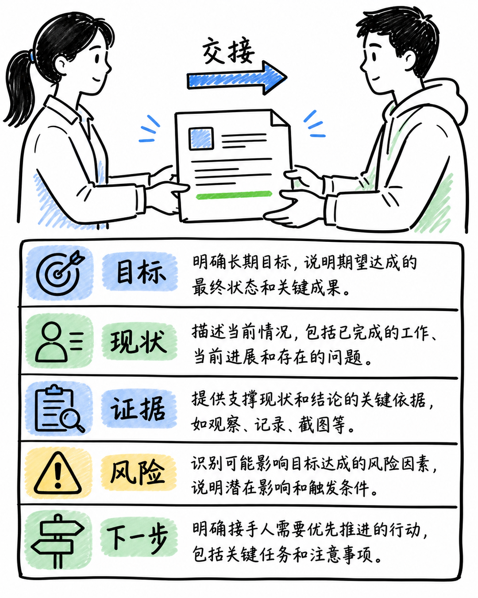

图解：“training”这张示意图用于解释“中断后怎么接着做？”的关键关系；阅读时可结合本节的步骤、边界与结论逐项核对。

## 工具能补上哪一段？

Hook、任务工具和监控器，补的是系统工程，不是魔法记忆。

Claude Code 的任务工具和 Hook，可以把子任务、检查和收尾动作接进开发流程。Codex 这类工作台更强调任务状态、交接和过程监控，核心也是让进度可见。

Claude Fable 5.1 这类面向长周期工作的模型，能把规划、工具调用和验证拉成更长的闭环；真正的竞争还要看完成率、恢复率和评测是否经得起长跑。

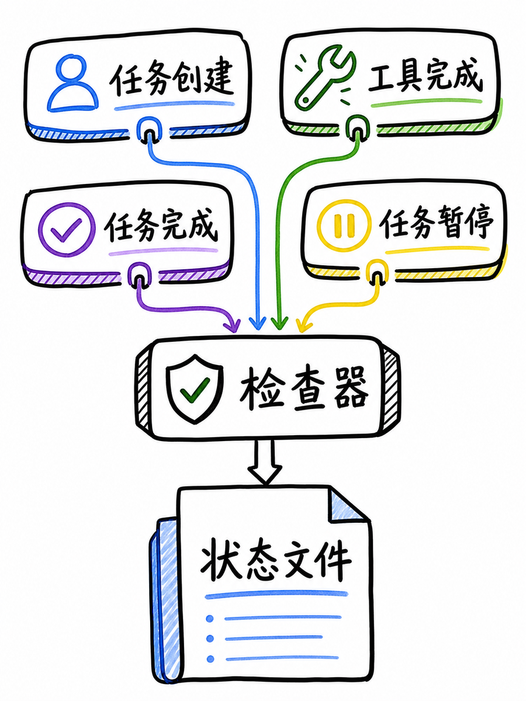

图解：“hooks”这张示意图用于解释“工具能补上哪一段？”的关键关系；阅读时可结合本节的步骤、边界与结论逐项核对。

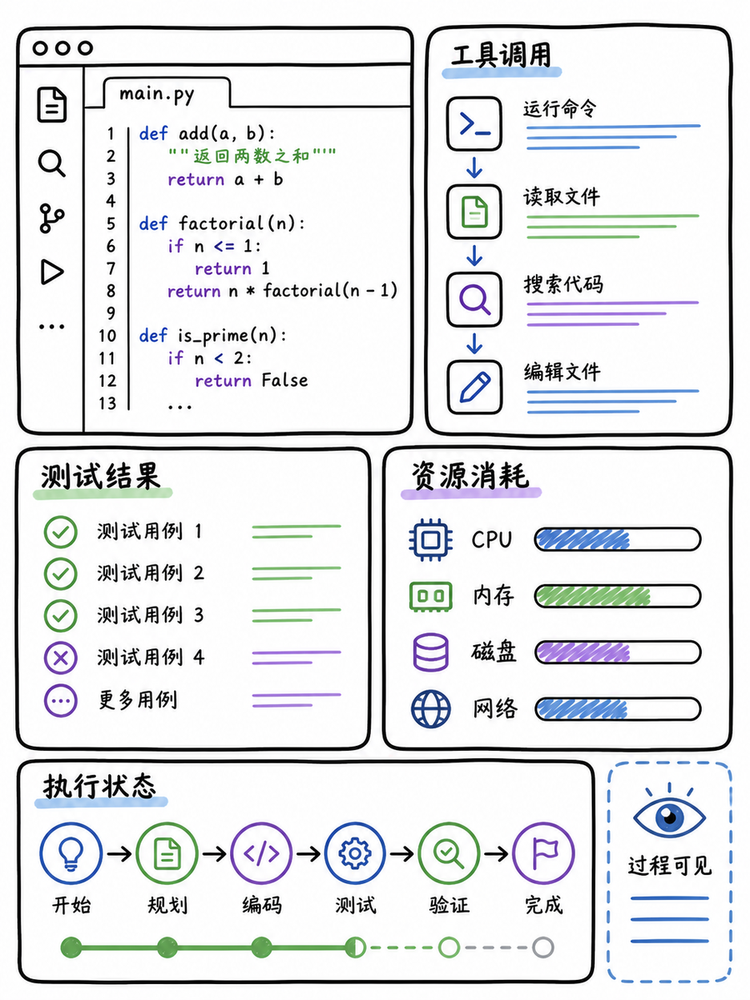

图解：“monitoring”这张示意图用于解释“工具能补上哪一段？”的关键关系；阅读时可结合本节的步骤、边界与结论逐项核对。

## 长时任务能力，怎么练出来？

模型、记忆层、执行器和数据，缺一块都难以长跑。

训练数据不能只看最后答对没有，还要保留中间步骤、工具反馈和失败后的修正。数据合成能构建多语言、不同工具和中断轨迹，但必须清洗重复和投机模式。

所以长时自主任务的答案很清楚：模型负责推理，外部系统负责记忆、计划、监控和恢复。

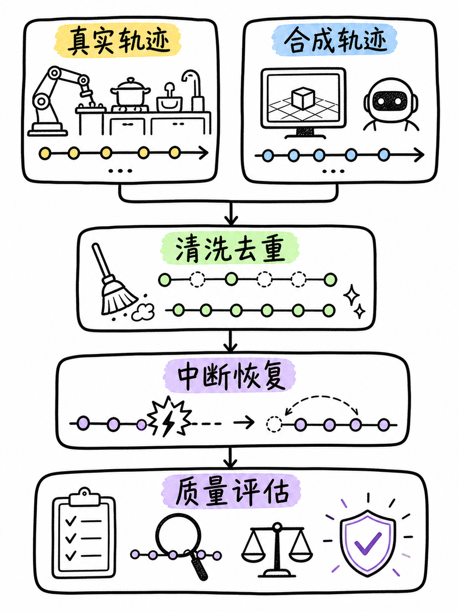

图解：“training”这张示意图用于解释“长时任务能力，怎么练出来？”的关键关系；阅读时可结合本节的步骤、边界与结论逐项核对。

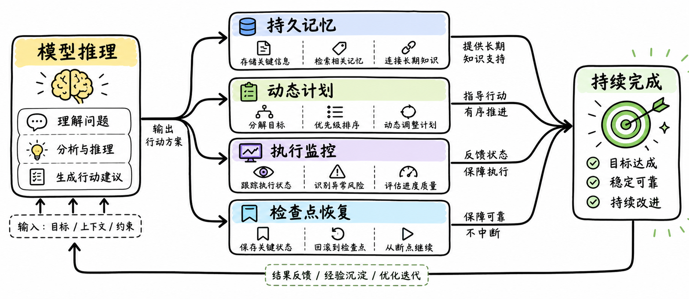

图解：“training overview”这张示意图用于解释“长时任务能力，怎么练出来？”的关键关系；阅读时可结合本节的步骤、边界与结论逐项核对。

## 小结

把问题拆成目标、约束、证据和验证四部分，通常比直接寻找唯一答案更可靠。先用本文的框架完成一次小范围验证，再根据真实反馈调整下一步。

## 参考资料

以下链接来自原始课程研究笔记；动态信息请以其当前页面为准。

- [https://en.wikipedia.org/wiki/AI_agent](https://en.wikipedia.org/wiki/AI_agent)
- [https://en.wikipedia.org/wiki/Automated_planning_and_scheduling](https://en.wikipedia.org/wiki/Automated_planning_and_scheduling)
- [https://en.wikipedia.org/wiki/Large_language_model](https://en.wikipedia.org/wiki/Large_language_model)
- [https://arxiv.org/abs/2606.04874](https://arxiv.org/abs/2606.04874)
- [https://arxiv.org/abs/2604.00892](https://arxiv.org/abs/2604.00892)
- [https://arxiv.org/abs/2605.14504](https://arxiv.org/abs/2605.14504)
- [https://arxiv.org/abs/2608.06663](https://arxiv.org/abs/2608.06663)
- [https://docs.anthropic.com/en/docs/claude-code/cli-usage](https://docs.anthropic.com/en/docs/claude-code/cli-usage)
- [https://docs.anthropic.com/en/docs/build-with-claude/prompt-engineering/prompt-templates-and-variables](https://docs.anthropic.com/en/docs/build-with-claude/prompt-engineering/prompt-templates-and-variables)
- [https://platform.openai.com/docs/quickstart/make-your-first-api-request](https://platform.openai.com/docs/quickstart/make-your-first-api-request)
- [https://platform.openai.com/docs/assistants/deep-dive/run-lifecycle](https://platform.openai.com/docs/assistants/deep-dive/run-lifecycle)
- [https://www.anthropic.com/claude/fable](https://www.anthropic.com/claude/fable)
- [https://www.anthropic.com/claude-fable-and-mythos-5-1](https://www.anthropic.com/claude-fable-and-mythos-5-1)
- [https://platform.claude.com/docs/en/models/overview](https://platform.claude.com/docs/en/models/overview)
- [https://platform.claude.com/docs/en/models/fable-5-1/whats-new-fable-5-1](https://platform.claude.com/docs/en/models/fable-5-1/whats-new-fable-5-1)
- [https://www.anthropic.com/claude-fable-5-1-mythos-5-1-system-card](https://www.anthropic.com/claude-fable-5-1-mythos-5-1-system-card)
