# 主流 AI 语言模型（LLM）解析

用黑板图解方式，简明讲解《主流 AI 语言模型（LLM）解析》。

## 阅读边界

本文依据原始课程的研究笔记、课程结构和发布文案整理。涉及产品、模型、版本、平台规则、价格或资格等可能变化的信息，实践前应以当前官方资料和实际环境为准。

## LLM 到底在做什么？

主流模型定位、代表型号与真实任务边界

当我们说一个模型会聊天、写代码、看图片时，它到底在做什么？大型语言模型，也就是 LLM，可以理解成一个处理语言模式的预测系统。

它接收问题、文件和上下文，再判断哪些信息与当前任务更相关。随后，模型逐步生成回答、代码或结构化结果。

如果连接搜索、数据库或其他工具，它还可以把外部信息带进这条流程。所以，模型、聊天产品、工具调用和最终答案，并不是同一个层次。

接下来，我们逐家看清五家主流模型的产品定位和型号差异。

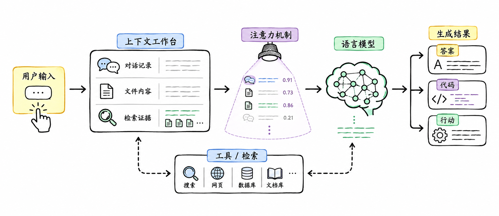

图解：用一个高信息密度的大图解释 LLM 的共同机制：用户输入、上下文、注意力、语言模型、工具/检索、生成结果。至少 5 个主要对象、4 个局部文字锚点、完整输入—处理—输出关系链。

## OpenAI 的产品层

主流模型定位、代表型号与真实任务边界

先看 OpenAI，最容易混淆的是 ChatGPT、GPT、API 和 Codex 的关系。ChatGPT 是面向用户的对话产品，GPT 是模型家族。

API 是开发者调用模型和工具的入口。Codex 更像面向编程任务的智能助手环境，可以处理代码库、终端、测试、审查和重构。

Codex 不是 GPT-5.6 Sol 的专属功能。

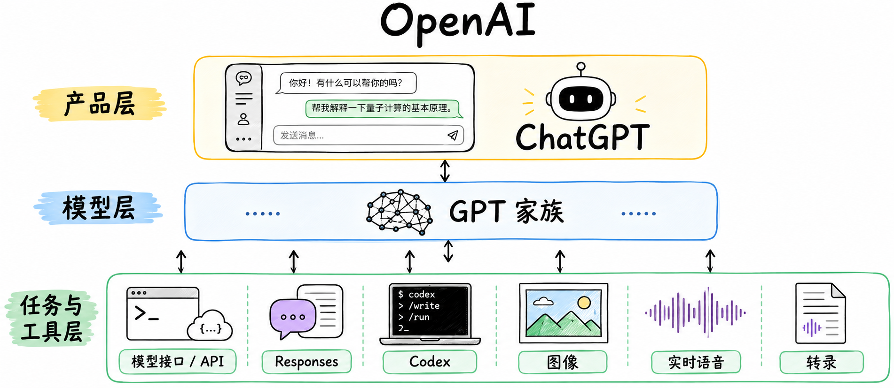

图解：OpenAI 独立产品层—模型层—任务层大图。中心是“OpenAI / GPT 家族”，左侧为 ChatGPT 用户端助手，中央为 GPT 模型层，右侧连接 API/Responses、Codex 和图像/实时/转录等专用能力。必须为每个对象提供形状、中文身份标签和关系箭头。

## OpenAI 的代表型号

主流模型定位、代表型号与真实任务边界

GPT-5.6 Sol 的定位，是复杂专业工作、推理和代码。GPT-5.6 Terra，强调通用能力与成本之间的平衡。

GPT-5.6 Luna，更适合批量分类、信息抽取、客服和高吞吐自动化。选择 OpenAI 时，应先分清产品层，再选择模型，最后配置工具。

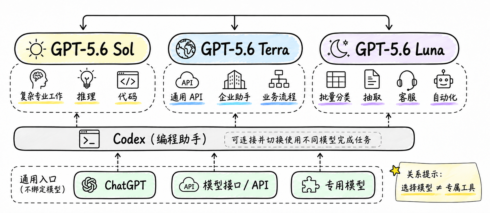

图解：修正版 OpenAI 型号与 Codex 跨模型工具关系图。

## Claude 的产品生态

主流模型定位、代表型号与真实任务边界

Claude 是 Anthropic 的模型与助手品牌。它的重点集中在文档、写作、分析、代码和长周期知识工作。

Claude 产品还包括 Claude Code、Cowork，以及面向企业的工作流和智能助手。这条路线的核心，不只是回答一个问题，而是持续处理一项复杂工作。

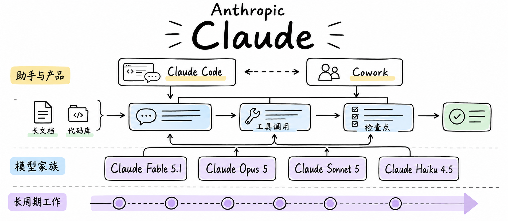

图解：Claude 产品生态与代表型号。

## Claude 的代表型号

主流模型定位、代表型号与真实任务边界

Claude Fable 5.1，面向高难度推理、长周期智能助手任务、代码和工具调用。Claude Opus 5，更偏向复杂编码和专业企业任务。

Claude Sonnet 5，强调能力与速度之间的平衡。Claude Haiku 4.5，更适合高速交互、批量处理和成本敏感任务。

长上下文很有用，但它不等于模型会自动记住所有内容。

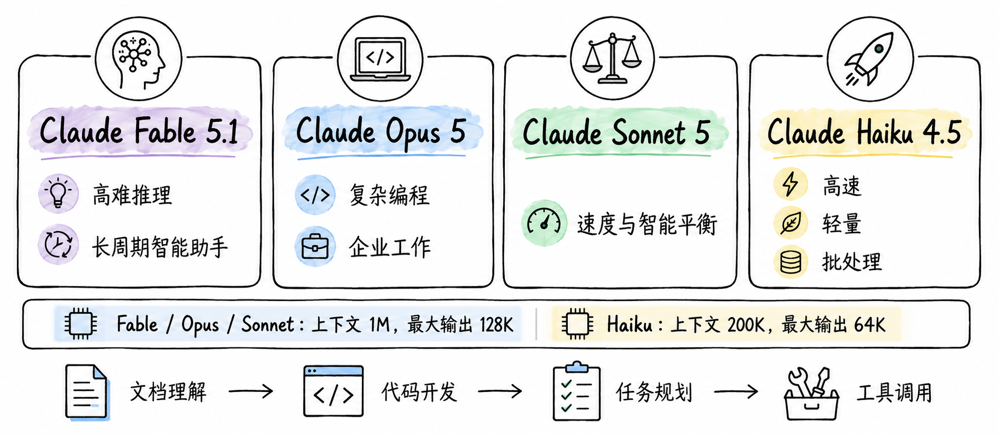

图解：Claude 产品生态与代表型号。

## Gemini 的多模态生态

主流模型定位、代表型号与真实任务边界

Gemini 是 Google 的多模态模型家族。文字只是它处理的信息类型之一。

它可以同时理解文字、图片、音频、视频和 PDF。Gemini 还连接 Search、Workspace、Cloud 和 AI Studio。

因此，Gemini 的特点不仅是模型能力，也包括它所在的 Google 产品生态。

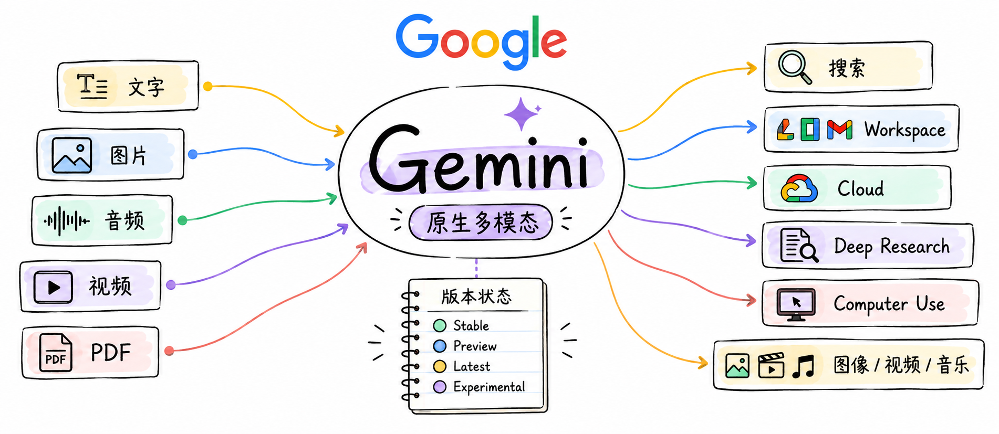

图解：Gemini 多模态生态与代表型号。

## Gemini 的代表型号

主流模型定位、代表型号与真实任务边界

Gemini 3.1 Pro，偏向复杂问题、推理、代码和智能助手任务。Gemini 3.8 Flash，强调高速多模态、长周期软件工程和复杂企业流程。

Flash-Lite，更适合摘要、分类、批处理和高频调用。Stable、Preview、Latest 和 Experimental，描述的是版本状态，不是能力排名。

使用 Gemini 时，应同时记录具体模型 ID、接口入口和版本状态。

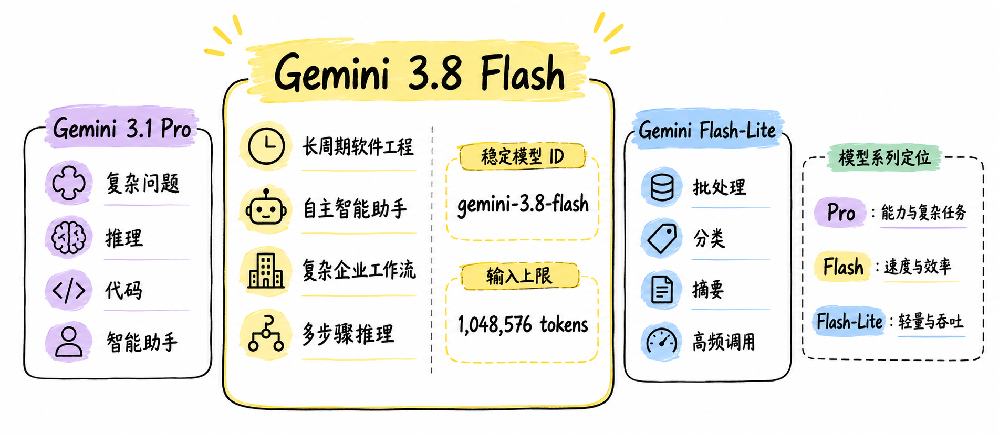

图解：Gemini 多模态生态与代表型号。

## Grok 的实时信息生态

主流模型定位、代表型号与真实任务边界

Grok 是 xAI 的通用模型和助手品牌。它把对话、实时信息和工具调用放在同一个产品路线中。

Web Search 和 X Search，可以为回答接入网络与社交平台信息。Grok 的价值，在于把模型回答和实时信息入口连接起来。

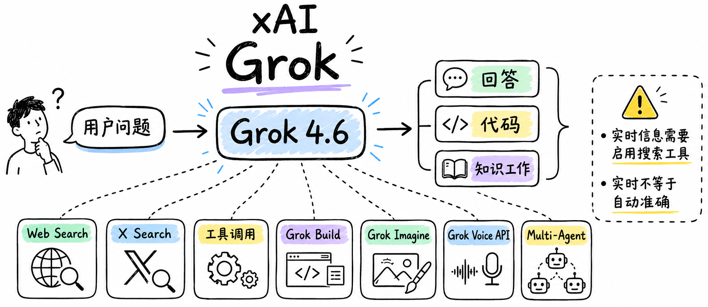

图解：Grok 实时信息生态与代表型号。

## Grok 4.6 与工具能力

主流模型定位、代表型号与真实任务边界

Grok 4.6 面向编码、知识工作、复杂多步骤任务和长时智能助手。Grok Build 面向项目构建和编码，Imagine 面向图像与视频，Voice 面向实时语音。

但实时不等于自动实时。如果没有启用搜索工具，模型不会凭空获得训练数据之后的新闻和事件知识。

使用 Grok 时，要把搜索结果和模型判断分开核验。

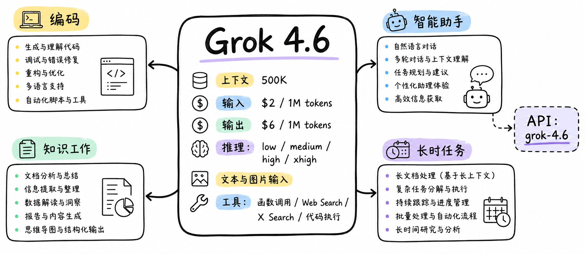

图解：Grok 实时信息生态与代表型号。

## DeepSeek 的开放模型生态

主流模型定位、代表型号与真实任务边界

DeepSeek 的路线更突出开放模型、推理、代码、低成本 API 和开发者集成。它的产品入口包括 Web、移动 App、API 和开发者工具。

这使 DeepSeek 更容易进入开发者部署、模型调用和智能助手工作流。但开放模型不等于零部署成本。

实际使用时，还要评估部署资源、版本维护、数据治理和合规要求。

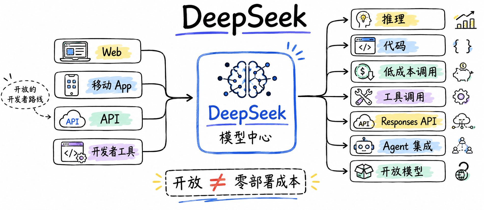

图解：DeepSeek 开放模型生态与代表型号。

## DeepSeek V4 型号

主流模型定位、代表型号与真实任务边界

DeepSeek-V4-Pro-0813，面向复杂推理、生产级智能助手、工具调用和 API 集成。DeepSeek-V4-Flash，更偏向较低延迟、较低成本、推理、代码和高吞吐任务。

DeepSeek-V4-Flash-Vision-Exp，针对视觉输入和多模态实验场景。V4-Pro 和 V4-Flash 支持思考与非思考模式、工具调用和结构化输出。

选择 DeepSeek 时，要同时看模型版本、部署方式和实际调用成本。

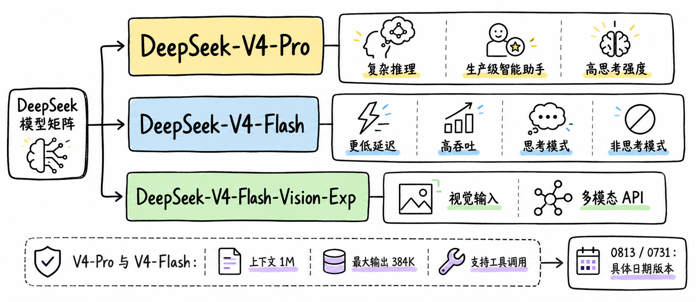

图解：DeepSeek 开放模型生态与代表型号。

## GPT、Claude、Gemini 的命名来源

主流模型定位、代表型号与真实任务边界

模型名字通常包含两种信息：品牌故事和技术标识。GPT 是 Generative Pre-trained Transformer 的缩写，也就是生成式预训练 Transformer。

ChatGPT 则是面向用户的聊天产品，不能简单等同于某一个 GPT API 型号。Claude 使用 Opus、Sonnet、Haiku 和 Fable 等文学与艺术意象区分产品层级。

Gemini 的含义接近双子座或双生者，适合表达统一、多模态和跨任务的品牌叙事。品牌语义可以帮助理解，但不能替代技术指标。

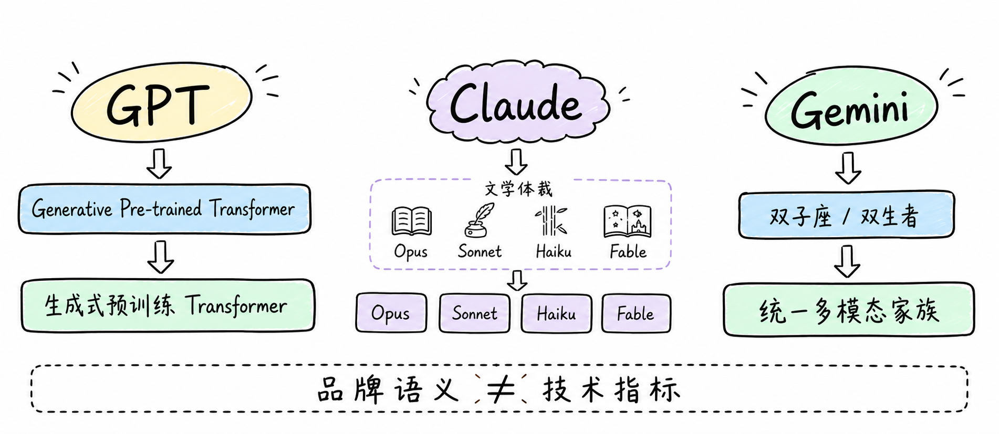

图解：两组命名来源场景。

## Grok、DeepSeek 的命名来源

主流模型定位、代表型号与真实任务边界

Grok 一词来自科幻小说《异乡异客》，常被解释为深入、直觉式地理解。这个名字与对话、实时互动和探索感相呼应。

DeepSeek 通常写作“深度求索”，传递深入探索的品牌表达。不过，品牌名称不是技术架构说明。

真正需要核对的，是具体型号、能力后缀、版本日期和 API 标识。

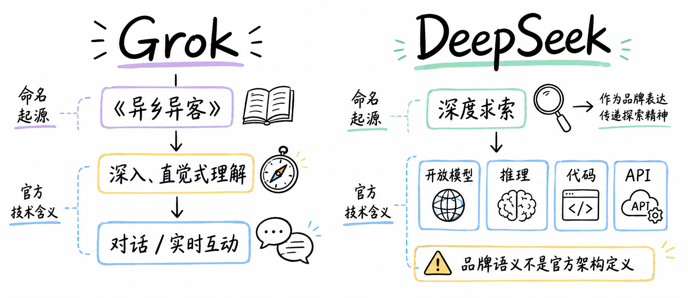

图解：两组命名来源场景。

## 如何拆解一个模型名称？

主流模型定位、代表型号与真实任务边界

读模型名称，可以先拆成四类信息：家族名、版本、能力档位，以及日期或生命周期状态。GPT-5.6 Sol 中，GPT 是家族名，5.6 是版本，Sol 是产品档位。

Claude Fable 5.1 中，Claude 是家族，Fable 是型号名，5.1 是版本。Gemini 3.8 Flash 中，3.8 是版本，Flash 表示速度与效率方向。

DeepSeek-V4-Pro-0813，则包含家族、V4 代际、Pro 档位和日期版本。最重要的一条规则是：数字不能跨厂商直接比较。

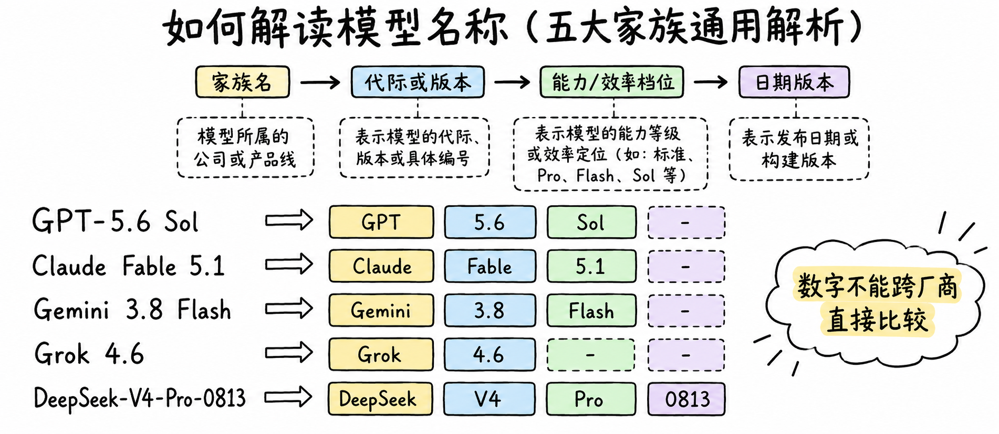

图解：模型名称、后缀、生命周期与调用标识拆解。

## 后缀、生命周期与 API ID

主流模型定位、代表型号与真实任务边界

Pro、Flash、Lite、R1、Vision 和 Exp，通常用于表达能力方向、效率方向、推理路线、视觉能力或实验状态。但同一个后缀，在不同厂商那里不一定完全同义。

Stable、Preview、Latest 和 Experimental，主要描述版本生命周期。API ID、Alias 和日期版本，则关系到调用、迁移和兼容性。

生产环境应该记录完整模型 ID、访问时间、接口入口和版本状态。

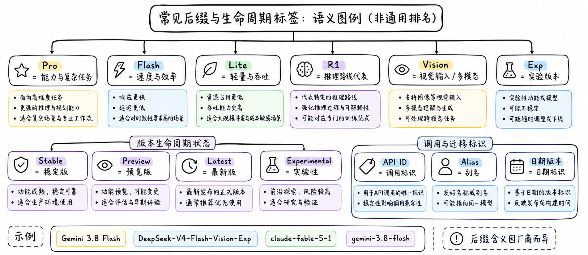

图解：模型名称、后缀、生命周期与调用标识拆解。

## 五家模型如何选择？

主流模型定位、代表型号与真实任务边界

最后，把五家模型放回真实任务中选择。通用助手和应用生态，可以先了解 OpenAI ChatGPT 与 GPT。

长文档、代码库和长周期知识工作，可以重点测试 Anthropic Claude。Google Search、Workspace、Cloud 和多模态流程，可以重点测试 Google Gemini。

需要实时 Web 或 X 信息，可以测试 xAI Grok。关注开放模型、推理、代码和低成本 API，可以测试 DeepSeek。

这些只是任务起点，不是绝对排名。真正比较时，要使用同一组任务检查事实准确性、代码质量、工具调用、上下文保持和失败恢复。

结论很简单：没有绝对最佳，先定任务，再看模型。

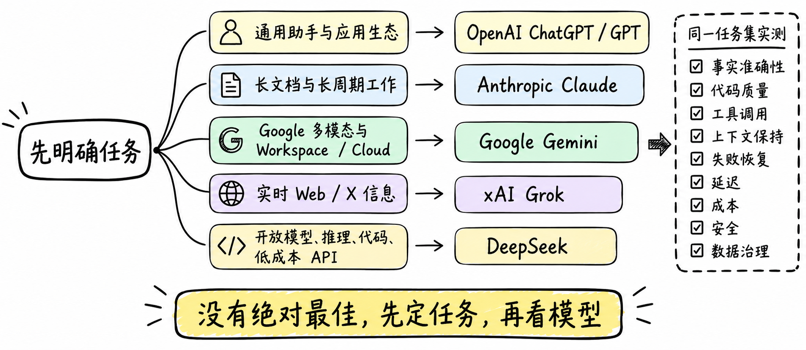

图解：任务驱动的选择逻辑与评估清单。

## 小结

把问题拆成目标、约束、证据和验证四部分，通常比直接寻找唯一答案更可靠。先用本文的框架完成一次小范围验证，再根据真实反馈调整下一步。

## 参考资料

原始研究笔记未收录可公开核验的网址。本文仅作为课程源资料的整理版；涉及外部事实、版本与规则时，请在使用前自行核验当前一手资料。
