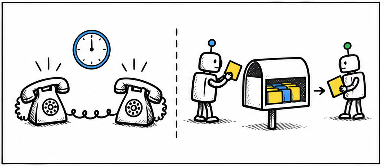
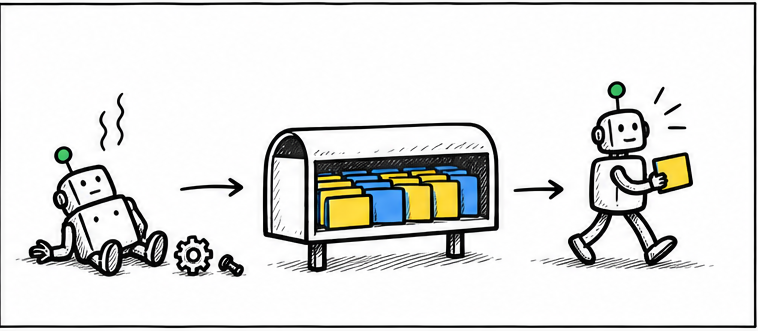
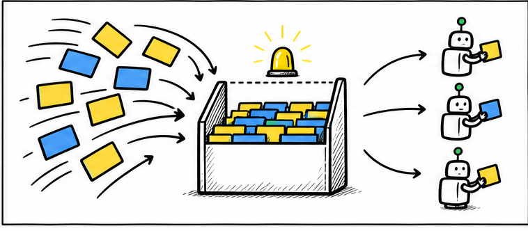
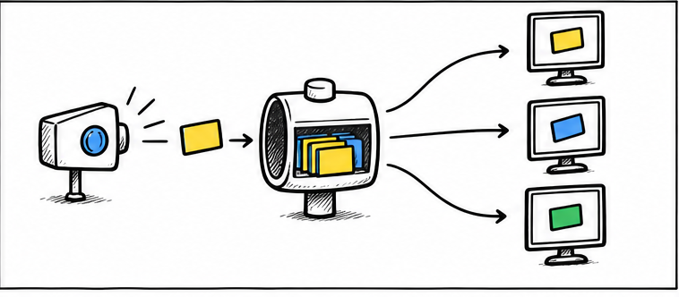
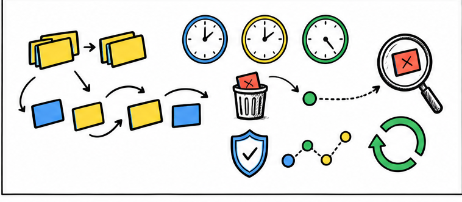
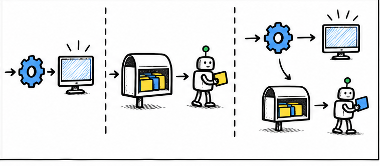

# 消息队列这么复杂，为什么大厂宁可用它也不肯直接同步调用？

> 对应短视频主题：消息队列这么复杂，为什么大厂宁可用它也不肯直接同步调用？  
> 资料核验与更新：2026-09-12

从同步等待、削峰和故障隔离，到重复消息与最终一致性，一次讲清大系统为什么愿意承担消息队列的复杂度。

## 阅读边界

本文依据原始课程的研究笔记、课程结构和发布文案整理。涉及产品、模型、版本、平台规则、价格或资格等可能变化的信息，实践前应以当前官方资料和实际环境为准。
原始研究记录标注的时间为：2026-08-26。
本页配图为依据正文新绘的 AI 辅助教学示意图；它们并非原始课程包内的素材，也不代表原始成片画面。

## 同步像电话，队列像收件箱

关键区别，是发送方要不要原地等待。

同步调用就像打电话，服务甲发出请求后，必须等服务乙当场回答。只要服务乙变慢、重启或者网络抖动，服务甲也会被一起拖住。

消息队列，就是先把任务作为一条消息存进中间收件箱。服务甲交付消息后可以先返回，服务乙稍后按自己的速度处理。

## 把当场失败，变成可恢复积压

持久化队列让发送与处理不必同时在线。

第一份收益叫时间解耦，也就是发送和处理不必发生在同一时刻。消费者短暂重启时，入口仍能把任务放进可靠配置的持久化队列。

消费者恢复以后，再从队列里继续处理尚未完成的消息。同步链路里的即时故障，就被转换成了可以监控和追赶的任务积压。

## 高峰来了，先让队列接住

接收速度与处理速度可以分别控制。

第二份收益是削峰，突发的一万条任务不必在同一秒压到下游。队列先接住高峰，再让消费者按照可承受的速度取走任务。

处理速度不够时，可以单独增加消费者，而不必连入口服务一起扩容。但缓冲不会创造处理能力，积压持续增长时仍要扩容、限流或减少任务。

## 服务越多，越怕彼此绑死

消息中间层减少调用方必须知道的下游细节。

同步调用每增加一个下游，调用方就要知道它的地址、超时和失败处理。发布订阅，就是发布者只发送一次事件，由消息系统分发给多个感兴趣的消费者。

不同消费者可以用不同技术、不同容量和不同上线节奏独立演进。大系统真正节省的，往往是跨团队协调成本和故障传播范围。

## 复杂度没有消失，只是转移了

异步系统必须主动处理不确定性。

这份韧性并不免费，消息可能因为重试而被重复投递。幂等，就是同一消息处理多次，业务结果仍然和处理一次相同。

多个消费者并行工作时，消息还可能乱序，严格顺序通常会限制扩展能力。最终一致性，就是不同系统允许短暂不同步，但经过处理后会收敛到一致状态。

团队还要监控积压，把反复失败的毒消息放进死信区，并用追踪编号串起整条链路。

## 不是二选一，而是分清边界

同步负责立即回答，异步负责延后工作。

适合消息队列的任务，通常不要求立即回答，会遇到流量高峰，或者下游可能短暂不可用。如果调用者必须立刻得到结果，业务量又低且稳定，直接同步调用往往更合适。

实际系统常用混合方案，先同步确认核心结果，再异步完成通知、统计和后续任务。所以大厂不是拒绝同步，而是在规模变大后，愿意用队列的复杂度换取可控的韧性。

## 小结

把问题拆成目标、约束、证据和验证四部分，通常比直接寻找唯一答案更可靠。先用本文的框架完成一次小范围验证，再根据真实反馈调整下一步。

## 参考资料

> 📌 **查阅提示**：点击下方超链接可直接复制对应网址，粘贴至手机或电脑浏览器中即可查阅官方完整技术文档与规范。

- [【维基百科】消息队列（Message Queue）工作原理](https://en.wikipedia.org/wiki/Message_queue)  
  *说明：异步通信、解耦生产者与消费者、系统故障隔离的核心软件模式。*
- [【微软云架构模式】基于队列的负载平抑模式（Queue-Based Load Leveling）](https://learn.microsoft.com/en-us/azure/architecture/patterns/queue-based-load-leveling)  
  *说明：微软官方架构设计模式指南，解析如何利用消息缓冲解决突发高并发流量压垮下游的问题。*
- [【微软云架构模式】发布者—订阅者模式（Publisher-Subscriber Pattern）](https://learn.microsoft.com/en-us/azure/architecture/patterns/publisher-subscriber)  
  *说明：详细介绍事件驱动架构下消息广播、跨微服务解耦的设计规范。*
- [【AWS 官方文档】Amazon SQS 消息队列与 At-Least-Once 投递语义](https://docs.aws.amazon.com/AWSSimpleQueueService/latest/SQSDeveloperGuide/standard-queues-at-least-once-delivery.html)  
  *说明：AWS 官方手册，解析消息重试、幂等性消费与死信队列（DLQ）的落地要点。*
- [【RabbitMQ 官方文档】消息投递可靠性与仲裁队列（Quorum Queues）](https://www.rabbitmq.com/docs/reliability)  
  *说明：保障生产不丢消息的生产者确认机制、镜像集群与消费者手动 ACK 原理。*
- [【Apache Kafka 官方架构】Kafka 分区设计与顺序存储日志](https://kafka.apache.org/documentation/)  
  *说明：Kafka 核心设计哲学：高吞吐顺序 I/O、分区分片机制与可回放流处理。*
