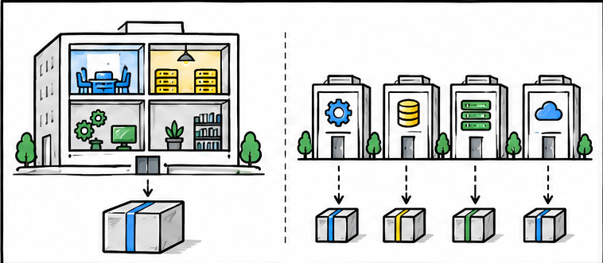
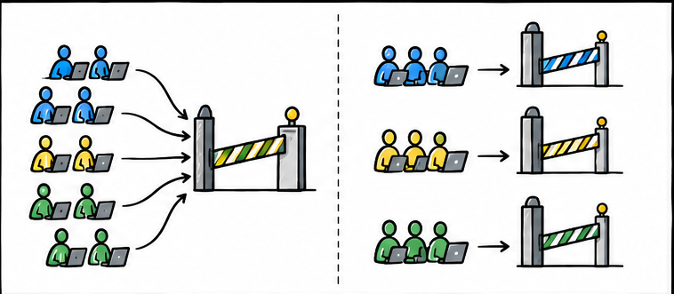
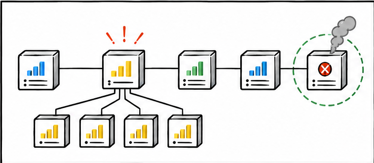
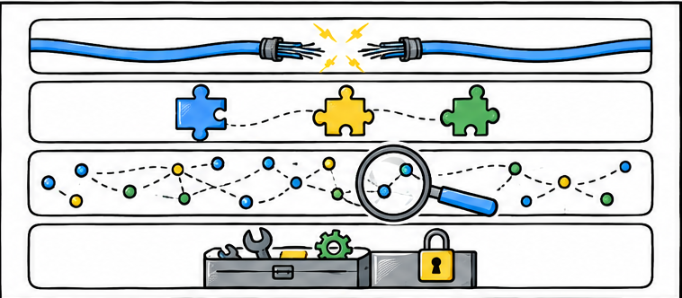
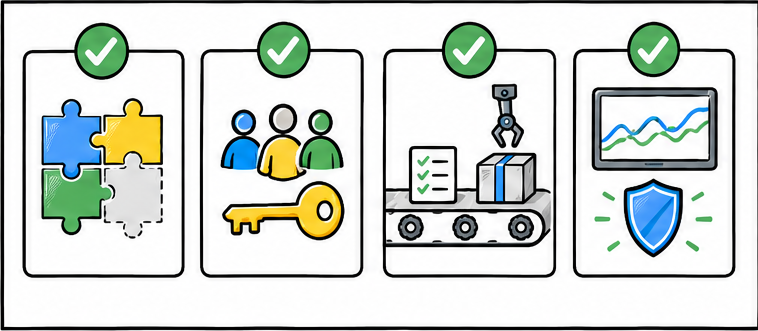
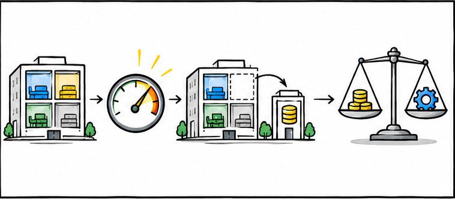

# 单体更简单，大厂为何还拆微服务？

> 对应短视频主题：单体更简单，大厂为何还拆微服务？  
> 资料核验与更新：2026-09-12

一堂面向初学者的黑板课：讲清单体与微服务的真实成本、适用条件和决策边界。

## 阅读边界

本文依据原始课程的研究笔记、课程结构和发布文案整理。涉及产品、模型、版本、平台规则、价格或资格等可能变化的信息，实践前应以当前官方资料和实际环境为准。
原始研究记录标注的时间为：2026-08-26。
该课程原始包被归为“仅保留源资料”；本文只根据现有文字材料整理，不把它表述为已完成的视频成片。
本页配图为依据正文新绘的 AI 辅助教学示意图；它们并非原始课程包内的素材，也不代表原始成片画面。

## 更简单的单体，遇上更昂贵的微服务

先承认成本，再谈大型组织为什么仍然选择拆分。

单体架构，就是把一个应用的主要功能放在一个部署单元里，一起开发、测试和发布。它通常更容易搭建，本地调试也更直接，所以简单系统从单体开始完全合理。

微服务架构，则把系统按业务能力拆成多个可以独立部署的小服务。代价是，原本程序内部的一次调用可能变成网络调用，还要处理超时、监控和数据一致性。

## 大厂购买的，其实是团队自治

系统变复杂，是为了让大量团队不必永远一起行动。

大厂愿意承担这笔复杂度，首先不是因为代码更高级，而是因为组织已经很大。当很多团队挤在同一个发布单元里，一个小改动也可能要求所有人协调、测试和一起上线。

拆分以后，边界清楚的团队可以独立开发和发布，减少整套系统同步行动的次数。热点业务还能单独扩容，故障也更容易限制在较小范围。

所以，微服务优化的不是一个程序员写代码的轻松程度，而是大量团队持续交付和运营的总体效率。

## 拆开之后，收益发生在运行与交付

不同业务的压力、风险和变化速度并不相同。

第二层收益发生在系统运行以后，因为不同部分的压力和变化速度并不相同。像秒杀这种短时间涌入大量请求的业务可能很忙，而账户资料相对平稳；拆开后只扩容热点服务，不必复制整个应用。

一个服务故障时，边界和降级方案设计得好，可以把影响限制在较小范围。服务还能按自己的风险和节奏发布，减少一次改动拖着整套系统上线。

注意，这些都是边界正确、依赖受控之后的潜在收益，不是拆开就自动获得。

## 复杂度账单，只是换了位置

代码内部的简单关系，被搬到了网络和平台之间。

架构账单不会消失，只会从代码内部搬到系统之间。进程里的函数调用很快，也很少丢失；跨网络调用却可能变慢、超时，甚至只完成一半。

一个数据库事务原本能一起提交，拆成多个服务后，常要接受暂时不一致并设计补偿流程。日志也散落在不同服务里，排查问题需要统一监控、指标和分布式追踪。

服务越多，部署、配置、权限和安全边界也越多，所以微服务要求强大的平台和自动化能力。

## 拆分之前，先检查四项前提

没有这些基础，服务数量只会放大混乱。

因此，真正适合拆分的团队，通常先具备几项前提。第一，业务边界已经比较稳定，大家知道哪些能力应该一起变化。

第二，每个服务有清楚的负责人，团队能独立开发、测试、部署和值守。第三，自动化测试、持续交付和可观测性，已经能够支撑大量发布单元。

如果这些条件缺失，拆分只会把一个难维护的单体，变成更难排查的分布式混乱。

## 别站队，用总体成本做决定

架构选择应该匹配团队、业务和运行风险的当前阶段。

所以，别问单体和微服务谁更先进，要问哪种成本更符合当前阶段。团队少、业务边界仍在变化、发布不频繁时，优先选择模块化单体，也就是在一个部署单元里守住清楚的模块边界。

先观察跨团队协调、局部扩容、发布等待或故障范围，是否已经成为持续瓶颈。如果答案是肯定的，再逐步抽出边界最清楚、收益最明确的服务。

最好的架构，不是服务数量最多，而是用最低的总体成本，让业务可靠地持续变化。

## 小结

把问题拆成目标、约束、证据和验证四部分，通常比直接寻找唯一答案更可靠。先用本文的框架完成一次小范围验证，再根据真实反馈调整下一步。

## 参考资料

以下链接来自原始课程研究笔记；动态信息请以其当前页面为准。

- [Wikipedia: Microservices](https://en.wikipedia.org/wiki/Microservices)
- [Microsoft Azure Architecture Center: Microservices architecture style](https://learn.microsoft.com/en-us/azure/architecture/guide/architecture-styles/microservices)
- [AWS Prescriptive Guidance: Decomposing monoliths into microservices](https://docs.aws.amazon.com/prescriptive-guidance/latest/modernization-decomposing-monoliths/)
- [Google Cloud Architecture Center: Re-architecting to cloud native](https://cloud.google.com/resources/rearchitecting-to-cloud-native)
- [Melvin E. Conway, “How Do Committees Invent?”, 1968](https://melconway.com/Home/pdf/committees.pdf)
- [Martin Fowler: Microservice Trade-Offs](https://martinfowler.com/articles/microservice-trade-offs.html)
