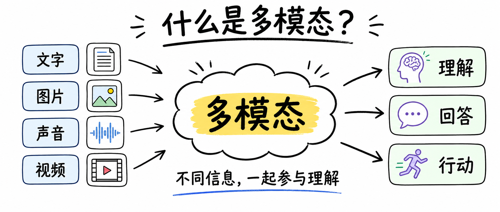
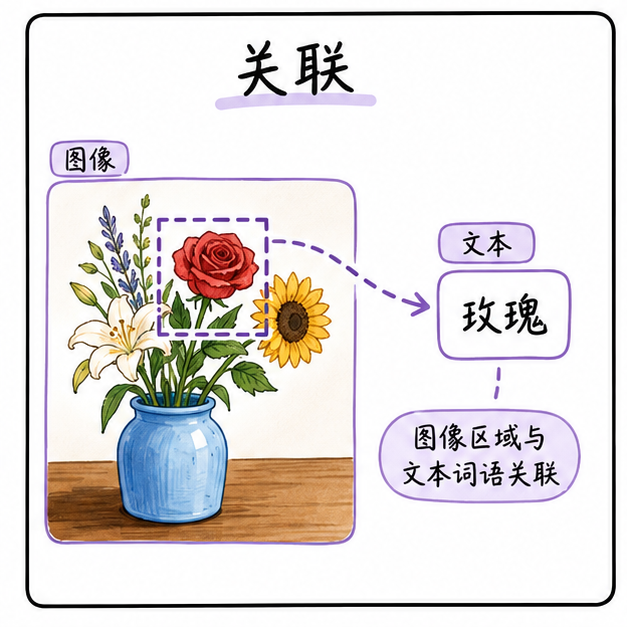
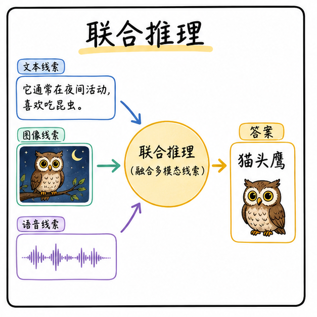
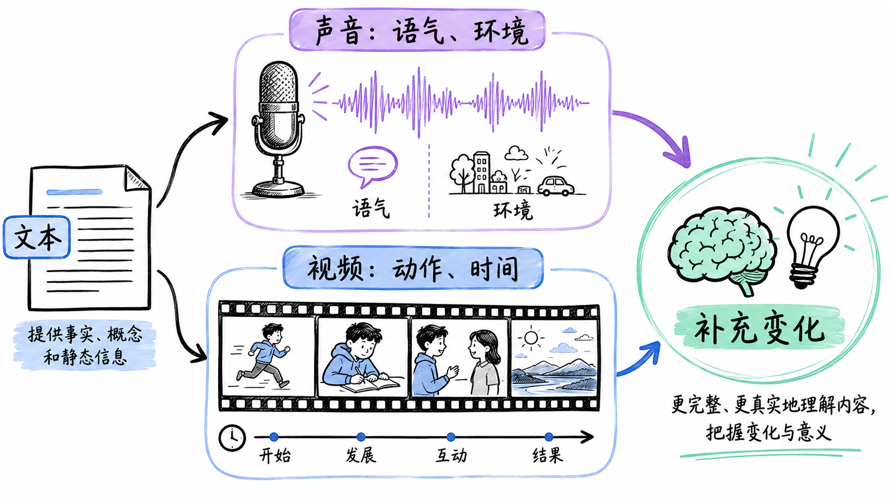
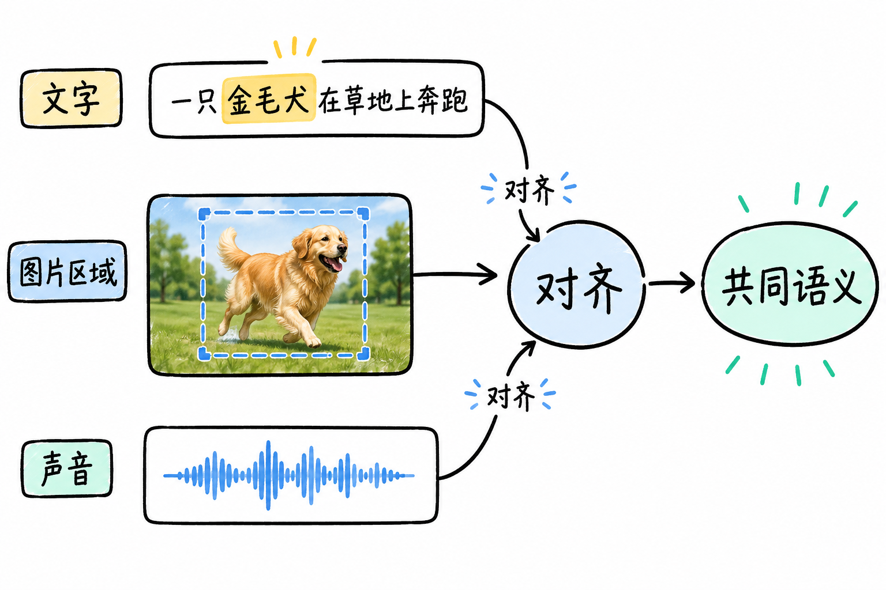
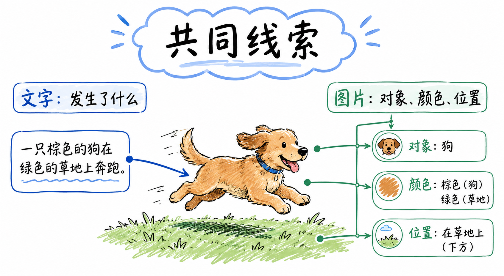
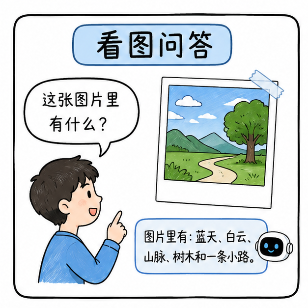
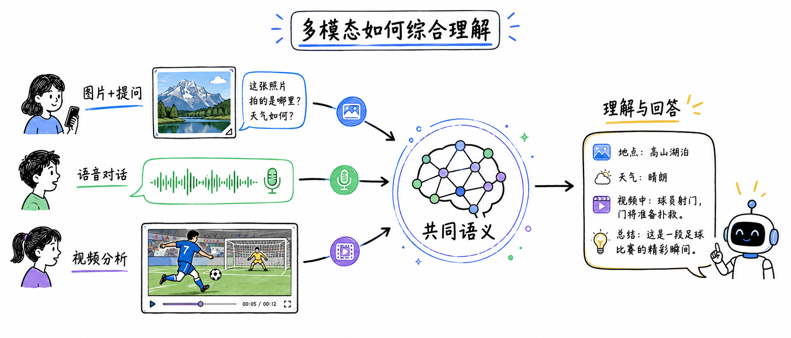

# 什么是多模态？

> 对应短视频主题：什么是多模态？  
> 资料核验与更新：2026-09-12

用黑板图解方式，简明讲解《什么是多模态？》。

## 阅读边界

本文依据原始课程的研究笔记、课程结构和发布文案整理。涉及产品、模型、版本、平台规则、价格或资格等可能变化的信息，实践前应以当前官方资料和实际环境为准。

## 什么是多模态？

让文字、图片、声音和视频一起参与理解

什么是多模态？就是让系统同时理解不同类型的信息。

图解：多模态技术总览：打通文本、图像、音频与视频的统一感知与理解边界。

## 文字和图片分别提供什么？

文字说明内容，图片补充对象与空间关系

文字告诉系统内容，图片补充对象、颜色和空间关系。

图解：图像模态特性：空间二维结构、高密度色彩像素与丰富的视觉几何信息。

图解：文本模态特性：离散符号序列、精确的语法逻辑与抽象概念表达。

图解：视频模态特性：在二维图像基础上引入时间连续帧与动态时空演变。

## 声音和视频又补充了什么？

声音带来语气环境，视频记录动作变化

声音带来语气和环境，视频记录连续动作和时间变化。

图解：跨模态关联机制：通过对齐层将视觉图像与自然语言描述映射到共同特征空间。

图解：多模态深层推理：结合常识逻辑对复杂图表、几何几何与工程图纸进行逐步剖析。

图解：音频与视频时序协同：同步处理声音事件、语调变化与画面动作。

## 多模态为什么能一起理解？

先对齐线索，再建立共同语义

系统先把不同模态对齐，确认它们描述的是同一个对象。

图解：跨模态对齐架构（如对比学习与交叉注意力机制）。

图解：统一多模态语义表征空间：不同输入形态在底层嵌入空间的向量分布。

图解：视觉问答（VQA）应用范式：输入图像与自然语言提问，模型精准定位并给出答案。

图解：端到端语音交互模态：跳过文本转写中间层，直接实现音频特征输入与自然语音合成输出。

## 共同语义如何帮助推理？

把不同线索关联起来，综合证据完成回答

建立共同语义关联后，系统才能综合线索完成推理。

## 上传图片再提问，算多模态吗？

图像和文字共同参与理解

上传图片再提问，就是图像和文字一起参与理解。

## 语音对话为什么也算多模态？

声音输入与文字回答形成完整对话

对着麦克风说话，是声音输入和文字回答形成对话。

## 多模态的核心是什么？

把多种输入对齐为共同语义，再给出回答

视频分析同时利用画面、声音与时间变化；核心是把多种输入对齐为共同语义。

图解：多模态人工智能发展全景：从单一文本对话向全感知具身物理世界交互演进。

## 小结

把问题拆成目标、约束、证据和验证四部分，通常比直接寻找唯一答案更可靠。先用本文的框架完成一次小范围验证，再根据真实反馈调整下一步。

## 参考资料

以下链接来自官方权威技术文档与开源规范；动态规则请以其当前页面为准。

- [CLIP: Connecting Text and Images (OpenAI)](https://openai.com/index/clip/)
- [Flamingo: a Visual Language Model for Few-Shot Learning (DeepMind)](https://www.deepmind.com/publications/tackling-multiple-tasks-with-a-single-visual-language-model)
- [Google Gemini Multimodal Architecture Paper](https://storage.googleapis.com/deepmind-media/gemini/gemini_1_report.pdf)
- [LLaVA: Large Language and Vision Assistant](https://llava-vl.github.io/)
