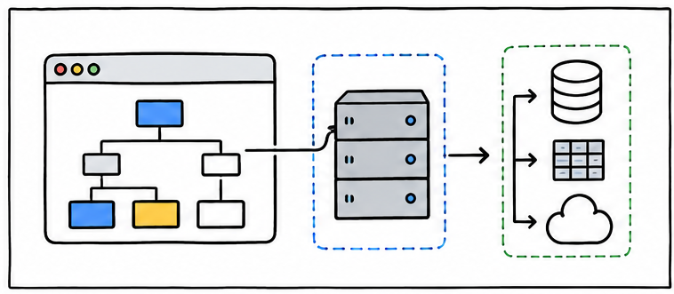
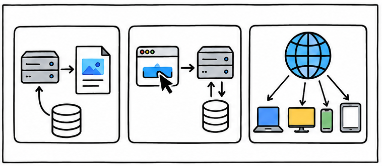
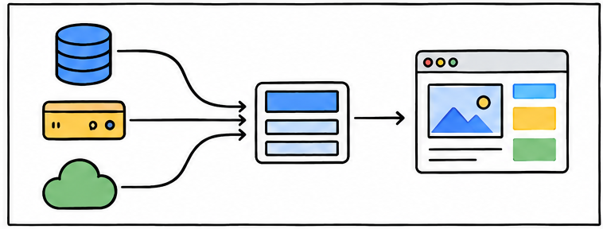
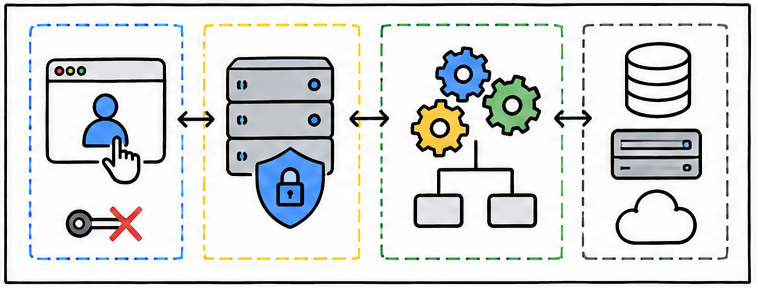
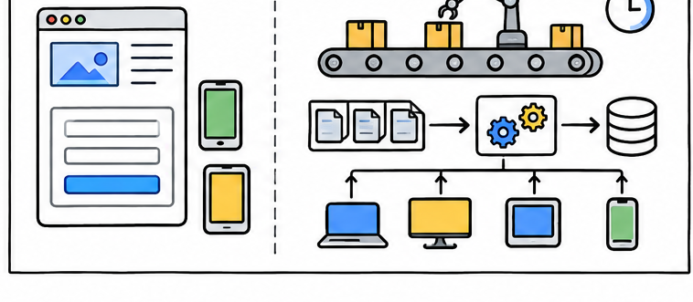
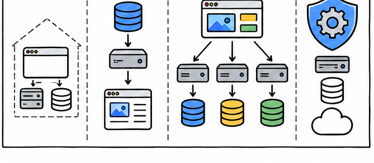

# Next.js 凭什么让后端危机感拉满？前后端边界真的要消失了吗？

> 对应短视频主题：Next.js 凭什么让后端危机感拉满？前后端边界真的要消失了吗？  
> 资料核验与更新：2026-09-12

从 Server Components、Server Actions 到前端专用后端，一次讲清 Next.js 为什么改变前后端协作，以及哪些后端职责根本不会消失。

## 阅读边界

本文依据原始课程的研究笔记、课程结构和发布文案整理。涉及产品、模型、版本、平台规则、价格或资格等可能变化的信息，实践前应以当前官方资料和实际环境为准。
原始研究记录标注的时间为：2026-08-26。
本页配图为依据正文新绘的 AI 辅助教学示意图；它们并非原始课程包内的素材，也不代表原始成片画面。

## 前端不再只待在浏览器

Next.js 把服务器渲染和数据获取带进 React 工程。

传统前端主要运行在浏览器里，需要数据时就通过接口请求独立后端。Next.js 把路由、渲染、数据获取和一部分服务器逻辑放进同一个 React 工程。

服务器组件，就是只在服务器执行的 React 组件，可以直接读取服务器侧数据再生成界面。于是网络边界不再固定画在前端仓库和后端仓库之间，而是进入了组件树。

## 一个框架，接住三类服务器工作

读取渲染、数据变更和公开端点各有合适入口。

服务器组件适合在服务器读取数据库或内部服务，并把结果直接渲染成页面。服务器操作，是由界面触发的服务器函数，主要处理表单提交和数据变更。

路由处理器，则可以创建公开的 HTTP 端点，返回 JSON、文件或其他内容。过去需要跨两个项目完成的薄接口，现在常能在一条功能链路里交付。

## 危机感来自：胶水代码被压缩

Next.js 先吃掉的，是只为当前页面服务的薄服务器层。

前端专用后端，就是只服务当前前端体验的服务器层，常简称 BFF。它可以聚合多个数据源、隐藏内部接口，并把页面需要的数据整理好。

当界面、类型、校验和数据拼装都在同一工程里，跨团队等待和重复定义就会减少。小团队甚至可以让一个全栈开发者独立完成整条功能，这才是后端危机感的来源。

## 边界没有消失，只是换了位置

代码可以同仓库，运行环境和责任仍然不同。

浏览器仍然不能安全保存密钥，也不能随意直连数据库和内部系统。Next.js 服务器代码仍要验证输入、检查身份和权限，并只返回必要数据。

复杂业务规则、跨系统事务和稳定公共接口，也不会因为组件能访问数据库就自动消失。真正变化的是边界从岗位和文件夹，迁移到运行环境、数据权限和业务责任。

## 能写后端，不等于完整后端替代

框架能力越靠近数据，安全与运营责任越不能省略。

Next.js 官方明确提醒，它的后端能力并不是完整后端替代。路由处理器和服务器操作都可能被外部调用，必须按公开接口的标准做认证、授权和校验。

某些托管运行时还会限制执行时间、本地文件写入和长连接，也不能依赖跨请求共享内存。长时间任务、消息消费、复杂事务和高吞吐计算，通常更适合独立后台服务。

当手机、网页和合作伙伴都依赖同一接口时，稳定契约和独立扩缩容也更加重要。

## 后端不会消失，价值会向深处移动

薄接口减少以后，领域、平台与可靠性更重要。

内容站、后台系统和早期产品，可以让 Next.js 覆盖更多全栈功能，减少团队交接。已经拥有成熟后端的团队，仍可以让服务器组件直接调用现有接口。

大型系统常让 Next.js 负责展示和前端专用后端，再把核心领域能力留在独立服务。后端工程师的价值不会消失，而会更多转向领域建模、平台能力、安全和可靠性。

所以前后端边界正在变得更流动，但网络、数据和业务责任的边界绝不会归零。

## 小结

把问题拆成目标、约束、证据和验证四部分，通常比直接寻找唯一答案更可靠。先用本文的框架完成一次小范围验证，再根据真实反馈调整下一步。

## 参考资料

以下链接来自原始课程研究笔记；动态信息请以其当前页面为准。

- [https://en.wikipedia.org/wiki/Next.js](https://en.wikipedia.org/wiki/Next.js)
- [https://en.wikipedia.org/wiki/Backend_for_frontend](https://en.wikipedia.org/wiki/Backend_for_frontend)
- [https://nextjs.org/docs](https://nextjs.org/docs)
- [https://nextjs.org/docs/app](https://nextjs.org/docs/app)
- [https://nextjs.org/docs/app/getting-started/server-and-client-components](https://nextjs.org/docs/app/getting-started/server-and-client-components)
- [https://nextjs.org/docs/app/guides/backend-for-frontend](https://nextjs.org/docs/app/guides/backend-for-frontend)
- [https://nextjs.org/docs/app/guides/authentication](https://nextjs.org/docs/app/guides/authentication)
- [https://nextjs.org/docs/app/guides/production-checklist](https://nextjs.org/docs/app/guides/production-checklist)
- [https://nextjs.org/docs/app/guides/deploying-to-platforms](https://nextjs.org/docs/app/guides/deploying-to-platforms)
