# 面向对象与 GoF 设计模式

用一个变化驱动的视角，串起 GoF 的 5 个创建型、7 个结构型和 11 个行为型模式，再看它们如何在真实系统中组合与复用。

## 阅读边界

本文依据原始课程的研究笔记、课程结构和发布文案整理。涉及产品、模型、版本、平台规则、价格或资格等可能变化的信息，实践前应以当前官方资料和实际环境为准。

## GoF 设计模式，真正隔离的是变化

先别背 23 个名字：先问哪一部分最可能改变。

代码一改，为什么总要牵一大片？这门课用一张图带你看懂设计模式。先把“软件设计”理解成一件事：安排代码的职责和变化边界。

GoF 是四位作者总结的二十三种经典设计模式，可以把它当成一张解决变化问题的工具地图。创建型处理对象怎么产生，结构型处理对象怎么组合，行为型处理请求、算法和职责怎么流动。

它们共同追求的不是让代码更复杂，而是让一个局部变化不要牵动整片系统。

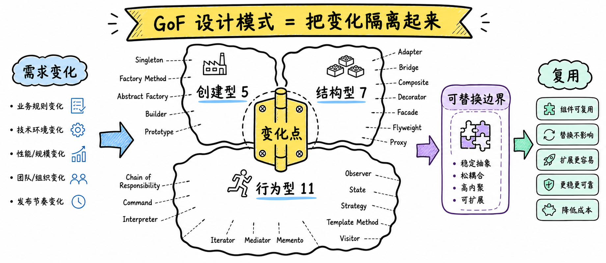

图解：Cognitive change: 从“23 个名字”变成一个按变化组织的地图。 Purpose: 课程钩子与总框架。 Review: text_review, number_review, fact_review.

## 创建型模式：把对象产生方式隔离出来

五种模式回答的都是：谁负责创建，以及创建细节何时变化。

工厂方法 把具体产品的决定交给子类，抽象工厂 则让一整族相互匹配的产品一起创建。建造者 适合把复杂对象拆成稳定步骤，原型 通过复制已有对象减少对具体类的依赖。

单例 只解决唯一实例和统一访问这一类约束，并不意味着所有全局对象都应该单例化。

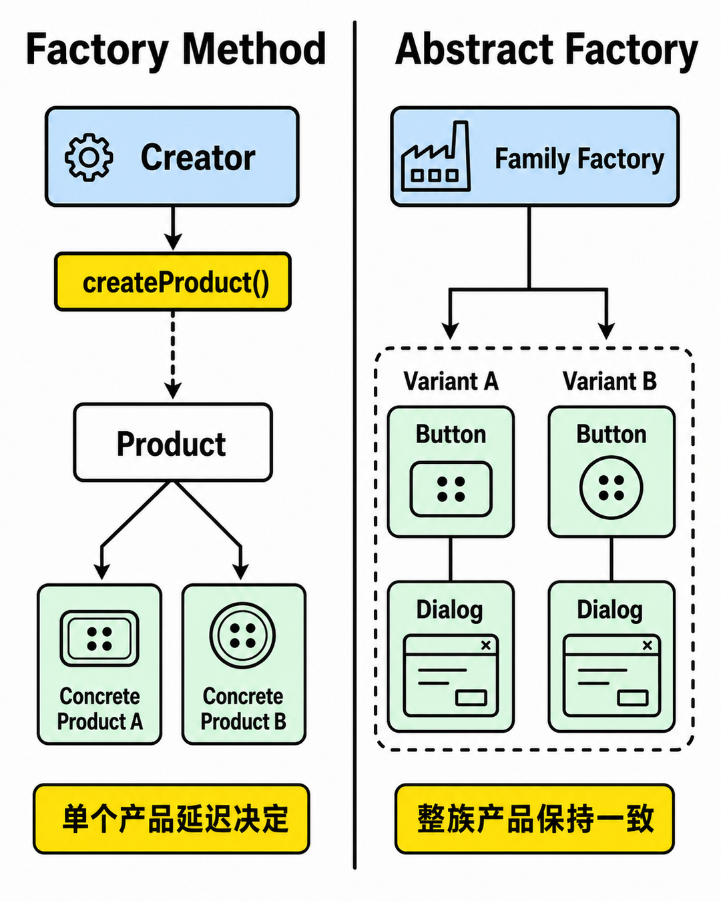

图解：Cognitive change: 创建对象从调用方移到专门的创建边界。 Purpose: Factory Method / Abstract Factory. Review: text_review, fact_review.

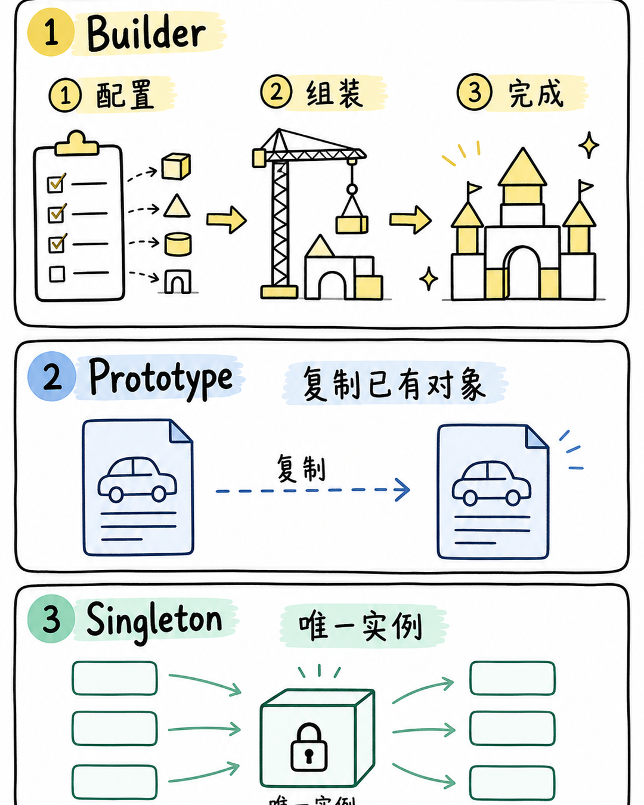

图解：Cognitive change: 创建型模式的另外三种变化：步骤、复制、唯一访问。 Purpose: Builder / Prototype / Singleton. Review: text_review, fact_review.

## 结构型模式：把对象接成可替换的形状

接口、组合、职责和访问方式，都可以成为结构变化的边界。

适配器 让已有接口接入新的调用方，桥接 则把抽象与实现拆成两条可以独立变化的层次。组合 让整体和部分共享统一接口，装饰 则用包装层叠加职责而不改动核心对象。

外观 隐藏子系统复杂度，享元 共享可复用状态，代理 则在访问前加入控制或延迟。

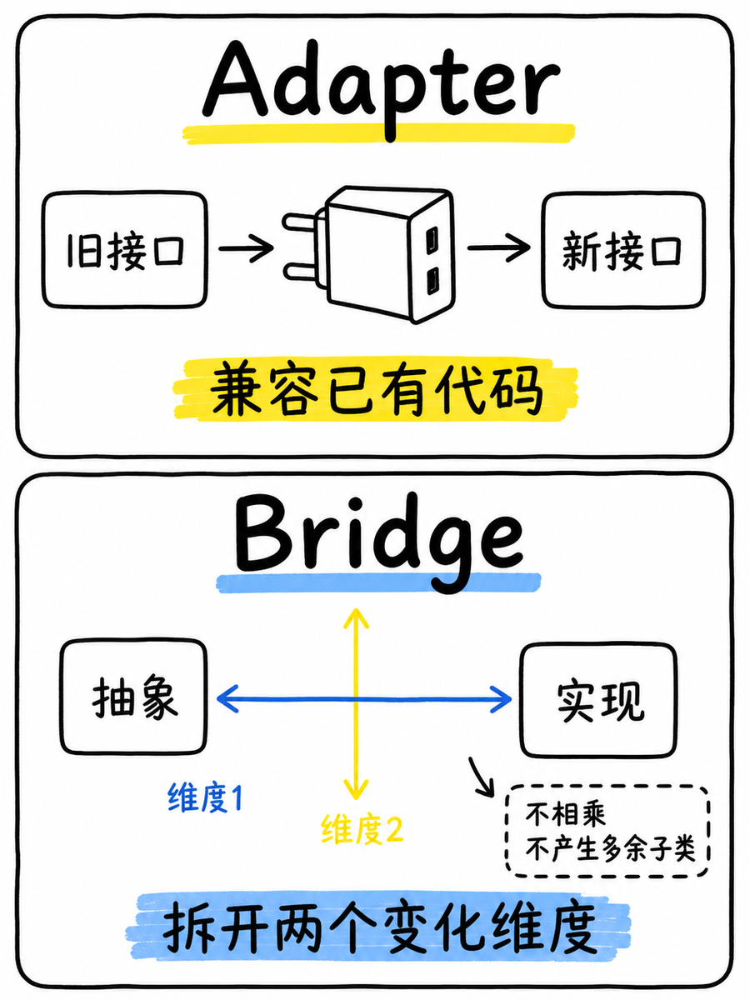

图解：Cognitive change: 结构型先处理接口不兼容与两个维度同时变化。 Purpose: Adapter and Bridge. Review: text_review, fact_review.

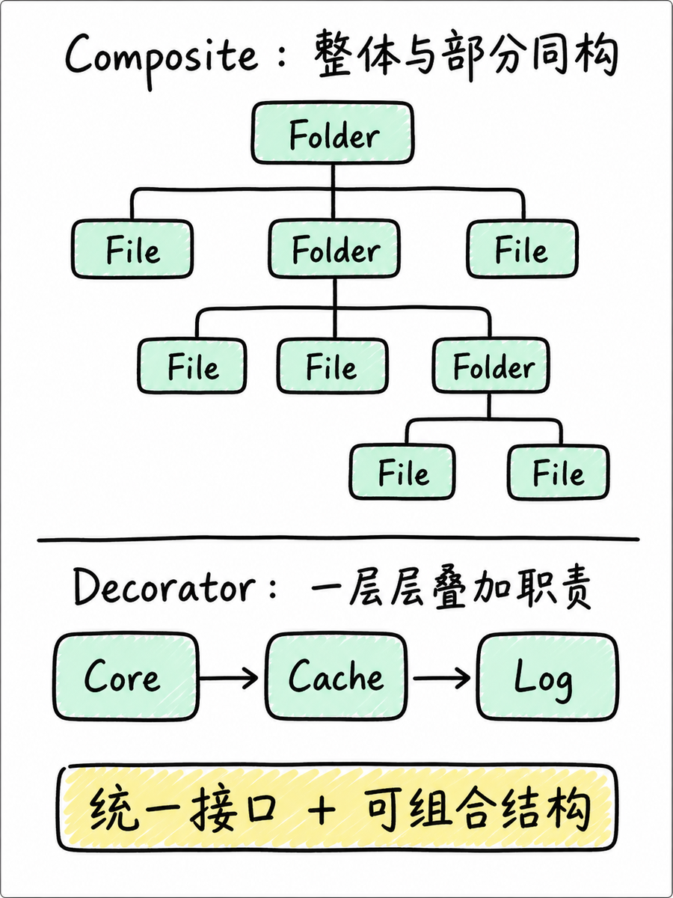

图解：Cognitive change: 同一接口下分别表达树形组合与可叠加职责。 Purpose: Composite and Decorator. Review: text_review, fact_review.

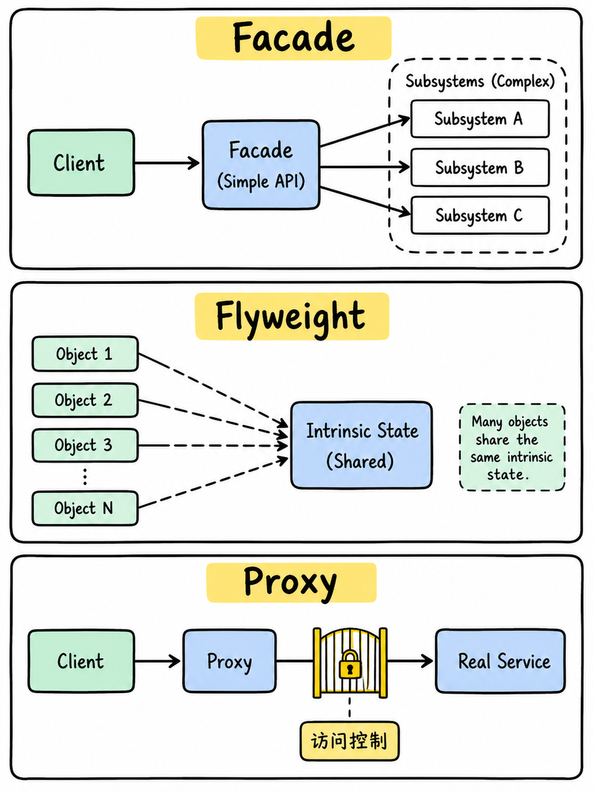

图解：Cognitive change: 结构型还可以隐藏复杂子系统、共享状态、控制访问。 Purpose: Facade / Flyweight / Proxy. Review: text_review, fact_review.

## 行为型模式：重新分配请求与算法的职责

重点不再是对象长什么样，而是谁处理、谁通知、谁保存历史。

责任链让请求沿处理链寻找负责者，命令把请求封装成对象，迭代器则统一遍历方式。观察者与中介者组织对象协作，备忘录与状态处理历史和状态，策略把算法替换独立出来。

模板方法固定算法骨架，访问者外置对对象结构的操作，解释器则把规则表达成可解释的结构。

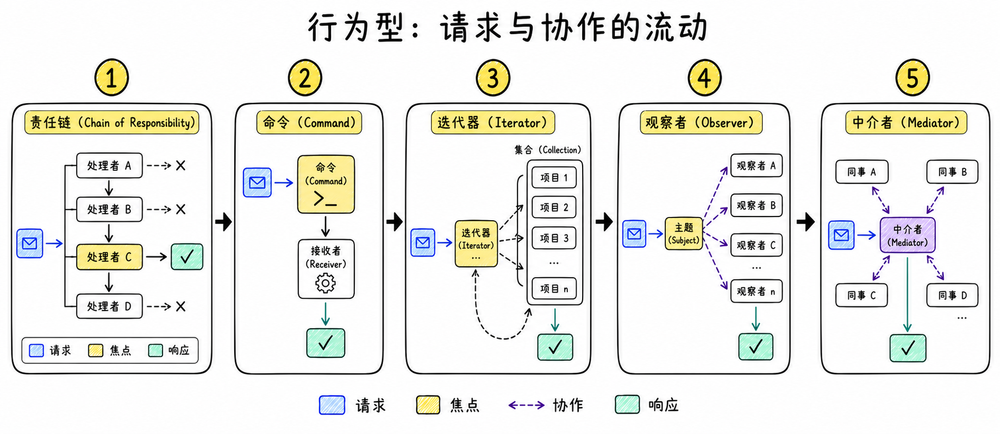

图解：Cognitive change: 行为型把“谁处理、何时通知、如何遍历”变成显式协作。 Purpose: Chain, Command, Iterator, Observer, Mediator. Review: text_review, fact_review.

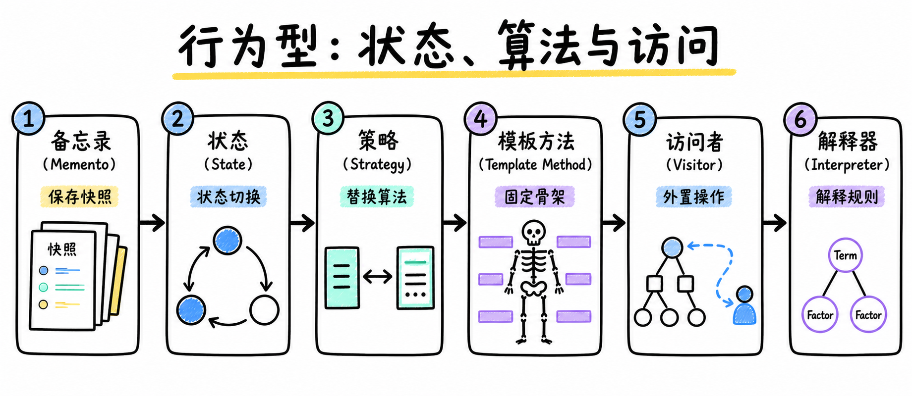

图解：Cognitive change: 行为型另一组处理状态、历史、算法骨架和对象结构访问。 Purpose: Memento / State / Strategy / Template Method / Visitor / Interpreter. Review: text_review, fact_review.

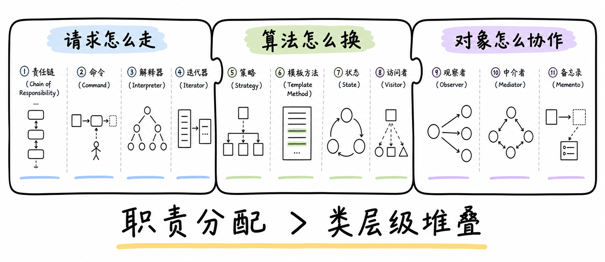

图解：Cognitive change: 将 11 个行为型模式归入三个可复用问题。 Purpose: compression and recall. Review: text_review, number_review.

## 真实系统里，模式的价值来自组合边界

一个变化轴对应一个可测试边界，多个模式可以协作但不能盲目堆叠。

以订单系统为例，策略可以替换计价规则，工厂可以扩展支付渠道，命令可以保存可撤销操作。观察者把订单状态变化通知给不同订阅者，多个模式组合后，新增一种变化不必修改所有调用方。

但如果系统根本没有替换、扩展或协作压力，模式只会增加间接层，所以复用必须和测试边界一起验证。

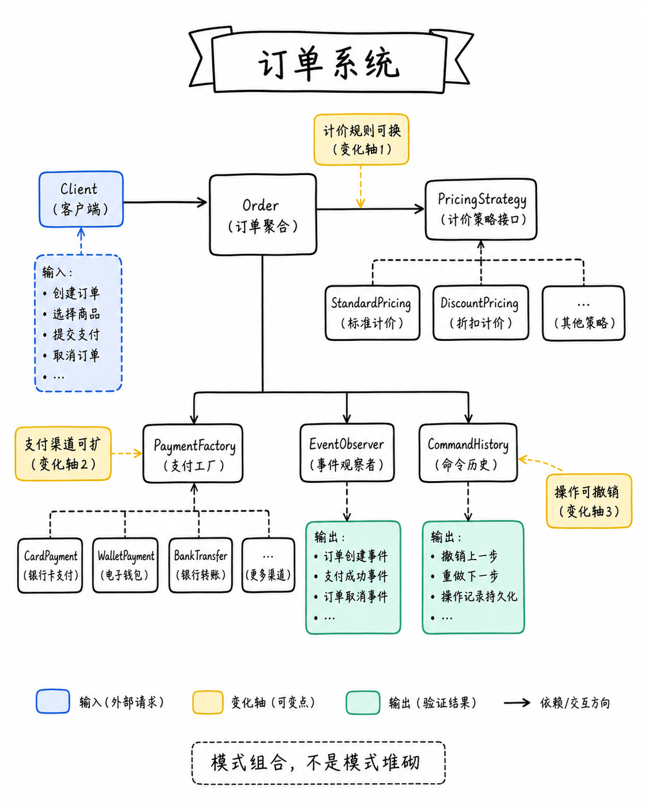

图解：Cognitive change: 真实系统里模式通过组合处理多个独立变化。 Purpose: order/document case. Review: text_review, fact_review.

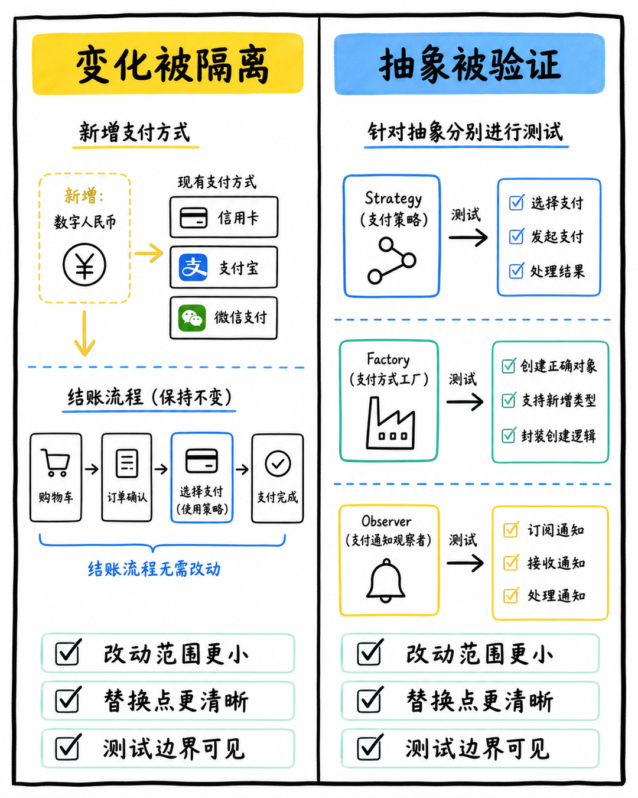

图解：Cognitive change: 组合模式的收益必须对应具体的复用边界与测试边界。 Purpose: verify reuse rather than abstraction theater. Review: text_review, fact_review.

## 选模式之前，先回答四个变化问题

把模式名放回设计现场：变化、知道、替换、成本。

看到一个新需求时，先问变化在哪里，再问谁应该知道这件事，谁应该负责它。如果需要替换算法、兼容接口、组合对象或追踪协作，模式可以提供一套共同语言。

如果引入模式后的抽象成本高于变化本身，就先保持简单，等真实压力出现再提炼。

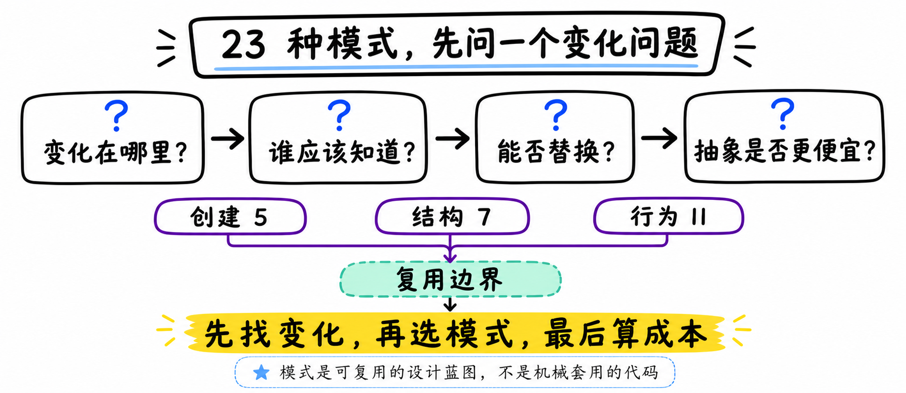

图解：Cognitive change: 从背模式名回到变化、边界、复用与成本的选型口诀。 Purpose: independent closing scene. Review: text_review, number_review, fact_review.

## 小结

把问题拆成目标、约束、证据和验证四部分，通常比直接寻找唯一答案更可靠。先用本文的框架完成一次小范围验证，再根据真实反馈调整下一步。

## 参考资料

以下链接来自原始课程研究笔记；动态信息请以其当前页面为准。

- [https://en.wikipedia.org/wiki/Design_Patterns](https://en.wikipedia.org/wiki/Design_Patterns)
- [https://en.wikipedia.org/wiki/Object-oriented_programming](https://en.wikipedia.org/wiki/Object-oriented_programming)
- [https://www.oreilly.com/library/view/design-patterns-elements/0201633612/](https://www.oreilly.com/library/view/design-patterns-elements/0201633612/)
- [https://ursinus.ecampus.com/design-patterns-elements-reusable/bk/9780201633610](https://ursinus.ecampus.com/design-patterns-elements-reusable/bk/9780201633610)
- [https://refactoring.guru/design-patterns/catalog](https://refactoring.guru/design-patterns/catalog)
- [https://refactoring.guru/design-patterns/what-is-pattern](https://refactoring.guru/design-patterns/what-is-pattern)
- [https://en.wikipedia.org/wiki/Software_design_pattern；https://en.wikipedia.org/wiki/Design_Patterns；https://www.oreilly.com/library/view/design-patterns-elements/0201633612/；https://www.informit.com/store/design-patterns-elements-of-reusable-object-oriented-software-9780201633610。](https://en.wikipedia.org/wiki/Software_design_pattern；https://en.wikipedia.org/wiki/Design_Patterns；https://www.oreilly.com/library/view/design-patterns-elements/0201633612/；https://www.informit.com/store/design-patterns-elements-of-reusable-object-oriented-software-9780201633610。)
