# 编程语言，为什么越变越多？

从机器指令、FORTRAN 和 C，到 Java、Python、JavaScript 与 Rust：这条线讲清语言为何不是一代替一代，而是在不同约束下持续分化。

## 阅读边界

本文依据原始课程的研究笔记、课程结构和发布文案整理。涉及产品、模型、版本、平台规则、价格或资格等可能变化的信息，实践前应以当前官方资料和实际环境为准。

## 编程语言演进：为什么越变越多？

70年人机抽象阶梯：人类思维与物理硬件之间的鸿沟跃迁

很多人以为编程语言的更迭，只是语法风格的变化。但回顾七十年演进史，它的本质是一部人类向机器硬件不断解耦的抽象攀登史。

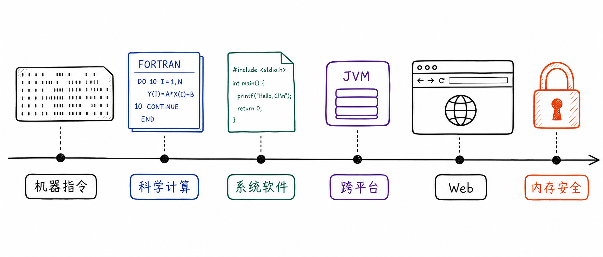

图解：```text

## 从打孔汇编到C语言结构化革命

破除硬件强绑定，编译器与指针开创系统软件基石

早期的打孔纸带和汇编语言，让人类思维不得不全盘迁就底层硬件寄存器。C 语言通过结构化控制和编译器，既保留了指针的高效掌控，又实现了算法跨硬件移植。

然而随着工程规模爆炸，手动内存管理的复杂性直接引爆了软件危机。

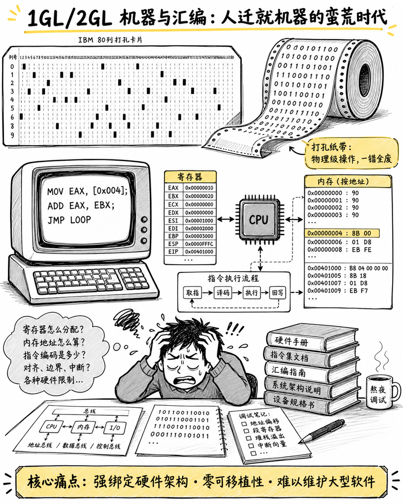

图解：```text

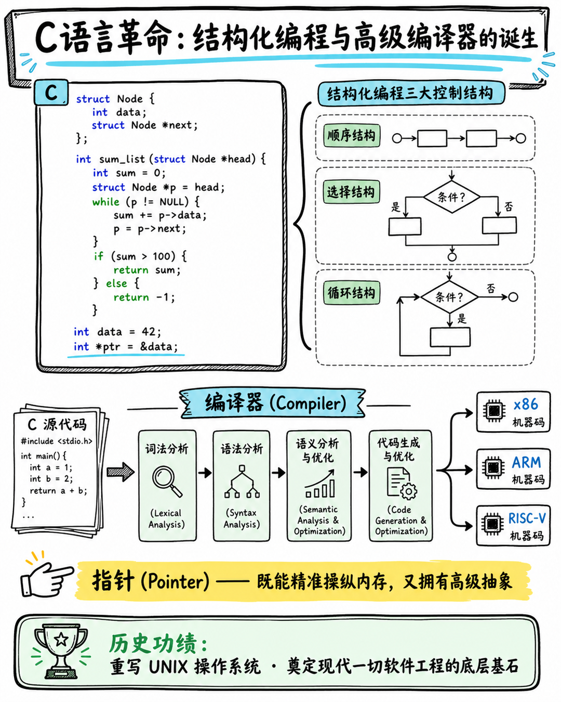

图解：```text

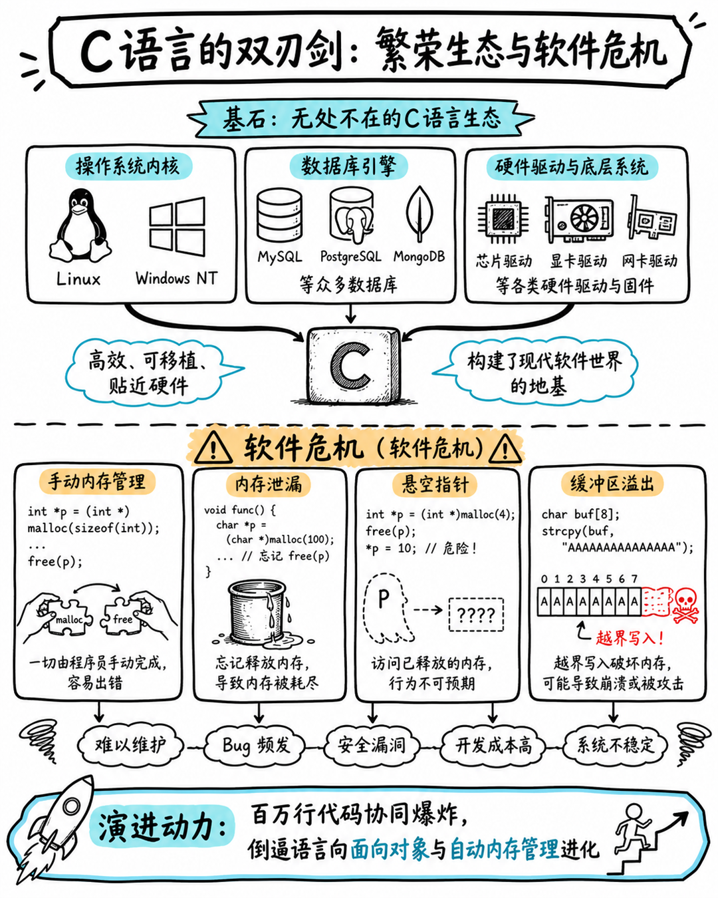

图解：```text

## 软件危机破局：面向对象与虚拟机生态

C++ 封装、Java 跨平台与脚本语言的敏捷生产力爆发

面对危机，C++ 引入面向对象范式，用封装与多态筑起了大型软件的协作边界。Java 凭借字节码与虚拟机，实现了跨平台运行与自动垃圾回收的里程碑跨越。

而 Python 与 JavaScript 则用极简语法和繁荣生态，推动了 Web 互联网与数据科学的繁荣。至此，计算机工业确立了在执行性能与研发效率之间的经典权衡光谱。

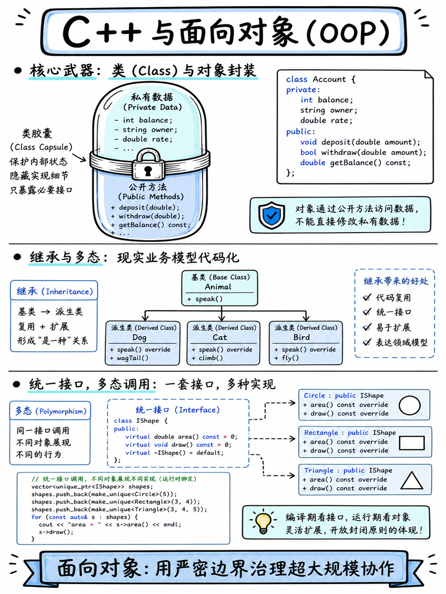

图解：```text

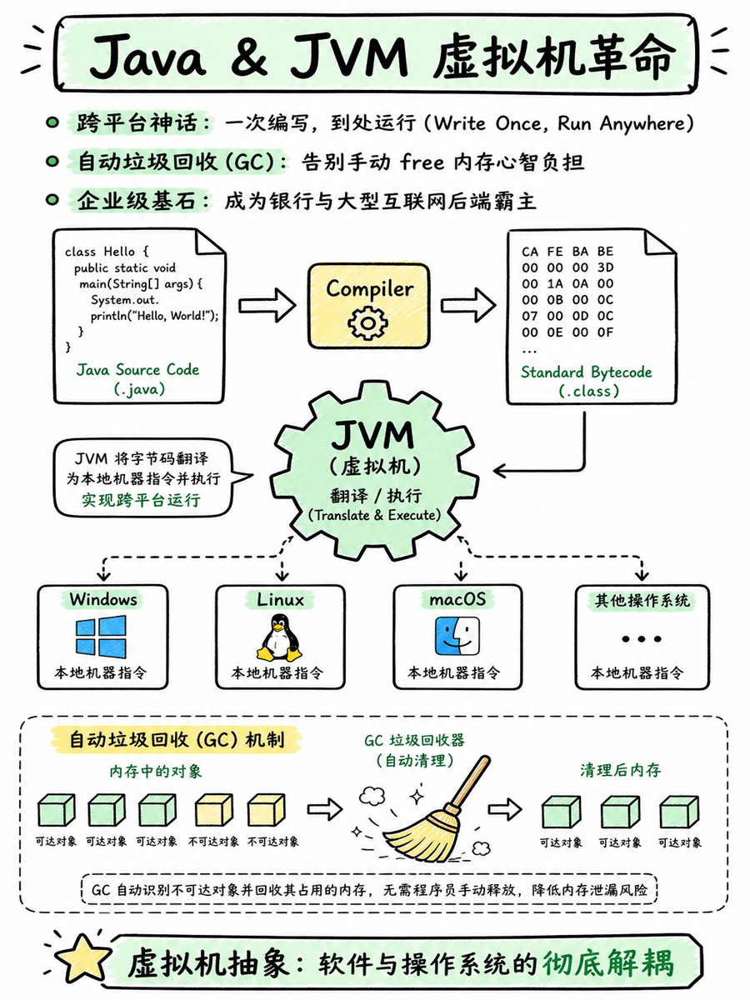

图解：```text

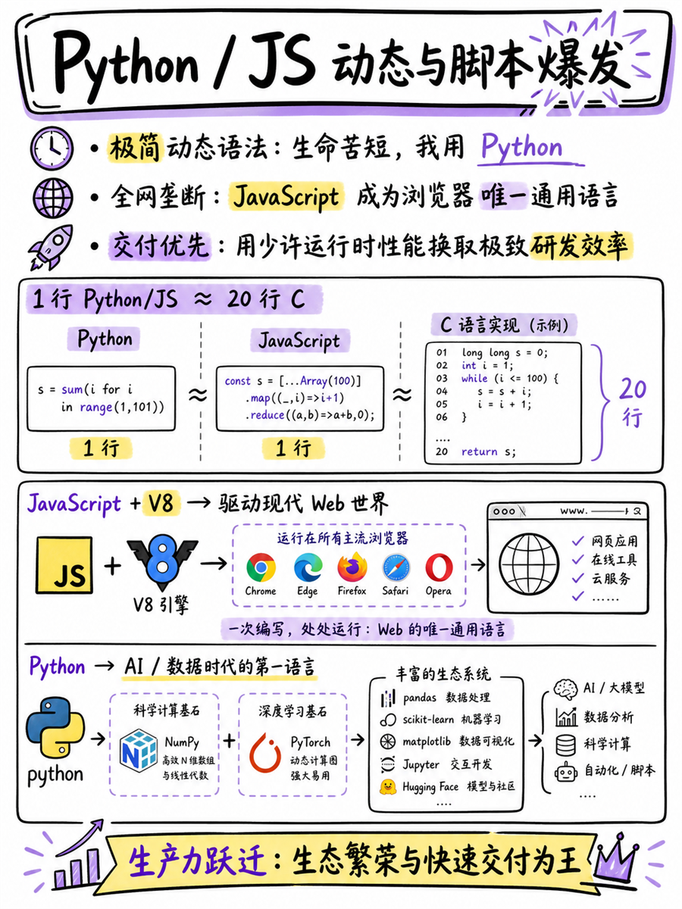

图解：```text

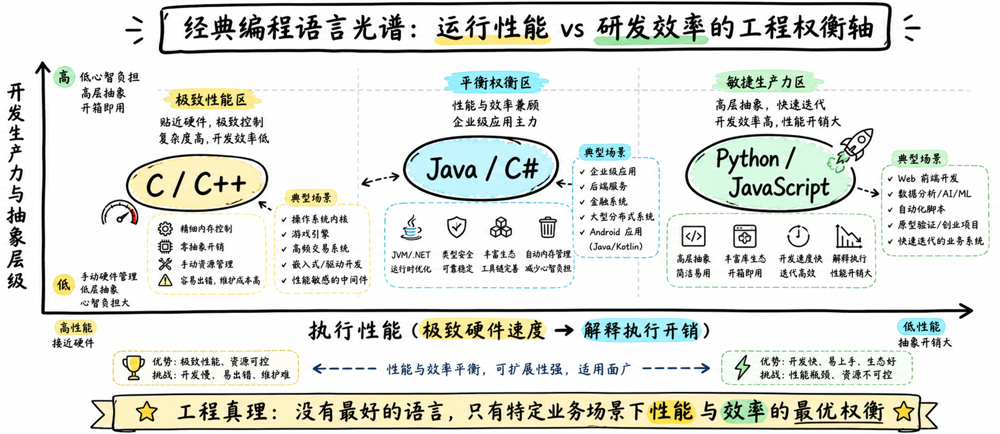

图解：```text

## 经典语言的性能—效率光谱

把经典语言放回同一坐标系，理解执行性能、抽象层级与研发效率之间的工程权衡

把 C++、Java、Python 与 JavaScript 放到同一张坐标图上，可以看到经典语言的工程权衡。

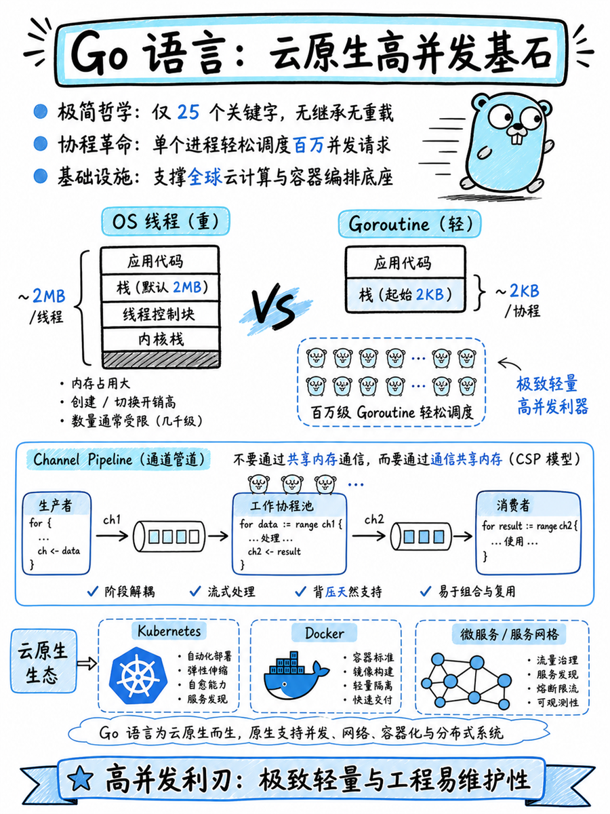

图解：```text

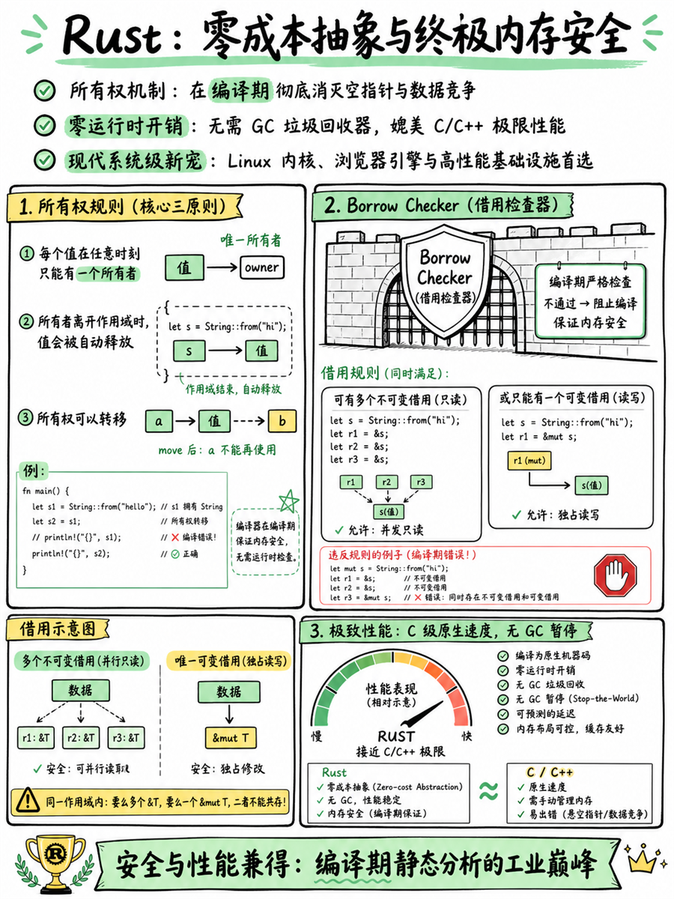

图解：```text

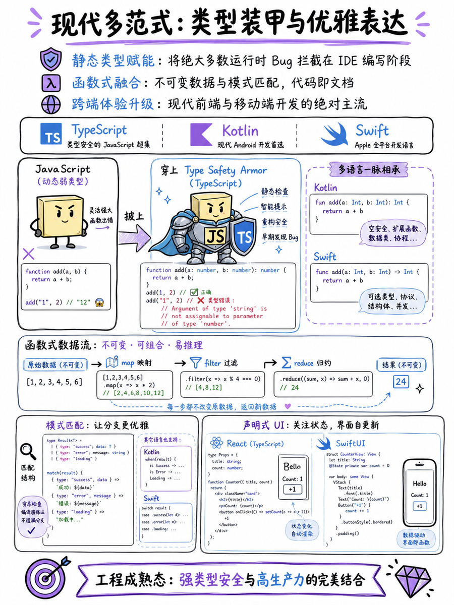

图解：```text

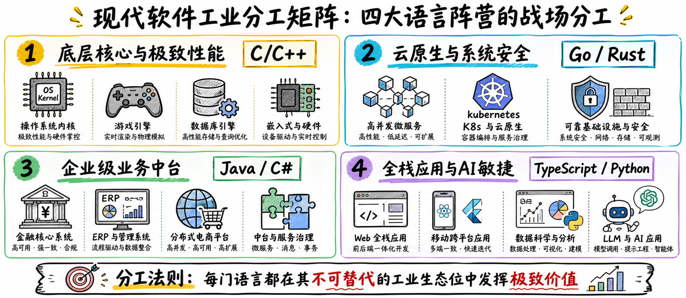

图解：```text

## 算力拐点：高并发与内存安全新纪元

Go 协程并发、Rust 编译期零成本安全与现代多范式语言

进入多核时代，Go 语言以轻量级协程和通道通信，重塑了云原生高并发基础设施。Rust 则独创所有权模型，在编译期消灭了内存漏洞，实现无垃圾回收的极致安全与性能。

TypeScript 等现代语言披上强类型装甲，融合函数式与声明式，大幅提升了工业健壮性。当今的软件工业，已经形成了底层、云端、企业中台与全栈敏捷各司其职的成熟格局。

## 现代软件工业的分工矩阵

从底层核心、云原生、企业中台到全栈与 AI 应用，语言生态形成互补分工

进入现代软件工业，语言不再争夺唯一王座，而是在底层、云端、企业中台和全栈应用中各司其职。

## 编程语言演进史：从机器指令到人类意图

从 1GL 到 5GL，抽象层次总体提高；现代 AI 辅助开发成为新的协作工具

回看这条演进主线，编程语言一直在把更多机器细节，交给编译器、运行时和开发工具处理。从机器语言、汇编和高级语言，到领域语言与逻辑约束求解，整体抽象层次确实不断提高。

但这不是一条严格线性的升级路线，不同范式会围绕性能、安全、生产力和生态持续并存。5GL 代表逻辑、约束与声明式求解，现代 AI 辅助开发则帮助人类表达意图，最终仍要回到测试、审查与工程决策。

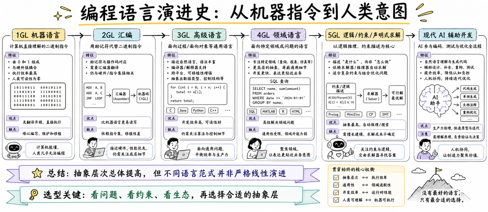

图解：```text

## 小结

把问题拆成目标、约束、证据和验证四部分，通常比直接寻找唯一答案更可靠。先用本文的框架完成一次小范围验证，再根据真实反馈调整下一步。

## 参考资料

以下链接来自原始课程研究笔记；动态信息请以其当前页面为准。

- [https://www.ibm.com/history/fortran](https://www.ibm.com/history/fortran)
- [https://www.bell-labs.com/usr/dmr/www/chist.pdf](https://www.bell-labs.com/usr/dmr/www/chist.pdf)
- [https://docs.oracle.com/javase/specs/jvms/se24/html/jvms-1.html](https://docs.oracle.com/javase/specs/jvms/se24/html/jvms-1.html)
- [https://developer.mozilla.org/en-US/docs/Glossary/JavaScript](https://developer.mozilla.org/en-US/docs/Glossary/JavaScript)
- [https://docs.python.org/3/tutorial/](https://docs.python.org/3/tutorial/)
- [https://doc.rust-lang.org/book/ch04-00-understanding-ownership.html](https://doc.rust-lang.org/book/ch04-00-understanding-ownership.html)
